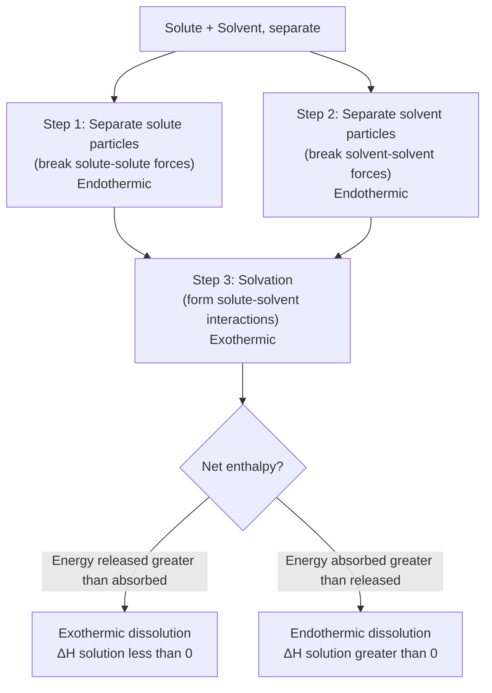
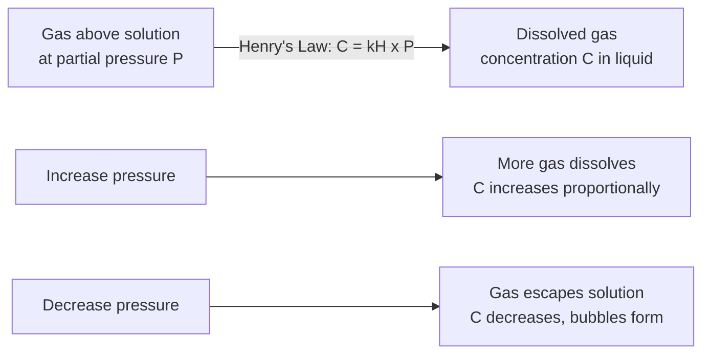

## Solubility and the Factors Affecting It


### Definition and Fundamental Concepts

**Solubility** is the maximum quantity of a solute that can dissolve in a given quantity of solvent at a specified temperature to form a stable, homogeneous solution (a **saturated solution**). It is typically expressed as grams of solute per 100 g (or 100 mL) of solvent, or in molar terms (mol/L).

**Key Points**

- A **saturated solution** contains the maximum amount of dissolved solute at equilibrium with undissolved excess solute (if present); the rate of dissolution equals the rate of recrystallization/precipitation.
- An **unsaturated solution** contains less solute than the maximum solubility limit and can dissolve additional solute.
- A **supersaturated solution** contains more dissolved solute than the equilibrium solubility limit under normal conditions—an unstable, metastable state typically achieved by dissolving solute at elevated temperature and then carefully cooling the solution without disturbance. Supersaturated solutions readily precipitate excess solute when disturbed (e.g., by a seed crystal, scratching the container, or agitation).

### The Dissolution Process: Energetics

#### Thermodynamic Framework

Dissolution can be conceptually broken into a three-step (Born-Haber-like) energy cycle:

1. **Separation of solute particles** (breaking solute-solute intermolecular/ionic forces) — endothermic, requires energy input.
2. **Separation of solvent particles** (breaking solvent-solvent intermolecular forces to create space for solute) — endothermic, requires energy input.
3. **Formation of solute-solvent interactions (solvation/hydration)** — exothermic, releases energy.

$$\Delta H_{solution} = \Delta H_1 + \Delta H_2 + \Delta H_3$$

The overall enthalpy of solution ($\Delta H_{solution}$) can be exothermic (net energy release, e.g., NaOH dissolving in water) or endothermic (net energy absorption, e.g., NH₄NO₃ dissolving in water), depending on the relative magnitudes of these steps.



#### The Role of Entropy

Dissolution is also thermodynamically favored by an **increase in entropy** (disorder), since a dissolved, dispersed state is generally more disordered than separate pure solute and solvent phases. The overall spontaneity of dissolution is governed by Gibbs free energy:

$$\Delta G_{solution} = \Delta H_{solution} - T\Delta S_{solution}$$

Even an endothermic dissolution process (positive $\Delta H$) can be spontaneous if the entropy increase ($\Delta S > 0$) is large enough to make $\Delta G$ negative, which explains why some salts (e.g., NH₄NO₃) dissolve spontaneously despite absorbing heat from the surroundings (producing a cooling effect, as used in instant cold packs).

### "Like Dissolves Like" Principle

Substances with similar types and magnitudes of intermolecular forces tend to be miscible/soluble in one another, because the energy cost of separating solvent and solute particles is offset by comparably favorable new solute-solvent interactions.

| Solute Type | Soluble In | Example |
| --- | --- | --- |
| Polar/ionic | Polar solvents | NaCl in water |
| Nonpolar | Nonpolar solvents | Oil (nonpolar) in hexane |
| Polar | Nonpolar solvents (poorly) | Sugar in hexane — low solubility |
| Ionic | Nonpolar solvents (poorly) | NaCl in hexane — negligible solubility |

**Key Points**

- Water, a highly polar molecule capable of hydrogen bonding, readily dissolves ionic compounds (via ion-dipole interactions) and polar molecular compounds (via hydrogen bonding or dipole-dipole interactions).
- Nonpolar solvents (e.g., hexane, benzene) dissolve nonpolar solutes via London dispersion forces but poorly dissolve ionic or highly polar solutes, since the energy required to separate strongly interacting ionic/polar solute particles is not compensated by weak solute-solvent dispersion interactions.

### Factor 1: Temperature

#### Effect on Solid Solubility

For most (though not all) solids dissolving in liquids, **solubility increases with increasing temperature**, since dissolution of most solids is endothermic, and by Le Chatelier's principle, adding heat (increasing temperature) shifts the equilibrium toward increased dissolution.

$$\text{solute (s)} + \text{solvent} \rightleftharpoons \text{solute (aq)} \quad \Delta H > 0 \text{ (typical case)}$$

**Exceptions**: Some solids (e.g., $Ce_2(SO_4)_3$, and to a lesser degree $Li_2CO_3$, $Li_2SO_4$) exhibit *decreasing* solubility with increasing temperature, corresponding to an exothermic dissolution process for that particular solute [Inference — specific exception compounds and the degree of solubility decrease are documented in solubility reference tables but can vary by source and measurement conditions].

#### Effect on Gas Solubility

For gases dissolving in liquids, **solubility decreases with increasing temperature**. This occurs because gas dissolution is generally exothermic overall (the kinetic energy of gas molecules must decrease substantially to be captured in the liquid phase), so increasing temperature shifts the equilibrium toward the gas phase (favoring escape from solution).

**Real-world relevance**: This explains why warm carbonated beverages go flat faster (CO₂ solubility decreases with warming) and why thermal water pollution (from power plant cooling water discharge) reduces dissolved oxygen levels available to aquatic organisms.

#### Solubility Curves

Solubility data is often presented graphically as **solubility curves** (solubility vs. temperature), which allow visual determination of saturation points and are used to distinguish saturated, unsaturated, and supersaturated conditions at a given temperature.

<svg xmlns="http://www.w3.org/2000/svg" viewBox="0 0 700 420" font-family="Arial, sans-serif">
<text x="350" y="26" text-anchor="middle" font-size="16" font-weight="bold" fill="#1a1a1a">Solubility Curves: Temperature Dependence (svg_diagram)</text>
<g transform="translate(60,55)">
<line x1="0" y1="300" x2="560" y2="300" stroke="#333" stroke-width="1.5" />
<line x1="0" y1="10" x2="0" y2="300" stroke="#333" stroke-width="1.5" />
<text x="280" y="325" text-anchor="middle" font-size="12" fill="#333">Temperature (°C)</text>
<text x="-30" y="150" text-anchor="middle" font-size="12" fill="#333" transform="rotate(-90,-30,150)">Solubility (g/100 g H2O)</text>



```

<path d="M 10,280 Q 200,220 350,90 Q 450,40 550,15" stroke="#c0392b" stroke-width="2.5" fill="none" />
<text x="500" y="35" font-size="11" fill="#c0392b">KNO3</text>


<path d="M 10,220 Q 280,210 550,195" stroke="#2874a6" stroke-width="2.5" fill="none" />
<text x="500" y="185" font-size="11" fill="#2874a6">NaCl</text>


<path d="M 10,150 Q 280,200 550,270" stroke="#8e44ad" stroke-width="2.5" fill="none" />
<text x="500" y="285" font-size="11" fill="#8e44ad">Ce2(SO4)3 (exception)</text>


<path d="M 10,290 Q 280,296 550,299" stroke="#27ae60" stroke-width="2" fill="none" />
<text x="500" y="298" font-size="10" fill="#27ae60">O2 (gas, low mg/L scale)</text>
```

</g>
</svg>

### Factor 2: Pressure

#### Effect on Solids and Liquids

Pressure has a **negligible effect on the solubility of solids and liquids** in liquid solvents, because solids and liquids are essentially incompressible, so changing pressure does not meaningfully alter their volume or the energetics of dissolution.

#### Effect on Gases: Henry's Law

For gases dissolving in liquids, solubility is **directly proportional to the partial pressure** of the gas above the solution. This relationship is described by **Henry's Law**:

$$C = k_H \times P$$

where $C$ is the solubility (concentration) of the gas in the liquid, $P$ is the partial pressure of the gas above the solution, and $k_H$ is the **Henry's Law constant**, specific to each gas-solvent pair and temperature-dependent.

**Example**

The Henry's Law constant for $O_2$ in water at 25°C is $k_H = 1.3 \times 10^{-3}$ mol/(L·atm). Calculate the solubility of $O_2$ in water in equilibrium with air (where $P_{O_2} \approx 0.21$ atm).

$$C = (1.3\times10^{-3} \text{ mol/(L·atm)}) \times (0.21 \text{ atm}) = 2.73 \times 10^{-4} \text{ mol/L}$$

**Real-world relevance**: Henry's Law explains the effervescence of carbonated beverages upon opening (reduction in pressure above the liquid causes dissolved $CO_2$ to escape as gas bubbles) and is central to understanding decompression sickness ("the bends") in scuba diving, where dissolved nitrogen in blood/tissue can form bubbles if pressure decreases too rapidly.



### Factor 3: Nature of Solute and Solvent (Intermolecular Forces)

The types and relative strengths of intermolecular forces between solute-solute, solvent-solvent, and solute-solvent particles govern whether dissolution is thermodynamically favorable, as summarized in the "like dissolves like" principle above. Key intermolecular force types relevant to solubility include:

- **Ion-dipole forces**: Govern dissolution of ionic compounds in polar solvents (e.g., NaCl in water); generally the strongest of the solute-solvent interaction types listed here.
- **Hydrogen bonding**: Governs high solubility of small polar molecules capable of H-bond donation/acceptance (e.g., ethanol, glucose) in water.
- **Dipole-dipole forces**: Govern solubility of polar molecular compounds lacking hydrogen-bonding capability in polar solvents.
- **London dispersion forces**: Govern solubility of nonpolar solutes in nonpolar solvents; the only intermolecular force available between fully nonpolar species.

### Factor 4: Common Ion Effect (Solubility of Ionic Compounds)

For sparingly soluble ionic (electrolyte) compounds, the presence of a **common ion** already dissolved in solution (from a different soluble salt) *decreases* the solubility of the sparingly soluble compound, via Le Chatelier's principle applied to the solubility equilibrium.

$$AgCl(s) \rightleftharpoons Ag^+(aq) + Cl^-(aq) \qquad K_{sp} = [Ag^+][Cl^-]$$

Adding a soluble salt containing $Cl^-$ (e.g., NaCl) increases $[Cl^-]$, shifting the equilibrium left and reducing the solubility of AgCl.

**Example**

Calculate the molar solubility of AgCl in pure water versus in 0.10 M NaCl solution. ($K_{sp}$ of AgCl $= 1.8\times10^{-10}$)

*In pure water*: $[Ag^+] = [Cl^-] = x$

$$K_{sp} = x^2 = 1.8\times10^{-10} \quad \Rightarrow \quad x = 1.34\times10^{-5} \text{ M}$$

*In 0.10 M NaCl*: $[Cl^-] \approx 0.10$ M (dominated by the common ion; contribution from AgCl dissolution is negligible)

$$K_{sp} = [Ag^+](0.10) = 1.8\times10^{-10} \quad \Rightarrow \quad [Ag^+] = 1.8\times10^{-9} \text{ M}$$

The solubility of AgCl decreased by roughly four orders of magnitude in the presence of the common ion.

### Factor 5: pH (for Compounds with Acidic/Basic Components)

The solubility of salts containing a basic anion (conjugate base of a weak acid, e.g., $F^-$, $CO_3^{2-}$, $OH^-$, $S^{2-}$) is strongly **pH-dependent**, since adding H⁺ (lowering pH) protonates the anion, effectively removing it from the dissolution equilibrium and shifting it toward further dissolution (increased solubility) via Le Chatelier's principle.

$$CaCO_3(s) \rightleftharpoons Ca^{2+}(aq) + CO_3^{2-}(aq)$$


$$CO_3^{2-}(aq) + H^+(aq) \rightarrow HCO_3^-(aq)$$

Adding acid consumes $CO_3^{2-}$, shifting the first equilibrium to the right and increasing $CaCO_3$ solubility. This explains why carbonate minerals (e.g., limestone) dissolve readily in acidic conditions—relevant to cave formation, ocean acidification effects on coral/shell dissolution, and acid rain damage to carbonate-based building materials and monuments.

**Key Points**

- Salts containing anions from **strong acids** (e.g., $Cl^-$, $NO_3^-$, $SO_4^{2-}$ from the corresponding strong acids) show minimal pH dependence in their solubility, since these anions do not undergo significant protonation even in acidic solution.
- This pH-dependence principle is the basis for **selective precipitation** techniques in qualitative analysis, where pH is carefully controlled to precipitate specific metal sulfides or hydroxides while keeping others in solution.

### Factor 6: Particle Size and Surface Area (Kinetics, Not True Solubility)

**Important distinction**: Particle size and stirring/agitation affect the **rate** at which a solute dissolves (dissolution kinetics), not the equilibrium solubility value itself. Smaller particle size increases surface area, allowing faster contact with solvent and faster attainment of the saturation equilibrium, but the maximum amount that can ultimately dissolve at a given temperature remains the same regardless of particle size or stirring [Inference — this is a standard distinction between solubility (a thermodynamic equilibrium property) and dissolution rate (a kinetic property), though very fine (nanoscale) particles can show a genuine, measurable increase in true equilibrium solubility due to surface energy/curvature effects, a more advanced consideration beyond typical general chemistry treatment].

### Summary Comparison Table

| Factor | Effect on Solid Solubility | Effect on Gas Solubility |
| --- | --- | --- |
| ↑ Temperature | Usually increases (most solids) | Decreases |
| ↑ Pressure | Negligible effect | Increases (Henry's Law) |
| Common ion | Decreases | Not typically applicable |
| ↓ pH (more acidic) | Increases (for basic anions) | Not typically applicable |
| Particle size / stirring | No effect on equilibrium value (affects rate only) | No effect on equilibrium value (affects rate only) |

### Common Pitfalls and Misconceptions

- **"All solids become more soluble when heated" is not universally true.** While it is the general trend, exceptions exist, and gas solubility follows the opposite trend entirely.
- **Confusing dissolution rate with solubility.** Crushing a solid or stirring a solution makes it dissolve *faster*, but does not increase the *maximum amount* that can dissolve (equilibrium solubility) at a given temperature.
- **Pressure effects apply specifically to gas solubility in liquids**—applying Henry's Law reasoning to solid solubility is a common but incorrect extrapolation, since solids and liquids are not significantly compressible.
- **The common ion effect reduces solubility—it does not eliminate it entirely.** Some solubility of the sparingly soluble salt always remains, governed by the (now-shifted) equilibrium position defined by $K_{sp}$.

**Related Topics**

- Solubility product constant ($K_{sp}$) and precipitation reactions
- Henry's Law and gas solubility applications
- Common ion effect and its relationship to buffer systems
- Colligative properties (boiling point elevation, freezing point depression, osmotic pressure)
- Intermolecular forces and their role in solution formation
- Selective precipitation and qualitative analysis techniques