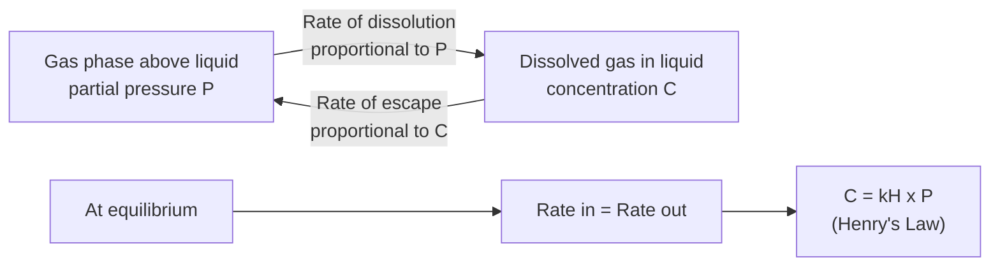
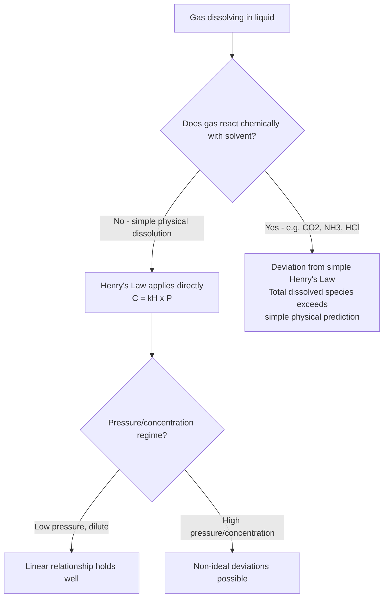

## Henry's Law and Gas Solubility

### Definition and Statement

**Henry's Law** states that at a constant temperature, the solubility (equilibrium concentration) of a gas in a liquid is **directly proportional to the partial pressure** of that gas above the liquid surface.

$$C = k_H \times P$$

where:

- $C$ = solubility (equilibrium concentration) of the dissolved gas, typically in mol/L or another concentration unit
- $P$ = partial pressure of the gas above the solution (atm or another pressure unit)
- $k_H$ = **Henry's Law constant**, specific to a given gas-solvent pair and dependent on temperature

**Key Points**

- Henry's Law applies specifically to **gas solubility in liquids**—it does not describe solid or liquid solute solubility, which is governed by different factors (temperature, common ion effect, etc.).
- The proportionality is linear only within the range where the gas does not undergo strong chemical reaction with the solvent and where the solution remains dilute (ideal behavior); significant deviations occur for gases that react chemically with the solvent (see limitations section below).

### Molecular-Level Explanation

Henry's Law arises from the dynamic equilibrium between gas molecules entering the liquid phase (dissolving) and gas molecules escaping the liquid phase (evaporating/degassing) at the gas-liquid interface:

$$\text{Gas}(g) \rightleftharpoons \text{Gas}(aq)$$

At equilibrium, the **rate of gas molecules entering solution** is proportional to the partial pressure (higher pressure means a higher collision frequency of gas molecules with the liquid surface, and thus more molecules entering solution per unit time). The **rate of gas molecules leaving solution** depends only on the concentration of dissolved gas already present. At equilibrium, these two rates are equal, which mathematically produces the direct proportionality between equilibrium concentration and pressure.



### The Henry's Law Constant ($k_H$)

#### Interpretation

$k_H$ reflects the intrinsic "affinity" of a particular gas for a particular solvent at a given temperature. A **larger $k_H$** indicates greater gas solubility at a given partial pressure (the gas dissolves more readily); a **smaller $k_H$** indicates lower solubility.

#### Units and Formulation Variability

Henry's Law constants are reported in several different mathematical forms and unit systems across chemistry, environmental science, and engineering literature, which is an important practical caveat:

$$C = k_H P \quad \text{(concentration form, } k_H \text{ in mol/(L·atm))}$$


$$P = k_H x \quad \text{(mole fraction form, } k_H \text{ in atm, sometimes called the "Henry's Law constant" in this inverted convention)}$$

[Inference — the existence of multiple conventions for expressing Henry's Law constants (concentration-based vs. mole-fraction-based, and various pressure/concentration unit combinations) is well documented across physical chemistry and environmental engineering references; students and practitioners must carefully verify which convention a given tabulated constant follows before applying it, as units and even the constant's numerical placement (multiplying vs. dividing) can differ between sources.]

#### Representative Henry's Law Constants (25°C, mol/(L·atm), concentration form)

| Gas | $k_H$ (mol/(L·atm)) |
| --- | --- |
| $O_2$ | $1.3 \times 10^{-3}$ |
| $N_2$ | $6.1 \times 10^{-4}$ |
| $CO_2$ | $3.4 \times 10^{-2}$ |
| $He$ | $3.7 \times 10^{-4}$ |
| $Ar$ | $1.4 \times 10^{-3}$ |

**Key Points**

- $CO_2$ has a notably higher $k_H$ than $O_2$ or $N_2$, consistent with its greater solubility in water—relevant to carbonated beverage chemistry and atmospheric $CO_2$ absorption into oceans.
- Nonpolar, small gases with weak intermolecular attraction to water (e.g., $He$, $N_2$) tend to have low $k_H$ values (low solubility) since they interact with water only via weak dispersion forces.

### Temperature Dependence of $k_H$

Because gas dissolution in liquids is generally an **exothermic** process overall, $k_H$ (in the concentration-based convention) **decreases with increasing temperature**, meaning gas solubility decreases as temperature rises (at constant partial pressure)—consistent with Le Chatelier's principle applied to an exothermic equilibrium.

**Key Points**

- This inverse relationship between temperature and gas solubility explains: (1) why warm carbonated beverages lose carbonation faster than cold ones, (2) why thermal pollution from industrial cooling water discharge reduces dissolved oxygen available to aquatic ecosystems, and (3) why cold ocean waters generally hold higher concentrations of dissolved $CO_2$ and $O_2$ than warm tropical waters.

### Worked Calculations

**Example 1: Basic Henry's Law Application**

Calculate the solubility of $N_2$ gas in water at 25°C when in equilibrium with air, where the partial pressure of $N_2$ is approximately 0.78 atm. ($k_H$ for $N_2 = 6.1\times10^{-4}$ mol/(L·atm))

$$C = k_H \times P = (6.1\times10^{-4} \text{ mol/(L·atm)}) \times (0.78 \text{ atm}) = 4.76\times10^{-4} \text{ mol/L}$$

**Example 2: Effect of Increased Pressure**

A carbonated beverage is bottled under a $CO_2$ partial pressure of 4.0 atm at 25°C. Calculate the dissolved $CO_2$ concentration. ($k_H$ for $CO_2 = 3.4\times10^{-2}$ mol/(L·atm))

$$C = (3.4\times10^{-2} \text{ mol/(L·atm)}) \times (4.0 \text{ atm}) = 0.136 \text{ mol/L}$$

Upon opening the bottle, the $CO_2$ partial pressure above the liquid drops sharply to atmospheric levels ($P_{CO_2} \approx 0.0004$ atm), and the equilibrium concentration correspondingly drops to a much lower value, driving the excess dissolved $CO_2$ to escape as visible bubbles (effervescence).

**Example 3: Comparing Two Pressure Conditions (Ratio Method)**

The solubility of $O_2$ in water at a partial pressure of 1.00 atm is $1.3\times10^{-3}$ mol/L. What would the solubility be at a partial pressure of 5.00 atm (assuming Henry's Law remains valid at this pressure)?

Since $C \propto P$ at constant temperature:

$$\frac{C_2}{C_1} = \frac{P_2}{P_1} \quad \Rightarrow \quad C_2 = C_1 \times \frac{P_2}{P_1} = (1.3\times10^{-3}) \times \frac{5.00}{1.00} = 6.5\times10^{-3} \text{ mol/L}$$

### Graphical Representation

<svg xmlns="http://www.w3.org/2000/svg" viewBox="0 0 640 400" font-family="Arial, sans-serif">
<text x="320" y="26" text-anchor="middle" font-size="16" font-weight="bold" fill="#1a1a1a">Henry's Law: Linear Relationship (svg_diagram)</text>
<g transform="translate(60,55)">
<line x1="0" y1="280" x2="500" y2="280" stroke="#333" stroke-width="1.5" />
<line x1="0" y1="10" x2="0" y2="280" stroke="#333" stroke-width="1.5" />
<text x="250" y="305" text-anchor="middle" font-size="12" fill="#333">Partial Pressure, P (atm)</text>
<text x="-30" y="140" text-anchor="middle" font-size="12" fill="#333" transform="rotate(-90,-30,140)">Solubility, C (mol/L)</text>



```

<line x1="0" y1="280" x2="450" y2="30" stroke="#c0392b" stroke-width="2.5" />
<text x="400" y="55" font-size="11" fill="#c0392b">High kH (e.g. CO2)</text>


<line x1="0" y1="280" x2="450" y2="220" stroke="#2874a6" stroke-width="2.5" />
<text x="400" y="240" font-size="11" fill="#2874a6">Low kH (e.g. N2)</text>

<text x="150" y="150" font-size="11" fill="#555" font-style="italic">Slope = kH (Henry's Law constant)</text>
```

</g>
</svg>

### Limitations and Deviations from Henry's Law

Henry's Law is an idealization and breaks down or requires modification under several conditions:

1. **Chemical reaction with solvent**: Gases that react chemically with water (rather than simply physically dissolving) do not follow simple Henry's Law behavior, because the reaction removes the gas from the simple physical dissolution equilibrium, effectively pulling more gas into solution than physical dissolution alone would predict.
   - $CO_2$ partially reacts: $CO_2 + H_2O \rightleftharpoons H_2CO_3$
   - $NH_3$ reacts extensively: $NH_3 + H_2O \rightleftharpoons NH_4^+ + OH^-$
   - $HCl$ and other highly soluble/reactive gases show even more pronounced deviation, as they essentially ionize completely rather than existing as simple dissolved molecular gas.
2. **High pressure**: At sufficiently high pressures, real gas behavior deviates from ideality, and the simple linear relationship of Henry's Law becomes less accurate; more complex equations of state may be required for precise work at extreme pressures [Inference — a standard limitation noted in physical chemistry treatments of non-ideal gas/solution behavior].
3. **High concentration/high solubility gases**: Henry's Law is most accurate for **dilute** solutions; gases with very high intrinsic solubility may show deviations from strict linearity at higher partial pressures.



### Real-World and Applied Relevance

#### Carbonation and Beverage Chemistry

Beverages are bottled/canned under elevated $CO_2$ partial pressure to maximize dissolved $CO_2$ per Henry's Law; opening the container reduces the pressure to atmospheric, shifting equilibrium and releasing dissolved gas as bubbles.

#### Decompression Sickness ("The Bends")

Scuba divers breathe compressed air at elevated ambient pressure underwater, increasing the partial pressure of nitrogen and thus (per Henry's Law) increasing the amount of $N_2$ dissolved in blood and tissues. Ascending too rapidly reduces ambient pressure faster than the body can safely eliminate the dissolved gas via respiration, causing nitrogen to form bubbles in tissues and bloodstream—the physiological basis of decompression sickness. This is why divers must ascend slowly and may require controlled decompression stops [Inference — the physiological application is a standard example cited in general and environmental chemistry references illustrating Henry's Law, though the full physiological mechanism of decompression sickness involves additional biological factors beyond the basic chemistry principle].

#### Dissolved Oxygen and Aquatic Ecosystems

Aquatic organisms depend on dissolved atmospheric $O_2$, governed by Henry's Law equilibrium with the atmosphere. Factors reducing dissolved $O_2$—elevated water temperature (thermal pollution), decreased atmospheric pressure (high altitude), or reduced surface mixing—can stress aquatic life by lowering available dissolved oxygen.

#### Ocean Carbon Chemistry and Acidification

Atmospheric $CO_2$ dissolves into oceans following Henry's Law equilibrium (modified by the subsequent chemical reaction of $CO_2$ with water to form carbonic acid). Rising atmospheric $CO_2$ partial pressure increases oceanic dissolved $CO_2$, contributing to ocean acidification, a significant area of environmental chemistry research [Inference — this is a well-established mechanism in environmental/atmospheric chemistry literature connecting Henry's Law to global carbon cycle and ocean chemistry].

### Common Pitfalls and Misconceptions

- **Applying Henry's Law to solid or liquid solute solubility** is a common conceptual error—Henry's Law describes gas solubility specifically; solid solubility follows different principles (see solubility and factors affecting it).
- **Confusing the multiple unit conventions** for $k_H$ (concentration-based vs. mole-fraction/pressure-based) leads to calculation errors of orders of magnitude; always verify which form a tabulated constant uses before applying it.
- **Assuming Henry's Law applies without modification to reactive gases** (e.g., treating dissolved $CO_2$ or $NH_3$ as if all of it remains as simple molecular gas in solution) ignores the significant fraction that undergoes subsequent chemical reaction with water, leading to underestimation of total dissolved species.
- **Forgetting that $k_H$ is temperature-dependent**—applying a 25°C Henry's Law constant to a system at a significantly different temperature without adjustment introduces systematic error.

**Related Topics**

- Solubility and the factors affecting it (temperature, pressure, common ion effect)
- Colligative properties (boiling point elevation, freezing point depression, osmotic pressure)
- Raoult's Law and vapor pressure of solutions
- Dalton's Law of partial pressures
- Carbonic acid equilibrium and ocean acidification chemistry
- Gas laws and real vs. ideal gas behavior