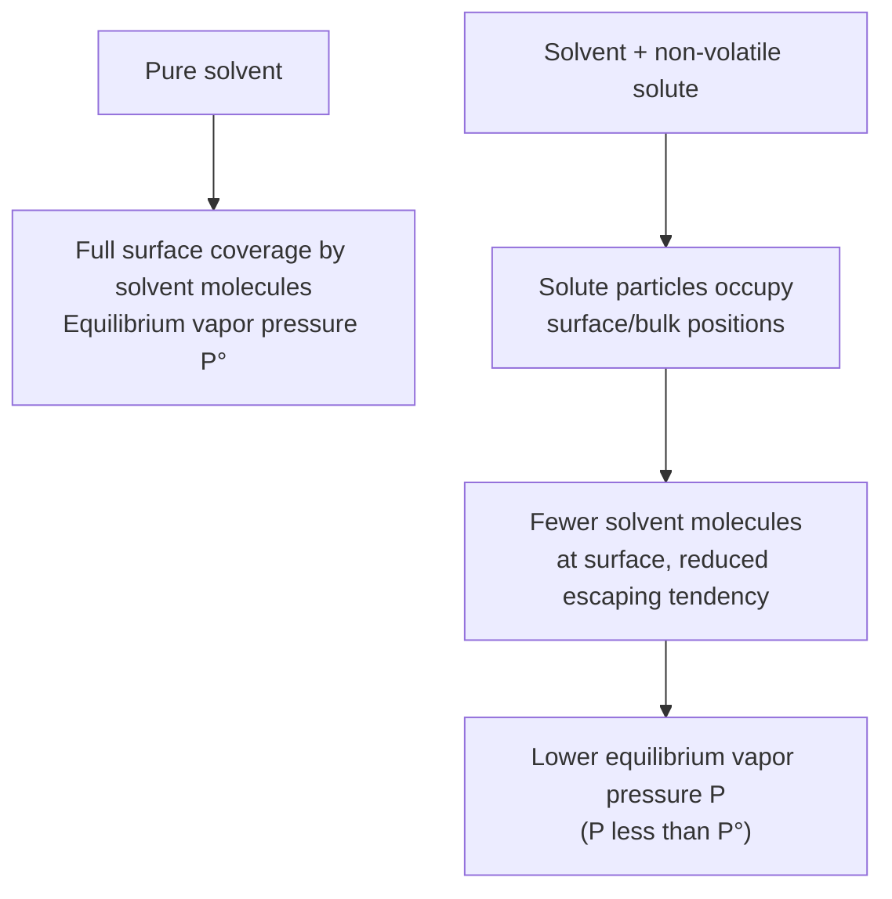
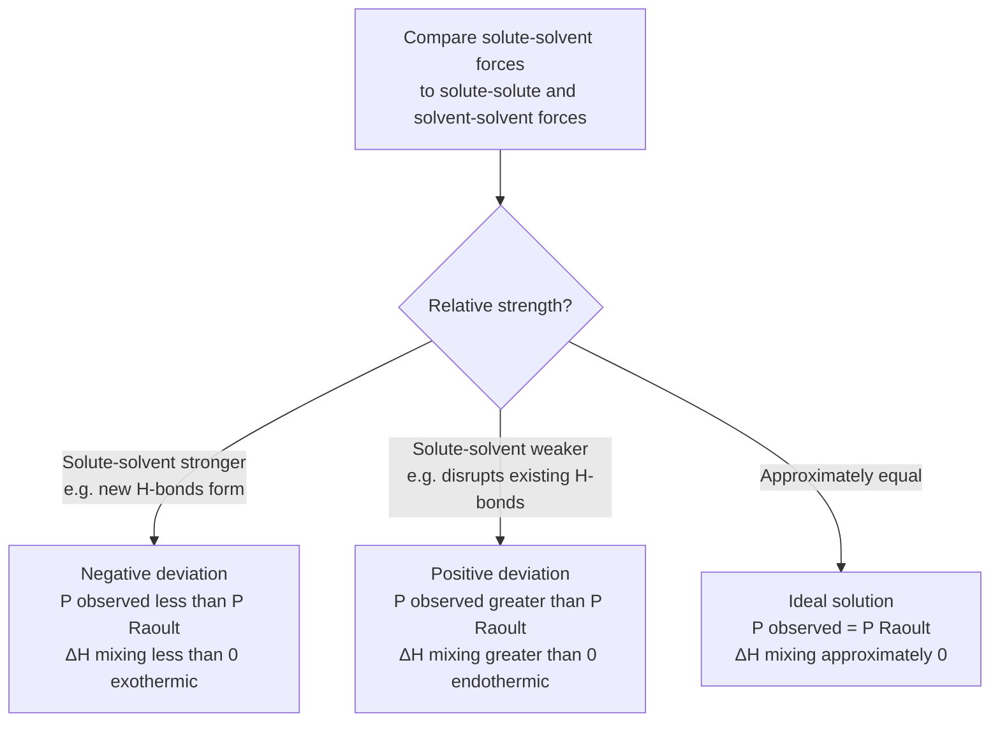
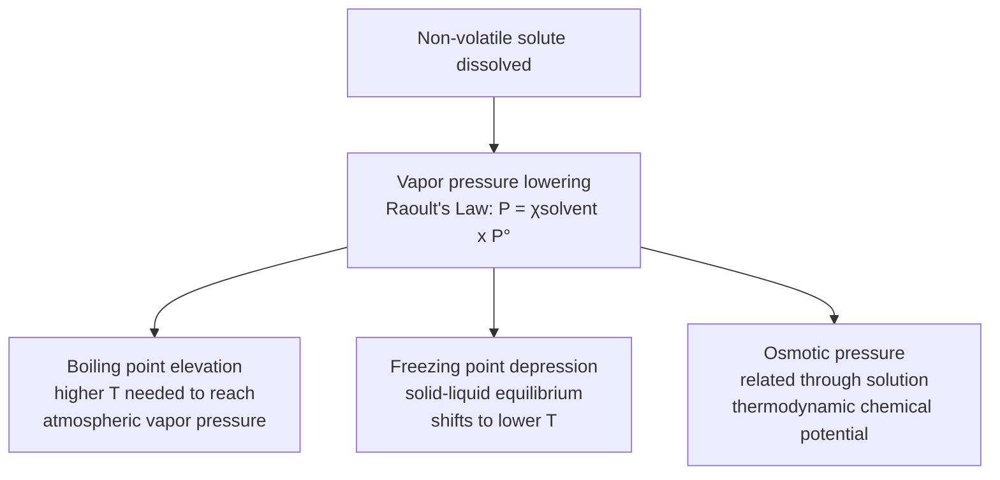

## Vapor Pressure Lowering and Raoult's Law

### Definition and Conceptual Basis

**Vapor pressure lowering** is a colligative property: the reduction in a solvent's vapor pressure that occurs when a non-volatile solute is dissolved in it, relative to the vapor pressure of the pure solvent at the same temperature. As a colligative property, the magnitude of vapor pressure lowering depends on the **number** of solute particles present, not their chemical identity.

**Key Points**

- Vapor pressure lowering occurs specifically when the solute is **non-volatile** (has negligible vapor pressure of its own), so that essentially all vapor above the solution originates from the solvent.
- The phenomenon arises because solute particles occupy positions at the liquid surface and throughout the bulk liquid, reducing the fraction of surface area occupied by solvent molecules and disrupting solvent-solvent interactions, thereby lowering the escaping tendency (rate of vaporization) of solvent molecules.

### Molecular-Level Explanation

At the liquid-vapor interface of a pure solvent, molecules continuously evaporate and condense, reaching a dynamic equilibrium vapor pressure. When solute particles are introduced:

1. Solute particles physically occupy space at and near the surface, reducing the number of solvent molecules in direct contact with the vapor phase per unit surface area.
2. Solute-solvent intermolecular attractions can further reduce the effective "escaping tendency" of solvent molecules (in addition to the simple dilution/surface-occupation effect).
3. Fewer solvent molecules escape into the vapor phase per unit time, so a lower vapor pressure is needed to re-establish equilibrium between evaporation and condensation.



### Raoult's Law

#### Statement

**Raoult's Law** quantifies vapor pressure lowering by stating that the vapor pressure of the solvent above a solution is equal to the mole fraction of the solvent multiplied by the vapor pressure of the pure solvent:

$$P_{solution} = \chi_{solvent} \times P^\circ_{solvent}$$

where:

- $P_{solution}$ = vapor pressure of the solvent above the solution
- $\chi_{solvent}$ = mole fraction of the solvent
- $P^\circ_{solvent}$ = vapor pressure of the pure solvent at the same temperature

**Key Points**

- Since $\chi_{solvent} < 1$ whenever any solute is present (as $\chi_{solvent} + \chi_{solute} = 1$), $P_{solution}$ is always less than $P^\circ_{solvent}$ for a non-volatile solute—confirming that dissolving a solute always lowers vapor pressure.
- Raoult's Law strictly applies to **ideal solutions**, where solute-solvent interactions are comparable in strength to solvent-solvent and solute-solute interactions; real solutions show deviations (discussed below).

#### Vapor Pressure Lowering Formula (ΔP)

The magnitude of the vapor pressure decrease can be derived directly from Raoult's Law:

$$\Delta P = P^\circ_{solvent} - P_{solution} = P^\circ_{solvent}(1 - \chi_{solvent}) = P^\circ_{solvent} \times \chi_{solute}$$

This compact form shows that the **vapor pressure lowering is directly proportional to the mole fraction of solute**, reinforcing its identity as a colligative property.

**Example**

Calculate the vapor pressure of a solution prepared by dissolving 92.0 g of glycerol ($C_3H_8O_3$, non-volatile, molar mass 92.09 g/mol) in 90.0 g of water at 25°C. ($P^\circ_{water} = 23.76$ mmHg at 25°C)

$$\text{mol glycerol} = \frac{92.0 \text{ g}}{92.09 \text{ g/mol}} = 0.999 \text{ mol}$$


$$\text{mol water} = \frac{90.0 \text{ g}}{18.02 \text{ g/mol}} = 4.995 \text{ mol}$$


$$\chi_{water} = \frac{4.995}{4.995 + 0.999} = \frac{4.995}{5.994} = 0.8333$$


$$P_{solution} = 0.8333 \times 23.76 \text{ mmHg} = 19.80 \text{ mmHg}$$


$$\Delta P = 23.76 - 19.80 = 3.96 \text{ mmHg}$$

### Raoult's Law for Volatile Solute-Solvent Mixtures

When **both** components of a two-component solution are volatile, each component contributes its own partial vapor pressure according to Raoult's Law, and the total vapor pressure is the sum of both partial pressures (an application of Dalton's Law of partial pressures):

$$P_A = \chi_A P^\circ_A \qquad P_B = \chi_B P^\circ_B$$


$$P_{total} = P_A + P_B = \chi_A P^\circ_A + \chi_B P^\circ_B$$

**Example**

A solution is prepared by mixing benzene ($\chi = 0.60$, $P^\circ = 95.1$ mmHg) and toluene ($\chi = 0.40$, $P^\circ = 28.4$ mmHg) at 25°C, forming an approximately ideal solution. Calculate the total vapor pressure.

$$P_{benzene} = 0.60 \times 95.1 = 57.1 \text{ mmHg}$$


$$P_{toluene} = 0.40 \times 28.4 = 11.4 \text{ mmHg}$$


$$P_{total} = 57.1 + 11.4 = 68.5 \text{ mmHg}$$

**Key Points**

- In a volatile two-component mixture, the **vapor above the solution is enriched in the more volatile component** relative to the liquid composition, since the component with the higher pure vapor pressure ($P^\circ$) contributes proportionally more to the vapor phase—this principle underlies fractional distillation.

### Ideal vs. Non-Ideal (Real) Solutions

#### Ideal Solutions

A solution is considered **ideal** when solute-solvent, solute-solute, and solvent-solvent intermolecular forces are all approximately equal in strength, such that mixing occurs with no significant enthalpy change ($\Delta H_{mixing} \approx 0$) and Raoult's Law is obeyed across the full composition range. Mixtures of structurally similar molecules (e.g., benzene and toluene) approximate ideal behavior closely.

#### Negative Deviations from Raoult's Law

Occur when solute-solvent attractive forces are **stronger** than the average of solute-solute and solvent-solvent forces (e.g., due to hydrogen bonding formed specifically between the two different components). This makes it harder for molecules to escape into the vapor phase than Raoult's Law predicts, resulting in an **observed vapor pressure lower than the ideal Raoult's Law prediction**.

$$P_{observed} < P_{Raoult's Law prediction}$$

Example: acetone + chloroform mixtures, where a hydrogen bond forms between the acetone carbonyl oxygen and the chloroform C–H, an interaction not present between like molecules to the same degree.

#### Positive Deviations from Raoult's Law

Occur when solute-solvent attractive forces are **weaker** than solute-solute and solvent-solvent forces, meaning molecules escape into the vapor phase more readily than Raoult's Law predicts, resulting in an **observed vapor pressure higher than the ideal prediction**.

$$P_{observed} > P_{Raoult's Law prediction}$$

Example: ethanol + hexane mixtures, where the disruption of ethanol's hydrogen-bonding network by nonpolar hexane increases the escaping tendency of both components relative to ideal behavior.



### Vapor Pressure–Composition Diagram

<svg xmlns="http://www.w3.org/2000/svg" viewBox="0 0 700 420" font-family="Arial, sans-serif">
<text x="350" y="26" text-anchor="middle" font-size="16" font-weight="bold" fill="#1a1a1a">Raoult's Law: Ideal vs. Deviating Solutions (svg_diagram)</text>
<g transform="translate(60,55)">
<line x1="0" y1="300" x2="560" y2="300" stroke="#333" stroke-width="1.5" />
<line x1="0" y1="10" x2="0" y2="300" stroke="#333" stroke-width="1.5" />
<text x="0" y="315" text-anchor="middle" font-size="10" fill="#555">χA = 1, χB = 0</text>
<text x="560" y="315" text-anchor="middle" font-size="10" fill="#555">χA = 0, χB = 1</text>
<text x="280" y="335" text-anchor="middle" font-size="12" fill="#333">Composition</text>
<text x="-30" y="150" text-anchor="middle" font-size="12" fill="#333" transform="rotate(-90,-30,150)">Vapor Pressure</text>



```

<line x1="0" y1="60" x2="560" y2="250" stroke="#333" stroke-width="1.5" stroke-dasharray="6,4" />
<text x="450" y="205" font-size="11" fill="#333">Ideal (Raoult's Law)</text>


<path d="M 0,60 Q 280,220 560,250" stroke="#2874a6" stroke-width="2.5" fill="none" />
<text x="280" y="260" text-anchor="middle" font-size="11" fill="#2874a6">Negative deviation</text>


<path d="M 0,60 Q 280,10 560,250" stroke="#c0392b" stroke-width="2.5" fill="none" />
<text x="280" y="30" text-anchor="middle" font-size="11" fill="#c0392b">Positive deviation</text>
```

</g>
</svg>

### Application to Electrolyte Solutes (Van't Hoff Factor)

For solutes that **dissociate** into multiple particles upon dissolution (electrolytes/ionic compounds), the effective mole fraction of solute particles is greater than the formula-unit mole fraction would suggest, since each formula unit produces multiple dissolved ions. This is accounted for using the **van't Hoff factor** ($i$), which represents the actual number of particles produced per formula unit in solution:

$$\Delta P = i \times \chi_{solute} \times P^\circ_{solvent} \quad \text{(approximate form for dilute solutions)}$$

**Key Points**

- For a non-electrolyte (e.g., glucose, glycerol, sucrose), $i \approx 1$, since the molecule remains intact upon dissolution.
- For a strong electrolyte like NaCl, the theoretical $i = 2$ (one $Na^+$ and one $Cl^-$ per formula unit); for $CaCl_2$, theoretical $i = 3$.
- Experimentally observed $i$ values are often somewhat lower than the theoretical maximum due to **ion pairing** in solution, where oppositely charged ions transiently associate and behave, in part, as a single kinetic/thermodynamic unit rather than fully independent particles—an effect more pronounced at higher concentrations.

**Example**

Estimate the vapor pressure lowering caused by dissolving 0.100 mol of $CaCl_2$ (assume $i = 3$, ideal dissociation) versus 0.100 mol of glucose (i = 1) in 1.00 kg of water at 25°C. ($P^\circ_{water} = 23.76$ mmHg; mol water $\approx 55.5$ mol)

For glucose:

$$\chi_{solute} = \frac{0.100}{55.5 + 0.100} = 1.80\times10^{-3}$$


$$\Delta P = (1)(1.80\times10^{-3})(23.76) = 0.0428 \text{ mmHg}$$

For $CaCl_2$ (using effective particle moles $= i \times 0.100 = 0.300$):

$$\chi_{solute,effective} = \frac{0.300}{55.5+0.300} = 5.37\times10^{-3}$$


$$\Delta P = (5.37\times10^{-3})(23.76) = 0.1276 \text{ mmHg}$$

The vapor pressure lowering for $CaCl_2$ is approximately three times greater than for glucose at the same molar quantity, consistent with $CaCl_2$ producing three dissolved particles per formula unit versus one for glucose.

### Relationship to Other Colligative Properties

Vapor pressure lowering is mechanistically the **root cause** underlying the other colligative properties, since boiling point elevation and freezing point depression can both be derived from the effect of reduced vapor pressure on the liquid's phase diagram:

- **Boiling point elevation**: Because vapor pressure is lowered, a higher temperature is required for the solution's vapor pressure to reach atmospheric pressure (the boiling condition), raising the boiling point.
- **Freezing point depression**: The reduced vapor pressure of the solution intersects the solid-vapor sublimation curve at a lower temperature than pure solvent, lowering the freezing point.



### Common Pitfalls and Misconceptions

- **Raoult's Law applies to the solvent's vapor pressure, not the solute's**, when the solute is non-volatile—a common error is attempting to calculate a "vapor pressure of the solute" in this context, which is essentially zero/negligible by definition of non-volatile.
- **Volatile solutes require the full two-component Raoult's Law treatment** (summing partial pressures of both components)—applying only the simple non-volatile-solute formula to a system where the solute itself has significant vapor pressure (e.g., an ethanol-water mixture) produces incorrect results.
- **Electrolyte dissociation must be accounted for via the van't Hoff factor**—treating an ionic compound as if it contributes only one particle per formula unit (as for molecular solutes) significantly underestimates vapor pressure lowering (and other colligative effects).
- **Deviations from Raoult's Law are not "errors"—they reflect real intermolecular chemistry.** Assuming all solutions behave ideally, especially for structurally dissimilar or hydrogen-bonding component pairs, can lead to significant discrepancies between predicted and observed vapor pressures.

**Related Topics**

- Boiling point elevation and freezing point depression
- Osmotic pressure and osmosis
- Van't Hoff factor and electrolyte solutions
- Ideal vs. non-ideal solution behavior and intermolecular forces
- Fractional distillation and vapor-liquid equilibrium
- Phase diagrams and their modification by solutes