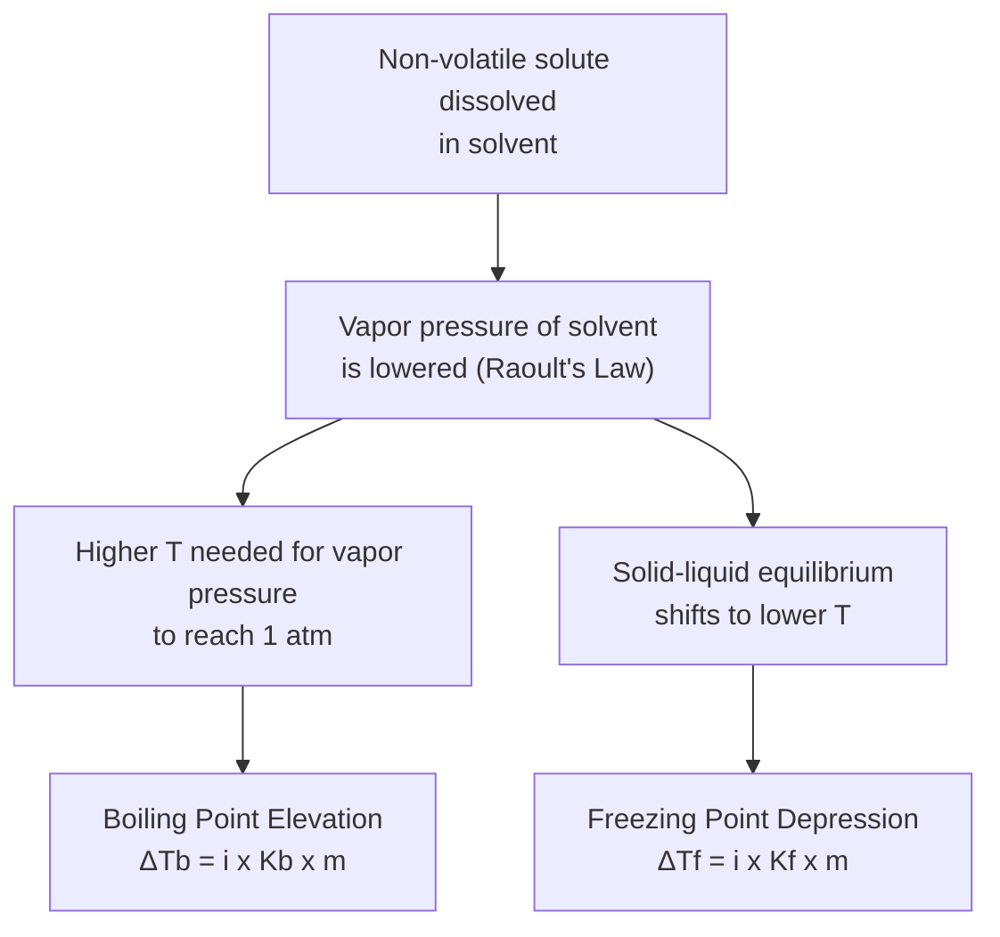
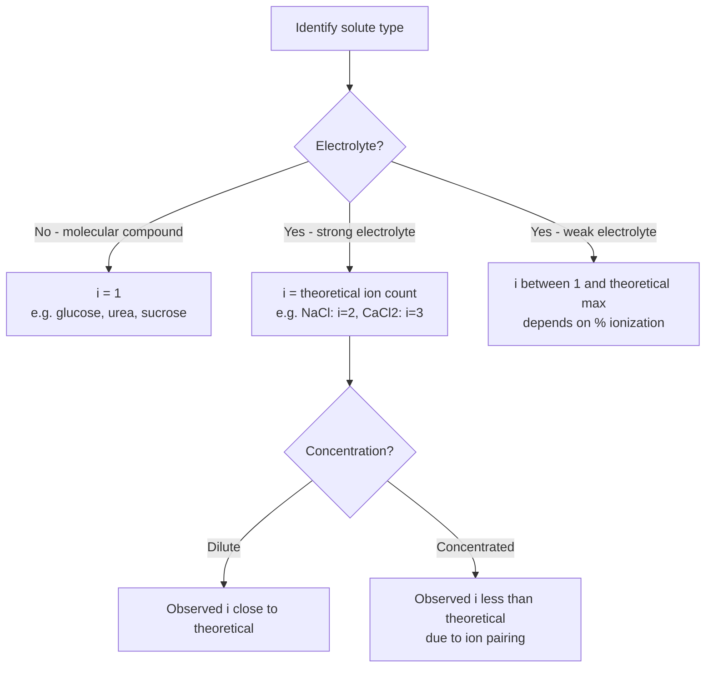

## Boiling Point Elevation and Freezing Point Depression


### Overview: Colligative Properties

**Boiling point elevation** and **freezing point depression** are both colligative properties—physical properties of a solution that depend on the **number (concentration) of solute particles** present, not their chemical identity. Both arise from the same underlying cause: the reduction in solvent vapor pressure caused by dissolved solute (vapor pressure lowering), which shifts the temperatures at which phase transitions occur.

**Key Points**

- Both phenomena require the solute to remain in the liquid phase during the phase transition being examined (i.e., the solute does not volatilize into the vapor during boiling, and does not co-crystallize into the solid during freezing)—this holds for most common non-volatile solutes and is the standard assumption in general chemistry treatments.
- Both effects are quantified using **molality** (not molarity), because molality is temperature-independent, which is essential since these phenomena are defined by a temperature change.

### Freezing Point Depression

#### Definition and Mechanism

**Freezing point depression** is the decrease in a solution's freezing point relative to the pure solvent's freezing point. It occurs because the solute lowers the solvent's vapor pressure (via Raoult's Law), and on a phase diagram, this shifts the liquid-solid equilibrium line to intersect the solid phase at a lower temperature. Physically, dissolved solute particles disrupt the regular crystal lattice formation of the solvent, making it thermodynamically less favorable for the solvent to freeze at its normal (pure) freezing point.

#### Governing Equation

$$\Delta T_f = i \times K_f \times m$$

where:

- $\Delta T_f$ = freezing point depression (decrease in freezing point, always reported as a positive magnitude, with the understanding that the new freezing point is lower)
- $i$ = van't Hoff factor (number of particles produced per formula unit upon dissociation)
- $K_f$ = **molal freezing point depression constant**, a solvent-specific property (°C·kg/mol or °C/m)
- $m$ = molality of the solution (mol solute/kg solvent)

The new freezing point is calculated as:

$$T_f(\text{solution}) = T_f(\text{pure solvent}) - \Delta T_f$$

#### Representative $K_f$ Values

| Solvent | Normal Freezing Point (°C) | $K_f$ (°C·kg/mol) |
| --- | --- | --- |
| Water | 0.00 | 1.86 |
| Benzene | 5.5 | 5.12 |
| Camphor | 178.8 | 40.0 |
| Cyclohexane | 6.5 | 20.0 |
| Acetic acid | 16.6 | 3.90 |

**Key Points**

- **Camphor** has an unusually large $K_f$, historically making it useful for determining molar masses experimentally via freezing point depression (Rast method), since even small amounts of solute produce a large, easily measurable temperature change.

### Boiling Point Elevation

#### Definition and Mechanism

**Boiling point elevation** is the increase in a solution's boiling point relative to the pure solvent's boiling point. Since dissolved non-volatile solute lowers the solvent's vapor pressure at any given temperature, a higher temperature is required for the solution's vapor pressure to reach atmospheric pressure (the defining condition for boiling), thus elevating the boiling point.

#### Governing Equation

$$\Delta T_b = i \times K_b \times m$$

where:

- $\Delta T_b$ = boiling point elevation (increase in boiling point, positive magnitude)
- $K_b$ = **molal boiling point elevation constant**, solvent-specific (°C·kg/mol)
- Other variables as defined above

The new boiling point is calculated as:

$$T_b(\text{solution}) = T_b(\text{pure solvent}) + \Delta T_b$$

#### Representative $K_b$ Values

| Solvent | Normal Boiling Point (°C) | $K_b$ (°C·kg/mol) |
| --- | --- | --- |
| Water | 100.00 | 0.512 |
| Benzene | 80.1 | 2.53 |
| Chloroform | 61.2 | 3.63 |
| Ethanol | 78.4 | 1.22 |
| Carbon tetrachloride | 76.7 | 5.03 |

**Key Points**

- $K_b$ and $K_f$ values are distinct properties of a given solvent (not simply related to each other) and must be looked up or given separately for each specific solvent.
- Both $K_b$ and $K_f$ depend only on the **identity of the solvent**—they are independent of the solute, which is precisely why the equations require only the solute's *molality* and *particle count* ($i$), not its chemical identity.



### Phase Diagram Interpretation

Both effects can be visualized on a phase diagram, where the solution's phase boundary curves (vapor pressure curves) are shifted downward relative to the pure solvent, causing the triple point and the solid-liquid and liquid-vapor equilibrium lines to shift accordingly.

<svg xmlns="http://www.w3.org/2000/svg" viewBox="0 0 700 460" font-family="Arial, sans-serif">
<text x="350" y="26" text-anchor="middle" font-size="16" font-weight="bold" fill="#1a1a1a">Phase Diagram: Solvent vs. Solution (svg_diagram)</text>
<g transform="translate(70,55)">
<line x1="0" y1="350" x2="560" y2="350" stroke="#333" stroke-width="1.5" />
<line x1="0" y1="10" x2="0" y2="350" stroke="#333" stroke-width="1.5" />
<text x="280" y="375" text-anchor="middle" font-size="12" fill="#333">Temperature</text>
<text x="-35" y="175" text-anchor="middle" font-size="12" fill="#333" transform="rotate(-90,-35,175)">Pressure</text>



```

<path d="M 150,350 L 200,150 L 350,30" stroke="#333" stroke-width="2" fill="none" />
<path d="M 200,150 L 100,10" stroke="#333" stroke-width="2" fill="none" />
<text x="380" y="25" font-size="10" fill="#333">Pure solvent L-V curve</text>


<path d="M 190,350 L 240,180 L 380,60" stroke="#2874a6" stroke-width="2" stroke-dasharray="5,3" fill="none" />
<text x="400" y="80" font-size="10" fill="#2874a6">Solution L-V curve (lowered)</text>


<line x1="150" y1="330" x2="150" y2="350" stroke="#c0392b" stroke-width="2" />
<text x="150" y="310" text-anchor="middle" font-size="10" fill="#c0392b">Tf (solution)</text>
<line x1="200" y1="330" x2="200" y2="350" stroke="#333" stroke-width="2" />
<text x="200" y="310" text-anchor="middle" font-size="10" fill="#333">Tf° (pure)</text>


<line x1="0" y1="200" x2="560" y2="200" stroke="#888" stroke-dasharray="3,3" />
<text x="10" y="195" font-size="10" fill="#555">1 atm</text>
<line x1="350" y1="180" x2="350" y2="220" stroke="#333" stroke-width="2" />
<text x="350" y="235" text-anchor="middle" font-size="10" fill="#333">Tb° (pure)</text>
<line x1="420" y1="180" x2="420" y2="220" stroke="#2874a6" stroke-width="2" />
<text x="420" y="235" text-anchor="middle" font-size="10" fill="#2874a6">Tb (solution)</text>

<text x="80" y="130" font-size="11" fill="#555">ΔTf</text>
<text x="385" y="205" font-size="11" fill="#555">ΔTb</text>
```

</g>
</svg>

### Worked Calculations

**Example 1: Freezing Point Depression (Non-electrolyte)**

Calculate the freezing point of a solution prepared by dissolving 25.0 g of ethylene glycol ($C_2H_6O_2$, molar mass 62.07 g/mol, non-electrolyte, $i=1$) in 500.0 g of water. ($K_f = 1.86$ °C·kg/mol)

$$\text{mol ethylene glycol} = \frac{25.0}{62.07} = 0.4028 \text{ mol}$$


$$m = \frac{0.4028 \text{ mol}}{0.5000 \text{ kg}} = 0.8056 \text{ mol/kg}$$


$$\Delta T_f = (1)(1.86)(0.8056) = 1.498 \text{ °C}$$


$$T_f(\text{solution}) = 0.00 - 1.498 = -1.50 \text{ °C}$$

**Example 2: Boiling Point Elevation (Electrolyte)**

Calculate the boiling point of a solution prepared by dissolving 15.0 g of $MgCl_2$ (molar mass 95.21 g/mol, strong electrolyte, theoretical $i=3$) in 300.0 g of water. ($K_b = 0.512$ °C·kg/mol)

$$\text{mol } MgCl_2 = \frac{15.0}{95.21} = 0.1576 \text{ mol}$$


$$m = \frac{0.1576}{0.3000} = 0.5253 \text{ mol/kg}$$


$$\Delta T_b = (3)(0.512)(0.5253) = 0.8069 \text{ °C}$$


$$T_b(\text{solution}) = 100.00 + 0.807 = 100.81 \text{ °C}$$

**Example 3: Molar Mass Determination via Freezing Point Depression**

An unknown non-electrolyte compound (1.20 g) is dissolved in 50.0 g of benzene, producing a freezing point depression of 1.02°C. Determine the molar mass of the unknown. ($K_f$ of benzene $= 5.12$ °C·kg/mol)

$$m = \frac{\Delta T_f}{K_f} = \frac{1.02}{5.12} = 0.1992 \text{ mol/kg}$$


$$\text{mol solute} = m \times \text{kg solvent} = 0.1992 \times 0.0500 = 9.96\times10^{-3} \text{ mol}$$


$$\text{Molar mass} = \frac{1.20 \text{ g}}{9.96\times10^{-3} \text{ mol}} = 120.5 \text{ g/mol}$$

### The Van't Hoff Factor in Detail

**Key Points**

- **Non-electrolytes** (molecular compounds that do not dissociate, e.g., glucose, sucrose, urea, ethylene glycol): $i = 1$
- **Strong electrolytes**: theoretical $i$ equals the number of ions produced per formula unit (e.g., NaCl: $i=2$; $CaCl_2$: $i=3$; $Al_2(SO_4)_3$: $i=5$)
- **Weak electrolytes** (partially dissociating, e.g., weak acids/bases): $i$ is between 1 and the fully-dissociated theoretical maximum, and its exact value depends on the degree of ionization at the given concentration.
- **Experimental (observed) $i$ values are typically somewhat lower than theoretical values** for strong electrolytes, especially at higher concentrations, due to **ion pairing**—the tendency of oppositely charged ions to transiently associate in solution and behave, in part, as a single particle rather than fully independent dissociated ions. This deviation becomes more pronounced with increasing concentration and increasing ionic charge.



### Real-World Applications

#### Antifreeze/Coolant Systems

Ethylene glycol or propylene glycol added to automobile radiator coolant exploits both freezing point depression (preventing freezing in cold weather) and boiling point elevation (raising the operating temperature ceiling, preventing boil-over)—a dual practical benefit from a single colligative additive.

#### Road De-icing

Salts such as NaCl or $CaCl_2$ are spread on icy roads to lower the freezing point of water below the ambient temperature, causing ice to melt (or preventing water from freezing). $CaCl_2$ is sometimes preferred in very cold climates because its higher van't Hoff factor ($i=3$ vs. $i=2$ for NaCl) produces greater freezing point depression per mole, and it also releases heat upon dissolving (exothermic dissolution), providing an additional (though secondary) melting benefit [Inference — the exothermic dissolution contribution is a recognized secondary factor discussed in some applied chemistry references, though the primary de-icing mechanism is colligative freezing point depression].

#### Molar Mass Determination

Freezing point depression (cryoscopy) and, less commonly, boiling point elevation (ebullioscopy) are classic experimental techniques for determining the molar mass of an unknown solute, particularly useful historically before more modern spectrometric methods (e.g., mass spectrometry) became widely accessible.

#### Food Science

Salt added to ice in traditional ice-cream making lowers the freezing point of the ice-water mixture below 0°C, allowing the surrounding brine to reach a temperature cold enough to freeze the cream mixture (which itself has a lower freezing point than pure water due to its own dissolved/suspended components) [Inference — a commonly cited illustrative example in general chemistry education, though the exact mechanism additionally involves the physical chemistry of the ice-salt eutectic system].

### Common Pitfalls and Misconceptions

- **Using molarity instead of molality.** Since these are temperature-dependent phenomena, molality (mass-based, temperature-independent) must be used, not molarity (volume-based, temperature-dependent)—a very common calculation error.
- **Forgetting the van't Hoff factor for electrolytes.** Omitting $i$ (or incorrectly using $i=1$) for ionic compounds significantly underestimates the actual $\Delta T_f$ or $\Delta T_b$.
- **Using theoretical $i$ without qualification for concentrated solutions.** At higher concentrations, ion pairing reduces the effective $i$ below the theoretical maximum; precise work may require an experimentally determined $i$ rather than the simple theoretical ion count.
- **Confusing $K_f$ and $K_b$ values, or assuming they are equal for a given solvent.** These are independent solvent-specific constants and must not be interchanged.
- **Applying these equations to volatile solutes without modification.** The simple non-volatile-solute forms of these equations assume the solute does not itself contribute vapor pressure; volatile solute systems require more complex treatment.

**Related Topics**

- Vapor pressure lowering and Raoult's Law
- Osmotic pressure and osmosis
- Van't Hoff factor and electrolyte dissociation
- Molar mass determination techniques (cryoscopy, ebullioscopy)
- Phase diagrams and phase equilibria
- Colligative properties comparison across concentration units