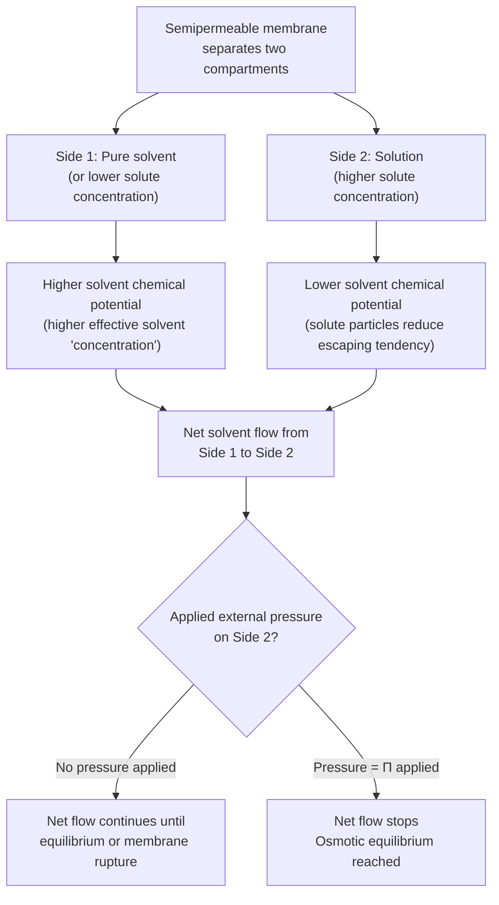
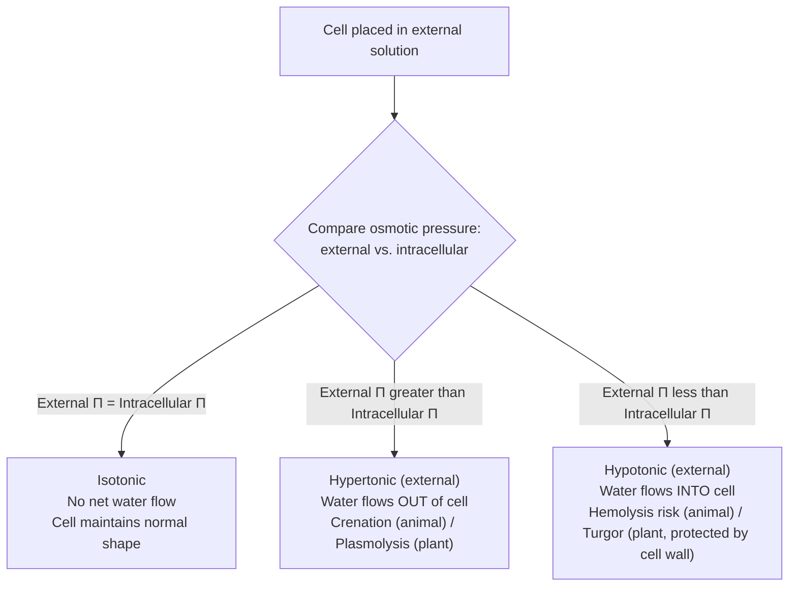
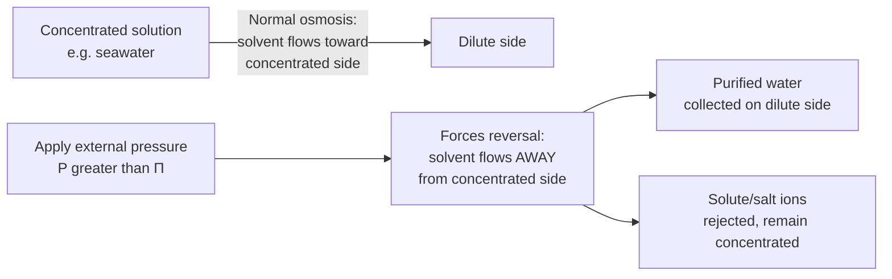

## Osmotic Pressure

### Definition and Conceptual Basis

**Osmotic pressure** ($\Pi$) is a colligative property defined as the pressure that must be applied to a solution to prevent the net inward flow of pure solvent across a semipermeable membrane separating the solution from the pure solvent. It quantifies the "driving force" for **osmosis**—the spontaneous net movement of solvent molecules across a semipermeable membrane from a region of lower solute concentration (higher solvent chemical potential) to a region of higher solute concentration (lower solvent chemical potential).

**Key Points**

- A **semipermeable membrane** allows solvent molecules to pass through but blocks (or significantly restricts) the passage of solute particles.
- Osmosis proceeds spontaneously in the direction that tends to equalize solute concentration on both sides of the membrane, driven by the tendency toward increased entropy/equalized chemical potential.
- Like vapor pressure lowering, boiling point elevation, and freezing point depression, osmotic pressure depends on the **number (concentration) of solute particles**, not their chemical identity.

### The Osmosis Process

### The Van't Hoff Equation for Osmotic Pressure

#### Governing Equation

Osmotic pressure follows an equation mathematically analogous to the ideal gas law, known as the **van't Hoff equation for osmotic pressure**:

$$\Pi = i M R T$$

where:

- $\Pi$ = osmotic pressure (atm, or other pressure units)
- $i$ = van't Hoff factor (number of particles produced per formula unit upon dissociation)
- $M$ = molarity of the solution (mol/L)
- $R$ = ideal gas constant (0.08206 L·atm/(mol·K))
- $T$ = absolute temperature (Kelvin)

**Key Points**

- Notably, osmotic pressure calculations use **molarity**, not molality—unlike boiling point elevation and freezing point depression. This is because osmotic pressure is fundamentally a pressure-volume relationship (analogous to the ideal gas law $PV = nRT$, rearranged as $P = (n/V)RT$), making volume-based concentration the natural unit here, rather than a purely temperature-change-based phenomenon like the other colligative properties.
- Temperature must always be converted to **Kelvin** before use in this equation.

### Worked Calculations

**Example 1: Basic Osmotic Pressure Calculation**

Calculate the osmotic pressure of a 0.150 M sucrose solution ($C_{12}H_{22}O_{11}$, non-electrolyte, $i=1$) at 25°C (298 K).

$$\Pi = iMRT = (1)(0.150 \text{ mol/L})(0.08206 \text{ L·atm/(mol·K)})(298 \text{ K})$$

$$\Pi = 3.667 \text{ atm}$$

**Example 2: Electrolyte Solution**

Calculate the osmotic pressure of a 0.100 M $CaCl_2$ solution at 37°C (310 K, approximating physiological body temperature), assuming ideal (complete) dissociation ($i=3$).

$$\Pi = (3)(0.100 \text{ mol/L})(0.08206)(310 \text{ K})$$

$$\Pi = 7.632 \text{ atm}$$

**Example 3: Molar Mass Determination via Osmotic Pressure**

A 1.00 g sample of an unknown non-electrolyte protein is dissolved in enough water to make 250.0 mL of solution. The measured osmotic pressure at 25°C is 2.10 mmHg. Determine the approximate molar mass of the protein.

First convert pressure to atm:

$$\Pi = \frac{2.10 \text{ mmHg}}{760 \text{ mmHg/atm}} = 2.763\times10^{-3} \text{ atm}$$

Rearranging the van't Hoff equation to solve for $M$:

$$M = \frac{\Pi}{iRT} = \frac{2.763\times10^{-3}}{(1)(0.08206)(298)} = 1.130\times10^{-4} \text{ mol/L}$$

$$\text{mol solute} = M \times V = (1.130\times10^{-4} \text{ mol/L})(0.2500 \text{ L}) = 2.825\times10^{-5} \text{ mol}$$

$$\text{Molar mass} = \frac{1.00 \text{ g}}{2.825\times10^{-5} \text{ mol}} = 35,400 \text{ g/mol}$$

### Why Osmotic Pressure Is the Most Sensitive Colligative Property

**Key Points**

- Osmotic pressure produces the **largest, most easily measurable effect** among the four classic colligative properties (vapor pressure lowering, boiling point elevation, freezing point depression, osmotic pressure) for a given solute concentration—even very dilute solutions produce readily measurable osmotic pressures, whereas the corresponding boiling point elevation or freezing point depression might be too small to measure precisely with standard laboratory thermometry.
- This sensitivity makes osmotic pressure measurement (**osmometry**) the preferred method for determining the molar mass of **large molecules** such as proteins and polymers, where the molar concentration achievable at practical solubility limits is very low, and the corresponding boiling/freezing point changes would be too minute to detect reliably (as demonstrated in Example 3 above, where a very high molar mass corresponds to a still-measurable osmotic pressure).

### Types of Solutions Relative to Osmotic Pressure

#### Isotonic Solutions

Two solutions with **equal osmotic pressure** are termed **isotonic**. When separated by a semipermeable membrane, no net solvent flow occurs between isotonic solutions, since the chemical potential (escaping tendency) of solvent is equal on both sides.

#### Hypertonic Solutions

A solution with **higher osmotic pressure** (higher effective solute concentration) relative to a reference solution (e.g., inside a cell) is termed **hypertonic**. Water flows *out of* a cell placed in a hypertonic solution (net osmosis toward the higher-concentration external solution), causing the cell to shrink (**crenation** in animal cells; **plasmolysis** in plant cells).

#### Hypotonic Solutions

A solution with **lower osmotic pressure** relative to a reference solution is termed **hypotonic**. Water flows *into* a cell placed in a hypotonic solution, causing the cell to swell and potentially rupture (**hemolysis** in animal cells, particularly red blood cells; plant cells are generally protected from rupture by their rigid cell wall, instead becoming turgid).

### Biological and Medical Relevance

#### Intravenous (IV) Fluids

Medical IV solutions (e.g., 0.9% "normal" saline, 5% dextrose) are carefully formulated to be **isotonic** with blood plasma to prevent damage to red blood cells—a hypotonic IV fluid could cause hemolysis, while a hypertonic fluid could cause cell crenation/dehydration at the cellular level.

#### Kidney Function and Osmoregulation

The kidneys regulate blood osmotic pressure and solute concentration through selective filtration and reabsorption processes, maintaining osmotic homeostasis critical for proper cellular function throughout the body [Inference — this is a standard physiological application referenced in connecting osmotic pressure chemistry to biology, with the detailed regulatory mechanisms belonging more properly to physiology than general chemistry].

#### Plant Water Transport

Osmotic pressure differences between soil water, root cells, and other plant tissues drive water uptake and transport through plant vascular systems, contributing to turgor pressure that provides structural support to non-woody plant tissue.

### Reverse Osmosis

**Reverse osmosis** is a water purification/desalination technique that applies **external pressure exceeding the natural osmotic pressure** of a concentrated (e.g., saline) solution, forcing solvent (water) to flow *against* its natural osmotic direction—from the concentrated solution through a semipermeable membrane into the dilute (purified) side, while solute (e.g., salt ions) is rejected by the membrane.

$$P_{applied} > \Pi_{solution}$$

**Key Points**

- Reverse osmosis is widely used in seawater desalination and household/industrial water purification systems, and requires overcoming the substantial osmotic pressure of seawater (approximately 27 atm, reflecting its high dissolved ion concentration) [Inference — the specific osmotic pressure value for seawater is a commonly cited reference figure in environmental/engineering chemistry sources and can vary somewhat depending on exact salinity].

### Osmotic Pressure Relative to Other Colligative Properties

<svg xmlns="http://www.w3.org/2000/svg" viewBox="0 0 700 340" font-family="Arial, sans-serif">
<text x="350" y="26" text-anchor="middle" font-size="16" font-weight="bold" fill="#1a1a1a">Colligative Properties: Common Origin (svg_diagram)</text>
<rect x="250" y="50" width="200" height="60" rx="8" fill="#eaf2fd" stroke="#2874a6" stroke-width="2" />
<text x="350" y="85" text-anchor="middle" font-size="13" font-weight="bold" fill="#1a5276">Solute particle concentration </text>
<text x="350" y="100" text-anchor="middle" font-size="11" fill="#333">(depends only on # particles)</text>
<line x1="300" y1="110" x2="150" y2="160" stroke="#555" stroke-width="1.5" />
<line x1="400" y1="110" x2="550" y2="160" stroke="#555" stroke-width="1.5" />
<line x1="330" y1="110" x2="280" y2="160" stroke="#555" stroke-width="1.5" />
<line x1="370" y1="110" x2="420" y2="160" stroke="#555" stroke-width="1.5" />
<rect x="50" y="160" width="180" height="70" rx="8" fill="#fdecea" stroke="#c0392b" stroke-width="2" />
<text x="140" y="190" text-anchor="middle" font-size="12" font-weight="bold" fill="#943126">Vapor Pressure Lowering</text>
<text x="140" y="210" text-anchor="middle" font-size="10" fill="#333">P = χsolvent P°</text>
<rect x="230" y="160" width="180" height="70" rx="8" fill="#eafaf1" stroke="#27ae60" stroke-width="2" />
<text x="320" y="190" text-anchor="middle" font-size="12" font-weight="bold" fill="#1e8449">Boiling Pt Elevation</text>
<text x="320" y="210" text-anchor="middle" font-size="10" fill="#333">ΔTb = iKbm</text>
<rect x="410" y="160" width="180" height="70" rx="8" fill="#fef5e7" stroke="#b9770e" stroke-width="2" />
<text x="500" y="190" text-anchor="middle" font-size="12" font-weight="bold" fill="#7e5109">Freezing Pt Depression</text>
<text x="500" y="210" text-anchor="middle" font-size="10" fill="#333">ΔTf = iKfm</text>
<rect x="590" y="160" width="100" height="70" rx="8" fill="#f4ecf7" stroke="#8e44ad" stroke-width="2" />
<text x="640" y="185" text-anchor="middle" font-size="11" font-weight="bold" fill="#5b2c6f">Osmotic</text>
<text x="640" y="200" text-anchor="middle" font-size="11" font-weight="bold" fill="#5b2c6f">Pressure</text>
<text x="640" y="218" text-anchor="middle" font-size="10" fill="#333">Π = iMRT</text>

<text x="350" y="280" text-anchor="middle" font-size="12" fill="#555" font-style="italic">All four properties share a common origin in solute particle count and follow the same i-factor treatment</text>

</svg>

### Common Pitfalls and Misconceptions

- **Using molality instead of molarity** for osmotic pressure calculations is a frequent reversal error—osmotic pressure specifically uses molarity ($M$), unlike boiling point elevation and freezing point depression, which use molality.
- **Forgetting to convert temperature to Kelvin.** As with any application of $R = 0.08206$ L·atm/(mol·K), Celsius temperatures must be converted to Kelvin before substitution.
- **Neglecting the van't Hoff factor for electrolyte solutes**, leading to significant underestimation of $\Pi$ for ionic compounds.
- **Confusing osmotic pressure with hydrostatic/applied pressure in general.** Osmotic pressure is specifically the pressure required to *halt* net osmotic flow—it is a property of the solution relative to a reference (typically pure solvent), not an absolute external pressure being applied under normal (non-equilibrium) circumstances.
- **Assuming isotonic solutions have identical molarity for different solutes.** Isotonic solutions have equal *osmotic pressure* ($\Pi = iMRT$ equal), which depends on the product $i \times M$—two isotonic solutions of different solutes (e.g., one electrolyte, one non-electrolyte) will generally have different molarities to compensate for differing $i$ values.

**Related Topics**

- Vapor pressure lowering and Raoult's Law
- Boiling point elevation and freezing point depression
- Van't Hoff factor and electrolyte dissociation behavior
- Reverse osmosis and water purification technology
- Cell membrane transport and osmoregulation in biology
- Molar mass determination techniques (osmometry vs. cryoscopy/ebullioscopy)