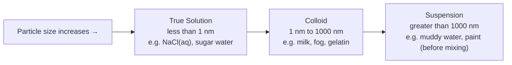
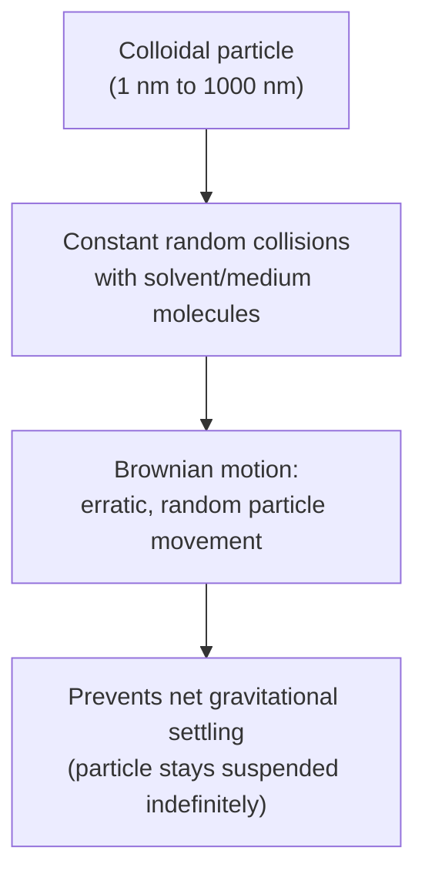

## Colloids and Suspensions

### Classification of Mixtures by Particle Size

Heterogeneous and homogeneous mixtures can be classified into three categories based on the size of the dispersed particles: **true solutions**, **colloids**, and **suspensions**. This classification is fundamentally a spectrum defined by particle diameter, which in turn governs the physical behavior of the mixture.

| Property | True Solution | Colloid | Suspension |
| --- | --- | --- | --- |
| Particle size | < 1 nm | 1 nm – 1000 nm (1 μm) | > 1000 nm (1 μm) |
| Homogeneity | Homogeneous | Appears homogeneous, actually heterogeneous | Heterogeneous |
| Settling | Does not settle | Does not settle (under gravity alone) | Settles over time |
| Filterability | Passes through filter paper and membranes | Passes through filter paper; blocked by some membranes | Blocked by filter paper |
| Tyndall effect | No (does not scatter light) | Yes (scatters light) | Yes (scatters light, but often visibly turbid) |
| Visual appearance | Clear, transparent | Often clear or translucent but may scatter light visibly | Cloudy, opaque, particles often visible |

**Key Points**

- The distinction between these three categories is **not sharply discrete but based on a continuous particle size scale**—colloid classification is defined by an approximate size range (roughly 1 nm to 1 μm) rather than an exact physical boundary.
- A colloid's dispersed particles are large enough to scatter visible light but small enough to remain suspended indefinitely due to constant random collision with solvent molecules (Brownian motion), preventing gravitational settling.

### Colloids: Definition and Structure

A **colloid** (or colloidal dispersion) is a mixture in which microscopically dispersed particles (the **dispersed phase**) are distributed throughout a continuous medium (the **dispersion medium** or continuous phase), with the dispersed particles large enough to scatter light but small enough to remain suspended without settling under normal gravitational conditions over practical observation timescales.

**Key Points**

- Colloids appear homogeneous to the naked eye but are actually **heterogeneous at the microscopic level**, since the dispersed and continuous phases remain physically and chemically distinct (unlike a true solution, where the solute is dispersed at the molecular/ionic level).
- Colloidal particles may be single large molecules (e.g., proteins, polymers) or aggregates of many smaller molecules/ions (e.g., micelles, dispersed solid particles).

### Types of Colloids by Phase Combination

Colloids are classified according to the physical states of the dispersed phase and the dispersion medium:

| Dispersed Phase | Dispersion Medium | Colloid Type | Examples |
| --- | --- | --- | --- |
| Solid | Gas | Solid aerosol | Smoke, dust in air |
| Liquid | Gas | Liquid aerosol | Fog, mist, clouds, hairspray |
| Gas | Liquid | Foam | Whipped cream, shaving foam, soap suds |
| Liquid | Liquid | Emulsion | Milk, mayonnaise, salad dressing |
| Solid | Liquid | Sol | Paint, blood, ink, muddy water (borderline with suspension) |
| Gas | Solid | Solid foam | Marshmallow, styrofoam, pumice |
| Liquid | Solid | Solid emulsion (gel) | Butter, cheese, gelatin dessert (Jell-O) |
| Solid | Solid | Solid sol | Colored glass, some alloys, certain gemstones |

**Key Points**

- A gas-in-gas combination does not produce a colloid, since gases are always miscible with one another at the molecular level, forming a true (homogeneous) solution rather than a distinct dispersed phase.
- **Gel-type colloids** (liquid dispersed in solid, or in some usages a semi-solid network trapping liquid) have a distinctive semi-rigid structure arising from the dispersed liquid phase being trapped within a continuous solid network (e.g., a polymer or protein matrix), giving properties intermediate between solid and liquid.

### Properties of Colloids

#### The Tyndall Effect

The **Tyndall effect** is the scattering of visible light by colloidal particles, making a light beam passing through a colloid visible as a distinct path, whereas the same beam passes through a true solution without visible scattering (since true solution particles are too small, relative to the wavelength of visible light, to scatter it appreciably).

**Key Points**

- The Tyndall effect is the standard experimental test used to distinguish a colloid from a true solution, since both may appear visually clear or translucent to casual observation.
- Everyday examples include the visible beam of a car's headlights in fog, sunlight beams visible through dusty air, or a laser pointer beam visible when passed through gelatin.

#### Brownian Motion

**Brownian motion** is the continuous, random, erratic movement of colloidal particles, caused by constant collisions with the much smaller, rapidly moving molecules of the dispersion medium. This random motion is a key factor preventing colloidal particles from settling under gravity, since the particles are continuously kept in random motion rather than following a steady, unidirectional sedimentation path.

#### Electrical Charge and Colloidal Stability

Many colloidal particles carry a **similar electrical surface charge** (often due to selective ion adsorption from the dispersion medium onto the particle surface). This shared charge causes **mutual electrostatic repulsion** between particles, which is a key factor preventing colloidal particles from aggregating (clumping together) into larger particles that would eventually settle out—effectively stabilizing the colloid against coagulation.

**Key Points**

- This charge-based stabilization mechanism explains why colloids can be **destabilized (coagulated)** by adding an electrolyte solution: the added ions can neutralize or shield the colloidal particles' surface charge, reducing electrostatic repulsion and allowing particles to aggregate and eventually settle or separate—a process called **coagulation** or **flocculation**.
- This principle underlies practical applications such as water treatment (adding alum, $KAl(SO_4)_2$, to coagulate and remove suspended colloidal impurities) and the curdling of milk (protein colloid destabilization) upon addition of acid.

### Emulsions and Emulsifying Agents

An **emulsion** is a colloid formed from two normally immiscible liquids (typically a polar and a nonpolar liquid, such as oil and water). Because the two liquid phases are fundamentally incompatible at the molecular level, emulsions are inherently thermodynamically unstable and tend to separate over time unless stabilized.

#### Emulsifying Agents

An **emulsifying agent** (emulsifier) is a substance—typically possessing both a polar (hydrophilic) and nonpolar (hydrophobic/lipophilic) region within the same molecule (an **amphiphilic** structure)—that stabilizes an emulsion by positioning itself at the interface between the two liquid phases, reducing interfacial tension and preventing droplet coalescence.

**Key Points**

- Common emulsifiers include soaps and detergents (fatty acid salts), lecithin (found in egg yolk, widely used in food emulsification such as mayonnaise), and various synthetic surfactants.
- Emulsifiers work by orienting their hydrophilic region toward the water phase and their hydrophobic (lipophilic) region toward the oil phase, forming a stabilizing interfacial layer (often as micelles) around dispersed droplets.

<svg xmlns="http://www.w3.org/2000/svg" viewBox="0 0 640 360" font-family="Arial, sans-serif">
<text x="320" y="26" text-anchor="middle" font-size="16" font-weight="bold" fill="#1a1a1a">Emulsifying Agent Stabilization (svg_diagram)</text>

<circle cx="320" cy="190" r="90" fill="#f9e79f" stroke="#b9770e" stroke-width="2" />
<text x="320" y="195" text-anchor="middle" font-size="13" fill="#7e5109">Oil (nonpolar)</text>

<rect x="30" y="60" width="580" height="260" fill="#d6eaf8" opacity="0.3" />
<text x="100" y="90" font-size="12" fill="#1a5276">Water (polar) phase</text>

<g id="emulsifier-molecules">
<line x1="320" y1="100" x2="320" y2="85" stroke="#c0392b" stroke-width="3" />
<circle cx="320" cy="80" r="6" fill="#2874a6" />
<line x1="410" y1="130" x2="422" y2="120" stroke="#c0392b" stroke-width="3" />
<circle cx="428" cy="115" r="6" fill="#2874a6" />
<line x1="410" y1="250" x2="422" y2="260" stroke="#c0392b" stroke-width="3" />
<circle cx="428" cy="265" r="6" fill="#2874a6" />
<line x1="320" y1="280" x2="320" y2="295" stroke="#c0392b" stroke-width="3" />
<circle cx="320" cy="300" r="6" fill="#2874a6" />
<line x1="230" y1="250" x2="218" y2="260" stroke="#c0392b" stroke-width="3" />
<circle cx="212" cy="265" r="6" fill="#2874a6" />
<line x1="230" y1="130" x2="218" y2="120" stroke="#c0392b" stroke-width="3" />
<circle cx="212" cy="115" r="6" fill="#2874a6" />
</g>

<text x="450" y="60" font-size="10" fill="`#c0392b`">Red line = hydrophobic tail (into oil)</text>

<text x="450" y="75" font-size="10" fill="`#2874a6`">Blue circle = hydrophilic head (into water)</text>

</svg>

### Suspensions

#### Definition and Behavior

A **suspension** is a heterogeneous mixture containing relatively large particles (greater than approximately 1000 nm / 1 μm) dispersed throughout a liquid or gas medium. Unlike colloids, suspension particles are large enough to be affected significantly by gravity and will **settle out over time** if left undisturbed, and can typically be separated from the medium by ordinary filtration (filter paper).

**Key Points**

- Suspensions generally appear **visibly cloudy or opaque** and often show visible particulate matter to the naked eye, distinguishing them from colloids, which may appear clear despite their heterogeneous microscopic nature.
- Suspensions require periodic agitation/shaking to redistribute settled particles before use (e.g., many pharmaceutical suspensions carry "shake well before use" labeling), since gravitational settling is a defining characteristic of this mixture type.

**Common examples**: Muddy/silty river water, freshly mixed flour in water, some liquid medications (e.g., calamine lotion, certain antibiotic suspensions), sand in water.

### Comparative Diagram: Solution vs. Colloid vs. Suspension Behavior

<svg xmlns="http://www.w3.org/2000/svg" viewBox="0 0 700 320" font-family="Arial, sans-serif">
<text x="350" y="26" text-anchor="middle" font-size="16" font-weight="bold" fill="#1a1a1a">Settling and Light-Scattering Comparison (svg_diagram)</text>

<rect x="30" y="60" width="180" height="220" rx="6" fill="#eaf2fd" stroke="#2874a6" stroke-width="2" />
<text x="120" y="85" text-anchor="middle" font-size="13" font-weight="bold" fill="#1a5276">True Solution</text>
<line x1="60" y1="130" x2="180" y2="130" stroke="#f39c12" stroke-width="3" />
<text x="120" y="150" text-anchor="middle" font-size="10" fill="#333">No visible light path</text>
<text x="120" y="250" text-anchor="middle" font-size="11" fill="#333">No settling, ever</text>
<text x="120" y="270" text-anchor="middle" font-size="11" fill="#333">Passes all filters</text>

<rect x="260" y="60" width="180" height="220" rx="6" fill="#eafaf1" stroke="#27ae60" stroke-width="2" />
<text x="350" y="85" text-anchor="middle" font-size="13" font-weight="bold" fill="#1e8449">Colloid</text>
<line x1="290" y1="130" x2="410" y2="130" stroke="#f39c12" stroke-width="3" />
<circle cx="320" cy="130" r="2" fill="#943126" />
<circle cx="340" cy="128" r="2" fill="#943126" />
<circle cx="360" cy="132" r="2" fill="#943126" />
<text x="350" y="150" text-anchor="middle" font-size="10" fill="#333">Visible Tyndall effect</text>
<text x="350" y="250" text-anchor="middle" font-size="11" fill="#333">No gravitational settling</text>
<text x="350" y="270" text-anchor="middle" font-size="11" fill="#333">Blocked by some membranes</text>

<rect x="490" y="60" width="180" height="220" rx="6" fill="#fdecea" stroke="#c0392b" stroke-width="2" />
<text x="580" y="85" text-anchor="middle" font-size="13" font-weight="bold" fill="#943126">Suspension</text>
<line x1="520" y1="130" x2="640" y2="130" stroke="#f39c12" stroke-width="3" />
<circle cx="530" cy="130" r="4" fill="#7e5109" />
<circle cx="560" cy="128" r="4" fill="#7e5109" />
<circle cx="590" cy="132" r="4" fill="#7e5109" />
<circle cx="620" cy="129" r="4" fill="#7e5109" />
<text x="580" y="150" text-anchor="middle" font-size="10" fill="#333">Strong light scattering</text>
<circle cx="530" cy="230" r="4" fill="#7e5109" />
<circle cx="550" cy="235" r="4" fill="#7e5109" />
<circle cx="570" cy="228" r="4" fill="#7e5109" />
<text x="580" y="265" text-anchor="middle" font-size="11" fill="#333">Settles over time</text>
</svg>

### Coagulation and Colloidal Destabilization

**Coagulation** (or flocculation) is the process by which colloidal particles aggregate into larger clumps, which can then settle out or be filtered—effectively converting a stable colloid into behavior resembling a suspension.

#### Methods of Coagulation

1. **Adding electrolytes**: Ions in solution can neutralize the surface charge stabilizing colloidal particles, reducing electrostatic repulsion and allowing aggregation. Higher-charge ions are generally more effective coagulants for a given colloidal charge type (related to the Schulze-Hardy rule, a more advanced treatment of coagulation efficiency as a function of counter-ion charge) [Inference — the Schulze-Hardy rule is a well-established principle in colloid chemistry literature but represents a more advanced/specialized topic beyond typical introductory general chemistry coverage].
2. **Heating**: Increased thermal motion can overcome stabilizing forces in some colloidal systems, promoting aggregation (e.g., denaturation and coagulation of egg white proteins upon cooking).
3. **Adding an oppositely charged colloid**: Mixing colloids of opposite surface charge causes mutual charge neutralization and aggregation.
4. **Mechanical agitation or prolonged time**: Some colloids gradually destabilize and aggregate simply through extended contact and collision over time, though colloidal stability can persist for extended periods under proper conditions.

**Real-world relevance**: Water treatment facilities add coagulants (e.g., alum, $Al_2(SO_4)_3$) to municipal water supplies to aggregate and remove suspended colloidal impurities (clay, organic matter) via subsequent sedimentation and filtration—an essential step in water purification.

### Common Pitfalls and Misconceptions

- **Colloids are not "true solutions" despite appearing homogeneous.** A common misconception is that clarity/transparency alone indicates a true solution; the definitive test is the Tyndall effect (light scattering), not visual homogeneity alone.
- **Colloidal particles do not settle under normal gravity**, distinguishing them from suspensions—students sometimes incorrectly assume all "cloudy" or "non-clear" mixtures will eventually settle, but stable colloids remain dispersed indefinitely absent destabilizing conditions.
- **The size ranges (1 nm–1000 nm for colloids) are approximate guidelines, not rigid absolute boundaries**—some sources describe slightly different boundary values, and borderline cases (e.g., very fine clay suspensions) can display characteristics of both colloids and suspensions.
- **"Colloid" is not synonymous with "gel" or any single physical consistency.** Colloids span a wide range of phase combinations (aerosols, foams, emulsions, sols, gels) with very different physical appearances and behaviors, unified only by the shared particle-size classification principle.

**Related Topics**

- Solubility and factors affecting dissolution
- Intermolecular forces and their role in phase behavior
- Surface tension and surfactant chemistry
- Water treatment and coagulation/flocculation processes
- Emulsification in food science and pharmaceutical formulation
- Colligative properties and true solution behavior (for contrast)