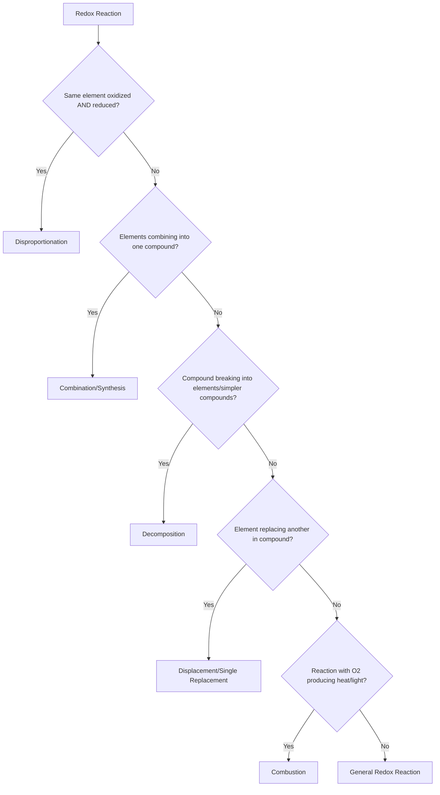

## Oxidation-Reduction Reactions

### Definition and Core Concept

An oxidation-reduction reaction (redox reaction) is a chemical process in which electrons are transferred between chemical species, resulting in a change in oxidation states. Every redox reaction consists of two simultaneous half-reactions:

- **Oxidation**: loss of electrons, resulting in an increase in oxidation number
- **Reduction**: gain of electrons, resulting in a decrease in oxidation number

The mnemonic **OIL RIG** (Oxidation Is Loss, Reduction Is Gain) summarizes the electron-transfer direction.

$$\text{Oxidation: } X \rightarrow X^{n+} + ne^-$$

$$\text{Reduction: } Y^{n+} + ne^- \rightarrow Y$$

Because electrons cannot exist freely in solution, oxidation and reduction always occur together — one species' electron loss is another species' electron gain. This coupling means the total electrons lost in oxidation must equal the total electrons gained in reduction.

### Oxidation Numbers (Oxidation States)

Oxidation number is a bookkeeping value assigned to an atom representing the hypothetical charge it would have if all bonds were fully ionic.

**Rules for assigning oxidation numbers (in priority order):**

1. Free elements (uncombined) have an oxidation number of $0$ (e.g., $Fe$, $O_2$, $P_4$)
2. Monatomic ions have an oxidation number equal to their charge (e.g., $Na^+ = +1$, $Cl^- = -1$)
3. The sum of oxidation numbers in a neutral compound equals $0$; in a polyatomic ion, the sum equals the ion's charge
4. Group 1 metals are always $+1$; Group 2 metals are always $+2$ in compounds
5. Fluorine is always $-1$ in compounds
6. Hydrogen is $+1$ when bonded to nonmetals, $-1$ when bonded to metals (metal hydrides, e.g., $NaH$)
7. Oxygen is usually $-2$, except in peroxides ($-1$, e.g., $H_2O_2$), superoxides ($-1/2$), and when bonded to fluorine ($+2$ in $OF_2$)
8. Halogens are usually $-1$ unless bonded to oxygen or a more electronegative halogen

**Worked example:** Determine the oxidation number of manganese in $KMnO_4$.

$$K(+1) + Mn(x) + 4 \times O(-2) = 0$$

$$+1 + x - 8 = 0 \implies x = +7$$

Manganese is in the $+7$ oxidation state.

### Identifying Oxidizing and Reducing Agents

- **Oxidizing agent (oxidant)**: the species that is reduced; it accepts electrons and causes oxidation in another species
- **Reducing agent (reductant)**: the species that is oxidized; it donates electrons and causes reduction in another species

**Example:**

$$Zn(s) + Cu^{2+}(aq) \rightarrow Zn^{2+}(aq) + Cu(s)$$

- $Zn$ goes from $0 \to +2$: oxidized, so $Zn$ is the reducing agent
- $Cu^{2+}$ goes from $+2 \to 0$: reduced, so $Cu^{2+}$ is the oxidizing agent

### Types of Redox Reactions

**Combination (synthesis) reactions**

$$2Mg(s) + O_2(g) \rightarrow 2MgO(s)$$

Two or more elements combine; oxidation states change for at least one element.

**Decomposition reactions**

$$2H_2O_2(aq) \rightarrow 2H_2O(l) + O_2(g)$$

A compound breaks down; often disproportionation (see below).

**Displacement (single replacement) reactions**

$$Fe(s) + CuSO_4(aq) \rightarrow FeSO_4(aq) + Cu(s)$$

One element displaces another from a compound. Common subtypes:

- Metal displacement (as above)
- Hydrogen displacement: $2Na(s) + 2H_2O(l) \rightarrow 2NaOH(aq) + H_2(g)$
- Halogen displacement: $Cl_2(g) + 2Br^-(aq) \rightarrow 2Cl^-(aq) + Br_2(l)$

**Combustion reactions**

$$CH_4(g) + 2O_2(g) \rightarrow CO_2(g) + 2H_2O(l)$$

Carbon is oxidized from $-4$ to $+4$; oxygen is reduced from $0$ to $-2$.

**Disproportionation reactions**

The same element is simultaneously oxidized and reduced.

$$Cl_2(g) + 2OH^-(aq) \rightarrow Cl^-(aq) + OCl^-(aq) + H_2O(l)$$

Chlorine ($0$) becomes both $Cl^-$ ($-1$, reduced) and $OCl^-$ ($+1$, oxidized).

### Balancing Redox Equations: Half-Reaction Method

The half-reaction (ion-electron) method is the standard approach for balancing complex redox equations, particularly in acidic or basic solution.

**Steps for acidic solution:**

1. Split into two half-reactions (oxidation and reduction)
2. Balance all atoms except $O$ and $H$
3. Balance $O$ by adding $H_2O$
4. Balance $H$ by adding $H^+$
5. Balance charge by adding electrons ($e^-$)
6. Multiply each half-reaction so electrons lost equal electrons gained
7. Add the half-reactions; cancel species appearing on both sides

**Worked example:** Balance $MnO_4^- + Fe^{2+} \rightarrow Mn^{2+} + Fe^{3+}$ in acidic solution.

Reduction half-reaction:

$$MnO_4^- \rightarrow Mn^{2+}$$

$$MnO_4^- \rightarrow Mn^{2+} + 4H_2O$$

$$MnO_4^- + 8H^+ \rightarrow Mn^{2+} + 4H_2O$$

$$MnO_4^- + 8H^+ + 5e^- \rightarrow Mn^{2+} + 4H_2O$$

Oxidation half-reaction:

$$Fe^{2+} \rightarrow Fe^{3+} + e^-$$

Equalize electrons (multiply oxidation half-reaction by 5):

$$5Fe^{2+} \rightarrow 5Fe^{3+} + 5e^-$$

Combine:

$$MnO_4^- + 8H^+ + 5Fe^{2+} \rightarrow Mn^{2+} + 4H_2O + 5Fe^{3+}$$

**Verification:** Charge on left: $-1 + 8 + 10 = +17$. Charge on right: $+2 + 15 = +17$. Balanced.

**For basic solution:** balance as if acidic, then add $OH^-$ to both sides equal to the number of $H^+$ present, combining $H^+ + OH^- \rightarrow H_2O$ and canceling duplicate water molecules.

### Balancing Redox Equations: Oxidation Number Method

An alternative approach useful for simpler reactions:

1. Assign oxidation numbers to all atoms
2. Identify atoms that change oxidation state
3. Calculate the electron change per atom
4. Use coefficients so total electrons lost equal total electrons gained
5. Balance remaining atoms by inspection

**Worked example:** $Cu + HNO_3 \rightarrow Cu(NO_3)_2 + NO + H_2O$

- $Cu: 0 \rightarrow +2$ (loses 2 electrons)
- $N$ (in $NO_3^-$ forming $NO$): $+5 \rightarrow +2$ (gains 3 electrons)

LCM of 2 and 3 is 6, so multiply $Cu$ by 3 and $N$ (the reduced portion) by 2:

$$3Cu + 8HNO_3 \rightarrow 3Cu(NO_3)_2 + 2NO + 4H_2O$$

Note: 8 total $HNO_3$ accounts for both the nitrate acting as spectator ion (6, forming $Cu(NO_3)_2$) and nitrate being reduced (2, forming $NO$).

### Redox Reaction Diagram (svg_diagram)

<svg xmlns="http://www.w3.org/2000/svg" viewBox="0 0 700 320">
<text x="350" y="30" text-anchor="middle" font-size="18" font-weight="bold" fill="#1a1a1a">Electron Transfer in a Redox Reaction (svg_diagram)</text>
<rect x="40" y="80" width="160" height="90" rx="8" fill="#fde68a" stroke="#b45309" stroke-width="2" />
<text x="120" y="115" text-anchor="middle" font-size="16" font-weight="bold" fill="#1a1a1a">Zn(s)</text>
<text x="120" y="140" text-anchor="middle" font-size="13" fill="#1a1a1a">Oxidation state: 0</text>
<rect x="40" y="200" width="160" height="90" rx="8" fill="#fecaca" stroke="#b91c1c" stroke-width="2" />
<text x="120" y="235" text-anchor="middle" font-size="16" font-weight="bold" fill="#1a1a1a">Zn²⁺(aq)</text>
<text x="120" y="260" text-anchor="middle" font-size="13" fill="#1a1a1a">Oxidation state: +2</text>
<path d="M 120 170 L 120 200" stroke="#000" stroke-width="2" marker-end="url(#arrow1)" />
<text x="230" y="188" font-size="13" fill="#7c2d12" font-weight="bold">loses 2e⁻ (oxidized)</text>
<rect x="500" y="80" width="160" height="90" rx="8" fill="#bfdbfe" stroke="#1d4ed8" stroke-width="2" />
<text x="580" y="115" text-anchor="middle" font-size="16" font-weight="bold" fill="#1a1a1a">Cu²⁺(aq)</text>
<text x="580" y="140" text-anchor="middle" font-size="13" fill="#1a1a1a">Oxidation state: +2</text>
<rect x="500" y="200" width="160" height="90" rx="8" fill="#bbf7d0" stroke="#15803d" stroke-width="2" />
<text x="580" y="235" text-anchor="middle" font-size="16" font-weight="bold" fill="#1a1a1a">Cu(s)</text>
<text x="580" y="260" text-anchor="middle" font-size="13" fill="#1a1a1a">Oxidation state: 0</text>
<path d="M 580 170 L 580 200" stroke="#000" stroke-width="2" marker-end="url(#arrow1)" />
<text x="400" y="188" text-anchor="middle" font-size="13" fill="#14532d" font-weight="bold">gains 2e⁻ (reduced)</text>
<path d="M 200 125 L 500 125" stroke="#000" stroke-width="2" stroke-dasharray="6,4" marker-end="url(#arrow1)" />
<text x="350" y="115" text-anchor="middle" font-size="13" fill="#1a1a1a">2 electrons transferred</text>
</svg>

### Redox Reaction Classification Flowchart

### Applications and Real-World Examples

- **Corrosion**: iron rusting is a redox process — $Fe \rightarrow Fe^{2+} + 2e^-$ (oxidation) coupled with $O_2$ reduction in the presence of water
- **Batteries and galvanic cells**: spontaneous redox reactions generate electrical current by physically separating oxidation and reduction half-reactions (see Chapter: Electrochemistry — Galvanic Cells)
- **Electrolysis**: non-spontaneous redox reactions driven by external electrical current
- **Combustion and respiration**: biological and industrial energy release via oxidation of fuels/glucose
- **Bleaching and disinfection**: chlorine and hydrogen peroxide act as oxidizing agents
- **Metallurgy**: extraction of metals from ores via reduction (e.g., blast furnace reduction of $Fe_2O_3$ by $CO$)

### Common Errors and Misconceptions

- Confusing oxidation state change direction: oxidation number *increases* during oxidation (electron loss), not decreases
- Forgetting that oxygen is not always $-2$ (peroxides, superoxides, $OF_2$ are exceptions)
- Assuming a reaction with oxygen is always oxidation of the other reactant — must verify via oxidation number tracking, not by presence of $O_2$ alone
- Failing to balance both mass and charge when combining half-reactions
- Treating oxidizing/reducing agent labels backward — the oxidizing agent is itself reduced, not oxidized

**Related Topics**

- Balancing redox equations in acidic vs. basic solution (ion-electron method deep dive)
- Standard reduction potentials and the electrochemical series
- Galvanic (voltaic) cells and cell notation
- Electrolytic cells and Faraday's laws of electrolysis
- Nernst equation and non-standard cell potentials
- Corrosion chemistry and cathodic protection
- Redox titrations (e.g., potassium permanganate, dichromate titrations)