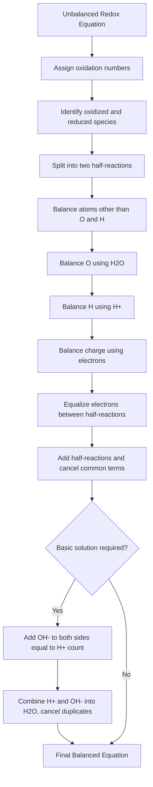

## Balancing Redox Equations

### Overview

Balancing redox equations requires satisfying two simultaneous constraints: conservation of mass (atoms) and conservation of charge (electrons). Unlike simple metathesis reactions, redox equations often cannot be balanced by inspection alone because electron transfer must be explicitly tracked. Two standard methods exist: the **half-reaction (ion-electron) method** and the **oxidation number (change) method**.

### Half-Reaction Method — Acidic Solution

This is the most widely used and most reliable method, particularly for complex polyatomic species.

**Procedure:**

1. Write the unbalanced ionic equation and assign oxidation numbers to identify the species being oxidized and reduced
2. Separate into two half-reactions: one for oxidation, one for reduction
3. Balance all elements except $O$ and $H$ in each half-reaction
4. Balance oxygen atoms by adding $H_2O$ to the side deficient in oxygen
5. Balance hydrogen atoms by adding $H^+$ to the side deficient in hydrogen
6. Balance charge in each half-reaction by adding electrons ($e^-$) to the more positive side
7. Multiply each half-reaction by an integer so the number of electrons lost equals the number of electrons gained
8. Add the two half-reactions together, canceling any species (electrons, $H_2O$, $H^+$) that appear identically on both sides
9. Verify: check that atoms and total charge balance on both sides

**Worked example 1:** Balance $Cr_2O_7^{2-} + I^- \rightarrow Cr^{3+} + I_2$ in acidic solution.

*Reduction half-reaction (Cr: $+6 \rightarrow +3$):*

$$Cr_2O_7^{2-} \rightarrow 2Cr^{3+}$$

Balance $O$ with $H_2O$:

$$Cr_2O_7^{2-} \rightarrow 2Cr^{3+} + 7H_2O$$

Balance $H$ with $H^+$:

$$Cr_2O_7^{2-} + 14H^+ \rightarrow 2Cr^{3+} + 7H_2O$$

Balance charge (left: $-2+14=+12$; right: $+6$; difference of 6 electrons needed on left):

$$Cr_2O_7^{2-} + 14H^+ + 6e^- \rightarrow 2Cr^{3+} + 7H_2O$$

*Oxidation half-reaction (I: $-1 \rightarrow 0$):*

$$2I^- \rightarrow I_2 + 2e^-$$

*Equalize electrons* (LCM of 6 and 2 is 6 — multiply oxidation half-reaction by 3):

$$6I^- \rightarrow 3I_2 + 6e^-$$

*Combine and cancel electrons:*

$$Cr_2O_7^{2-} + 14H^+ + 6I^- \rightarrow 2Cr^{3+} + 7H_2O + 3I_2$$

**Verification:** Atoms — $Cr$: 2=2, $O$: 7=7, $H$: 14=14, $I$: 6=6. Charge — left: $-2+14-6=+6$; right: $+6+0+0=+6$. Balanced.

### Half-Reaction Method — Basic Solution

Because $H^+$ does not formally exist in appreciable concentration in basic solution, the equation must be adjusted after acidic-style balancing.

**Procedure:**

1. Balance the equation exactly as if in acidic solution (steps 1–8 above)
2. Add $OH^-$ ions to both sides of the final equation, equal in number to the $H^+$ ions present
3. Combine $H^+ + OH^- \rightarrow H_2O$ on the side where they coexist
4. Cancel any $H_2O$ that appears on both sides, leaving only $OH^-$ and net $H_2O$

**Worked example 2:** Balance $MnO_4^- + ClO_2^- \rightarrow MnO_2 + ClO_4^-$ in basic solution.

*Balance in acidic conditions first:*

Reduction (Mn: $+7 \rightarrow +4$):

$$MnO_4^- + 4H^+ + 3e^- \rightarrow MnO_2 + 2H_2O$$

Oxidation (Cl: $+3 \rightarrow +7$):

$$ClO_2^- + 2H_2O \rightarrow ClO_4^- + 4H^+ + 4e^-$$

*Equalize electrons* (LCM of 3, 4 is 12 — multiply reduction by 4, oxidation by 3):

$$4MnO_4^- + 16H^+ + 12e^- \rightarrow 4MnO_2 + 8H_2O$$

$$3ClO_2^- + 6H_2O \rightarrow 3ClO_4^- + 12H^+ + 12e^-$$

*Combine:*

$$4MnO_4^- + 16H^+ + 3ClO_2^- + 6H_2O \rightarrow 4MnO_2 + 8H_2O + 3ClO_4^- + 12H^+$$

*Cancel common species* ($16H^+ - 12H^+ = 4H^+$ remaining on left; $8H_2O - 6H_2O = 2H_2O$ remaining on right):

$$4MnO_4^- + 4H^+ + 3ClO_2^- \rightarrow 4MnO_2 + 2H_2O + 3ClO_4^-$$

*Convert to basic: add $4OH^-$ to both sides (matching the 4 $H^+$):*

$$4MnO_4^- + 4H^+ + 4OH^- + 3ClO_2^- \rightarrow 4MnO_2 + 2H_2O + 3ClO_4^- + 4OH^-$$

*Combine $4H^+ + 4OH^- \rightarrow 4H_2O$:*

$$4MnO_4^- + 4H_2O + 3ClO_2^- \rightarrow 4MnO_2 + 2H_2O + 3ClO_4^- + 4OH^-$$

*Cancel duplicate water ($4H_2O - 2H_2O = 2H_2O$ remaining on left):*

$$4MnO_4^- + 2H_2O + 3ClO_2^- \rightarrow 4MnO_2 + 3ClO_4^- + 4OH^-$$

**Verification:** Charge — left: $-4+0-3=-7$; right: $0-3-4=-7$. Balanced.

### Oxidation Number (Oxidation-State Change) Method

Useful for molecular equations, particularly when the full ionic breakdown is unnecessary.

**Procedure:**

1. Assign oxidation numbers to every atom
2. Identify atoms whose oxidation number changes; calculate the magnitude of change per atom
3. Determine the multiplier needed so total electrons lost = total electrons gained (cross-multiply using the LCM of the two changes)
4. Insert these multipliers as coefficients on the oxidized and reduced species
5. Balance remaining atoms (typically metals, then nonmetal spectators, then $H$ and $O$) by inspection
6. Verify mass and charge balance

**Worked example 3:** Balance $KMnO_4 + HCl \rightarrow KCl + MnCl_2 + Cl_2 + H_2O$

- $Mn$: $+7 \rightarrow +2$ (gain of 5 electrons per Mn)
- $Cl$ (only the fraction oxidized to $Cl_2$): $-1 \rightarrow 0$ (loss of 1 electron per Cl)

LCM of 5 and 1 is 5, so 5 $Cl^-$ must be oxidized for every 2 $Mn$ reduced... balancing per single $Mn$: multiply oxidized $Cl$ by 5:

$$2KMnO_4 + 16HCl \rightarrow 2KCl + 2MnCl_2 + 5Cl_2 + 8H_2O$$

**Verification:** $K$: 2=2, $Mn$: 2=2, $O$: 8=8, $H$: 16=16, $Cl$: left 16, right $2+4+10=16$. Charge: all neutral species, 0=0. Balanced.

### Special Cases and Complications

**Disproportionation reactions**: the same element serves as both oxidant and reductant. Balance as two separate half-reactions for the same starting species, then combine — do not assume a 1:1 split.

**Polyatomic ions as spectators**: in molecular (not net ionic) equations, spectator ions (e.g., $K^+$, $SO_4^{2-}$) must be reintroduced after balancing the net ionic equation to restore the full molecular formula, often requiring additional formula units of acid or salt.

**Fractional intermediate coefficients**: if balancing yields fractional coefficients (e.g., $\frac{1}{2}O_2$), multiply the entire equation through by the denominator to obtain whole numbers.

**Reactions in different media**: some redox reactions proceed differently in acidic vs. basic vs. neutral conditions (e.g., permanganate reduction: $Mn^{2+}$ in acid, $MnO_2$ in neutral/basic, $MnO_4^{2-}$ in strongly basic) — the balancing method must reflect the actual half-reaction products for that medium. [Unverified: exact product depends on relative concentration and reaction conditions, which can vary by source]

### Balancing Workflow Diagram

### Verification Checklist Diagram (svg_diagram)

<svg xmlns="http://www.w3.org/2000/svg" viewBox="0 0 650 260">
<text x="325" y="28" text-anchor="middle" font-size="17" font-weight="bold" fill="#1a1a1a">Balanced Equation Verification Checklist (svg_diagram)</text>
<rect x="30" y="55" width="270" height="60" rx="6" fill="#dbeafe" stroke="#1d4ed8" stroke-width="2" />
<text x="165" y="80" text-anchor="middle" font-size="14" font-weight="bold" fill="#1a1a1a">1. Mass Balance</text>
<text x="165" y="100" text-anchor="middle" font-size="12" fill="#1a1a1a">Equal atoms of each element</text>
<rect x="350" y="55" width="270" height="60" rx="6" fill="#dcfce7" stroke="#15803d" stroke-width="2" />
<text x="485" y="80" text-anchor="middle" font-size="14" font-weight="bold" fill="#1a1a1a">2. Charge Balance</text>
<text x="485" y="100" text-anchor="middle" font-size="12" fill="#1a1a1a">Equal net charge both sides</text>
<rect x="30" y="140" width="270" height="60" rx="6" fill="#fef3c7" stroke="#b45309" stroke-width="2" />
<text x="165" y="165" text-anchor="middle" font-size="14" font-weight="bold" fill="#1a1a1a">3. Electron Balance</text>
<text x="165" y="185" text-anchor="middle" font-size="12" fill="#1a1a1a">e⁻ lost = e⁻ gained</text>
<rect x="350" y="140" width="270" height="60" rx="6" fill="#fce7f3" stroke="#be185d" stroke-width="2" />
<text x="485" y="165" text-anchor="middle" font-size="14" font-weight="bold" fill="#1a1a1a">4. Lowest Whole-Number Ratio</text>
<text x="485" y="185" text-anchor="middle" font-size="12" fill="#1a1a1a">No common factor remains</text>
<rect x="200" y="220" width="250" height="35" rx="6" fill="#e5e7eb" stroke="#374151" stroke-width="2" />
<text x="325" y="243" text-anchor="middle" font-size="13" font-weight="bold" fill="#1a1a1a">All four pass → Equation Balanced</text>
</svg>

### Common Errors

- Balancing $H$ before $O$, causing rework — always balance $O$ first, then $H$
- Forgetting to multiply half-reactions before adding, leaving unequal electron counts
- Adding $OH^-$ in acidic-solution problems (only applicable when the problem explicitly states basic/alkaline medium)
- Neglecting to cancel duplicate $H_2O$ or $H^+/OH^-$ after combining half-reactions, leaving a non-simplified equation
- Losing track of spectator ions when converting a balanced net ionic equation back to full molecular form

**Related Topics**

- Oxidation-reduction reactions and oxidation number assignment rules
- Standard reduction potentials and the electrochemical series
- Galvanic cells and cell notation (anode/cathode conventions)
- Nernst equation for non-standard conditions
- Redox titrimetric calculations (permanganometry, iodometry, dichromate methods)
- Electrolysis and Faraday's laws