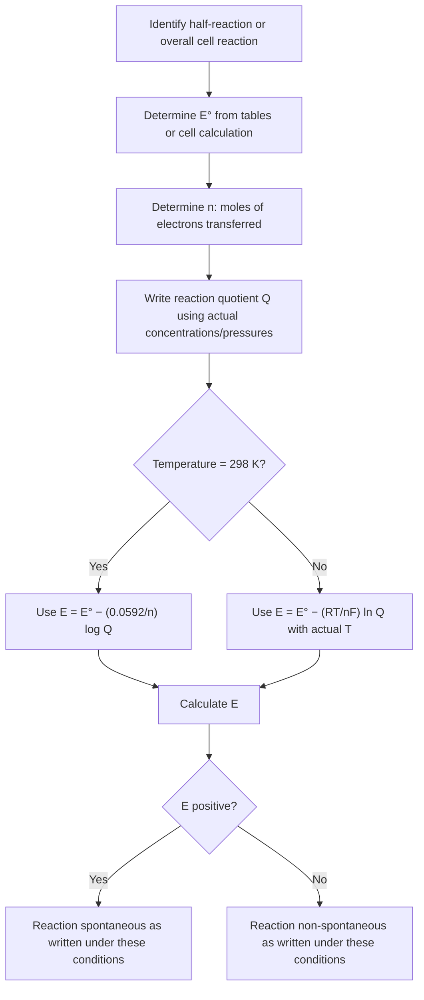

## The Nernst Equation

### Definition and Core Concept

The Nernst equation relates the electrode potential (or overall cell potential) of an electrochemical system to the standard potential and the actual concentrations (activities) and pressures of the species involved. It allows prediction of cell voltage under real, non-standard conditions, rather than the idealized $1\,M$/$1\,atm$/$25°C$ conditions used to define $E^\circ$.

**General form:**

$$E = E^\circ - \frac{RT}{nF}\ln Q$$

where:

- $E$ = actual (non-standard) electrode or cell potential ($V$)
- $E^\circ$ = standard electrode or cell potential ($V$)
- $R$ = universal gas constant ($8.314\,J/(mol\cdot K)$)
- $T$ = absolute temperature ($K$)
- $n$ = number of moles of electrons transferred in the balanced half-reaction or overall reaction
- $F$ = Faraday constant ($96{,}485\,C/mol$)
- $Q$ = reaction quotient, computed the same way as for equilibrium expressions (products over reactants, each raised to its stoichiometric coefficient; pure solids and liquids excluded)

### Simplified Form at 25°C

Substituting $T = 298\,K$ and converting from natural log ($\ln$) to base-10 log ($\log$) using $\ln x = 2.303\log x$:

$$\frac{RT}{F} = \frac{(8.314)(298)}{96{,}485} \approx 0.0257\,V$$

$$\frac{RT}{F} \times 2.303 \approx 0.0592\,V$$

**Simplified Nernst equation at 298 K:**

$$E = E^\circ - \frac{0.0592\,V}{n}\log Q$$

This form is standard for most introductory and intermediate electrochemistry calculations, since $25°C$ is the conventional reference temperature.

### Derivation from Gibbs Free Energy

The Nernst equation derives from the general thermodynamic relationship between Gibbs free energy and reaction quotient:

$$\Delta G = \Delta G^\circ + RT\ln Q$$

Substituting the electrochemical relationships $\Delta G = -nFE$ and $\Delta G^\circ = -nFE^\circ$:

$$-nFE = -nFE^\circ + RT\ln Q$$

Dividing through by $-nF$:

$$E = E^\circ - \frac{RT}{nF}\ln Q$$

This derivation confirms the Nernst equation is not an independent postulate but a direct restatement of free-energy dependence on reaction quotient, expressed in electrochemical (voltage) terms.

### Worked Example 1: Basic Cell Potential Calculation

Calculate $E_{cell}$ for a Daniell cell ($Zn/Zn^{2+} \| Cu^{2+}/Cu$, $E^\circ_{cell} = +1.10\,V$, $n=2$) at $298\,K$ where $[Zn^{2+}] = 0.10\,M$ and $[Cu^{2+}] = 0.0010\,M$.

**Overall reaction:** $Zn(s) + Cu^{2+}(aq) \rightarrow Zn^{2+}(aq) + Cu(s)$

$$Q = \frac{[Zn^{2+}]}{[Cu^{2+}]} = \frac{0.10}{0.0010} = 100$$

$$E_{cell} = 1.10\,V - \frac{0.0592}{2}\log(100)$$

$$E_{cell} = 1.10\,V - \frac{0.0592}{2}(2) = 1.10\,V - 0.0592\,V = 1.041\,V$$

Because product ion concentration ($Cu^{2+}$, consumed) is low relative to reactant-side $Zn^{2+}$, $Q > 1$, which decreases $E_{cell}$ below $E^\circ_{cell}$ — consistent with the reaction being closer to equilibrium than the standard-state reference point.

### Worked Example 2: Effect of pH on Electrode Potential

Calculate the reduction potential of the $MnO_4^-/Mn^{2+}$ half-reaction at $pH = 3$, with $[MnO_4^-] = [Mn^{2+}] = 1\,M$.

**Half-reaction:** $MnO_4^-(aq) + 8H^+(aq) + 5e^- \rightarrow Mn^{2+}(aq) + 4H_2O(l) \quad E^\circ = +1.51\,V$

$$Q = \frac{[Mn^{2+}]}{[MnO_4^-][H^+]^8}$$

At $pH=3$: $[H^+] = 10^{-3}\,M$

$$Q = \frac{1}{(1)(10^{-3})^8} = \frac{1}{10^{-24}} = 10^{24}$$

$$E = 1.51\,V - \frac{0.0592}{5}\log(10^{24})$$

$$E = 1.51\,V - \frac{0.0592}{5}(24) = 1.51\,V - 0.284\,V = 1.226\,V$$

This demonstrates that half-reactions involving $H^+$ or $OH^-$ are highly pH-sensitive — the permanganate half-reaction's effective oxidizing power drops substantially as acidity decreases (pH increases), because the reaction requires $H^+$ as a reactant.

### Concentration Cells

A concentration cell is a special application of the Nernst equation in which both electrodes consist of the *same* chemical species, differing only in concentration between the two half-cells. Since $E^\circ_{cell} = 0$ (identical electrodes), the entire cell potential arises purely from the concentration gradient.

$$E_{cell} = 0 - \frac{0.0592}{n}\log\left(\frac{[\text{dilute}]}{[\text{concentrated}]}\right)$$

The half-cell with the higher concentration acts as the cathode (reduction is favored there, driving the system toward equilibrium by diluting the concentrated side and concentrating the dilute side).

**Worked example:** A concentration cell has $Cu(s)|Cu^{2+}(0.10\,M)\,\|\,Cu^{2+}(1.0\,M)|Cu(s)$. Calculate $E_{cell}$.

The concentrated side ($1.0\,M$) is the cathode; the dilute side ($0.10\,M$) is the anode.

$$E_{cell} = 0 - \frac{0.0592}{2}\log\left(\frac{0.10}{1.0}\right) = -\frac{0.0592}{2}(-1) = +0.0296\,V$$

The small but nonzero positive potential confirms spontaneous current flow driven purely by the concentration difference, without any inherent difference in electrode chemistry.

### Applications: pH Meters and Ion-Selective Electrodes

The Nernst equation underlies the operation of potentiometric sensors, most notably the glass pH electrode. The measured potential of a glass electrode varies linearly with $\log[H^+]$, i.e., linearly with pH:

$$E = E^\circ - \frac{0.0592}{1}\log\frac{1}{[H^+]} = E^\circ + 0.0592 \times pH \quad \text{[Inference: sign convention depends on specific electrode design and reference]}$$

This linear relationship (approximately $59.2\,mV$ per pH unit at $25°C$, often called the "Nernstian response" or "Nernstian slope") is the calibration basis for most modern digital pH meters. [Unverified: exact slope value and calibration behavior can vary slightly with electrode age, temperature, and manufacturer specifications]

### Nernst Equation Application Flowchart

### Nernst Equation Concept Diagram (svg_diagram)

<svg viewBox="0 0 650 300" xmlns="http://www.w3.org/2000/svg">
<text x="325" y="26" text-anchor="middle" font-size="17" font-weight="bold" fill="#1a1a1a">Nernst Equation — Potential vs. Reaction Quotient (svg_diagram)</text>
<line x1="80" y1="250" x2="580" y2="250" stroke="#000" stroke-width="2" marker-end="url(#arrowX)"/>
<text x="580" y="275" text-anchor="middle" font-size="13" fill="#1a1a1a">log Q</text>
<line x1="80" y1="250" x2="80" y2="50" stroke="#000" stroke-width="2" marker-end="url(#arrowY)"/>
<text x="50" y="50" text-anchor="middle" font-size="13" fill="#1a1a1a">E</text>
<line x1="80" y1="150" x2="580" y2="150" stroke="#94a3b8" stroke-width="1" stroke-dasharray="4,4"/>
<text x="600" y="155" font-size="12" fill="#1a1a1a">E&#176;</text>
<line x1="90" y1="60" x2="570" y2="240" stroke="#1d4ed8" stroke-width="3"/>
<circle cx="330" cy="150" r="5" fill="#b91c1c"/>
<text x="340" y="140" font-size="12" fill="#b91c1c">Q = 1 (E = E&#176;)</text>

<text x="150" y="90" font-size="12" fill="`#1a1a1a`">Q < 1: E > E°</text>

<text x="420" y="220" font-size="12" fill="`#1a1a1a`">Q > 1: E < E°</text>

<text x="325" y="295" text-anchor="middle" font-size="12" fill="`#1a1a1a`">Slope = −(RT/nF) × 2.303 = −0.0592/n at 298 K</text>

<defs>
<marker id="arrowX" markerWidth="10" markerHeight="10" refX="8" refY="3" orient="auto" markerUnits="strokeWidth">
<path d="M0,0 L0,6 L9,3 z" fill="#000"/>
</marker>
<marker id="arrowY" markerWidth="10" markerHeight="10" refX="8" refY="3" orient="auto" markerUnits="strokeWidth">
<path d="M0,0 L0,6 L9,3 z" fill="#000"/>
</marker>
</defs>
</svg>

### Relationship to Equilibrium

At equilibrium, $Q = K$ and $E_{cell} = 0$ (no net driving force remains). Substituting into the Nernst equation yields the previously established relationship:

$$0 = E^\circ_{cell} - \frac{RT}{nF}\ln K \implies E^\circ_{cell} = \frac{RT}{nF}\ln K = \frac{0.0592}{n}\log K \quad (298\,K)$$

This confirms that the Nernst equation is the general (non-equilibrium) case, while the $E^\circ$–$K$ relationship is the special case at equilibrium ($E_{cell}=0$).

### Common Errors and Misconceptions

- Forgetting to exclude pure solids and liquids from $Q$ (only aqueous ions and gases with non-unit activity/pressure are included)
- Using the wrong value of $n$ — must match the number of electrons in the *balanced* overall equation actually used to compute $E^\circ_{cell}$, not an arbitrary half-reaction
- Applying the $0.0592\,V$ simplified constant at temperatures other than $298\,K$ without recalculating $RT/F$
- Confusing $\ln$ and $\log$ conversion — the $2.303$ factor must be included when switching from natural log to base-10 log form
- Assuming concentration cells have $E^\circ = 0$ means no current flows — current flows due to the concentration-driven $E_{cell}$, even though $E^\circ_{cell}$ itself is zero
- Sign errors when substituting $Q < 1$ (yielding $\log Q < 0$, which *increases* $E$ above $E^\circ$)

**Related Topics**

- Standard reduction potentials and the electrochemical series
- Galvanic cells and standard cell potential
- Concentration cells and biological membrane potentials
- pH electrodes and potentiometric analytical methods
- Relationship between $E^\circ_{cell}$, $\Delta G^\circ$, and equilibrium constant $K$
- Electrolytic cells and Faraday's laws