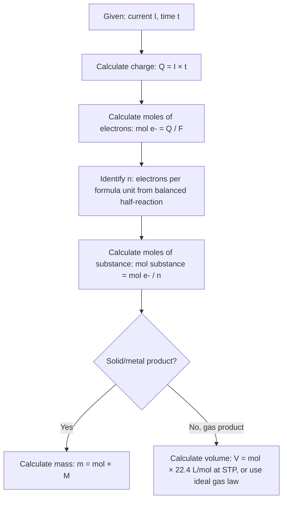

## Electrolysis and Faraday's Laws

### Definition and Core Concept

Electrolysis is the process by which an external electrical current drives a non-spontaneous redox reaction. Unlike a galvanic cell, which generates current from a spontaneous reaction ($\Delta G < 0$, $E_{cell} > 0$), an electrolytic cell consumes electrical energy to force a reaction to proceed in the non-spontaneous direction ($\Delta G > 0$, $E_{cell} < 0$ without the applied voltage).

The device used is called an **electrolytic cell**, and the applied voltage must exceed the reverse (non-spontaneous) cell potential to drive the reaction forward.

### Electrolytic Cell Structure

**Components:**

- **Anode**: the electrode where oxidation occurs. In an electrolytic cell, the anode is connected to the positive terminal of the external power source.
- **Cathode**: the electrode where reduction occurs. In an electrolytic cell, the cathode is connected to the negative terminal of the external power source.
- **Electrolyte**: a molten salt or ionic solution providing mobile ions to carry current
- **External power source**: a battery or DC power supply that forces electrons to flow against the natural (spontaneous) direction

**Critical distinction from galvanic cells:** oxidation still occurs at the anode and reduction still occurs at the cathode in both cell types — this assignment never changes. What differs is the *polarity* of each electrode, because the external power source dictates electron flow direction rather than the spontaneous reaction itself.

| Property | Galvanic Cell | Electrolytic Cell |
| --- | --- | --- |
| Anode polarity | Negative ($-$) | Positive ($+$) |
| Cathode polarity | Positive ($+$) | Negative ($-$) |
| Energy flow | Chemical → Electrical | Electrical → Chemical |
| $\Delta G$ | Negative (spontaneous) | Positive (non-spontaneous without external source) |

### Electrolysis of Molten Salts

In molten (fused) ionic compounds, only the cation and anion of the salt itself are present — no water or other competing species. This produces the simplest, most predictable electrolysis outcome.

**Example: Electrolysis of molten $NaCl$**

$$\text{Cathode (reduction): } Na^+(l) + e^- \rightarrow Na(l)$$

$$\text{Anode (oxidation): } 2Cl^-(l) \rightarrow Cl_2(g) + 2e^-$$

$$\text{Overall: } 2NaCl(l) \rightarrow 2Na(l) + Cl_2(g)$$

This is the industrial **Downs process** for producing metallic sodium and chlorine gas. [Inference: specific industrial cell designs incorporate additional engineering details such as molten $CaCl_2$ to lower the melting point, which are process-specific optimizations beyond the core electrochemistry]

### Electrolysis of Aqueous Solutions

Aqueous electrolysis is more complex than molten-salt electrolysis because water itself can be oxidized or reduced, competing with the dissolved ions. The actual product depends on relative reduction/oxidation potentials (including overpotential effects).

**Possible cathode reactions (reduction) — competition:**

$$2H_2O(l) + 2e^- \rightarrow H_2(g) + 2OH^-(aq) \quad E^\circ = -0.83\,V$$

versus reduction of a dissolved metal cation (e.g., $Na^+$, $E^\circ = -2.71\,V$)

Because water's reduction potential is *less negative* (more favorable) than that of active metal cations like $Na^+$, $K^+$, $Ca^{2+}$, water is preferentially reduced at the cathode in dilute aqueous solutions of these salts, producing $H_2$ gas rather than the metal.

**Possible anode reactions (oxidation) — competition:**

$$2H_2O(l) \rightarrow O_2(g) + 4H^+(aq) + 4e^- \quad E^\circ = +1.23\,V \text{ (reverse of reduction potential)}$$

versus oxidation of a dissolved anion (e.g., $Cl^-$, reverse of $E^\circ = +1.36\,V$, so oxidation requires $-1.36\,V$)

Based on standard potentials alone, water should be oxidized preferentially over $Cl^-$ (since $+1.23\,V < +1.36\,V$ required). However, in practice, $Cl_2$ gas is commonly observed at the anode during electrolysis of concentrated $NaCl(aq)$ due to **overpotential** — a kinetic barrier that makes actual oxygen evolution require significantly more energy than the thermodynamic prediction suggests. [Unverified: exact overpotential magnitude depends on electrode material, current density, and solution concentration, and varies across sources]

**Example: Electrolysis of aqueous $NaCl$ (brine) — the chlor-alkali process**

$$\text{Cathode: } 2H_2O(l) + 2e^- \rightarrow H_2(g) + 2OH^-(aq)$$

$$\text{Anode: } 2Cl^-(aq) \rightarrow Cl_2(g) + 2e^-$$

$$\text{Overall: } 2NaCl(aq) + 2H_2O(l) \rightarrow 2NaOH(aq) + H_2(g) + Cl_2(g)$$

This industrial process simultaneously produces three valuable commercial chemicals: sodium hydroxide, hydrogen gas, and chlorine gas.

**General guideline for predicting aqueous electrolysis products:**

- **Cathode**: species with the *least negative* (most positive) reduction potential is reduced preferentially — typically $H_2O$ (yielding $H_2$) unless the metal cation is less active than hydrogen (e.g., $Cu^{2+}$, $Ag^+$ are reduced directly to the metal, since their $E^\circ$ exceeds that of water reduction)
- **Anode**: species with the *least positive* (most negative) required oxidation potential is oxidized preferentially, though halide ions (especially $Cl^-$, $Br^-$, $I^-$) often oxidize before water due to overpotential effects, while $F^-$ and $SO_4^{2-}$ essentially never oxidize before water under normal conditions

### Faraday's Laws of Electrolysis

Michael Faraday established quantitative relationships between the electric charge passed through an electrolytic cell and the amount of chemical change produced.

**Faraday's First Law:** The mass of a substance produced or consumed at an electrode is directly proportional to the quantity of electric charge passed through the cell.

$$m \propto Q_{charge}$$

**Faraday's Second Law:** When the same quantity of charge is passed through different electrolytic cells, the masses of different substances produced at the electrodes are proportional to their equivalent weights (molar mass divided by the number of electrons involved in the half-reaction).

$$m \propto \frac{M}{n}$$

### Faraday's Law — Quantitative Formula

Combining charge, current, and time:

$$Q_{charge} = I \times t$$

where $I$ = current (amperes, $A$) and $t$ = time (seconds, $s$).

**Moles of electrons transferred:**

$$mol\,e^- = \frac{Q_{charge}}{F} = \frac{I \times t}{F}$$

where $F$ = Faraday constant $= 96{,}485\,C/mol\,e^-$ (the charge of one mole of electrons).

**Mass of substance deposited or produced:**

$$m = \frac{I \times t}{F} \times \frac{M}{n}$$

where $M$ = molar mass of the substance ($g/mol$) and $n$ = number of electrons transferred per formula unit in the relevant half-reaction.

### Worked Example 1: Mass of Metal Deposited

Calculate the mass of copper deposited at the cathode when a current of $2.50\,A$ is passed through a $CuSO_4$ solution for $1.00,hour$.

**Half-reaction:** $Cu^{2+}(aq) + 2e^- \rightarrow Cu(s)$, so $n = 2$, $M_{Cu} = 63.55\,g/mol$

Convert time to seconds: $t = 1.00\,hr \times 3600\,s/hr = 3600\,s$

$$Q_{charge} = I \times t = (2.50\,A)(3600\,s) = 9000\,C$$

$$mol\,e^- = \frac{9000\,C}{96{,}485\,C/mol} = 0.09327\,mol\,e^-$$

$$mol\,Cu = \frac{0.09327\,mol\,e^-}{2} = 0.04663\,mol\,Cu$$

$$m_{Cu} = (0.04663\,mol)(63.55\,g/mol) = 2.964\,g$$

Approximately $2.96\,g$ of copper is deposited.

### Worked Example 2: Volume of Gas Produced

Calculate the volume of $O_2(g)$ produced at STP when a current of $5.00\,A$ is passed through acidified water for $30.0,minutes$.

**Half-reaction:** $2H_2O(l) \rightarrow O_2(g) + 4H^+(aq) + 4e^-$, so $n = 4$ per mole $O_2$

$$t = 30.0\,min \times 60\,s/min = 1800\,s$$

$$Q_{charge} = (5.00\,A)(1800\,s) = 9000\,C$$

$$mol\,e^- = \frac{9000\,C}{96{,}485\,C/mol} = 0.09327\,mol\,e^-$$

$$mol\,O_2 = \frac{0.09327}{4} = 0.02332\,mol$$

At STP ($22.4\,L/mol$):

$$V_{O_2} = (0.02332\,mol)(22.4\,L/mol) = 0.5224\,L \approx 522\,mL$$

### Worked Example 3: Current Required for a Target Mass

Calculate the current required to deposit $10.0\,g$ of aluminum from molten $Al_2O_3$ in $2.00,hours$.

**Half-reaction:** $Al^{3+} + 3e^- \rightarrow Al$, so $n=3$, $M_{Al} = 26.98\,g/mol$

$$mol\,Al = \frac{10.0\,g}{26.98\,g/mol} = 0.3706\,mol$$

$$mol\,e^- = 0.3706\,mol \times 3 = 1.112\,mol\,e^-$$

$$Q_{charge} = mol\,e^- \times F = (1.112)(96{,}485) = 107{,}308\,C$$

$$t = 2.00\,hr \times 3600 = 7200\,s$$

$$I = \frac{Q_{charge}}{t} = \frac{107{,}308\,C}{7200\,s} \approx 14.9\,A$$

### Electrolytic Cell Diagram (svg_diagram)

<svg xmlns="http://www.w3.org/2000/svg" viewBox="0 0 700 340">
<text x="350" y="26" text-anchor="middle" font-size="17" font-weight="bold" fill="#1a1a1a">Electrolytic Cell — Aqueous NaCl Electrolysis (svg_diagram)</text>
<rect x="150" y="70" width="400" height="200" fill="#e0f2fe" stroke="#0369a1" stroke-width="2" />
<text x="350" y="60" text-anchor="middle" font-size="13" fill="#1a1a1a">NaCl(aq) electrolyte</text>
<rect x="210" y="90" width="30" height="160" fill="#94a3b8" stroke="#334155" stroke-width="2" />
<text x="225" y="270" text-anchor="middle" font-size="13" fill="#1a1a1a">Anode (+)</text>
<text x="225" y="290" text-anchor="middle" font-size="12" fill="#1a1a1a">Cl₂ gas forms</text>
<rect x="460" y="90" width="30" height="160" fill="#94a3b8" stroke="#334155" stroke-width="2" />
<text x="475" y="270" text-anchor="middle" font-size="13" fill="#1a1a1a">Cathode (−)</text>
<text x="475" y="290" text-anchor="middle" font-size="12" fill="#1a1a1a">H₂ gas forms</text>
<rect x="300" y="15" width="100" height="35" rx="6" fill="#fff" stroke="#000" stroke-width="2" />
<text x="350" y="38" text-anchor="middle" font-size="13" font-weight="bold" fill="#1a1a1a">DC Source</text>
<line x1="225" y1="90" x2="225" y2="15" stroke="#000" stroke-width="2" />
<line x1="225" y1="15" x2="300" y2="32" stroke="#000" stroke-width="2" />
<text x="235" y="15" font-size="14" fill="#1a1a1a">+</text>
<line x1="475" y1="90" x2="475" y2="15" stroke="#000" stroke-width="2" />
<line x1="475" y1="15" x2="400" y2="32" stroke="#000" stroke-width="2" />
<text x="460" y="15" font-size="14" fill="#1a1a1a">−</text>

<text x="350" y="310" text-anchor="middle" font-size="13" font-weight="bold" fill="`#1a1a1a`">2NaCl(aq) + 2H₂O(l) → 2NaOH(aq) + H₂(g) + Cl₂(g)</text>

</svg>

### Faraday's Law Calculation Flowchart

### Industrial Applications

- **Chlor-alkali process**: electrolysis of brine to produce $Cl_2$, $H_2$, and $NaOH$ — foundational to the chemical manufacturing industry
- **Extraction of reactive metals**: molten-salt electrolysis is the primary method for isolating metals too reactive to be reduced chemically (e.g., $Al$ via the Hall-Héroult process from molten cryolite-dissolved $Al_2O_3$; $Na$ via the Downs process)
- **Electroplating**: depositing a thin protective or decorative metal layer (e.g., $Cr$, $Ni$, $Ag$, $Au$) onto a conductive object by making the object the cathode in an electrolytic cell
- **Electrorefining**: purifying metals (notably copper) by dissolving impure metal at the anode and redepositing pure metal at the cathode
- **Water electrolysis**: producing $H_2$ and $O_2$ gas, relevant to hydrogen fuel production and energy storage research

### Common Errors and Misconceptions

- Assuming anode/cathode polarity is fixed universally — polarity reverses between galvanic and electrolytic cells, though oxidation is *always* at the anode and reduction *always* at the cathode in both
- Forgetting unit conversions (current in amperes requires time in seconds, not hours or minutes, for direct use in $Q = It$)
- Using the wrong $n$ value — must reflect electrons transferred per formula unit of the *specific product* being calculated, not a generic "one electron" assumption
- Neglecting competing electrode reactions in aqueous electrolysis (assuming the dissolved salt's ions always react instead of water)
- Ignoring overpotential effects that can cause the observed product to differ from the thermodynamically predicted product based on standard potentials alone

**Related Topics**

- Standard reduction potentials and predicting electrolysis products
- Galvanic cells and the reverse relationship to electrolytic cells
- Industrial electrochemical processes (chlor-alkali, Hall-Héroult, Downs process)
- Electroplating and electrorefining techniques
- Overpotential and electrode kinetics
- Battery charging as a practical electrolysis application