## Batteries and Fuel Cells

### Definition and Core Concept

Batteries and fuel cells are both practical applications of galvanic cell principles, converting chemical energy directly into electrical energy through spontaneous redox reactions. They differ fundamentally in how the reactants are supplied and stored.

- **Battery**: a self-contained electrochemical cell (or series of cells) in which the reactants are stored internally within the device; energy output is limited by the finite quantity of reactants sealed inside
- **Fuel cell**: an electrochemical cell in which reactants (fuel and oxidant) are continuously supplied from external reservoirs, allowing sustained electricity generation as long as fuel supply continues

Both operate on the same underlying electrochemistry as any galvanic cell: an anode where oxidation occurs, a cathode where reduction occurs, and an electrolyte enabling ion transport between them.

### Classification of Batteries

**Primary batteries (non-rechargeable):**

The redox reaction is not practically reversible; once reactants are consumed, the battery is discarded. The forward reaction has such a large equilibrium constant (large positive $E^\circ_{cell}$) that reversing it electrically is impractical or produces unwanted side reactions/structural degradation.

**Secondary batteries (rechargeable):**

The redox reaction is reversible. During discharge, the cell operates as a galvanic cell (spontaneous, $\Delta G < 0$); during charging, an external power source drives the reaction in reverse, operating the same physical cell as an electrolytic cell (non-spontaneous without external voltage).

### Primary Battery: Zinc-Carbon (Leclanché) Cell

One of the earliest commercial dry cell batteries.

$$\text{Anode: } Zn(s) \rightarrow Zn^{2+}(aq) + 2e^-$$

$$\text{Cathode: } 2MnO_2(s) + 2NH_4^+(aq) + 2e^- \rightarrow Mn_2O_3(s) + 2NH_3(aq) + H_2O(l)$$

The zinc metal can serves as both the anode and the physical container; a moist paste of $NH_4Cl$ and $ZnCl_2$ serves as the electrolyte; a carbon (graphite) rod surrounded by manganese dioxide serves as the cathode. Typical output is approximately $1.5\,V$.

### Primary Battery: Alkaline Battery

An improvement on the zinc-carbon design, using $KOH$ as the electrolyte instead of the acidic $NH_4Cl$ paste, providing longer shelf life and more stable voltage output.

$$\text{Anode: } Zn(s) + 2OH^-(aq) \rightarrow ZnO(s) + H_2O(l) + 2e^-$$

$$\text{Cathode: } 2MnO_2(s) + H_2O(l) + 2e^- \rightarrow Mn_2O_3(s) + 2OH^-(aq)$$

$$\text{Overall: } Zn(s) + 2MnO_2(s) \rightarrow ZnO(s) + Mn_2O_3(s)$$

Nominal voltage: approximately $1.5\,V$, similar to zinc-carbon but with substantially higher capacity and longer usable life.

### Secondary Battery: Lead-Acid Battery

The standard automotive battery, notable for its reversibility and high surge current capability.

$$\text{Anode (discharge): } Pb(s) + SO_4^{2-}(aq) \rightarrow PbSO_4(s) + 2e^-$$

$$\text{Cathode (discharge): } PbO_2(s) + 4H^+(aq) + SO_4^{2-}(aq) + 2e^- \rightarrow PbSO_4(s) + 2H_2O(l)$$

$$\text{Overall (discharge): } Pb(s) + PbO_2(s) + 2H_2SO_4(aq) \rightarrow 2PbSO_4(s) + 2H_2O(l)$$

Each cell produces approximately $2.0\,V$; six cells connected in series produce the standard $12\,V$ automotive battery. Notably, both electrode reactions produce solid $PbSO_4$, which adheres to the electrode surfaces — during charging, the applied external voltage reverses this reaction, converting $PbSO_4$ back into $Pb$ and $PbO_2$ and regenerating $H_2SO_4$ electrolyte. Electrolyte density (measured via hydrometer) decreases during discharge as $H_2SO_4$ is consumed, providing a practical state-of-charge indicator.

### Secondary Battery: Lithium-Ion Battery

The dominant rechargeable battery technology for portable electronics and electric vehicles, based on lithium ion intercalation rather than a bulk redox deposition/dissolution mechanism.

**Simplified representative half-reactions (using $LiCoO_2$ cathode chemistry):**

$$\text{Anode (discharge): } Li_xC_6 \rightarrow 6C(s) + xLi^+ + xe^-$$

$$\text{Cathode (discharge): } Li_{1-x}CoO_2(s) + xLi^+ + xe^- \rightarrow LiCoO_2(s)$$

Rather than the electrode material itself being consumed/deposited as in lead-acid, lithium ions shuttle back and forth between layered host structures (graphite anode, metal oxide cathode) during charge and discharge — this "rocking chair" mechanism minimizes structural degradation and enables high cycle life. [Inference: exact cathode chemistry varies significantly across commercial formulations — $LiCoO_2$, $LiFePO_4$, $LiMn_2O_4$, and NMC (nickel-manganese-cobalt) blends are all in active use with differing performance/safety/cost tradeoffs]

Nominal cell voltage is typically around $3.6$–$3.7\,V$, substantially higher than aqueous battery chemistries, contributing to lithium-ion's high energy density. This high voltage is possible because the cell uses a non-aqueous (organic) electrolyte, avoiding the ~$1.23\,V$ decomposition limit of water.

### Fuel Cells

A fuel cell continuously converts chemical energy from an external fuel supply into electrical energy without combustion, as long as fuel and oxidant continue to be supplied.

**Hydrogen-oxygen fuel cell (acidic/PEM type):**

$$\text{Anode (oxidation): } 2H_2(g) \rightarrow 4H^+(aq) + 4e^-$$

$$\text{Cathode (reduction): } O_2(g) + 4H^+(aq) + 4e^- \rightarrow 2H_2O(l)$$

$$\text{Overall: } 2H_2(g) + O_2(g) \rightarrow 2H_2O(l) \quad E^\circ_{cell} \approx +1.23\,V$$

The only byproduct is water, making hydrogen fuel cells attractive for low-emission power generation. A Proton Exchange Membrane (PEM) fuel cell uses a solid polymer electrolyte that selectively conducts $H^+$ ions from anode to cathode while blocking electron flow through the membrane (forcing electrons through the external circuit).

**Alkaline fuel cell variant:**

$$\text{Anode: } 2H_2(g) + 4OH^-(aq) \rightarrow 4H_2O(l) + 4e^-$$

$$\text{Cathode: } O_2(g) + 2H_2O(l) + 4e^- \rightarrow 4OH^-(aq)$$

Alkaline fuel cells were historically used in specialized applications (e.g., NASA's Apollo and Space Shuttle programs) due to high efficiency, though susceptibility to $CO_2$ contamination (forming carbonate precipitates that degrade the alkaline electrolyte) limits terrestrial application versatility. [Unverified: specific historical program details are drawn from general knowledge and should be verified against primary aerospace engineering sources if required for precise citation]

### Fuel Cell vs. Battery — Comparison

| Property | Battery | Fuel Cell |
| --- | --- | --- |
| Reactant storage | Internal, sealed | External, continuously supplied |
| Operation duration | Limited by internal reactant quantity | Continuous, as long as fuel supplied |
| Rechargeable? | Primary: no; Secondary: yes (electrically) | Not "recharged" — refueled instead |
| Typical application | Portable electronics, vehicles, grid storage | Stationary power, vehicles (H₂ fuel cell cars), spacecraft |

### Battery/Fuel Cell Comparison Diagram (svg_diagram)

<svg xmlns="http://www.w3.org/2000/svg" viewBox="0 0 700 300">
<text x="350" y="26" text-anchor="middle" font-size="17" font-weight="bold" fill="#1a1a1a">Battery vs. Fuel Cell — Reactant Flow (svg_diagram)</text>
<rect x="40" y="60" width="280" height="200" rx="8" fill="#fef3c7" stroke="#b45309" stroke-width="2" />
<text x="180" y="85" text-anchor="middle" font-size="14" font-weight="bold" fill="#1a1a1a">Battery (sealed system)</text>
<rect x="90" y="110" width="60" height="100" fill="#94a3b8" stroke="#334155" stroke-width="2" />
<text x="120" y="230" text-anchor="middle" font-size="11" fill="#1a1a1a">Anode</text>
<rect x="220" y="110" width="60" height="100" fill="#f97316" stroke="#7c2d12" stroke-width="2" />
<text x="250" y="230" text-anchor="middle" font-size="11" fill="#1a1a1a">Cathode</text>
<text x="180" y="250" text-anchor="middle" font-size="11" fill="#1a1a1a">Finite internal reactants</text>
<rect x="380" y="60" width="280" height="200" rx="8" fill="#dbeafe" stroke="#1d4ed8" stroke-width="2" />
<text x="520" y="85" text-anchor="middle" font-size="14" font-weight="bold" fill="#1a1a1a">Fuel Cell (open system)</text>
<rect x="430" y="110" width="60" height="100" fill="#94a3b8" stroke="#334155" stroke-width="2" />
<text x="460" y="230" text-anchor="middle" font-size="11" fill="#1a1a1a">Anode</text>
<rect x="560" y="110" width="60" height="100" fill="#f97316" stroke="#7c2d12" stroke-width="2" />
<text x="590" y="230" text-anchor="middle" font-size="11" fill="#1a1a1a">Cathode</text>
<path d="M 400 100 L 430 130" stroke="#1d4ed8" stroke-width="2" marker-end="url(#arrowF)" />
<text x="395" y="95" font-size="10" fill="#1d4ed8">H₂ in</text>
<path d="M 660 100 L 620 130" stroke="#dc2626" stroke-width="2" marker-end="url(#arrowF)" />
<text x="640" y="95" font-size="10" fill="#dc2626">O₂ in</text>
<path d="M 460 220 L 460 250" stroke="#15803d" stroke-width="2" marker-end="url(#arrowF)" />
<text x="460" y="248" font-size="10" fill="#15803d" text-anchor="middle">H₂O out</text>
</svg>

### Battery Technology Classification Flowchart

```mermaid
flowchart TD
    A[Electrochemical Power Source] --> B{Reactants stored internally or supplied externally?}
    B -->|Internal, sealed| C[Battery]
    B -->|External, continuous| D[Fuel Cell]
    C --> E{Reaction reversible electrically?}
    E -->|No| F[Primary Battery]
    E -->|Yes| G[Secondary Battery]
    F --> F1[Zinc-Carbon, Alkaline]
    G --> G1[Lead-Acid, Lithium-Ion, NiMH, NiCd]
    D --> D1[Hydrogen-Oxygen PEM, Alkaline, Solid Oxide]
```

### Key Performance Considerations

- **Energy density**: energy stored per unit mass or volume — lithium-ion significantly outperforms lead-acid, driving its dominance in portable electronics and EVs
- **Power density**: rate at which energy can be delivered — lead-acid batteries provide high surge current suited to starting internal combustion engines
- **Cycle life**: number of charge/discharge cycles before significant capacity degradation — varies substantially by chemistry and operating conditions
- **Self-discharge rate**: rate of capacity loss when not in use, relevant for shelf-stored primary batteries and long-term secondary battery storage
- **Efficiency**: fuel cells can achieve high energy conversion efficiency compared to combustion-based generation, since they bypass the thermodynamic limitations imposed by the Carnot cycle in heat engines [Inference: exact efficiency figures are strongly dependent on specific fuel cell design, operating temperature, and load conditions]

### Common Errors and Misconceptions

- Assuming all batteries are rechargeable — primary battery chemistries are specifically engineered for single-use and are not designed for safe electrical reversal
- Confusing a fuel cell with a battery due to superficial similarity — the defining distinction is continuous external reactant supply versus sealed internal storage
- Assuming fuel cells "store" energy — they convert continuously supplied fuel to electricity in real time and do not function as energy storage devices themselves
- Overlooking that during battery charging, the same physical device that acts as a galvanic cell during discharge temporarily operates as an electrolytic cell
- Assuming lithium-ion battery voltage stems from the same mechanism as aqueous batteries — the higher voltage is enabled specifically by the non-aqueous electrolyte avoiding water's electrochemical stability window

**Related Topics**

- Galvanic cells and standard cell potential
- Electrolysis and the charging process as reverse electrolysis
- Corrosion and sacrificial anode protection
- Standard reduction potentials and predicting electrode reactions
- Emerging battery technologies (solid-state batteries, sodium-ion batteries)
- Environmental and recycling considerations for battery chemistries