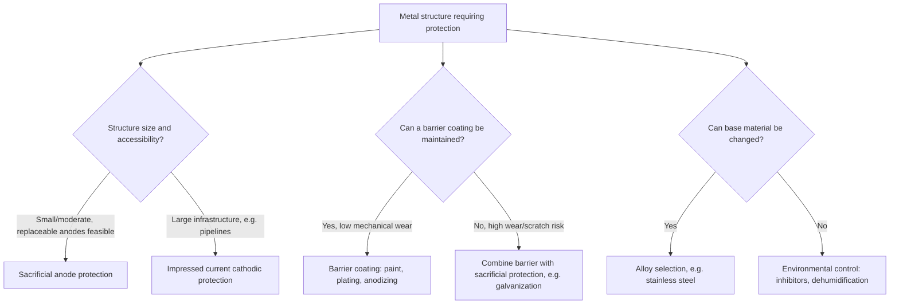

## Corrosion and Its Prevention

### Definition and Core Concept

Corrosion is the spontaneous electrochemical degradation of a metal caused by its reaction with substances in the environment, typically oxygen and moisture, resulting in the metal returning to a more thermodynamically stable oxidized form (usually an oxide, hydroxide, sulfide, or carbonate). Corrosion is fundamentally a galvanic (spontaneous redox) process occurring on the metal's own surface, functioning as an unintentional, distributed electrochemical cell.

Because most structural metals (iron, steel, aluminum, copper, zinc) have negative standard reduction potentials relative to oxygen reduction, their oxidation is thermodynamically favorable in the presence of $O_2$ and $H_2O$, making corrosion an essentially universal and continuous process wherever these conditions are met.

### Electrochemical Mechanism of Iron Corrosion (Rusting)

Rusting is the most commercially significant corrosion process and proceeds via a well-characterized electrochemical mechanism involving distinct anodic and cathodic regions on the same piece of metal.

**Anodic reaction (oxidation, at sites of the metal surface where iron is exposed):**

$$Fe(s) \rightarrow Fe^{2+}(aq) + 2e^- \quad E^\circ = -0.44\,V$$

**Cathodic reaction (reduction, typically at sites where oxygen and moisture are most accessible):**

$$O_2(g) + 4H^+(aq) + 4e^- \rightarrow 2H_2O(l) \quad E^\circ = +1.23\,V$$

(In neutral/near-neutral conditions, the equivalent reaction is $O_2(g) + 2H_2O(l) + 4e^- \rightarrow 4OH^-(aq)$, $E^\circ = +0.40\,V$.)

**Overall initial reaction:**

$$2Fe(s) + O_2(g) + 4H^+(aq) \rightarrow 2Fe^{2+}(aq) + 2H_2O(l)$$

Electrons flow through the metal itself from the anodic region to the cathodic region, while ions migrate through the surface moisture film, which acts as the electrolyte — effectively forming a short-circuited galvanic cell distributed across the metal's own surface.

**Secondary reactions forming rust:** $Fe^{2+}$ is further oxidized by dissolved oxygen to $Fe^{3+}$, which precipitates as hydrated iron(III) oxide (rust):

$$4Fe^{2+}(aq) + O_2(g) + (4+2x)H_2O(l) \rightarrow 2Fe_2O_3\cdot xH_2O(s) + 8H^+(aq)$$

The hydrated iron(III) oxide, $Fe_2O_3\cdot xH_2O$, is the characteristic reddish-brown rust. Notably, this final rust product is porous and does not adhere strongly to the underlying metal, allowing moisture and oxygen continued access to fresh metal beneath — a key reason iron corrosion is progressive and self-perpetuating, unlike some metals that form protective oxide layers.

### Factors Accelerating Corrosion

- **Electrolyte presence**: dissolved ions (e.g., salts) increase the conductivity of the surface moisture film, accelerating the electron/ion transport that sustains the corrosion cell — this is why coastal and road-salted environments accelerate rusting significantly
- **Low pH (acidic conditions)**: higher $H^+$ concentration directly favors the cathodic oxygen reduction half-reaction and can additionally support direct $H^+$ reduction as a competing cathodic process
- **Dissolved oxygen concentration**: since $O_2$ is the primary oxidant driving the cathodic reaction, environments with higher oxygen availability generally support faster corrosion, up to physical/kinetic limits
- **Galvanic coupling with a more noble (less active) metal**: physical contact between two dissimilar metals accelerates corrosion of the more active (more easily oxidized) metal, since it is forced to act as the anode in a galvanic couple
- **Mechanical stress and surface defects**: strained or scratched regions often have different electrochemical potential than undisturbed metal, creating localized anodic sites (stress corrosion)
- **Temperature**: generally increases reaction kinetics, accelerating corrosion rate, though effects on dissolved oxygen solubility can partially offset this in some aqueous systems [Inference: net temperature effect on corrosion rate depends on the balance between increased reaction kinetics and decreased oxygen solubility at elevated temperature, and can vary by system]

### Galvanic Corrosion and the Galvanic Series

When two dissimilar metals are in electrical contact within a shared electrolyte, a galvanic cell forms, and the more active metal (more negative $E^\circ$, higher position in the reactivity/lower in reduction potential) becomes the anode and corrodes preferentially, while the less active (more noble) metal is protected (acts as cathode).

**Practical consequence:** using inappropriate fasteners (e.g., steel bolts in an aluminum structure exposed to moisture) can dramatically accelerate corrosion of the more active metal at the contact point, even though neither metal alone would corrode as rapidly in isolation.

### Corrosion Prevention Strategies

**1. Barrier protection (physical isolation from electrolyte/oxygen)**

Applying a physical coating that prevents moisture and oxygen from reaching the metal surface:

- Paint and polymer coatings
- Grease or oil films
- Electroplated metal layers (e.g., chromium plating on steel)
- Anodized oxide layers (deliberately thickened protective oxide, notably used on aluminum)

Limitation: any breach in the barrier (scratch, chip) exposes bare metal, and localized corrosion can proceed rapidly at the defect site, sometimes worse than on an uncoated surface due to concentrated anodic activity at the small exposed area.

**2. Sacrificial anode (cathodic) protection**

A more active metal is deliberately connected to the metal being protected, forcing the more active metal to act as the anode (undergoing oxidation/corrosion itself) while the protected metal is forced into the cathodic role and does not corrode.

$$\text{Sacrificial metal (anode): } M(s) \rightarrow M^{n+}(aq) + ne^- \quad \text{(more negative } E^\circ \text{ than the protected metal)}$$

**Common applications:**

- Zinc or magnesium blocks attached to ship hulls and underground steel pipelines
- Galvanized steel: a zinc coating applied to steel serves dual purposes — as a barrier coating, and (critically) as a sacrificial anode if the coating is scratched, since $Zn$ ($E^\circ = -0.76\,V$) is more easily oxidized than $Fe$ ($E^\circ = -0.44\,V$), protecting the underlying steel even at breach points

**3. Impressed current cathodic protection (ICCP)**

An external DC power source forces the protected metal to function as a cathode, using an inert or consumable auxiliary anode. Unlike sacrificial anode protection (which relies purely on the intrinsic reactivity difference between metals), ICCP actively drives the protective current using an external power supply, allowing protection of very large structures (pipelines, ship hulls, bridge infrastructure) where sacrificial anode replacement would be impractical. [Inference: specific engineering implementation details, such as anode material selection and current density requirements, are application-specific and beyond core electrochemical principles]

**4. Alloying**

Combining the base metal with other elements to form a more corrosion-resistant material:

- Stainless steel: alloying iron with chromium (typically ≥10.5% by mass) causes formation of a thin, adherent, self-healing chromium oxide passive layer on the surface, which — unlike iron oxide — strongly bonds to the underlying metal and blocks further oxygen/moisture access
- Bronze and other corrosion-resistant alloys leverage similar passivation or intrinsic nobility principles

**5. Environmental control**

Reducing exposure to corrosive conditions directly:

- Dehumidification or moisture control in storage/industrial environments
- Corrosion inhibitor additives in cooling systems, pipelines, and paint formulations
- pH adjustment in industrial process water

### Corrosion Mechanism Diagram (svg_diagram)

<svg xmlns="http://www.w3.org/2000/svg" viewBox="0 0 650 320">
<text x="325" y="26" text-anchor="middle" font-size="17" font-weight="bold" fill="#1a1a1a">Iron Corrosion — Electrochemical Cell on Metal Surface (svg_diagram)</text>
<rect x="80" y="150" width="480" height="60" fill="#94a3b8" stroke="#334155" stroke-width="2" />
<text x="320" y="185" text-anchor="middle" font-size="13" fill="#1a1a1a">Iron (Fe) surface</text>
<ellipse cx="200" cy="145" rx="60" ry="15" fill="#bae6fd" stroke="#0369a1" stroke-width="1" opacity="0.7" />
<text x="200" y="130" text-anchor="middle" font-size="11" fill="#1a1a1a">Moisture film (electrolyte)</text>
<circle cx="160" cy="150" r="8" fill="#dc2626" />
<text x="160" y="230" text-anchor="middle" font-size="12" font-weight="bold" fill="#dc2626">Anodic site</text>
<text x="160" y="248" text-anchor="middle" font-size="11" fill="#1a1a1a">Fe → Fe²⁺ + 2e⁻</text>
<circle cx="450" cy="150" r="8" fill="#1d4ed8" />
<text x="450" y="230" text-anchor="middle" font-size="12" font-weight="bold" fill="#1d4ed8">Cathodic site</text>
<text x="450" y="248" text-anchor="middle" font-size="11" fill="#1a1a1a">O₂ + 4H⁺ + 4e⁻ → 2H₂O</text>
<path d="M 160 158 L 450 158" stroke="#000" stroke-width="2" stroke-dasharray="5,3" marker-end="url(#arrowC)" />
<text x="300" y="178" text-anchor="middle" font-size="11" fill="#1a1a1a">e⁻ flow through metal</text>
<path d="M 200 140 Q 320 110 440 140" stroke="#0369a1" stroke-width="2" stroke-dasharray="3,3" marker-end="url(#arrowC)" />
<text x="320" y="105" text-anchor="middle" font-size="11" fill="#0369a1">Fe²⁺ migrates through moisture → forms rust</text>

<text x="320" y="280" text-anchor="middle" font-size="12" font-weight="bold" fill="`#1a1a1a`">Rust: Fe₂O₃·xH₂O forms between anodic and cathodic zones</text>

</svg>

### Corrosion Prevention Decision Flowchart

### Passivation vs. Sacrificial Protection (Comparison)

| Property | Passivation (e.g., stainless steel, aluminum) | Sacrificial Anode (e.g., galvanized steel) |
| --- | --- | --- |
| Mechanism | Self-forming adherent oxide layer blocks further reaction | More active metal preferentially oxidized instead of protected metal |
| Self-healing? | Yes, if oxide layer is disrupted and re-exposed to oxygen | Yes, as long as sacrificial metal remains and is electrically connected |
| Requires ongoing consumption? | No (oxide is stable, not consumed) | Yes (sacrificial metal is gradually consumed and must eventually be replaced) |
| Failure mode | Pitting corrosion if passive layer is chemically breached (e.g., by chloride ions) | Loss of protection once sacrificial metal is fully consumed |

### Common Errors and Misconceptions

- Assuming corrosion only occurs at a single point on a metal surface — it is typically distributed across microscopic anodic and cathodic regions, with the physical rust deposit often appearing at neither exact original site
- Confusing sacrificial anode protection with a barrier coating — sacrificial protection works by electrochemical potential (galvanic coupling), not by physically blocking moisture/oxygen
- Assuming galvanized steel provides no protection once scratched — the zinc coating continues to sacrificially protect the exposed steel until the zinc is fully consumed in that region
- Believing all metal oxides are protective — iron oxide is porous and non-adherent (allowing continued corrosion), while chromium oxide (in stainless steel) and aluminum oxide are dense and adherent (providing passivation)
- Overlooking galvanic corrosion risk when combining dissimilar metals in a design, particularly in marine or otherwise electrolyte-rich environments

**Related Topics**

- Standard reduction potentials and the galvanic/electrochemical series
- Galvanic cells and electrode potential fundamentals
- Electrolysis and impressed current cathodic protection engineering
- Passivation chemistry and metal oxide layer formation
- Metallurgy and alloy design for corrosion resistance
- Environmental factors in materials degradation (pitting, crevice corrosion, stress corrosion cracking)