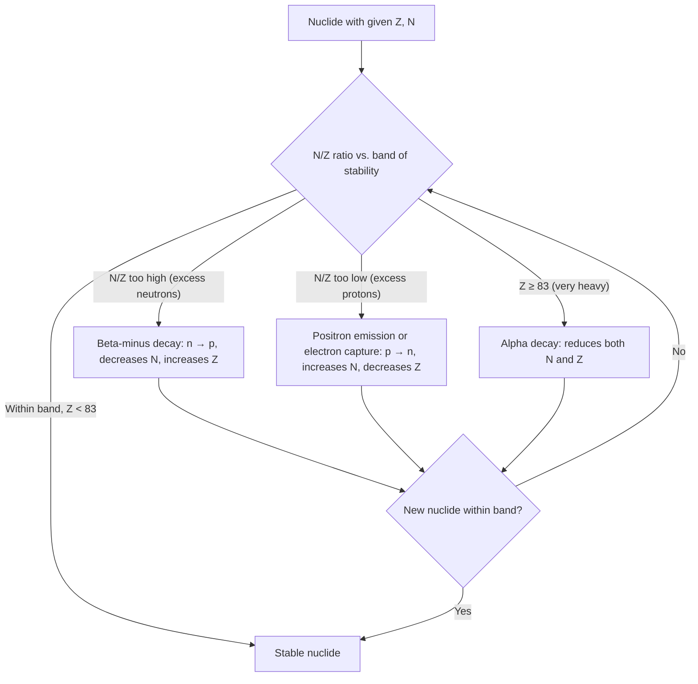

## Nuclear Structure and Stability

### Definition and Core Concept

Nuclear structure refers to the composition and arrangement of protons and neutrons (collectively called nucleons) within an atomic nucleus, while nuclear stability describes whether a given combination of protons and neutrons persists indefinitely or undergoes spontaneous transformation (radioactive decay) to reach a more stable configuration. Nuclear stability is governed by the balance between attractive short-range nuclear forces and repulsive long-range electrostatic forces acting within the nucleus.

### Basic Nuclear Terminology

- **Nucleon**: a general term for either a proton or a neutron
- **Atomic number ($Z$)**: number of protons in the nucleus; defines the element's chemical identity
- **Mass number ($A$)**: total number of nucleons (protons + neutrons), $A = Z + N$
- **Neutron number ($N$)**: number of neutrons, $N = A - Z$
- **Nuclide**: a specific nuclear species characterized by a particular combination of $Z$ and $N$
- **Isotopes**: nuclides with the same $Z$ (same element) but different $N$ (different mass numbers)
- **Isobars**: nuclides with the same mass number $A$ but different $Z$
- **Isotones**: nuclides with the same neutron number $N$ but different $Z$

**Standard nuclide notation:**

$$^{A}_{Z}X$$

where $X$ is the element symbol. For example, $^{14}_{6}C$ represents carbon-14: $Z=6$ protons, $A=14$ total nucleons, so $N = 14-6 = 8$ neutrons.

### The Strong Nuclear Force

The strong nuclear force is the fundamental interaction that binds protons and neutrons together within the nucleus, overcoming the electrostatic (Coulombic) repulsion between positively charged protons.

**Key characteristics:**

- **Short range**: effective only over distances comparable to nuclear dimensions (approximately $10^{-15}\,m$, or 1 femtometer); beyond this range, its effect drops off extremely rapidly
- **Charge-independent**: acts equally between proton-proton, neutron-neutron, and proton-neutron pairs, unlike the electrostatic force, which acts only between charged particles
- **Stronger than electrostatic repulsion at very short range**: this is what allows nuclei to hold together despite mutual proton repulsion, but only when nucleons are packed closely enough
- **Saturation property**: each nucleon interacts strongly only with its immediate neighbors, not with all other nucleons in the nucleus simultaneously — this explains why nuclear binding energy per nucleon does not increase indefinitely with nucleus size

Because the strong force is short-range while electrostatic repulsion is long-range (acting between every pair of protons regardless of distance), larger nuclei require an increasing proportion of neutrons (which contribute to the strong force without adding to electrostatic repulsion) to remain stable.

### Nuclear Binding Energy

Nuclear binding energy is the energy required to completely separate a nucleus into its individual, unbound protons and neutrons. Equivalently, it is the energy released when free nucleons assemble into a nucleus.

**Mass defect:** the mass of an intact nucleus is always measurably less than the sum of the masses of its individual constituent protons and neutrons. This missing mass ($\Delta m$) is converted to binding energy according to Einstein's mass-energy equivalence.

$$\Delta m = [Zm_p + Nm_n] - m_{nucleus}$$

$$E_{binding} = \Delta m \, c^2$$

where $c$ = speed of light ($2.998 \times 10^8\,m/s$).

**Worked example:** Calculate the binding energy of helium-4 ($^4_2He$), given: $m_p = 1.007276\,u$, $m_n = 1.008665\,u$, $m_{He-4} = 4.002602\,u$ (using atomic mass units, where $1\,u = 1.6605 \times 10^{-27}\,kg$).

$$\Delta m = [2(1.007276) + 2(1.008665)] - 4.002602$$

$$\Delta m = [2.014552 + 2.017330] - 4.002602 = 4.031882 - 4.002602 = 0.029280\,u$$

Converting to kg:

$$\Delta m = 0.029280\,u \times 1.6605 \times 10^{-27}\,kg/u = 4.862 \times 10^{-29}\,kg$$

$$E_{binding} = \Delta m \, c^2 = (4.862 \times 10^{-29}\,kg)(2.998 \times 10^8\,m/s)^2 \approx 4.368 \times 10^{-12}\,J$$

Converting to MeV (using $1\,MeV = 1.602 \times 10^{-13}\,J$):

$$E_{binding} \approx \frac{4.368 \times 10^{-12}\,J}{1.602 \times 10^{-13}\,J/MeV} \approx 27.27\,MeV$$

[Unverified: the commonly cited literature value for helium-4 binding energy is approximately 28.3 MeV; minor discrepancies from hand-calculated values typically arise from rounding in intermediate mass values and unit conversion constants]

### Binding Energy per Nucleon

Total binding energy alone does not indicate relative nuclear stability across different elements, since larger nuclei naturally have more total binding energy simply by having more nucleons. The more meaningful comparative metric is **binding energy per nucleon**:

$$\frac{E_{binding}}{A}$$

**Key trend:** binding energy per nucleon increases sharply for light nuclei, reaches a maximum around iron-56 ($^{56}Fe$, approximately $8.8,MeV/nucleon$), and then gradually decreases for heavier nuclei. This curve is the single most important graphical tool for understanding both fission and fusion energetics.

- **Fusion** of light nuclei (below iron) into heavier nuclei releases energy, since the product has higher binding energy per nucleon than the reactants
- **Fission** of heavy nuclei (above iron) into lighter fragments releases energy, since the products have higher binding energy per nucleon than the original heavy nucleus
- Iron-56 represents the peak of nuclear stability — no simple fusion or fission process starting from iron-56 releases energy

### Binding Energy Curve Diagram (svg_diagram)

<svg xmlns="http://www.w3.org/2000/svg" viewBox="0 0 650 380">
<text x="325" y="26" text-anchor="middle" font-size="17" font-weight="bold" fill="#1a1a1a">Binding Energy per Nucleon vs. Mass Number (svg_diagram)</text>
<line x1="70" y1="320" x2="600" y2="320" stroke="#000" stroke-width="2" marker-end="url(#arrowB)" />
<text x="600" y="345" text-anchor="middle" font-size="13" fill="#1a1a1a">Mass number (A)</text>
<line x1="70" y1="320" x2="70" y2="50" stroke="#000" stroke-width="2" marker-end="url(#arrowB)" />
<text x="35" y="180" font-size="13" fill="#1a1a1a" transform="rotate(-90 35 180)">Binding energy/nucleon (MeV)</text>

<path d="M 90 310 Q 130 150 200 110 Q 280 85 320 82 Q 400 90 480 140 Q 550 190 590 240" stroke="`#1d4ed8`" stroke-width="3" fill="none" />

<circle cx="320" cy="82" r="6" fill="#b91c1c" />
<text x="320" y="65" text-anchor="middle" font-size="12" font-weight="bold" fill="#b91c1c">Fe-56 (peak stability, ~8.8 MeV/nucleon)</text>

<text x="150" y="290" font-size="12" fill="`#15803d`">Fusion region (light nuclei)</text>

<path d="M 150 280 L 250 150" stroke="`#15803d`" stroke-width="1.5" stroke-dasharray="4,3" marker-end="url(#arrowB)" />

<text x="480" y="290" font-size="12" fill="`#7c2d12`">Fission region (heavy nuclei)</text>

<path d="M 480 280 L 400 130" stroke="`#7c2d12`" stroke-width="1.5" stroke-dasharray="4,3" marker-end="url(#arrowB)" />

<text x="90" y="335" font-size="11" fill="`#1a1a1a`">1</text>

<text x="320" y="335" font-size="11" fill="`#1a1a1a`">56</text>

<text x="590" y="335" font-size="11" fill="`#1a1a1a`">238</text>

</svg>

### Factors Governing Nuclear Stability

**Neutron-to-proton (N/Z) ratio:**

The single most important predictor of nuclear stability for a given element. Light stable nuclei ($Z \lesssim 20$) tend to have $N/Z \approx 1$ (roughly equal protons and neutrons). As atomic number increases, the stable $N/Z$ ratio rises progressively, reaching approximately $1.5$ for the heaviest stable/near-stable nuclei, because additional neutrons are needed to provide extra strong-force binding to counteract accumulating proton-proton electrostatic repulsion without contributing further to that repulsion.

**Band (belt) of stability:**

When stable nuclides are plotted with $N$ on the vertical axis against $Z$ on the horizontal axis, they cluster along a narrow curved region called the band of stability. Nuclides falling outside this band are unstable (radioactive) and decay via processes that shift their $N/Z$ ratio toward the band:

- **Nuclides above the band** (excess neutrons, $N/Z$ too high): typically undergo beta-minus ($\beta^-$) decay, converting a neutron to a proton, decreasing $N$ and increasing $Z$
- **Nuclides below the band** (excess protons, $N/Z$ too low): typically undergo positron emission or electron capture, converting a proton to a neutron, increasing $N$ and decreasing $Z$
- **Very heavy nuclides** (beyond $Z \approx 83$, bismuth): tend to undergo alpha decay, reducing both $N$ and $Z$ simultaneously and reducing overall mass, since no stable configuration exists at very high mass numbers regardless of $N/Z$ ratio

[Note: detailed decay mode prediction and mechanics are covered separately under Radioactive Decay in this chapter]

### Magic Numbers and Nuclear Shell Structure

Certain specific numbers of protons or neutrons ($2, 8, 20, 28, 50, 82, 126$) confer exceptional nuclear stability, analogous to the enhanced stability of noble gas electron configurations in atomic structure. These are called **magic numbers**, and nuclei with a magic number of protons, neutrons, or both (**doubly magic** nuclei, e.g., $^4_2He$, $^{16}_8O$, $^{40}_{20}Ca$, $^{208}_{82}Pb$) exhibit notably higher binding energy per nucleon and greater resistance to decay than neighboring nuclides.

This pattern is explained by the **nuclear shell model**, in which protons and neutrons independently occupy discrete quantized energy levels (analogous to electron orbitals), and a filled shell configuration corresponds to a particularly stable, low-energy nuclear arrangement. [Inference: the nuclear shell model is a well-established theoretical framework in nuclear physics, though its full mathematical treatment (spin-orbit coupling corrections, etc.) extends beyond typical introductory chemistry coverage]

### Even-Odd Nucleon Stability Patterns

Empirically, nuclear stability correlates strongly with whether the numbers of protons and neutrons are even or odd:

| Protons (Z) | Neutrons (N) | Number of stable nuclides (approximate) | Relative stability |
| --- | --- | --- | --- |
| Even | Even | ~157 | Most stable (most common) |
| Even | Odd | ~53 | Moderately stable |
| Odd | Even | ~50 | Moderately stable |
| Odd | Odd | ~5 | Least stable (rare) |

[Unverified: exact stable nuclide counts vary slightly (typically ±1–3) between different nuclear data compilations depending on classification of borderline long-lived/observationally stable nuclides]

This pattern (sometimes summarized as the "even-even" stability preference) arises from nucleon pairing effects: paired nucleons (of like type) in the same energy level couple their intrinsic spins in a way that lowers overall nuclear energy, providing additional binding stability beyond what the shell model alone predicts.

### Band of Stability Diagram

### Common Errors and Misconceptions

- Confusing mass number ($A$, total nucleons) with atomic mass (the actual measured mass in atomic mass units, which is slightly less than $A$ due to mass defect)
- Assuming binding energy per nucleon increases indefinitely with nucleus size — it peaks near iron-56 and then decreases, which is the entire basis for both fission and fusion energy release
- Believing the strong nuclear force acts only between protons and neutrons (heterogeneous pairs) — it is charge-independent and acts equally between all nucleon pair types
- Assuming any nucleus with more neutrons is automatically more stable — excess neutrons beyond the stable N/Z ratio for a given Z also lead to instability (neutron-rich unstable isotopes)
- Treating "magic number" stability as absolute proof against any decay — magic-number nuclides are simply more stable relative to neighbors, not universally non-radioactive (many magic-number nuclides are still observed to decay, just typically with longer half-lives or via less common pathways)

**Related Topics**

- Radioactive decay modes (alpha, beta, gamma, positron emission, electron capture)
- Nuclear fission and chain reactions
- Nuclear fusion and stellar nucleosynthesis
- Half-life and radioactive decay kinetics
- Mass-energy equivalence and Einstein's relation
- Nuclear reactors and applications of nuclear stability principles