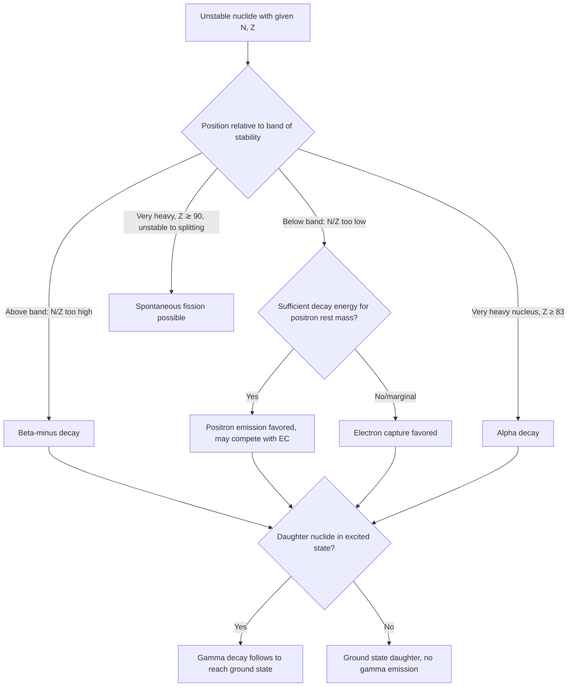

## Types of Radioactive Decay

### Definition and Core Concept

Radioactive decay is the spontaneous transformation of an unstable atomic nucleus into a different nuclear configuration, accompanied by the emission of particles and/or electromagnetic radiation. Each unstable nuclide decays via a specific mode (or competing modes) determined primarily by its position relative to the band of stability and its neutron-to-proton (N/Z) ratio. The decay process converts an unstable parent nuclide into a daughter nuclide, which may itself be stable or may undergo further decay.

### Alpha (α) Decay

Emission of an alpha particle, which is a helium-4 nucleus ($^4_2He^{2+}$, i.e., 2 protons and 2 neutrons bound together).

**General equation:**

$$^{A}_{Z}X \rightarrow \,^{A-4}_{Z-2}Y + \,^{4}_{2}He$$

Alpha decay decreases mass number by 4 and atomic number by 2. It is common among very heavy nuclides (typically $Z \geq 83$), where the nucleus is too large for the short-range strong force to hold together against cumulative long-range proton-proton electrostatic repulsion, and ejecting a tightly-bound alpha particle (itself a doubly-magic, highly stable configuration) is energetically favorable.

**Example:**

$$^{238}_{92}U \rightarrow \,^{234}_{90}Th + \,^{4}_{2}He$$

**Properties of alpha particles:** relatively large mass and charge ($+2$) result in strong ionizing power but very low penetration ability — alpha particles are stopped by a sheet of paper or the outer dead layer of human skin, but pose significant internal hazard if alpha-emitting material is ingested or inhaled.

### Beta-Minus (β⁻) Decay

Emission of a high-energy electron (beta particle) from the nucleus, accompanied by an antineutrino. This occurs when a neutron within the nucleus converts to a proton.

**Underlying nucleon transformation:**

$$n \rightarrow p + \beta^- + \bar\nu_e$$

**General equation:**

$$^{A}_{Z}X \rightarrow \,^{A}_{Z+1}Y + \,^{0}_{-1}\beta + \bar\nu_e$$

Mass number remains unchanged; atomic number increases by 1 (since a neutron becomes a proton). Beta-minus decay is common among nuclides above the band of stability (neutron-rich, $N/Z$ too high), as it shifts the $N/Z$ ratio downward toward the stable band.

**Example:**

$$^{14}_{6}C \rightarrow \,^{14}_{7}N + \,^{0}_{-1}\beta + \bar\nu_e$$

**Properties of beta particles:** smaller mass and charge ($-1$) than alpha particles, giving intermediate penetration ability and ionizing power — typically stopped by a few millimeters of aluminum or several meters of air, but capable of penetrating skin to some depth.

### Positron Emission (β⁺ Decay)

Emission of a positron (the antiparticle of the electron, same mass but $+1$ charge) from the nucleus, accompanied by a neutrino. This occurs when a proton within the nucleus converts to a neutron.

**Underlying nucleon transformation:**

$$p \rightarrow n + \beta^+ + \nu_e$$

**General equation:**

$$^{A}_{Z}X \rightarrow \,^{A}_{Z-1}Y + \,^{0}_{+1}\beta + \nu_e$$

Mass number remains unchanged; atomic number decreases by 1. Positron emission is common among nuclides below the band of stability (proton-rich, $N/Z$ too low), shifting the $N/Z$ ratio upward toward the stable band.

**Example:**

$$^{11}_{6}C \rightarrow \,^{11}_{5}B + \,^{0}_{+1}\beta + \nu_e$$

**Positron annihilation:** emitted positrons rapidly encounter ambient electrons in surrounding matter, undergoing mutual annihilation and converting their combined rest mass entirely into two gamma-ray photons (each $0.511\,MeV$), emitted in nearly opposite directions to conserve momentum. This annihilation radiation is the physical basis of Positron Emission Tomography (PET) medical imaging.

### Electron Capture (K-Capture)

An inner-shell (typically K-shell) orbital electron is captured by the nucleus and combines with a proton to form a neutron, accompanied by neutrino emission. This is an alternative pathway (competing with positron emission) for proton-rich nuclides to shift toward a more stable $N/Z$ ratio.

**Underlying nucleon transformation:**

$$p + e^- \rightarrow n + \nu_e$$

**General equation:**

$$^{A}_{Z}X + \,^{0}_{-1}e \rightarrow \,^{A}_{Z-1}Y + \nu_e$$

Mass number remains unchanged; atomic number decreases by 1 — the same net nuclear transformation as positron emission, but achieved by consuming an atomic electron rather than creating a positron.

**Example:**

$$^{7}_{4}Be + \,^{0}_{-1}e \rightarrow \,^{7}_{3}Li + \nu_e$$

**Characteristic X-ray emission:** when the captured inner-shell electron vacancy is filled by an electron dropping from a higher energy level, characteristic X-rays are emitted, providing an experimental signature used to detect electron capture events. [Inference: electron capture is generally favored over positron emission when the energy difference between parent and daughter nuclide is relatively small, since positron emission requires sufficient energy to create the positron's rest mass ($0.511\,MeV$) in addition to the nuclear transformation energy, while electron capture has no such minimum energy threshold]

### Gamma (γ) Decay

Emission of high-energy electromagnetic radiation (a gamma-ray photon) from a nucleus transitioning from a higher-energy (excited) nuclear state to a lower-energy state, without any change in the number of protons or neutrons.

**General equation:**

$$^{A}_{Z}X^{*} \rightarrow \,^{A}_{Z}X + \gamma$$

where $X^{*}$ denotes an excited nuclear state (often a metastable or "isomeric" state, sometimes denoted with an "m" superscript, e.g., $^{99m}Tc$).

Gamma decay frequently accompanies other decay modes (alpha, beta), since the daughter nuclide produced is often left in an excited nuclear state immediately after the primary transformation, and subsequently relaxes to its ground state by emitting one or more gamma photons. Gamma decay alone does not change the identity of the element or the isotope — only the nuclear energy state.

**Properties of gamma radiation:** no mass or charge, resulting in the lowest ionizing power but the highest penetration ability among common decay radiation types — attenuation requires substantial shielding (several centimeters of lead or meters of concrete).

### Spontaneous Fission

For very heavy nuclides (typically $Z \gtrsim 90$), the nucleus can spontaneously split into two smaller, roughly comparable-mass fragments (rather than emitting a small particle), along with several neutrons and substantial energy release. This is distinct from induced fission (triggered by neutron bombardment) but follows the same underlying principle: heavy nuclei near the low-binding-energy-per-nucleon end of the curve release energy by splitting into fragments with higher binding energy per nucleon.

**Representative example:**

$$^{252}_{98}Cf \rightarrow \text{two fission fragments} + \text{neutrons} + \text{energy}$$

[Unverified: specific fragment mass distributions and neutron yields vary probabilistically across many possible fission pathways for a given parent nuclide, and exact branching ratios are empirically determined rather than predicted from first principles in introductory treatment]

### Comparative Penetration and Ionizing Power

| Radiation type | Composition | Charge | Relative mass | Penetration ability | Shielding required |
| --- | --- | --- | --- | --- | --- |
| Alpha ($\alpha$) | 2p + 2n | $+2$ | ~4 u | Very low | Paper, skin |
| Beta ($\beta^-/\beta^+$) | electron/positron | $\mp1$ | ~1/1836 u | Moderate | Aluminum foil, few mm |
| Gamma ($\gamma$) | photon | 0 | 0 | Very high | Lead, thick concrete |
| Neutron | neutron | 0 | ~1 u | High (no charge to interact electrostatically) | Water, paraffin, boron |

**Inverse relationship:** as a general pattern, radiation types with greater ionizing power (alpha > beta > gamma) tend to have lower penetration ability, and vice versa, because ionizing interactions are precisely what deposits energy and slows the radiation as it passes through matter.

### Decay Mode Prediction Flowchart

### Decay Particle Comparison Diagram (svg_diagram)

<svg xmlns="http://www.w3.org/2000/svg" viewBox="0 0 650 300">
<text x="325" y="26" text-anchor="middle" font-size="17" font-weight="bold" fill="#1a1a1a">Radioactive Decay Types — Nuclear Transformation (svg_diagram)</text>

<text x="90" y="70" font-size="13" font-weight="bold" fill="`#1a1a1a`">Alpha decay</text>

<circle cx="90" cy="110" r="30" fill="`#fecaca`" stroke="`#b91c1c`" stroke-width="2" />

<text x="90" y="115" text-anchor="middle" font-size="11" fill="`#1a1a1a`">Z,N</text>

<path d="M 125 110 L 165 110" stroke="#000" stroke-width="2" marker-end="url(#arrowD)" />

<circle cx="200" cy="110" r="25" fill="`#fecaca`" stroke="`#b91c1c`" stroke-width="2" />

<text x="200" y="115" text-anchor="middle" font-size="10" fill="`#1a1a1a`">Z−2,N−2</text>

<text x="90" y="160" text-anchor="middle" font-size="11" fill="`#1a1a1a`">+ ⁴He (α)</text>

<text x="330" y="70" font-size="13" font-weight="bold" fill="`#1a1a1a`">Beta-minus decay</text>

<circle cx="330" cy="110" r="28" fill="`#bfdbfe`" stroke="`#1d4ed8`" stroke-width="2" />

<text x="330" y="115" text-anchor="middle" font-size="11" fill="`#1a1a1a`">Z,N</text>

<path d="M 365 110 L 405 110" stroke="#000" stroke-width="2" marker-end="url(#arrowD)" />

<circle cx="440" cy="110" r="28" fill="`#bfdbfe`" stroke="`#1d4ed8`" stroke-width="2" />

<text x="440" y="115" text-anchor="middle" font-size="10" fill="`#1a1a1a`">Z+1,N−1</text>

<text x="330" y="160" text-anchor="middle" font-size="11" fill="`#1a1a1a`">+ β⁻ + antineutrino</text>

<text x="90" y="210" font-size="13" font-weight="bold" fill="`#1a1a1a`">Gamma decay</text>

<circle cx="90" cy="250" r="28" fill="`#fef3c7`" stroke="`#b45309`" stroke-width="2" />

<text x="90" y="255" text-anchor="middle" font-size="10" fill="`#1a1a1a`">Z,N (excited)</text>

<path d="M 125 250 L 165 250" stroke="#000" stroke-width="2" marker-end="url(#arrowD)" />

<circle cx="200" cy="250" r="28" fill="`#fef3c7`" stroke="`#b45309`" stroke-width="2" />

<text x="200" y="255" text-anchor="middle" font-size="10" fill="`#1a1a1a`">Z,N (ground)</text>

<text x="90" y="295" text-anchor="middle" font-size="11" fill="`#1a1a1a`">+ γ photon</text>

<text x="440" y="210" font-size="13" font-weight="bold" fill="`#1a1a1a`">Positron emission</text>

<circle cx="440" cy="250" r="28" fill="`#dcfce7`" stroke="`#15803d`" stroke-width="2" />

<text x="440" y="255" text-anchor="middle" font-size="11" fill="`#1a1a1a`">Z,N</text>

<path d="M 475 250 L 515 250" stroke="#000" stroke-width="2" marker-end="url(#arrowD)" />

<circle cx="550" cy="250" r="28" fill="`#dcfce7`" stroke="`#15803d`" stroke-width="2" />

<text x="550" y="255" text-anchor="middle" font-size="10" fill="`#1a1a1a`">Z−1,N+1</text>

<text x="440" y="295" text-anchor="middle" font-size="11" fill="`#1a1a1a`">+ β⁺ + neutrino</text>

</svg>

### Balancing Nuclear Equations

Unlike chemical equations, nuclear equations are balanced by conserving mass number ($A$) and atomic number ($Z$) separately (representing conservation of nucleons and conservation of charge, respectively), rather than balancing element symbols.

**Rules:**

1. Sum of mass numbers on the left = sum of mass numbers on the right
2. Sum of atomic numbers on the left = sum of atomic numbers on the right

**Worked example:** Identify the missing particle in: $^{32}_{15}P \rightarrow \,^{32}_{16}S + \,?$

Mass number: $32 = 32 + A_?  \implies A_? = 0$

Atomic number: $15 = 16 + Z_? \implies Z_? = -1$

The missing particle has $A=0$, $Z=-1$, identifying it as a beta particle (electron): $^{0}_{-1}\beta$. This confirms the process is beta-minus decay.

### Common Errors and Misconceptions

- Confusing beta-minus decay (neutron→proton, atomic number increases) with positron emission (proton→neutron, atomic number decreases) — both involve "beta" particles but produce opposite changes in $Z$
- Forgetting that gamma decay alone does not change $A$ or $Z$ — it only releases excess nuclear energy, so gamma decay never appears as an isolated, independent nuclear transformation in the same sense as the other modes
- Assuming alpha particles are the most dangerous/penetrating radiation because they cause the most ionization — ionizing power and penetration ability are inversely related, and alpha particles are actually the least penetrating
- Treating electron capture and positron emission as producing different nuclear outcomes — both decrease $Z$ by 1 and increase $N$ by 1, differing only in mechanism (external electron capture vs. internal positron creation)
- Miscounting nucleons when balancing nuclear equations by treating mass number and atomic number as a single combined balancing requirement rather than two independent conservation conditions

**Related Topics**

- Nuclear structure and the band of stability
- Half-life and radioactive decay kinetics (first-order decay mathematics)
- Nuclear fission and chain reactions
- Nuclear fusion and stellar nucleosynthesis
- Applications of radioisotopes (medical imaging, radiometric dating, industrial tracers)
- Radiation detection and dosimetry units (Gray, Sievert, Curie, Becquerel)