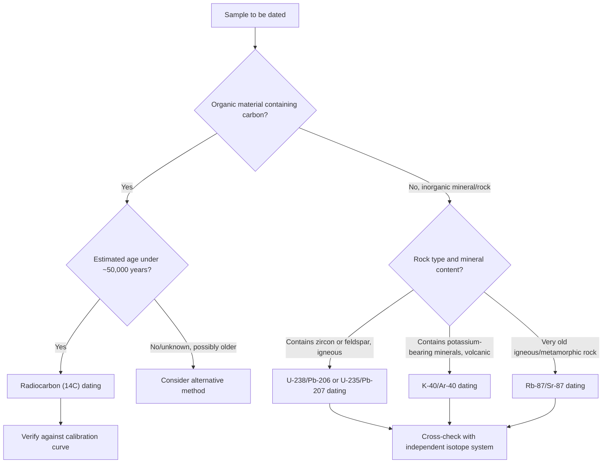

## Half-Life and Radiometric Dating

<syllabot_broad_topic/>

### Definition and Core Concept

Half-life ($t_{1/2}$) is the time required for exactly half of a given quantity of a radioactive nuclide to decay. Radioactive decay is a first-order kinetic process, meaning the rate of decay at any instant is directly proportional to the number of undecayed nuclei present, and — critically — the half-life is a constant, independent of the initial quantity of material, temperature, pressure, or chemical state. Radiometric dating applies the mathematically predictable, constant-rate nature of radioactive decay to determine the age of materials by measuring the ratio of remaining parent nuclide to accumulated daughter nuclide.

### Kinetics of Radioactive Decay

Radioactive decay follows first-order kinetics, directly analogous to first-order chemical reaction kinetics.

**Rate law:**

$$\text{Rate} = -\frac{dN}{dt} = \lambda N$$

where $N$ = number of undecayed radioactive nuclei present, $\lambda$ = decay constant (characteristic of the specific nuclide, units of $time^{-1}$).

**Integrated rate law:**

$$N_t = N_0 e^{-\lambda t}$$

where $N_0$ = initial number of nuclei (at $t=0$), $N_t$ = number of nuclei remaining after time $t$.

**Relationship between decay constant and half-life:**

Setting $N_t = N_0/2$ at $t = t_{1/2}$:

$$\frac{N_0}{2} = N_0 e^{-\lambda t_{1/2}}$$

$$\frac{1}{2} = e^{-\lambda t_{1/2}}$$

$$\ln\left(\frac{1}{2}\right) = -\lambda t_{1/2}$$

$$-\ln 2 = -\lambda t_{1/2}$$

$$t_{1/2} = \frac{\ln 2}{\lambda} = \frac{0.693}{\lambda}$$

This relationship allows conversion between decay constant and half-life in either direction, and is mathematically identical to the first-order chemical kinetics half-life relationship.

### Fraction Remaining After Successive Half-Lives

After $n$ half-lives have elapsed:

$$N_t = N_0 \left(\frac{1}{2}\right)^n$$

| Number of half-lives | Fraction remaining | Percent remaining |
| --- | --- | --- |
| 0 | 1 | 100% |
| 1 | 1/2 | 50% |
| 2 | 1/4 | 25% |
| 3 | 1/8 | 12.5% |
| 4 | 1/16 | 6.25% |
| 5 | 1/32 | 3.125% |
| 10 | 1/1024 | ~0.098% |

This exponential (not linear) decrease means a sample never mathematically reaches exactly zero remaining parent nuclide, though after approximately 7–10 half-lives the remaining quantity typically becomes negligible for most practical measurement purposes. [Inference: the specific number of half-lives at which a quantity becomes "negligible" depends on initial sample size and detector sensitivity, and is not a fixed universal threshold]

### Worked Example 1: Basic Half-Life Calculation

Cobalt-60 has a half-life of $5.27$ years. If a sample initially contains $80.0\,g$ of $^{60}Co$, how much remains after $15.81$ years?

$$n = \frac{15.81\,yr}{5.27\,yr} = 3.0 \text{ half-lives}$$

$$N_t = 80.0\,g \times \left(\frac{1}{2}\right)^3 = 80.0\,g \times \frac{1}{8} = 10.0\,g$$

### Worked Example 2: Calculating Decay Constant and Applying the Integrated Rate Law

Calculate the decay constant for $^{60}Co$ ($t_{1/2} = 5.27\,yr$), then determine the mass remaining after $10.0$ years from an initial $80.0\,g$ sample (a non-integer number of half-lives).

$$\lambda = \frac{0.693}{5.27\,yr} = 0.1315\,yr^{-1}$$

$$N_t = N_0 e^{-\lambda t} = 80.0\,g \times e^{-(0.1315)(10.0)}$$

$$N_t = 80.0\,g \times e^{-1.315} = 80.0\,g \times 0.2685 \approx 21.5\,g$$

### Worked Example 3: Determining Age from Remaining Fraction

A sample originally contained $100\%$ $^{14}C$ (relative to its living-organism baseline). Analysis shows only $15.0\%$ of the original $^{14}C$ remains. Given $t_{1/2}(^{14}C) = 5730$ years, calculate the sample's age.

$$\lambda = \frac{0.693}{5730\,yr} = 1.209 \times 10^{-4}\,yr^{-1}$$

$$N_t = N_0 e^{-\lambda t} \implies \frac{N_t}{N_0} = e^{-\lambda t}$$

$$0.150 = e^{-(1.209\times10^{-4})t}$$

$$\ln(0.150) = -(1.209\times10^{-4})t$$

$$-1.897 = -(1.209\times10^{-4})t$$

$$t = \frac{1.897}{1.209\times10^{-4}} \approx 15{,}690 \text{ years}$$

### Radiocarbon (¹⁴C) Dating

Radiocarbon dating is among the most widely used radiometric dating techniques for organic materials, applicable to samples up to roughly 50,000–60,000 years old. [Unverified: the practical upper age limit depends on measurement technique — standard beta-counting methods and modern accelerator mass spectrometry (AMS) have different effective detection limits, and the exact figure varies across sources]

**Principle:** $^{14}C$ is continuously produced in the upper atmosphere by cosmic ray interactions with nitrogen:

$$^{14}_{7}N + \,^{1}_{0}n \rightarrow \,^{14}_{6}C + \,^{1}_{1}H$$

This $^{14}C$ oxidizes to $^{14}CO_2$ and mixes into the global carbon cycle, being taken up by living organisms through photosynthesis (plants) and the food chain (animals) at a roughly constant atmospheric ratio relative to stable $^{12}C$. While an organism is alive, continuous carbon uptake maintains this $^{14}C/^{12}C$ ratio at approximately the atmospheric equilibrium value. Upon death, carbon uptake ceases, and the $^{14}C$ present begins decaying via beta-minus decay ($t_{1/2} = 5730$ years) back to $^{14}N$, without replenishment:

$$^{14}_{6}C \rightarrow \,^{14}_{7}N + \,^{0}_{-1}\beta$$

By measuring the remaining $^{14}C/^{12}C$ ratio in a sample and comparing it to the assumed constant atmospheric baseline ratio, the elapsed time since death (or since the organic material stopped exchanging carbon with the atmosphere) can be calculated using the standard integrated rate law.

**Key assumptions and limitations:**

- Assumes the atmospheric $^{14}C/^{12}C$ ratio has remained approximately constant over the relevant timeframe (in practice, calibration curves derived from other independent dating methods, such as dendrochronology, are used to correct for known historical fluctuations)
- Only applicable to materials that were once part of the active carbon cycle (organic material) — not directly applicable to inorganic materials like rocks or metals
- Accuracy degrades substantially for very old samples, since after many half-lives the remaining $^{14}C$ activity becomes difficult to distinguish from background radiation

### Radiometric Dating of Rocks and Minerals

For geological timescales far exceeding the range of radiocarbon dating, isotopes with much longer half-lives are used, based on parent-daughter isotope pairs that become locked into a mineral's crystal structure at the time of the rock's formation (crystallization).

**Common long-lived radiometric dating systems:**

| Parent isotope | Daughter isotope | Half-life (approximate) | Typical application |
| --- | --- | --- | --- |
| $^{238}U$ | $^{206}Pb$ | $4.47$ billion years | Igneous/metamorphic rock dating |
| $^{235}U$ | $^{207}Pb$ | $0.704$ billion years | Cross-check with U-238/Pb-206 |
| $^{40}K$ | $^{40}Ar$ | $1.25$ billion years | Volcanic rock dating |
| $^{87}Rb$ | $^{87}Sr$ | $48.8$ billion years | Very old igneous/metamorphic rocks |

[Unverified: precise half-life values for these long-lived systems are subject to ongoing refinement in nuclear physics literature; figures presented represent commonly cited textbook approximations]

**Core principle:** at the moment a mineral crystallizes, it typically incorporates the parent isotope but excludes the daughter isotope (due to differing chemical/ionic properties preventing daughter incorporation into the crystal lattice). From that point forward, the parent decays at a constant rate, and the daughter accumulates within the closed mineral system. Measuring the present-day parent-to-daughter ratio allows calculation of elapsed time since crystallization, using the same integrated rate law framework as radiocarbon dating.

**Critical assumption — closed system:** accurate radiometric dating requires that the mineral sample has remained a closed system since formation (no loss or gain of parent or daughter isotope through subsequent geological processes such as metamorphism, weathering, or fluid exchange). Cross-checking with multiple independent isotope systems on the same sample is a standard practice to identify potential open-system disturbances. [Inference: this cross-checking practice is a well-established methodology in geochronology for validating dating results, though specific protocols vary by laboratory and sample type]

### Exponential Decay Curve Diagram (svg_diagram)

<svg xmlns="http://www.w3.org/2000/svg" viewBox="0 0 650 350">
<text x="325" y="26" text-anchor="middle" font-size="17" font-weight="bold" fill="#1a1a1a">Radioactive Decay — Exponential Curve (svg_diagram)</text>
<line x1="70" y1="290" x2="600" y2="290" stroke="#000" stroke-width="2" marker-end="url(#arrowH)" />
<text x="600" y="315" text-anchor="middle" font-size="13" fill="#1a1a1a">Time (half-lives)</text>
<line x1="70" y1="290" x2="70" y2="50" stroke="#000" stroke-width="2" marker-end="url(#arrowH)" />
<text x="35" y="170" font-size="13" fill="#1a1a1a" transform="rotate(-90 35 170)">N (fraction remaining)</text>

<path d="M 70 60 Q 150 100 200 150 Q 280 210 330 240 Q 400 265 470 278 Q 540 285 590 288" stroke="`#1d4ed8`" stroke-width="3" fill="none" />

<line x1="70" y1="60" x2="600" y2="60" stroke="#94a3b8" stroke-width="1" stroke-dasharray="3,3" />
<text x="45" y="65" font-size="11" fill="#1a1a1a">N₀</text>
<line x1="70" y1="175" x2="200" y2="175" stroke="#94a3b8" stroke-width="1" stroke-dasharray="3,3" />
<line x1="200" y1="175" x2="200" y2="290" stroke="#94a3b8" stroke-width="1" stroke-dasharray="3,3" />
<text x="45" y="180" font-size="11" fill="#1a1a1a">N₀/2</text>
<text x="200" y="308" text-anchor="middle" font-size="11" fill="#1a1a1a">t₁ₖ₂</text>
<line x1="70" y1="232" x2="330" y2="232" stroke="#94a3b8" stroke-width="1" stroke-dasharray="3,3" />
<line x1="330" y1="232" x2="330" y2="290" stroke="#94a3b8" stroke-width="1" stroke-dasharray="3,3" />
<text x="40" y="237" font-size="11" fill="#1a1a1a">N₀/4</text>
<text x="330" y="308" text-anchor="middle" font-size="11" fill="#1a1a1a">2t₁ₖ₂</text>
</svg>

### Radiometric Dating Method Selection Flowchart

### Common Errors and Misconceptions

- Assuming half-life means "half the substance disappears" in a chemical sense — the parent nuclide atoms are transformed into daughter nuclide atoms, not physically destroyed or vanished
- Treating half-life decay as linear (e.g., assuming 2 half-lives means 0% remaining) rather than exponential — after $n$ half-lives, the fraction remaining is $(1/2)^n$, never reaching exactly zero
- Assuming half-life depends on the amount of sample present — half-life is an intrinsic, constant property of the specific nuclide, unaffected by initial quantity, temperature, pressure, or chemical bonding state
- Applying radiocarbon dating to inorganic materials (rocks, metals) — it is only valid for materials that were once part of the biological carbon cycle
- Ignoring the closed-system assumption in geological radiometric dating — contamination, metamorphism, or leaching can compromise accuracy if parent or daughter isotopes are gained or lost after initial crystallization
- Confusing decay constant ($\lambda$) with half-life ($t_{1/2}$) — they are inversely related via $t_{1/2} = 0.693/\lambda$, not numerically identical

**Related Topics**

- Types of radioactive decay (alpha, beta, gamma, positron emission, electron capture)
- Nuclear structure and the band of stability
- First-order chemical reaction kinetics (mathematical parallel to radioactive decay)
- Nuclear fission and fusion energetics
- Applications of radioisotopes in medicine and industry
- Geochronology and the geologic time scale