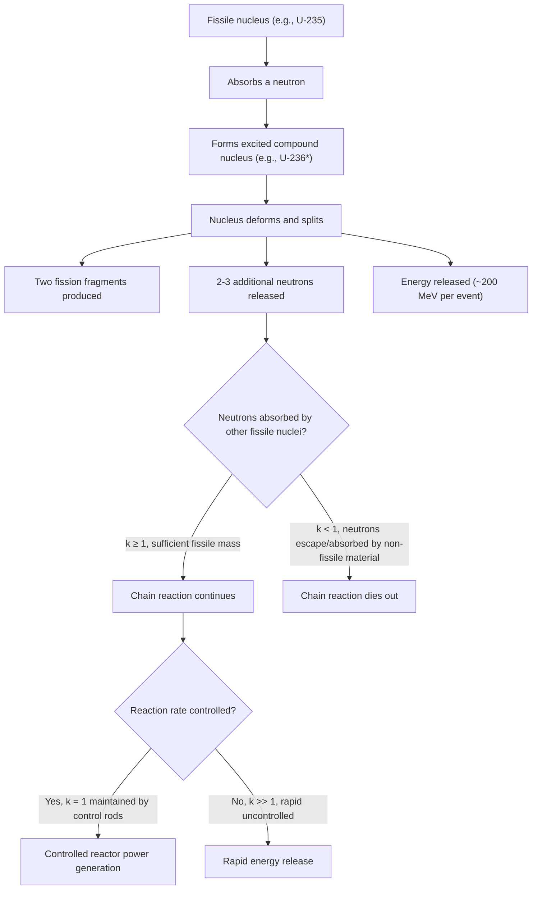

## Nuclear Fission

### Definition and Core Concept

Nuclear fission is the process by which a heavy, unstable atomic nucleus splits into two (or occasionally more) smaller nuclei of roughly comparable mass, accompanied by the release of neutrons, gamma radiation, and a substantial quantity of energy. Fission can occur spontaneously (as a rare decay mode for very heavy nuclides) or, more commonly and usefully, can be induced by bombarding a fissile nucleus with a neutron. Fission releases energy because the resulting fragments have higher binding energy per nucleon than the original heavy nucleus, consistent with the binding energy curve's decline for nuclei heavier than iron-56.

### Induced Fission Mechanism

**General process:** a fissile nucleus absorbs a neutron, forming a highly excited, unstable compound nucleus that rapidly deforms and splits into two fission fragments, releasing additional neutrons and energy.

**Representative example (uranium-235 fission):**

$$^{235}_{92}U + \,^{1}_{0}n \rightarrow \,^{236}_{92}U^{*} \rightarrow \,^{141}_{56}Ba + \,^{92}_{36}Kr + 3\,^{1}_{0}n + \text{energy}$$

The asterisk denotes the highly excited, transient compound nucleus ($^{236}U^{*}$) formed immediately after neutron capture, which exists only briefly before splitting. Fission fragment combinations are not fixed — a given fissile nuclide can split into many different possible pairs of fragments across repeated fission events, with fragment mass distributions following characteristic (typically asymmetric, bimodal) statistical patterns. [Unverified: exact fragment yield distributions and their precise statistical characterization are empirically determined nuclear data and vary by fissile isotope; treated at an introductory level here]

**Other representative fission products for $^{235}U$:**

$$^{235}_{92}U + \,^{1}_{0}n \rightarrow \,^{144}_{56}Ba + \,^{89}_{36}Kr + 3\,^{1}_{0}n$$

$$^{235}_{92}U + \,^{1}_{0}n \rightarrow \,^{140}_{54}Xe + \,^{94}_{38}Sr + 2\,^{1}_{0}n$$

### Common Fissile and Fissionable Isotopes

- **Fissile nuclides**: capable of sustaining fission with neutrons of any energy, including slow (thermal) neutrons — the primary practical nuclear fuels, e.g., $^{235}U$, $^{239}Pu$, $^{233}U$
- **Fissionable (but not fissile) nuclides**: can undergo fission but typically require higher-energy (fast) neutrons — e.g., $^{238}U$, which constitutes the vast majority (>99%) of naturally occurring uranium

**Natural uranium composition:** naturally occurring uranium is predominantly $^{238}U$ (~99.3%) with only a small fraction of the fissile $^{235}U$ isotope (~0.7%). [Unverified: precise isotopic abundance percentages are commonly cited nuclear data figures and may show minor variation across sources] Because reactor and weapons applications typically require higher $^{235}U$ concentration than natural abundance provides, **enrichment** processes (e.g., gas centrifuge separation) are used to increase the $^{235}U$ fraction relative to $^{238}U$.

### Chain Reactions

A defining feature of fission is that each fission event releases multiple neutrons (typically 2–3 per event for common fissile isotopes), which can themselves induce further fission events in neighboring fissile nuclei, potentially creating a self-sustaining chain reaction.

**Multiplication factor ($k$):** the average number of neutrons from one fission event that go on to cause a subsequent fission event.

- $k < 1$ (subcritical): the reaction is not self-sustaining and dies out over time
- $k = 1$ (critical): the reaction is exactly self-sustaining, with a constant rate of fission events over time — the target operating condition for controlled nuclear reactors
- $k > 1$ (supercritical): the reaction rate increases over time, potentially exponentially — the basis for both controlled reactor power increases (mild supercriticality, carefully managed) and uncontrolled fission weapon detonation (prompt, large supercriticality)

**Critical mass:** the minimum quantity of fissile material required to sustain a chain reaction ($k \geq 1$), below which too many neutrons escape the material's surface without causing further fission (a surface-area-to-volume effect) for the reaction to be self-sustaining. Critical mass depends on the fissile isotope, its physical density/geometry, and the presence of any surrounding neutron-reflecting material.

### Chain Reaction Diagram (svg_diagram)

<svg xmlns="http://www.w3.org/2000/svg" viewBox="0 0 650 380">
<text x="325" y="26" text-anchor="middle" font-size="17" font-weight="bold" fill="#1a1a1a">Nuclear Fission Chain Reaction (svg_diagram)</text>
<circle cx="100" cy="80" r="22" fill="#fecaca" stroke="#b91c1c" stroke-width="2" />
<text x="100" y="85" text-anchor="middle" font-size="11" fill="#1a1a1a">U-235</text>
<path d="M 60 60 L 85 75" stroke="#1d4ed8" stroke-width="2" marker-end="url(#arrowFi)" />
<text x="40" y="55" font-size="11" fill="#1d4ed8">n</text>
<path d="M 120 95 L 180 140" stroke="#000" stroke-width="2" marker-end="url(#arrowFi)" />
<path d="M 130 100 L 200 100" stroke="#000" stroke-width="2" marker-end="url(#arrowFi)" />
<path d="M 115 105 L 160 180" stroke="#000" stroke-width="2" marker-end="url(#arrowFi)" />
<circle cx="200" cy="150" r="16" fill="#fef3c7" stroke="#b45309" stroke-width="2" />
<text x="200" y="154" text-anchor="middle" font-size="9" fill="#1a1a1a">frag</text>
<text x="220" y="105" font-size="11" fill="#1a1a1a">3n released</text>
<circle cx="180" cy="200" r="12" fill="#dbeafe" stroke="#1d4ed8" stroke-width="1" />
<text x="180" y="204" text-anchor="middle" font-size="8" fill="#1a1a1a">n</text>
<circle cx="330" cy="80" r="18" fill="#fecaca" stroke="#b91c1c" stroke-width="2" />
<circle cx="330" cy="150" r="18" fill="#fecaca" stroke="#b91c1c" stroke-width="2" />
<circle cx="330" cy="220" r="18" fill="#fecaca" stroke="#b91c1c" stroke-width="2" />
<text x="330" y="85" text-anchor="middle" font-size="10" fill="#1a1a1a">U-235</text>
<text x="330" y="155" text-anchor="middle" font-size="10" fill="#1a1a1a">U-235</text>
<text x="330" y="225" text-anchor="middle" font-size="10" fill="#1a1a1a">U-235</text>
<path d="M 250 100 L 310 80" stroke="#000" stroke-width="1.5" marker-end="url(#arrowFi)" />
<path d="M 250 105 L 310 150" stroke="#000" stroke-width="1.5" marker-end="url(#arrowFi)" />
<path d="M 250 110 L 310 220" stroke="#000" stroke-width="1.5" marker-end="url(#arrowFi)" />

<text x="450" y="150" font-size="12" font-weight="bold" fill="`#1a1a1a`">Generation 2</text>

<text x="450" y="170" font-size="11" fill="`#1a1a1a`">Each fission produces</text>

<text x="450" y="185" font-size="11" fill="`#1a1a1a`">more neutrons → more fissions</text>

<text x="325" y="290" text-anchor="middle" font-size="12" fill="`#1a1a1a`">k = 1: critical (self-sustaining, constant rate)</text>

<text x="325" y="310" text-anchor="middle" font-size="12" fill="`#1a1a1a`">k &gt; 1: supercritical (exponentially increasing rate)</text>

</svg>

### Energy Release in Fission

Fission of a single $^{235}U$ nucleus releases approximately $200\,MeV$ of energy, distributed among fission fragment kinetic energy, neutron kinetic energy, and gamma/beta radiation from subsequent fragment decay. [Unverified: the commonly cited ~200 MeV figure represents an approximate average across the statistical distribution of possible fission pathways, and precise energy partition among fragments/neutrons/radiation varies by specific event]

**Energy scale comparison:** fission of $1\,kg$ of $^{235}U$ releases energy roughly equivalent to burning several thousand tons of coal. [Inference: exact comparative figures depend on the specific energy content assumed for coal combustion and the fission energy yield calculation basis, and vary across sources — the comparison is intended to illustrate the vastly greater energy density of nuclear fission relative to chemical combustion, not to provide a precise conversion factor]

**Calculating fission energy via mass-energy equivalence:** the same $E = mc^2$ principle governing nuclear binding energy applies to fission — the combined mass of fission fragments plus released neutrons is measurably less than the mass of the original fissile nucleus plus the absorbed neutron, with this mass difference converted to kinetic and radiative energy.

### Nuclear Reactor Design Principles

A controlled fission chain reaction ($k \approx 1$) is the basis for nuclear power generation, converting fission heat into electricity via conventional steam turbine generation.

**Key reactor components:**

- **Fuel**: typically enriched uranium (often as $UO_2$ pellets), providing the fissile material
- **Moderator**: a material (commonly water, heavy water, or graphite) that slows fast neutrons produced by fission down to thermal (slow) energies, since $^{235}U$ fission cross-section (probability of neutron capture leading to fission) is substantially higher for slow neutrons than fast neutrons
- **Control rods**: composed of strongly neutron-absorbing material (e.g., boron, cadmium, hafnium), inserted or withdrawn to regulate the neutron population and maintain $k \approx 1$, or rapidly inserted to shut down the reaction (achieving $k \ll 1$) in emergency scenarios
- **Coolant**: circulates through the reactor core to remove fission heat and transfer it to a steam generation system (in many designs, water serves as both moderator and coolant simultaneously)
- **Containment structure**: physical barriers designed to prevent release of radioactive materials to the environment

[Inference: specific reactor design variants (pressurized water reactors, boiling water reactors, heavy water reactors, etc.) involve substantial engineering differences in component arrangement and materials selection beyond the core electrochemical/nuclear principles covered here]

### Nuclear Fission Weapons (Brief Overview)

Fission weapons rely on achieving a rapid, highly supercritical chain reaction ($k$ substantially greater than 1) in a compact mass of highly enriched fissile material, releasing an enormous quantity of energy in a very short timeframe (uncontrolled, as opposed to the deliberately moderated rate in a power reactor). [Note: detailed weapons engineering is outside the scope of standard chemistry curricula and is not elaborated further here]

### Nuclear Fission Process Flowchart

### Common Errors and Misconceptions

- Assuming any uranium sample can sustain a chain reaction — natural uranium's low $^{235}U$ abundance (~0.7%) generally requires enrichment for most reactor and all weapons applications
- Confusing fissile and fissionable — all fissile nuclides are fissionable, but not all fissionable nuclides (e.g., $^{238}U$) are fissile, since fissile specifically means capable of sustaining fission with thermal (slow) neutrons
- Believing fission always produces the exact same two fragments for a given fissile isotope — fragment combinations follow a statistical distribution across many possible fission pathways
- Assuming a higher multiplication factor $k$ is always desirable — reactor operation specifically targets $k \approx 1$ (criticality) for stable, controlled power output, not maximum supercriticality
- Confusing moderator and control rod function — the moderator slows neutrons to increase fission probability, while control rods absorb neutrons to reduce fission rate; they serve opposite regulatory purposes within the same system

**Related Topics**

- Nuclear structure, binding energy, and the band of stability
- Nuclear fusion and stellar nucleosynthesis
- Types of radioactive decay
- Half-life and radiometric dating
- Nuclear reactor engineering and reactor safety systems
- Nuclear waste management and radioactive isotope applications