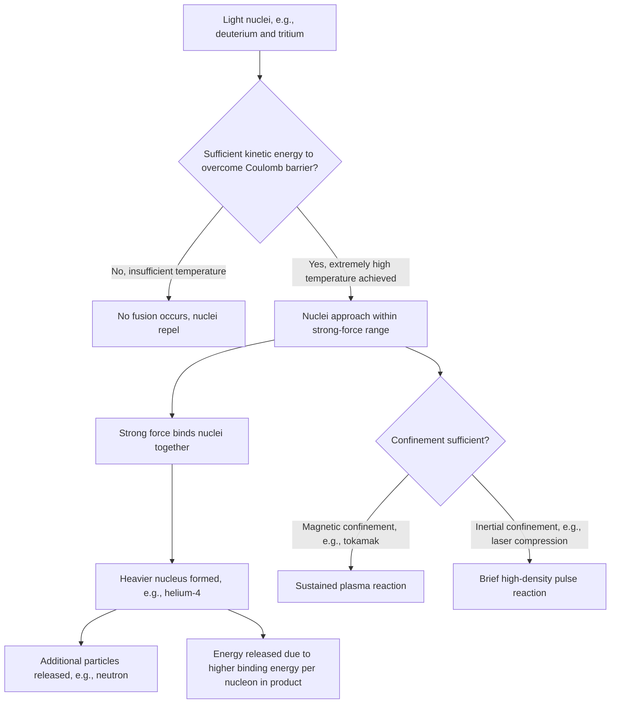

## Nuclear Fusion

### Definition and Core Concept

Nuclear fusion is the process by which two light atomic nuclei combine to form a single heavier nucleus, accompanied by the release of a substantial quantity of energy (and typically additional particles such as neutrons). Fusion releases energy because the resulting heavier nucleus has higher binding energy per nucleon than the original lighter nuclei, consistent with the steep rising portion of the binding energy curve for elements lighter than iron-56. Fusion is the energy source powering stars, including the Sun, and is the subject of ongoing research toward controlled terrestrial energy generation.

### Fusion Reaction Mechanism

**General requirement:** for fusion to occur, two positively charged nuclei must overcome their mutual electrostatic (Coulombic) repulsion and approach within the extremely short range ($\sim10^{-15}\,m$) at which the strong nuclear force becomes dominant and can bind them together. This electrostatic barrier is called the **Coulomb barrier**, and overcoming it requires extremely high kinetic energy — correspondingly extremely high temperature — for the colliding nuclei.

**Representative fusion reaction (deuterium-tritium fusion):**

$$^{2}_{1}H + \,^{3}_{1}H \rightarrow \,^{4}_{2}He + \,^{1}_{0}n + \text{energy}$$

This reaction, commonly abbreviated as "D-T fusion," is the primary reaction pursued in most current terrestrial fusion energy research, due to its relatively lower required ignition temperature compared to other candidate fusion reactions and its comparatively large reaction cross-section (probability of fusion occurring per collision). [Inference: the specific comparative advantage of D-T fusion in terms of required temperature and cross-section relative to alternative fusion fuel cycles is well-established in fusion physics literature, though exact quantitative comparisons involve technical plasma physics beyond introductory chemistry scope]

**Energy release:** the D-T reaction releases approximately $17.6\,MeV$ per fusion event. [Unverified: this is a commonly cited literature figure; precise value depends on exact atomic mass data used in the mass-defect calculation]

### Proton-Proton Chain (Stellar Fusion)

The primary fusion pathway powering stars with mass similar to or less than the Sun is the proton-proton chain, which ultimately converts hydrogen into helium through a multi-step sequence.

**Simplified overall summary reaction:**

$$4\,^{1}_{1}H \rightarrow \,^{4}_{2}He + 2\,^{0}_{+1}\beta + 2\nu_e + \text{energy}$$

**Representative intermediate steps:**

$$^{1}_{1}H + \,^{1}_{1}H \rightarrow \,^{2}_{1}H + \,^{0}_{+1}\beta + \nu_e$$

$$^{2}_{1}H + \,^{1}_{1}H \rightarrow \,^{3}_{2}He + \gamma$$

$$^{3}_{2}He + \,^{3}_{2}He \rightarrow \,^{4}_{2}He + 2\,^{1}_{1}H$$

The proton-proton chain proceeds through multiple sequential steps rather than a single direct four-proton collision (which would be statistically negligible in probability), with the initial proton-proton fusion step being the rate-limiting stage due to its comparatively low reaction probability, even at stellar core temperatures and pressures. [Inference: the multi-step nature and rate-limiting first step of the proton-proton chain are well-established in stellar astrophysics; specific reaction rate figures require specialized astrophysical reference data beyond general chemistry scope]

**CNO cycle:** in more massive stars with higher core temperatures, an alternative fusion pathway (the carbon-nitrogen-oxygen cycle) becomes the dominant hydrogen-to-helium fusion mechanism, using carbon, nitrogen, and oxygen nuclei as catalysts that are regenerated at the cycle's completion rather than consumed. [Unverified: relative dominance crossover temperature between proton-proton chain and CNO cycle is stellar-mass-dependent and requires specific astrophysical reference values]

### Fusion vs. Fission — Comparison

| Property | Fusion | Fission |
| --- | --- | --- |
| Nuclei involved | Light nuclei combine | Heavy nuclei split |
| Direction on binding energy curve | Moves toward peak (increasing stability) from the light side | Moves toward peak (increasing stability) from the heavy side |
| Typical energy release per event | Generally higher per unit mass of fuel | Lower per unit mass of fuel, though still far exceeding chemical reactions |
| Required conditions | Extremely high temperature (to overcome Coulomb barrier) | Neutron absorption at typically ambient/thermal conditions |
| Natural occurrence | Stellar interiors | Some spontaneous decay of very heavy nuclides; not naturally self-sustaining on Earth |
| Byproduct radioactivity concern | Generally lower long-lived radioactive waste (though reaction-specific, e.g., neutron activation of reactor materials) | Significant long-lived radioactive fission product waste |
| Current terrestrial application status | Experimental/research stage for net energy generation | Established commercial power generation technology |

[Inference: relative radioactive waste comparison depends heavily on specific reactor materials and fuel cycle design in both cases; general characterization only]

### Fusion Energy Release Diagram (svg_diagram)

<svg xmlns="http://www.w3.org/2000/svg" viewBox="0 0 650 320">
<text x="325" y="26" text-anchor="middle" font-size="17" font-weight="bold" fill="#1a1a1a">Deuterium-Tritium Fusion Reaction (svg_diagram)</text>
<circle cx="130" cy="150" r="30" fill="#bfdbfe" stroke="#1d4ed8" stroke-width="2" />
<text x="130" y="155" text-anchor="middle" font-size="12" fill="#1a1a1a">²H (D)</text>
<circle cx="130" cy="230" r="30" fill="#dbeafe" stroke="#1d4ed8" stroke-width="2" />
<text x="130" y="235" text-anchor="middle" font-size="12" fill="#1a1a1a">³H (T)</text>
<path d="M 160 165 L 250 185" stroke="#000" stroke-width="2" marker-end="url(#arrowFu)" />
<path d="M 160 215 L 250 195" stroke="#000" stroke-width="2" marker-end="url(#arrowFu)" />
<text x="190" y="175" font-size="11" fill="#1a1a1a">Coulomb barrier</text>
<text x="190" y="230" font-size="11" fill="#1a1a1a">overcome (high T)</text>
<circle cx="330" cy="190" r="35" fill="#fecaca" stroke="#b91c1c" stroke-width="2" />
<text x="330" y="195" text-anchor="middle" font-size="12" fill="#1a1a1a">⁴He</text>
<path d="M 365 175 L 420 150" stroke="#000" stroke-width="2" marker-end="url(#arrowFu)" />
<circle cx="450" cy="135" r="15" fill="#dcfce7" stroke="#15803d" stroke-width="2" />
<text x="450" y="139" text-anchor="middle" font-size="10" fill="#1a1a1a">n</text>

<text x="330" y="270" text-anchor="middle" font-size="13" font-weight="bold" fill="`#1a1a1a`">Energy released: ~17.6 MeV</text>

</svg>

### Requirements for Controlled Terrestrial Fusion

Achieving practical, sustained, net-positive-energy fusion on Earth requires simultaneously satisfying several demanding physical conditions:

- **Extremely high temperature**: on the order of $10^7$–$10^8\,K$, needed to give fuel nuclei sufficient kinetic energy to overcome Coulomb repulsion at a practically useful reaction rate. At these temperatures, matter exists as fully ionized **plasma** rather than as a conventional gas.
- **Sufficient plasma density**: a high enough concentration of reactant nuclei to achieve an adequate fusion event rate
- **Sufficient confinement time**: the plasma must be sustained at the required temperature and density for long enough that the fusion energy released exceeds the energy input required to create and maintain the plasma conditions (the basis of the **Lawson criterion**, which combines density, confinement time, and temperature into a single figure of merit for fusion feasibility)

[Inference: the Lawson criterion is a well-established figure of merit in fusion plasma physics, though its precise quantitative formulation and threshold values for different confinement approaches involve specialized plasma physics beyond general chemistry treatment]

### Confinement Approaches

**Magnetic confinement:** uses strong magnetic fields to contain and control the charged plasma without physical material contact (since no solid material could withstand direct contact with plasma at fusion-relevant temperatures). The tokamak, a toroidal (donut-shaped) magnetic confinement design, is the most extensively developed and researched approach, exemplified by large-scale international collaborative projects. [Unverified: current status, timelines, and specific performance milestones of major fusion research projects change frequently and should be verified against current sources for up-to-date information]

**Inertial confinement:** uses intense energy pulses (typically high-power lasers) directed symmetrically onto a small fuel pellet, rapidly compressing and heating it to fusion conditions before the plasma has time to expand and disperse (hence "inertial" — relying on the fuel's own inertia to maintain sufficient density for the brief confinement duration). [Unverified: specific experimental results and achieved milestones for inertial confinement fusion facilities are subject to ongoing research developments and should be checked against current sources if precise figures are needed]

### Fusion Process Flowchart

### Terrestrial and Astrophysical Applications

- **Stellar nucleosynthesis**: fusion processes in stars are responsible for producing most naturally occurring elements up to iron via sequential fusion stages, with elements heavier than iron primarily produced through non-fusion processes (e.g., neutron capture during supernova events), since fusion beyond iron-56 no longer releases energy [Inference: detailed stellar nucleosynthesis pathways for specific elements involve specialized astrophysics beyond general chemistry curriculum scope]
- **Fusion weapons**: thermonuclear weapons use a fission-based primary stage to achieve the extreme temperature and pressure conditions required to initiate a fusion secondary stage [Note: detailed weapons engineering is outside standard chemistry curriculum scope]
- **Fusion energy research**: pursued as a potential future large-scale, low-carbon energy source, motivated by fusion fuel's relative abundance (e.g., deuterium extractable from seawater) and the comparative absence of long-lived high-level radioactive waste relative to fission, though as of current research status, net-positive sustained commercial fusion power generation has not yet been achieved at grid scale [Unverified: research status and progress toward this goal evolve continuously and should be checked against current sources for up-to-date assessment]

### Common Errors and Misconceptions

- Assuming fusion is inherently "easier" than fission because it involves smaller nuclei — fusion actually requires overcoming a substantial energy barrier (the Coulomb barrier) that fission does not face in the same way, making controlled terrestrial fusion technically more challenging to sustain than fission
- Confusing the proton-proton chain's net summary reaction with its actual multi-step mechanism — the four-proton-to-helium conversion does not occur via a single direct four-body collision
- Assuming any light-nuclei combination releases energy via fusion — energy release specifically requires the product nucleus to have higher binding energy per nucleon than the reactants, which holds for light nuclei fusing toward iron-56 but not universally for all conceivable combinations
- Believing current fusion reactors already provide net commercial energy output — as of general current understanding, terrestrial fusion remains primarily in the research and experimental development phase for sustained net-positive energy generation [Unverified: exact status should be verified against current sources, as this is a rapidly evolving research area]
- Conflating magnetic and inertial confinement as interchangeable approaches — they represent fundamentally different engineering strategies (sustained low-density plasma vs. brief high-density pulse) for achieving the same underlying physical fusion conditions

**Related Topics**

- Nuclear structure, binding energy, and the binding energy curve
- Nuclear fission and chain reactions
- Types of radioactive decay
- Stellar nucleosynthesis and origin of the elements
- Half-life and radiometric dating
- Plasma physics and confinement engineering