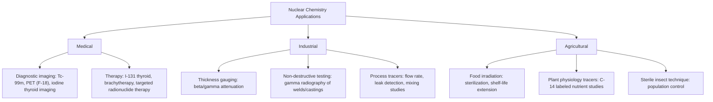

## Applications of Nuclear Chemistry in Medicine and Industry

### Overview

Nuclear chemistry principles — radioactive decay, half-life predictability, and the distinct physical properties of alpha, beta, and gamma radiation — underpin a wide range of practical applications spanning medical diagnosis and treatment, industrial quality control, agriculture, power generation, and scientific research. These applications generally exploit one or more of three core properties of radioisotopes: their predictable decay kinetics, their distinctive and detectable emitted radiation, or the biological/chemical effects of that radiation on matter.

### Medical Diagnostic Imaging

**Radiotracers and nuclear medicine imaging:**

A radioactive isotope (or a radioactively labeled compound) is introduced into the body, and its distribution is tracked using external radiation detectors, exploiting the chemical similarity between the radioactive tracer and its stable counterpart to follow biological processes without invasive surgery.

**Technetium-99m ($^{99m}Tc$):** the most widely used medical imaging radioisotope, employed in a substantial majority of diagnostic nuclear medicine procedures. [Unverified: exact percentage figures for clinical usage prevalence vary by source and change over time with evolving medical practice]

- Decays via gamma emission ($t_{1/2} \approx 6.0$ hours) from a metastable nuclear state to $^{99}Tc$, without significant particle emission, minimizing radiation dose to the patient while still providing detectable gamma radiation for external imaging
- The short half-life is advantageous both for minimizing patient radiation exposure and because it is produced on-demand via a "technetium generator" from longer-lived molybdenum-99 ($^{99}Mo$, $t_{1/2} \approx 66$ hours), allowing hospitals to generate fresh $^{99m}Tc$ locally as needed rather than relying on direct shipment of the short-lived isotope itself
- Used in bone scans, cardiac perfusion imaging, and numerous other diagnostic procedures depending on the specific chemical compound to which it is bound

**Positron Emission Tomography (PET):**

Uses positron-emitting radioisotopes (commonly fluorine-18, as $^{18}F$-fluorodeoxyglucose, or FDG) incorporated into biologically active molecules. As covered under positron emission decay, the emitted positron rapidly annihilates with a nearby electron, producing two $0.511\,MeV$ gamma photons emitted in nearly opposite directions; detecting these coincident, oppositely-directed photon pairs allows precise three-dimensional reconstruction of tracer concentration within the body.

$$^{18}_{9}F \rightarrow \,^{18}_{8}O + \,^{0}_{+1}\beta + \nu_e$$

FDG-PET imaging is widely used in oncology (cancer cells often exhibit elevated glucose metabolism, concentrating the glucose-analog tracer), cardiology, and neurology.

**Iodine isotopes and thyroid imaging:**

Since the thyroid gland naturally concentrates iodine for hormone synthesis, radioactive iodine isotopes (e.g., $^{131}I$, $^{123}I$) are used both diagnostically (imaging thyroid structure and function) and, in the case of $^{131}I$, therapeutically (see below), leveraging the body's natural biochemical iodine-uptake pathway to selectively target the thyroid.

### Medical Therapeutic Applications

**Radiotherapy (external beam and brachytherapy):**

High-energy radiation (often gamma rays from cobalt-60 sources historically, or increasingly linear-accelerator-generated X-rays in modern practice) is directed at cancerous tissue to damage cellular DNA and induce cell death, exploiting the generally greater radiation sensitivity of rapidly dividing cancer cells relative to most healthy tissue. [Inference: relative radiosensitivity between cancer and healthy tissue is a well-established principle in radiation oncology, though the degree of differential sensitivity varies substantially by tissue and cancer type]

**Brachytherapy** involves placing a sealed radioactive source directly within or adjacent to the tumor tissue, delivering a concentrated radiation dose to the target area while minimizing exposure to surrounding healthy tissue, exploiting the rapid falloff of radiation intensity with distance from a small source.

**Radioactive iodine therapy ($^{131}I$):**

$^{131}I$ is a beta and gamma emitter that, due to natural thyroid iodine uptake, concentrates selectively in thyroid tissue when administered, delivering a therapeutic radiation dose to destroy hyperactive or cancerous thyroid tissue while largely sparing tissue elsewhere in the body — a widely cited example of exploiting biochemical targeting to achieve therapeutic selectivity via radioisotope chemistry rather than physical radiation beam targeting alone.

**Targeted radionuclide therapy:**

More broadly, radioisotopes chemically bound to targeting molecules (e.g., antibodies that bind specifically to cancer cell surface markers) can deliver localized radiation dose to cancer cells throughout the body, an approach under continued active development and refinement in oncology. [Unverified: specific approved therapeutic agents and their clinical status change over time and should be checked against current medical sources for precise, current details]

### Radiometric Applications in Industry

**Thickness gauging:**

Beta or gamma radiation sources are positioned on one side of a moving material (e.g., sheet metal, paper, or plastic film during manufacturing), with a detector on the opposite side measuring the amount of radiation transmitted through the material. Since radiation attenuation through matter depends on material thickness and density, real-time thickness variations can be detected and used for automated process control, ensuring consistent product thickness during continuous manufacturing.

**Industrial radiography (non-destructive testing):**

Gamma-ray sources (commonly cobalt-60 or iridium-192) are used analogously to medical X-ray imaging to inspect the internal structure of welds, castings, and structural components for internal defects (cracks, voids, inclusions) without damaging or disassembling the object, exploiting differential radiation absorption between sound material and internal flaws to produce a detectable image on film or an electronic detector.

**Radioactive tracers in industrial process monitoring:**

Small quantities of radioisotopes can be introduced into industrial fluid systems (e.g., pipelines, chemical process streams) to track flow rates, detect leaks, or measure mixing efficiency, since the radioactive tracer can be detected externally at very low concentrations without requiring physical sampling at every measurement point.

### Applications in Agriculture and Food Science

**Food irradiation:**

Gamma radiation (commonly from cobalt-60 sources) is used to sterilize or extend the shelf life of food products by damaging the DNA of microorganisms, insects, and parasites present in the food, without a significant temperature increase (distinguishing it from heat-based sterilization/pasteurization methods) and without leaving the food itself measurably radioactive, since gamma rays do not induce nuclear transformations in the irradiated material at the energies typically used for this purpose. [Inference: the non-induction of radioactivity in irradiated food at typical processing gamma energies is a well-established principle distinguishing food irradiation from processes involving neutron activation]

**Radioisotope tracers in plant physiology and agricultural research:**

Radioactively labeled compounds (e.g., $^{14}C$-labeled carbon dioxide or nutrients) allow researchers to track nutrient uptake, photosynthetic pathways, and metabolic processes within plants by following the labeled atoms through subsequent biochemical analysis, without needing to isolate the process being studied from the whole living organism.

**Sterile insect technique (agricultural pest control):**

Large quantities of a target insect pest species are sterilized using radiation and released into the wild population; sterile males mating with wild females produce no offspring, progressively reducing the pest population over successive generations without broad-spectrum chemical pesticide application. [Inference: this is an established integrated pest management technique in agricultural entomology, applied to various pest species with documented historical use cases]

### Radioisotope Production Methods

Radioisotopes used in medicine and industry are generally produced by one of several methods:

- **Nuclear reactor neutron irradiation**: stable target nuclei absorb neutrons within a reactor's neutron flux, becoming neutron-rich radioactive isotopes (typically beta-minus emitters, consistent with their position above the band of stability)
- **Particle accelerator (cyclotron) bombardment**: stable target nuclei are bombarded with accelerated charged particles (protons, deuterons), producing proton-rich radioactive isotopes (typically positron emitters or electron-capture nuclides), commonly used for PET tracer production (e.g., $^{18}F$)
- **Radionuclide generators**: a longer-lived parent radioisotope continuously decays to produce a shorter-lived, chemically separable daughter radioisotope, which can be periodically extracted for use — the technetium-99m generator system (from $^{99}Mo$) is the most prominent medical example

### Application Classification Diagram

### Radiotracer Selection Principle Diagram (svg_diagram)

<svg xmlns="http://www.w3.org/2000/svg" viewBox="0 0 650 300">
<text x="325" y="26" text-anchor="middle" font-size="17" font-weight="bold" fill="#1a1a1a">Radiotracer Selection Criteria (svg_diagram)</text>
<rect x="40" y="60" width="270" height="90" rx="8" fill="#dbeafe" stroke="#1d4ed8" stroke-width="2" />
<text x="175" y="90" text-anchor="middle" font-size="14" font-weight="bold" fill="#1a1a1a">Half-life</text>
<text x="175" y="115" text-anchor="middle" font-size="11" fill="#1a1a1a">Long enough for procedure,</text>
<text x="175" y="132" text-anchor="middle" font-size="11" fill="#1a1a1a">short enough to limit dose</text>
<rect x="340" y="60" width="270" height="90" rx="8" fill="#dcfce7" stroke="#15803d" stroke-width="2" />
<text x="475" y="90" text-anchor="middle" font-size="14" font-weight="bold" fill="#1a1a1a">Emission Type</text>
<text x="475" y="115" text-anchor="middle" font-size="11" fill="#1a1a1a">Gamma/positron for external</text>
<text x="475" y="132" text-anchor="middle" font-size="11" fill="#1a1a1a">detection; beta/alpha for local dose</text>
<rect x="40" y="180" width="270" height="90" rx="8" fill="#fef3c7" stroke="#b45309" stroke-width="2" />
<text x="175" y="210" text-anchor="middle" font-size="14" font-weight="bold" fill="#1a1a1a">Chemical Behavior</text>
<text x="175" y="235" text-anchor="middle" font-size="11" fill="#1a1a1a">Mimics or targets the</text>
<text x="175" y="252" text-anchor="middle" font-size="11" fill="#1a1a1a">biological process of interest</text>
<rect x="340" y="180" width="270" height="90" rx="8" fill="#fce7f3" stroke="#be185d" stroke-width="2" />
<text x="475" y="210" text-anchor="middle" font-size="14" font-weight="bold" fill="#1a1a1a">Production Feasibility</text>
<text x="475" y="235" text-anchor="middle" font-size="11" fill="#1a1a1a">Reactor, cyclotron, or</text>
<text x="475" y="252" text-anchor="middle" font-size="11" fill="#1a1a1a">generator availability</text>
</svg>

### Radiation Safety Considerations in Applied Contexts

- **ALARA principle**: "As Low As Reasonably Achievable" — a foundational radiation protection principle guiding minimization of radiation dose in all medical and industrial applications, balancing diagnostic/therapeutic/industrial benefit against radiation exposure risk
- **Isotope selection for minimal biological impact**: preference for isotopes with half-lives matched closely to the required procedure duration, minimizing unnecessary continued radioactivity (and thus continued dose) after the diagnostic or industrial purpose has been served
- **Shielding and containment**: appropriate shielding material selection depends on the specific radiation type involved (as established under decay particle properties — dense material such as lead for gamma sources, versus comparatively minimal shielding needs for pure beta or alpha sources, given their limited penetration)
- **Waste management**: industrial and medical radioactive waste requires appropriate handling, storage, and disposal protocols reflecting the specific isotope's half-life and radiation type. [Unverified: specific regulatory frameworks and disposal protocols vary substantially by jurisdiction and are subject to ongoing regulatory development; current authoritative sources should be consulted for specific compliance requirements]

### Common Errors and Misconceptions

- Assuming all radioactive tracers/sources render treated materials permanently radioactive — most food irradiation and many industrial gauging applications use gamma sources that do not induce radioactivity in the irradiated material itself
- Confusing diagnostic and therapeutic radioisotope use — diagnostic applications favor isotopes with minimal particle emission (gamma-only, for external detection with minimal tissue damage) and short half-lives, while therapeutic applications specifically seek isotopes with damaging particle emission (beta or alpha) concentrated at the target site
- Assuming higher radiation dose always improves diagnostic image quality or therapeutic effect — the ALARA principle specifically balances benefit against unnecessary additional exposure risk
- Believing PET imaging directly detects the positron itself — PET detectors actually register the two annihilation gamma photons produced when the emitted positron encounters and annihilates with an ambient electron
- Overlooking that isotope selection is constrained not only by favorable decay properties but also by practical production feasibility (reactor availability, cyclotron access, or generator system logistics)

**Related Topics**

- Types of radioactive decay and their distinct physical properties
- Half-life and radiometric dating (decay kinetics underlying isotope selection)
- Nuclear fission (reactor-based isotope production)
- Radiation detection instrumentation and dosimetry units
- Radiation biology and mechanisms of radiation damage to living tissue
- Regulatory frameworks for radioactive material handling and disposal