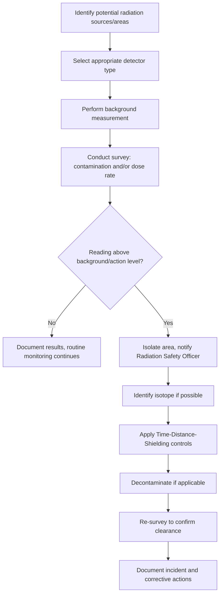

## Radiation Detection and Safety

### Overview

Radiation detection and safety encompasses the instrumentation, methodologies, and protective protocols used to identify, measure, and mitigate exposure to ionizing radiation. This field bridges nuclear physics, health physics, and regulatory science, providing the practical infrastructure that makes safe work with radioactive materials possible in medicine, industry, research, and nuclear power.

### Types of Ionizing Radiation Relevant to Detection

**Alpha particles ($\alpha$)**

- Composition: 2 protons + 2 neutrons (helium-4 nucleus), charge $+2$
- Range: a few centimeters in air; stopped by a sheet of paper or the dead layer of skin
- Detection challenge: low penetration means detectors must be very close to the source, often windowless or thin-window designs
- Internal hazard: highly ionizing (high linear energy transfer, LET), so inhalation or ingestion of alpha emitters is disproportionately dangerous relative to external exposure

**Beta particles ($\beta^-$, $\beta^+$)**

- Composition: high-energy electrons or positrons
- Range: up to several meters in air; stopped by a few millimeters of aluminum or plastic
- Detection: thin-window Geiger-Müller (GM) tubes, plastic scintillators
- Bremsstrahlung concern: high-Z shielding (lead) generates secondary X-rays when stopping beta particles, so low-Z materials (acrylic, aluminum) are preferred as primary shielding

**Gamma rays ($\gamma$) and X-rays**

- Composition: high-energy electromagnetic photons
- Range: highly penetrating; attenuated but rarely fully stopped without substantial shielding
- Detection: scintillation detectors (NaI(Tl)), semiconductor detectors (HPGe), ionization chambers
- Shielding: dense, high-Z materials (lead, tungsten, depleted uranium) or thick concrete

**Neutrons**

- Uncharged, so they do not ionize directly but interact via nuclear collisions and capture reactions
- Detection relies on secondary reactions: $^{3}\text{He}(n,p)^{3}\text{H}$, $^{10}\text{B}(n,\alpha)^{7}\text{Li}$, or elastic scattering with hydrogenous materials (proportional counters, BF₃ tubes, moderated detectors)
- Shielding: hydrogen-rich materials (water, polyethylene, paraffin) to moderate (slow) neutrons, often combined with boron or cadmium to absorb the resulting thermal neutrons

### Detection Instrument Categories

**Gas-filled detectors**

These rely on ionization of gas atoms as radiation passes through a chamber with an applied electric field, collecting the resulting ion pairs at electrodes.

| Detector Type | Applied Voltage Region | Signal Behavior | Typical Use |
| --- | --- | --- | --- |
| Ionization chamber | Low | Signal proportional to initial ionization (no gas multiplication) | Dose rate measurement, high-flux fields |
| Proportional counter | Moderate | Gas multiplication amplifies signal proportionally to initial ionization | Energy discrimination, alpha/beta spectroscopy |
| Geiger-Müller (GM) tube | High | Avalanche discharge; all pulses same size regardless of initial energy | Portable survey meters, general contamination checks |

The relationship between applied voltage and detector response follows the classic gas-detector response curve, moving from the recombination region, through the ionization chamber plateau, the proportional region, the region of limited proportionality, and finally the Geiger-Müller plateau, before reaching continuous discharge at very high voltage.

**Scintillation detectors**

A scintillator material emits visible light photons when ionizing radiation deposits energy in it. This light is converted to an electrical pulse by a photomultiplier tube (PMT) or photodiode.

- **NaI(Tl) (thallium-doped sodium iodide):** the workhorse for gamma spectroscopy; good light yield, moderate energy resolution, hygroscopic (must be sealed)
- **Plastic scintillators:** fast response, good for beta detection and timing applications, poor energy resolution
- **Liquid scintillation counting (LSC):** the sample is mixed directly into a scintillation cocktail, widely used for low-energy beta emitters like $^{3}\text{H}$ and $^{14}\text{C}$ where self-absorption in solid samples would be problematic

**Semiconductor detectors**

Ionizing radiation creates electron-hole pairs in a semiconductor crystal (analogous to ion pairs in gas detectors), which are collected under an applied bias.

- **High-Purity Germanium (HPGe):** exceptional energy resolution, the gold standard for gamma spectroscopy and isotope identification; requires cryogenic cooling (liquid nitrogen or electric coolers) to reduce thermal noise
- **Silicon-based detectors (e.g., PIN diodes, CdZnTe):** used in personal dosimeters, portable spectrometers, and space applications; CdZnTe (CZT) can operate at room temperature with reasonable resolution

**Thermoluminescent Dosimeters (TLDs) and Optically Stimulated Luminescence (OSL)**

- TLDs use crystals (e.g., LiF) that trap electrons in an excited state upon radiation exposure; heating the crystal releases this energy as light, proportional to accumulated dose
- OSL dosimeters (using materials like Al₂O₃:C) work similarly but are read out using light stimulation rather than heat, allowing for repeat readouts
- Both are passive, integrating dosimeters used for personnel monitoring (badges, rings) over weeks to months

### Key Radiation Quantities and Units

| Quantity | SI Unit | Legacy Unit | Definition |
| --- | --- | --- | --- |
| Activity | Becquerel (Bq) | Curie (Ci) | Decays per second; $1\ \text{Ci} = 3.7 \times 10^{10}\ \text{Bq}$ |
| Absorbed dose | Gray (Gy) | rad | Energy deposited per unit mass; $1\ \text{Gy} = 1\ \text{J/kg}$; $1\ \text{Gy} = 100\ \text{rad}$ |
| Equivalent dose | Sievert (Sv) | rem | Absorbed dose weighted by radiation type (radiation weighting factor $w_R$); $1\ \text{Sv} = 100\ \text{rem}$ |
| Effective dose | Sievert (Sv) | rem | Equivalent dose weighted by tissue sensitivity (tissue weighting factor $w_T$), summed across organs |

The equivalent dose is calculated as:

$$H_T = \sum_R w_R \cdot D_{T,R}$$

where $D_{T,R}$ is the absorbed dose from radiation type $R$ in tissue $T$, and $w_R$ is the radiation weighting factor (1 for photons/electrons, 20 for alpha particles, variable 2.5–20 for neutrons depending on energy).

### The ALARA Principle and the Time-Distance-Shielding Triad

**ALARA (As Low As Reasonably Achievable)** is the foundational philosophy of radiation protection: exposure should be minimized below regulatory limits whenever practical, balancing safety against cost and feasibility.

**Time**

Dose is directly proportional to exposure duration:

$$D = \dot{D} \times t$$

where $D$ is total dose, $\dot{D}$ is dose rate, and $t$ is time. Minimizing time near a source directly minimizes dose.

**Distance**

For a point source, dose rate follows the inverse square law:

$$\dot{D}_2 = \dot{D}_1 \left(\frac{r_1}{r_2}\right)^2$$

Doubling distance from a source reduces dose rate to one-quarter. This is often the single most effective and lowest-cost protective measure.

**Example:** A worker measures a dose rate of $40\ \mu\text{Sv/h}$ at 1 meter from a source. What is the dose rate at 4 meters?

$$\dot{D}_2 = 40\ \mu\text{Sv/h} \times \left(\frac{1}{4}\right)^2 = 40 \times \frac{1}{16} = 2.5\ \mu\text{Sv/h}$$

**Shielding**

Attenuation of gamma/X-ray intensity through a shield follows exponential attenuation:

$$I = I_0 \, e^{-\mu x}$$

where $I_0$ is the initial intensity, $\mu$ is the linear attenuation coefficient (material- and energy-dependent), and $x$ is the shield thickness.

The **half-value layer (HVL)** is the thickness reducing intensity by half:

$$\text{HVL} = \frac{\ln 2}{\mu} \approx \frac{0.693}{\mu}$$

**Example:** If lead has an HVL of 1.2 cm for a given gamma energy, how many HVLs are needed to reduce intensity to below 5%?

$$\left(\frac{1}{2}\right)^n \leq 0.05 \implies n \geq \frac{\ln(0.05)}{\ln(0.5)} \approx 4.32$$

So 5 HVLs (6 cm of lead) would reduce intensity to approximately 3.1%.

### Radiation Shielding Diagram (svg_diagram)

<svg xmlns="http://www.w3.org/2000/svg" viewBox="0 0 780 300" font-family="Helvetica, Arial, sans-serif">
<text x="390" y="24" font-size="16" font-weight="bold" text-anchor="middle">Penetrating Power and Shielding Requirements (svg_diagram)</text>

<circle cx="60" cy="80" r="10" fill="#333" />
<text x="60" y="105" font-size="11" text-anchor="middle">Source</text>

<text x="10" y="140" font-size="12" font-weight="bold">α</text>

<line x1="80" y1="140" x2="140" y2="140" stroke="`#c0392b`" stroke-width="4" />

<rect x="140" y="130" width="8" height="20" fill="#888" />

<text x="200" y="144" font-size="11">Stopped by paper / skin (few cm air)</text>

<text x="10" y="175" font-size="12" font-weight="bold">β</text>

<line x1="80" y1="175" x2="220" y2="175" stroke="`#e67e22`" stroke-width="4" />

<rect x="220" y="165" width="14" height="20" fill="#999" />

<text x="280" y="179" font-size="11">Stopped by aluminum / plastic (mm-cm)</text>

<text x="10" y="210" font-size="12" font-weight="bold">γ</text>

<line x1="80" y1="210" x2="380" y2="210" stroke="`#2980b9`" stroke-width="4" />

<rect x="380" y="195" width="30" height="30" fill="#555" />

<text x="480" y="214" font-size="11">Attenuated by thick lead / concrete</text>

<text x="10" y="245" font-size="12" font-weight="bold">n</text>

<line x1="80" y1="245" x2="420" y2="245" stroke="`#27ae60`" stroke-width="4" />

<rect x="420" y="230" width="34" height="30" fill="`#7f8c8d`" />

<text x="510" y="249" font-size="11">Moderated by water / polyethylene + absorber</text>

<text x="390" y="285" font-size="10" text-anchor="middle" fill="#555">Line length ~ qualitative penetration range; block = representative shielding material</text>

</svg>

### Personnel Dosimetry and Monitoring

- **Film badges (legacy):** photographic film darkens proportionally to dose; largely superseded by TLD/OSL
- **TLD/OSL badges:** worn on the body (typically chest or collar), read out periodically (monthly/quarterly) by accredited dosimetry services
- **Electronic Personal Dosimeters (EPDs):** real-time digital dose and dose-rate readout, often with audible alarms at preset thresholds; standard in nuclear facilities and radiography
- **Extremity dosimeters (rings):** used when hands work close to sources (e.g., handling vials, brachytherapy sources)
- **Bioassay and whole-body counting:** for suspected internal contamination, urine/fecal bioassay detects excreted radionuclides, while whole-body counters directly measure gamma-emitting internal contamination

### Regulatory Dose Limits (Representative)

Values vary by jurisdiction (e.g., ICRP recommendations, US NRC, national regulators), but representative annual occupational limits include:

- Whole-body effective dose: 20 mSv/year averaged over 5 years (ICRP), with no single year exceeding 50 mSv (regulatory frameworks vary by country) [Unverified — consult the applicable national regulator for exact current limits]
- Public dose limit: typically 1 mSv/year above background
- Lens of the eye: historically 150 mSv/year, revised downward to 20 mSv/year averaged over 5 years by ICRP 2011 recommendations in many jurisdictions [Unverified — implementation varies by country and date of adoption]
- Extremities (hands, feet) and skin: higher limits (e.g., 500 mSv/year) due to lower stochastic risk from localized shallow exposure

### Radiation Survey Instruments in Practice

**Contamination survey**

- Direct frisking with a thin-window GM or scintillation probe to detect surface contamination
- Wipe tests (smears) analyzed by liquid scintillation or gamma counting to detect removable contamination distinct from fixed contamination

**Area/ambient dose rate survey**

- Ionization chamber survey meters for accurate dose rate measurement across a wide energy range
- GM-based survey meters for rapid relative measurements and low-level detection, though less accurate for dose rate quantification due to strong energy dependence

**Isotope identification**

- Handheld or backpack gamma spectrometers (NaI or CZT-based) used in homeland security, customs screening, and emergency response to identify specific radionuclides from their characteristic gamma energy spectra

### Health Effects Framework: Stochastic vs. Deterministic

**Deterministic (tissue reactive) effects**

- Occur above a threshold dose; severity increases with dose once threshold is exceeded
- Examples: erythema (skin reddening), acute radiation syndrome, cataracts
- Basis for setting short-term/emergency dose limits

**Stochastic effects**

- Probability (not severity) increases with dose; no threshold is assumed in the standard linear no-threshold (LNT) model used for radiation protection purposes
- Examples: cancer induction, heritable genetic effects
- Basis for the ALARA philosophy, since any dose carries some non-zero theoretical risk under LNT

[Inference] The LNT model remains the regulatory default for protection purposes, though it is a subject of ongoing scientific debate at very low doses where epidemiological data is sparse and effects may not be linearly extrapolable.

### Emergency Response and Contamination Control

- **External contamination:** removed via careful disrobing (removes ~80–90% of contamination in many incidents) followed by washing with mild soap and water; avoid abrading skin, which can drive contamination deeper
- **Internal contamination:** treatment depends on the radionuclide — e.g., stable iodine (KI) prophylaxis blocks thyroid uptake of radioactive iodine-131, Prussian blue enhances excretion of cesium and thallium, and DTPA chelation therapy accelerates excretion of transuranic elements (plutonium, americium)
- **Radiation Emergency Zones:** cordoned into cold (safe), warm (transition/decontamination), and hot (contaminated) zones to control spread and manage responder exposure

### Decision Logic for Selecting a Detection Method (svg_diagram)

<svg xmlns="http://www.w3.org/2000/svg" viewBox="0 0 760 340" font-family="Helvetica, Arial, sans-serif" font-size="12">
<text x="380" y="24" font-size="16" font-weight="bold" text-anchor="middle">Detector Selection Logic (svg_diagram)</text>
<rect x="300" y="40" width="160" height="36" rx="6" fill="#ecf0f1" stroke="#333" />
<text x="380" y="63" text-anchor="middle">What radiation type?</text>
<line x1="380" y1="76" x2="150" y2="120" stroke="#333" />
<line x1="380" y1="76" x2="380" y2="120" stroke="#333" />
<line x1="380" y1="76" x2="620" y2="120" stroke="#333" />
<rect x="70" y="120" width="160" height="36" rx="6" fill="#fdebd0" stroke="#333" />
<text x="150" y="143" text-anchor="middle">Alpha/Beta</text>
<rect x="300" y="120" width="160" height="36" rx="6" fill="#d6eaf8" stroke="#333" />
<text x="380" y="143" text-anchor="middle">Gamma/X-ray</text>
<rect x="540" y="120" width="160" height="36" rx="6" fill="#d5f5e3" stroke="#333" />
<text x="620" y="143" text-anchor="middle">Neutron</text>
<line x1="150" y1="156" x2="150" y2="190" stroke="#333" />
<rect x="40" y="190" width="220" height="44" rx="6" fill="white" stroke="#333" />
<text x="150" y="208" text-anchor="middle">Thin-window GM,</text>
<text x="150" y="224" text-anchor="middle">proportional counter, LSC</text>
<line x1="380" y1="156" x2="380" y2="190" stroke="#333" />
<rect x="280" y="190" width="200" height="60" rx="6" fill="white" stroke="#333" />
<text x="380" y="208" text-anchor="middle">Need isotope ID?</text>
<text x="380" y="224" text-anchor="middle" font-size="11">Yes: HPGe / NaI(Tl)</text>
<text x="380" y="240" text-anchor="middle" font-size="11">No: Ion chamber / GM</text>
<line x1="620" y1="156" x2="620" y2="190" stroke="#333" />
<rect x="510" y="190" width="220" height="44" rx="6" fill="white" stroke="#333" />
<text x="620" y="208" text-anchor="middle">Moderated ³He,</text>
<text x="620" y="224" text-anchor="middle">BF₃, or bubble detectors</text>
</svg>

### Radiation Survey Workflow (Mermaid)

### Common Calculation: Decay Correction During Detection

Since radionuclide activity decays over time, detector calibration and dose calculations often require correcting for decay between calibration/measurement and use:

$$A = A_0 \, e^{-\lambda t}$$

where $\lambda = \dfrac{\ln 2}{t_{1/2}}$ is the decay constant and $t_{1/2}$ is the half-life.

**Example:** A $^{99m}\text{Tc}$ source (half-life 6.0 hours) reads 100 MBq at calibration. What is its activity 18 hours later?

$$\lambda = \frac{0.693}{6.0\ \text{h}} = 0.1155\ \text{h}^{-1}$$

$$A = 100 \times e^{-0.1155 \times 18} = 100 \times e^{-2.079} \approx 100 \times 0.125 = 12.5\ \text{MBq}$$

This corresponds to exactly 3 half-lives ($18/6 = 3$), confirming $100 \times (1/2)^3 = 12.5\ \text{MBq}$.

**Related Topics**

- Nuclear decay modes and decay chains
- Half-life and radioactive decay kinetics
- Nuclear reactors and criticality safety
- Medical applications of radioisotopes (diagnostic imaging, radiotherapy)
- Dosimetry modeling and Monte Carlo radiation transport (e.g., MCNP, GEANT4)
- Radioactive waste classification and disposal
- Background radiation sources (cosmic, terrestrial, radon)
- Biological effects of ionizing radiation and radiobiology