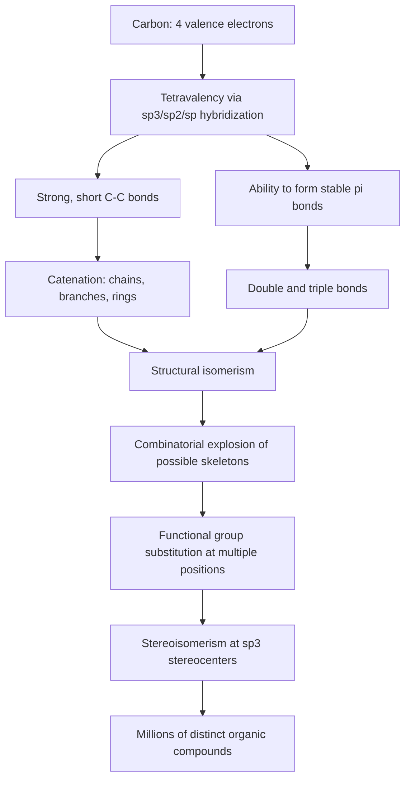

## Why Carbon Forms So Many Compounds

### Overview

Carbon is unique among all elements in the periodic table for the sheer diversity and number of compounds it can form — over 10 million known organic compounds, vastly outnumbering compounds of every other element combined. This extraordinary versatility stems from a specific combination of atomic properties that no other element replicates simultaneously.

### Electronic Configuration and Valence

Carbon has atomic number 6, with electronic configuration $1s^2 2s^2 2p^2$. In its ground state, carbon has 2 unpaired electrons in the $2p$ orbitals, which would suggest a valence of 2. However, carbon almost universally exhibits a valence of 4 in compounds due to **hybridization**.

The promotion of one $2s$ electron to the empty $2p_z$ orbital produces an excited state configuration $2s^1 2p_x^1 2p_y^1 2p_z^1$, giving four unpaired electrons available for bonding. The small energy cost of this promotion is more than compensated by the formation of four covalent bonds instead of two, making the tetravalent state energetically favorable.

### Catenation: The Central Property

**Catenation** is the ability of an atom to form bonds with other atoms of the same element, creating chains, branches, and rings. Carbon exhibits catenation to an extent unmatched by any other element.

**Key factors enabling strong catenation in carbon:**

1. **Small atomic size:** Carbon's small atomic radius (approximately 77 pm for the covalent radius) allows close approach between bonded carbon atoms, resulting in strong, short C–C bonds
2. **High C–C bond energy:** The C–C single bond energy is approximately 347–356 kJ/mol, substantially stronger than the Si–Si bond (~226 kJ/mol) or other Group 14 element-element bonds
3. **Bond stability trend down the group:** Bond strength decreases significantly down Group 14 (C > Si > Ge > Sn), which is why silicon, germanium, and tin show only limited catenation, and lead essentially none

| Element | Approximate E–E Bond Energy (kJ/mol) | Catenation Tendency |
| --- | --- | --- |
| Carbon (C) | ~347 | Extremely strong (millions of compounds) |
| Silicon (Si) | ~226 | Weak (silanes limited to ~Si₈) |
| Germanium (Ge) | ~188 | Very weak |
| Tin (Sn) | ~151 | Negligible |
| Lead (Pb) | ~130 | Essentially none |

[Inference] The dramatic drop-off in catenation ability down Group 14 is generally attributed to decreasing orbital overlap efficiency and increasing bond length as atomic size grows, though the precise quantitative contribution of each factor remains an area of ongoing physical-chemistry discussion.

### Tetravalency and Directional Bonding

Because carbon forms four bonds via $sp^3$, $sp^2$, or $sp$ hybridization, it can adopt distinct three-dimensional geometries:

- **$sp^3$ hybridization:** four equivalent hybrid orbitals arranged tetrahedrally, bond angle $109.5°$ (e.g., methane, $\text{CH}_4$)
- **$sp^2$ hybridization:** three hybrid orbitals in a trigonal planar arrangement, bond angle $120°$, with one unhybridized $p$ orbital available for a $\pi$ bond (e.g., ethylene, $\text{C}_2\text{H}_4$)
- **$sp$ hybridization:** two hybrid orbitals arranged linearly, bond angle $180°$, with two unhybridized $p$ orbitals available for two $\pi$ bonds (e.g., acetylene, $\text{C}_2\text{H}_2$)

This flexibility allows carbon to form single, double, and triple bonds, each with distinct geometric and electronic consequences, multiplying the number of structurally distinct molecules possible even from the same molecular formula.

### Hybridization Geometries (svg_diagram)

<svg xmlns="http://www.w3.org/2000/svg" viewBox="0 0 780 260" font-family="Helvetica, Arial, sans-serif" font-size="12">
<text x="390" y="22" font-size="16" font-weight="bold" text-anchor="middle">Carbon Hybridization and Geometry (svg_diagram)</text>

<text x="120" y="50" text-anchor="middle" font-weight="bold">sp³ (109.5°)</text>

<circle cx="120" cy="110" r="8" fill="#333" />

<line x1="120" y1="110" x2="80" y2="80" stroke="#333" stroke-width="2" />

<line x1="120" y1="110" x2="160" y2="80" stroke="#333" stroke-width="2" />

<line x1="120" y1="110" x2="90" y2="150" stroke="#333" stroke-width="2" />

<line x1="120" y1="110" x2="150" y2="150" stroke="#333" stroke-width="2" />

<circle cx="80" cy="80" r="5" fill="#999" />

<circle cx="160" cy="80" r="5" fill="#999" />

<circle cx="90" cy="150" r="5" fill="#999" />

<circle cx="150" cy="150" r="5" fill="#999" />

<text x="120" y="190" text-anchor="middle" font-size="11">Tetrahedral (methane)</text>

<text x="390" y="50" text-anchor="middle" font-weight="bold">sp² (120°)</text>

<circle cx="390" cy="110" r="8" fill="#333" />

<line x1="390" y1="110" x2="390" y2="70" stroke="#333" stroke-width="2" />

<line x1="390" y1="110" x2="355" y2="135" stroke="#333" stroke-width="2" />

<line x1="390" y1="110" x2="425" y2="135" stroke="#333" stroke-width="2" />

<circle cx="390" cy="70" r="5" fill="#999" />

<circle cx="355" cy="135" r="5" fill="#999" />

<circle cx="425" cy="135" r="5" fill="#999" />

<line x1="390" y1="108" x2="390" y2="72" stroke="`#c0392b`" stroke-width="1.5" stroke-dasharray="2,2" transform="translate(6,0)" />

<text x="390" y="190" text-anchor="middle" font-size="11">Trigonal planar (ethylene)</text>

<text x="650" y="50" text-anchor="middle" font-weight="bold">sp (180°)</text>

<circle cx="610" cy="110" r="8" fill="#333" />

<circle cx="690" cy="110" r="8" fill="#333" />

<line x1="610" y1="110" x2="690" y2="110" stroke="#333" stroke-width="2" />

<line x1="570" y1="110" x2="610" y2="110" stroke="#333" stroke-width="2" />

<line x1="690" y1="110" x2="730" y2="110" stroke="#333" stroke-width="2" />

<circle cx="570" cy="110" r="5" fill="#999" />

<circle cx="730" cy="110" r="5" fill="#999" />

<text x="650" y="190" text-anchor="middle" font-size="11">Linear (acetylene)</text>

</svg>

### Structural Isomerism as a Multiplying Factor

Beyond simply forming many bonds, carbon's tetravalency combined with catenation produces **structural isomerism** — molecules with the same molecular formula but different connectivity. The number of possible isomers grows combinatorially with chain length.

| Molecular Formula | Number of Structural Isomers |
| --- | --- |
| $\text{C}_4\text{H}_{10}$ | 2 |
| $\text{C}_5\text{H}_{12}$ | 3 |
| $\text{C}_6\text{H}_{14}$ | 5 |
| $\text{C}_{10}\text{H}_{22}$ | 75 |
| $\text{C}_{20}\text{H}_{42}$ | 366,319 |

This combinatorial explosion means that even simple hydrocarbon families generate enormous structural diversity as chain length increases, independent of the additional diversity introduced by heteroatoms and functional groups.

### Ability to Form Rings

Carbon's catenation extends beyond linear and branched chains to closed ring structures, adding another dimension of structural diversity:

- **Alicyclic rings:** cyclopropane, cyclohexane, and larger saturated rings
- **Aromatic rings:** benzene and polycyclic aromatic systems, stabilized by delocalized $\pi$ electron systems
- **Heterocyclic rings:** rings incorporating nitrogen, oxygen, or sulfur alongside carbon (e.g., pyridine, furan)
- **Fused and bridged polycyclic systems:** steroids, terpenes, and complex natural products

### Multiple Bonding and π-Bond Formation

Carbon readily forms stable $\pi$ bonds through unhybridized $p$-orbital overlap, enabling:

- **Double bonds** (C=C): found in alkenes, carbonyl groups (C=O)
- **Triple bonds** (C≡C): found in alkynes
- **Delocalized $\pi$ systems:** conjugated dienes, aromatic rings, and extended conjugation in natural pigments and polymers

This capacity for stable multiple bonding is not shared to the same degree by heavier Group 14 elements, whose larger atomic radii result in poorer $p$-orbital overlap and weaker $\pi$ bonds — a phenomenon sometimes referred to as the reluctance of heavier $p$-block elements to form strong $\pi$ bonds ("double bond rule" tendencies).

### Diversity Through Functional Groups and Heteroatoms

Carbon's four bonding positions can be occupied not only by other carbons and hydrogens, but by a wide range of heteroatoms (O, N, S, P, halogens), each introducing a **functional group** with characteristic reactivity:

| Functional Group | General Formula | Example |
| --- | --- | --- |
| Alcohol | R–OH | Ethanol |
| Aldehyde | R–CHO | Formaldehyde |
| Ketone | R–CO–R' | Acetone |
| Carboxylic acid | R–COOH | Acetic acid |
| Amine | R–NH₂ | Methylamine |
| Ester | R–COO–R' | Ethyl acetate |
| Amide | R–CONH₂ | Acetamide |
| Halide | R–X | Chloromethane |

Since any given carbon skeleton can bear different functional groups at different positions, and since molecules can contain multiple functional groups simultaneously, the combinatorics of (skeleton) × (functional group placement) × (stereochemistry) yield the vast compound diversity characteristic of organic chemistry.

### Stereoisomerism as an Additional Source of Diversity

Carbon's tetrahedral geometry at $sp^3$ centers allows for **chirality**: when a carbon atom is bonded to four different substituents, it becomes a stereocenter, giving rise to non-superimposable mirror-image molecules (enantiomers).

$$\text{Number of possible stereoisomers} \approx 2^n$$

where $n$ is the number of independent stereocenters (this is an upper bound; meso compounds and symmetry can reduce the actual count).

This stereochemical dimension means that even molecules with identical connectivity can exist as multiple distinct compounds with different physical and biological properties — a phenomenon of central importance in pharmacology and biochemistry, where enantiomers of the same drug can have vastly different physiological effects.

### Comparative Summary: Why Not Silicon?

Silicon, carbon's direct Group 14 neighbor, is sometimes proposed as an alternative basis for chemical complexity (notably in astrobiology speculation), but it falls short for several structural reasons:

1. Weaker Si–Si bonds limit chain length and stability of catenated structures
2. Silicon does not readily form stable $\pi$ bonds, making Si=Si and Si≡Si linkages rare and generally unstable under ordinary conditions
3. Si–O bonds are exceptionally strong (~452 kJ/mol), so silicon chemistry is thermodynamically driven toward silicate/silica-type Si–O–Si networks rather than Si–Si catenated chains
4. Larger atomic radius reduces orbital overlap efficiency compared to carbon's compact bonding geometry

[Inference] These comparative points are well-supported by bond energy data and are the standard explanation in general and inorganic chemistry texts, though the broader question of whether silicon-based complex chemistry could exist under exotic conditions (e.g., different temperature/pressure regimes) remains a matter of scientific speculation rather than settled fact.

### Conceptual Summary Diagram (Mermaid)

**Key Points**

- Carbon's tetravalency arises from $sp$ hybridization promoting a $2s$ electron into the $2p$ subshell, yielding 4 unpaired bonding electrons
- Catenation in carbon is uniquely strong due to small atomic radius and high C–C bond energy (~347 kJ/mol), far exceeding heavier Group 14 elements
- Carbon forms stable single, double, and triple bonds, unlike heavier congeners which resist strong $\pi$-bond formation
- Structural isomerism, ring formation, functional group diversity, and stereoisomerism multiply combinatorially to produce millions of distinct compounds from a single element

**Related Topics**

- Hybridization theory ($sp^3$, $sp^2$, $sp$) and molecular geometry
- Structural, geometric, and optical isomerism
- Functional groups and their characteristic reactions
- IUPAC nomenclature of organic compounds
- Aromaticity and Hückel's rule
- Homologous series and physical property trends