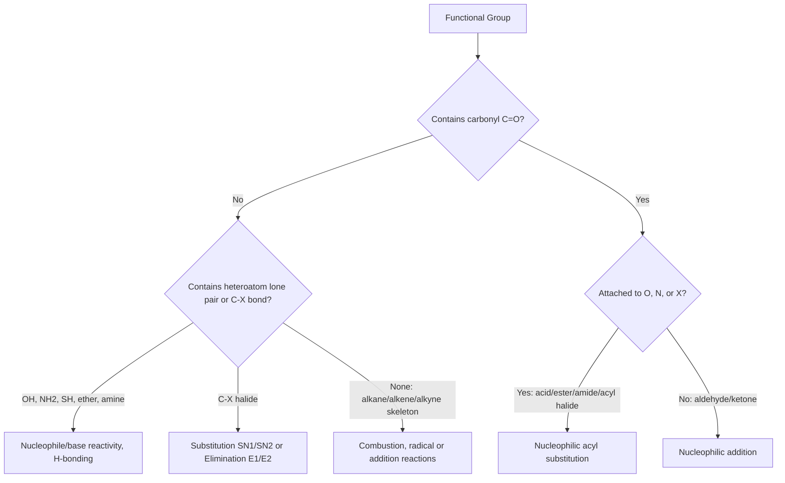

## Functional Groups Overview

### Overview

A **functional group** is a specific atom, group of atoms, or bonding arrangement within an organic molecule that determines its characteristic chemical reactivity, physical properties, and typical reaction mechanisms. Regardless of the size or complexity of the carbon skeleton to which it is attached, a given functional group tends to undergo similar reactions across different molecules — this principle underlies the systematic organization of all organic chemistry.

### Why Functional Groups Matter

The carbon-hydrogen framework of an organic molecule (the "skeleton") is relatively unreactive under most conditions. Reactivity is concentrated at functional groups because they typically introduce:

- **Polarity:** electronegativity differences between carbon and heteroatoms (O, N, halogens) create dipoles that make certain bonds susceptible to nucleophilic or electrophilic attack
- **Multiple bonds:** π electrons in double/triple bonds are more accessible and reactive than σ-bonded electrons
- **Lone pairs:** heteroatoms with lone pairs can act as nucleophiles or bases
- **Bond polarizability/weakness:** some bonds (e.g., C–X halide bonds) are weaker and more easily broken

This is the basis of the **retrosynthetic and mechanistic classification** of organic chemistry: instead of memorizing millions of individual compound reactions, chemists study a manageable set of functional group reaction patterns.

### Hydrocarbons (Baseline, No Heteroatom Functional Group)

| Group | Structure | Suffix | Example | Key Reactivity |
| --- | --- | --- | --- | --- |
| Alkane | C–C single bonds only | -ane | Ethane, $\text{CH}_3\text{CH}_3$ | Largely unreactive; combustion, radical halogenation |
| Alkene | C=C double bond | -ene | Ethylene, $\text{CH}_2=\text{CH}_2$ | Electrophilic addition (π bond as nucleophile) |
| Alkyne | C≡C triple bond | -yne | Acetylene, $\text{HC}\equiv\text{CH}$ | Electrophilic/nucleophilic addition |
| Arene (aromatic) | Delocalized ring π system | -ene/benzene derivatives | Benzene, $\text{C}_6\text{H}_6$ | Electrophilic aromatic substitution |

### Oxygen-Containing Functional Groups

**Alcohols (R–OH)**

- Polar O–H bond enables hydrogen bonding, raising boiling points relative to comparable alkanes
- Reactivity: nucleophilic oxygen (substitution, esterification), acidic O–H (weak acid, $pK_a \approx 16$–18), oxidizable to aldehydes/ketones/carboxylic acids
- Classified as primary, secondary, or tertiary based on the number of carbon substituents on the carbinol carbon
- Example: ethanol, $\text{CH}_3\text{CH}_2\text{OH}$

**Ethers (R–O–R')**

- Relatively unreactive due to lack of acidic protons or strong electrophilic/nucleophilic sites
- Useful as solvents; can act as weak Lewis bases
- Example: diethyl ether, $\text{CH}_3\text{CH}_2\text{–O–CH}_2\text{CH}_3$

**Aldehydes (R–CHO)**

- Carbonyl carbon bonded to at least one hydrogen; highly electrophilic carbonyl carbon
- Reactivity: nucleophilic addition (Grignard reagents, hydride reduction), oxidation to carboxylic acids, characteristic positive Tollens'/Fehling's tests
- Example: formaldehyde, $\text{HCHO}$; acetaldehyde, $\text{CH}_3\text{CHO}$

**Ketones (R–CO–R')**

- Carbonyl carbon bonded to two carbon substituents (no hydrogen on carbonyl carbon)
- Reactivity: nucleophilic addition similar to aldehydes but generally less reactive (steric/electronic reasons); resistant to mild oxidation
- Example: acetone, $\text{CH}_3\text{COCH}_3$

**Carboxylic acids (R–COOH)**

- Combines carbonyl and hydroxyl on the same carbon, creating strong resonance-stabilized acidity ($pK_a \approx 4$–5)
- Reactivity: deprotonation to carboxylate, conversion to esters/amides/acid chlorides
- Example: acetic acid, $\text{CH}_3\text{COOH}$

**Esters (R–COO–R')**

- Formed via condensation of carboxylic acid and alcohol (Fischer esterification), releasing water
- Reactivity: hydrolysis (acid- or base-catalyzed, the latter called saponification), transesterification
- Characteristic pleasant odors; common in fats, oils, and fragrances
- Example: ethyl acetate, $\text{CH}_3\text{COOCH}_2\text{CH}_3$

**Acid halides (R–COX) and Acid anhydrides (R–CO–O–CO–R')**

- Highly reactive carbonyl derivatives, excellent electrophiles for acylation reactions
- Used synthetically to install acyl groups onto nucleophiles (amines, alcohols) under milder conditions than the parent acid

### Nitrogen-Containing Functional Groups

**Amines (R–NH₂, R₂NH, R₃N)**

- Nitrogen lone pair confers basicity (Brønsted base, Lewis base) and nucleophilicity
- Classified as primary, secondary, or tertiary by the number of carbon substituents on nitrogen (distinct from the carbon classification scheme used for alcohols)
- Example: methylamine, $\text{CH}_3\text{NH}_2$

**Amides (R–CONH₂)**

- Combines carbonyl with nitrogen; resonance delocalization of the nitrogen lone pair into the carbonyl significantly reduces basicity/nucleophilicity compared to amines
- Highly stable to hydrolysis relative to esters; the amide (peptide) bond is the structural backbone of proteins
- Example: acetamide, $\text{CH}_3\text{CONH}_2$

**Nitriles (R–C≡N)**

- Polar, linear functional group; hydrolyzable to carboxylic acids or amides under acidic/basic conditions
- Reducible to primary amines

### Halogen-Containing Functional Groups

**Alkyl halides (R–X, X = F, Cl, Br, I)**

- Polarized C–X bond, with bond strength decreasing and reactivity generally increasing down the halogen group (C–I weakest, most reactive in $S_N$ mechanisms)
- Reactivity: nucleophilic substitution ($S_N1$/$S_N2$), elimination (E1/E2), depending on substrate structure, nucleophile/base strength, and solvent
- Example: chloromethane, $\text{CH}_3\text{Cl}$

### Sulfur- and Phosphorus-Containing Groups (Overview)

- **Thiols (R–SH):** sulfur analog of alcohols; weaker O–H-type hydrogen bonding but more acidic and nucleophilic sulfur; characteristic strong odors
- **Sulfides/thioethers (R–S–R'):** sulfur analog of ethers, more nucleophilic and polarizable than oxygen ethers
- **Phosphate esters:** central to biochemistry (ATP, nucleic acid backbone), reactivity around the phosphorus center underlies energy transfer in biological systems

### Priority Order for IUPAC Nomenclature (Principal Characteristic Group)

When a molecule contains multiple functional groups, IUPAC rules establish a **seniority order** to determine which group is named as the principal characteristic group (expressed as the suffix) versus which are named as substituent prefixes. A commonly taught simplified seniority order (highest to lowest priority) is:

1. Carboxylic acids
2. Esters
3. Amides
4. Nitriles
5. Aldehydes
6. Ketones
7. Alcohols
8. Amines
9. Alkenes/Alkynes
10. Alkanes (parent chain only, no suffix beyond -ane)

**Example:** A molecule containing both an alcohol and a carboxylic acid group is named as a hydroxy-substituted carboxylic acid (e.g., "3-hydroxybutanoic acid"), not as an alcohol with a carboxyl substituent, because the carboxylic acid outranks the alcohol in seniority.

[Inference] The exact seniority table in the current IUPAC 2013 recommendations includes additional classes (e.g., sulfonic acids, anhydrides ranked even above carboxylic acids in certain contexts) and finer distinctions; the list above reflects the standard introductory-level teaching simplification rather than the complete formal IUPAC priority table.

### Functional Group Identification Diagram (svg_diagram)

<svg xmlns="http://www.w3.org/2000/svg" viewBox="0 0 800 420" font-family="Helvetica, Arial, sans-serif" font-size="12">
<text x="400" y="24" font-size="16" font-weight="bold" text-anchor="middle">Common Functional Groups (svg_diagram)</text>

<rect x="20" y="45" width="160" height="60" rx="6" fill="#eaf2f8" stroke="#333" />
<text x="100" y="68" text-anchor="middle" font-weight="bold">Alcohol</text>
<text x="100" y="86" text-anchor="middle">R–OH</text>

<rect x="200" y="45" width="160" height="60" rx="6" fill="#fdebd0" stroke="#333" />
<text x="280" y="68" text-anchor="middle" font-weight="bold">Aldehyde</text>
<text x="280" y="86" text-anchor="middle">R–CHO</text>

<rect x="380" y="45" width="160" height="60" rx="6" fill="#fdebd0" stroke="#333" />
<text x="460" y="68" text-anchor="middle" font-weight="bold">Ketone</text>
<text x="460" y="86" text-anchor="middle">R–CO–R'</text>

<rect x="560" y="45" width="160" height="60" rx="6" fill="#fadbd8" stroke="#333" />
<text x="640" y="68" text-anchor="middle" font-weight="bold">Carboxylic Acid</text>
<text x="640" y="86" text-anchor="middle">R–COOH</text>

<rect x="20" y="125" width="160" height="60" rx="6" fill="#fadbd8" stroke="#333" />
<text x="100" y="148" text-anchor="middle" font-weight="bold">Ester</text>
<text x="100" y="166" text-anchor="middle">R–COO–R'</text>

<rect x="200" y="125" width="160" height="60" rx="6" fill="#d5f5e3" stroke="#333" />
<text x="280" y="148" text-anchor="middle" font-weight="bold">Amide</text>
<text x="280" y="166" text-anchor="middle">R–CONH₂</text>

<rect x="380" y="125" width="160" height="60" rx="6" fill="#d5f5e3" stroke="#333" />
<text x="460" y="148" text-anchor="middle" font-weight="bold">Amine</text>
<text x="460" y="166" text-anchor="middle">R–NH₂</text>

<rect x="560" y="125" width="160" height="60" rx="6" fill="#eaf2f8" stroke="#333" />
<text x="640" y="148" text-anchor="middle" font-weight="bold">Ether</text>
<text x="640" y="166" text-anchor="middle">R–O–R'</text>

<rect x="20" y="205" width="160" height="60" rx="6" fill="#e8daef" stroke="#333" />
<text x="100" y="228" text-anchor="middle" font-weight="bold">Alkyl Halide</text>
<text x="100" y="246" text-anchor="middle">R–X</text>

<rect x="200" y="205" width="160" height="60" rx="6" fill="#d5f5e3" stroke="#333" />
<text x="280" y="228" text-anchor="middle" font-weight="bold">Nitrile</text>
<text x="280" y="246" text-anchor="middle">R–C≡N</text>

<rect x="380" y="205" width="160" height="60" rx="6" fill="#fcf3cf" stroke="#333" />
<text x="460" y="228" text-anchor="middle" font-weight="bold">Thiol</text>
<text x="460" y="246" text-anchor="middle">R–SH</text>

<rect x="560" y="205" width="160" height="60" rx="6" fill="#fadbd8" stroke="#333" />
<text x="640" y="228" text-anchor="middle" font-weight="bold">Acid Halide</text>
<text x="640" y="246" text-anchor="middle">R–COX</text>

<text x="400" y="300" text-anchor="middle" font-size="11" fill="#555">Color grouping: blue = O-single-bond, orange = carbonyl (non-acid), red = carbonyl-acid-derivative,</text>

<text x="400" y="316" text-anchor="middle" font-size="11" fill="#555">green = nitrogen-containing, purple = halide, yellow = sulfur-containing</text>

</svg>

### General Reaction Behavior by Functional Group Class

### Physical Property Trends by Functional Group

| Group | Relative Boiling Point Effect | Water Solubility | Key Reason |
| --- | --- | --- | --- |
| Alkane | Baseline (lowest) | Insoluble | No polarity, no H-bonding |
| Ether | Slightly higher than alkane | Slight | Dipole, no H-bond donor |
| Aldehyde/Ketone | Moderate | Moderate | Dipole-dipole, no H-bond donor but accepts H-bonds |
| Amine | Moderate | Moderate–high | Weaker N–H hydrogen bonding than O–H |
| Alcohol | High | High (short chain) | Strong O–H hydrogen bonding, both donor and acceptor |
| Carboxylic acid | Highest (small molecules) | High (short chain) | Hydrogen bonding plus dimer formation via two H-bonds |

**Example:** Comparing butane ($\text{C}_4\text{H}_{10}$, bp $-1°\text{C}$), 1-propanol ($\text{C}_3\text{H}_7\text{OH}$, bp $97°\text{C}$), and propanoic acid ($\text{C}_2\text{H}_5\text{COOH}$, bp $141°\text{C}$) illustrates how functional group identity, more than molecular weight alone, dominates boiling point trends — all three have similar molecular weights, yet boiling points differ dramatically due to hydrogen bonding capacity.

**Key Points**

- A functional group is the reactive site of a molecule; the carbon skeleton itself is comparatively inert
- Functional groups are classified by heteroatom content and bonding pattern: hydroxyl, carbonyl, carboxyl, amino, halide, etc.
- Reactivity patterns (nucleophilic addition, nucleophilic acyl substitution, substitution/elimination) are shared across all members of a functional group class regardless of the attached carbon skeleton
- IUPAC nomenclature assigns a seniority order among functional groups to determine the principal suffix when multiple groups are present
- Physical properties (boiling point, solubility) are strongly governed by a functional group's capacity for hydrogen bonding and dipole interactions

**Related Topics**

- Nomenclature rules (IUPAC naming conventions)
- Nucleophilic substitution and elimination mechanisms ($S_N1$, $S_N2$, E1, E2)
- Nucleophilic addition to carbonyls
- Hydrogen bonding and intermolecular forces
- Acid-base behavior of organic functional groups ($pK_a$ trends)
- Spectroscopic identification of functional groups (IR, NMR)