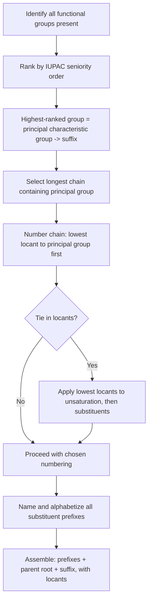

## IUPAC Nomenclature Rules

### Overview

IUPAC (International Union of Pure and Applied Chemistry) nomenclature is the systematic naming convention that allows any organic compound's structure to be unambiguously derived from its name, and vice versa. This system replaced the reliance on arbitrary historical/common names with a rule-based approach that scales to molecules of arbitrary complexity.

### General Naming Framework

Every systematic IUPAC name is built from three core components:

$$\text{Prefix(es)} + \text{Parent chain (root)} + \text{Suffix}$$

- **Parent chain (root):** identifies the longest continuous carbon chain containing the principal characteristic group, encoded by a root name indicating carbon count
- **Suffix:** indicates the principal characteristic functional group and/or degree of saturation
- **Prefix(es):** indicate substituents (branches, halogens, and functional groups of lower seniority than the principal group), each with a locant (position number)

### Root Names for Carbon Chain Length

| Carbons | Root | Carbons | Root |
| --- | --- | --- | --- |
| 1 | meth- | 6 | hex- |
| 2 | eth- | 7 | hept- |
| 3 | prop- | 8 | oct- |
| 4 | but- | 9 | non- |
| 5 | pent- | 10 | dec- |

### Step-by-Step Naming Procedure for Acyclic Compounds

**Step 1: Identify the principal characteristic group**

Scan the molecule for functional groups and determine the highest-seniority group present using the IUPAC seniority order (carboxylic acids > esters > amides > nitriles > aldehydes > ketones > alcohols > amines > alkenes/alkynes > alkanes). This group will be expressed as the suffix; all other groups become prefixes.

**Step 2: Select the parent chain**

The parent chain must be the longest continuous carbon chain that:

1. Contains the principal characteristic group (mandatory, takes priority over chain length)
2. Among chains satisfying condition 1, is the longest possible
3. If there is a tie in length, choose the chain with the greater number of substituents

**Step 3: Number the parent chain**

Assign locants (position numbers) starting from the end that gives the **lowest locant to the principal characteristic group** first. If this does not resolve the numbering, apply lowest locants to:

1. The principal characteristic group (highest priority)
2. Unsaturation (double/triple bonds)
3. Substituents as a set (lowest locant sum)
4. The substituent cited first alphabetically (if still tied)

**Step 4: Identify and name substituents**

List all substituent groups attached to the parent chain, using appropriate prefix names (see substituent prefix table below), each with its locant.

**Step 5: Assemble the name**

Arrange substituent prefixes in **alphabetical order** (ignoring multiplying prefixes like di-, tri- for alphabetization purposes, but not ignoring prefixes like "iso-" which are part of the substituent name itself), separated by commas if multiple locants apply to the same substituent type, with hyphens separating locants from letters.

### Common Substituent Prefixes

| Substituent | Prefix | Example Usage |
| --- | --- | --- |
| –CH₃ | methyl | 2-methylbutane |
| –C₂H₅ | ethyl | 3-ethylhexane |
| –F | fluoro | 1-fluoropropane |
| –Cl | chloro | 2-chlorobutane |
| –Br | bromo | 1-bromopentane |
| –I | iodo | 2-iodopropane |
| –NO₂ | nitro | nitrobenzene |
| –OR | alkoxy | methoxyethane |

### Multiplying Prefixes

When the same substituent appears more than once, multiplying prefixes indicate the count, and each occurrence receives its own locant:

| Count | Prefix (simple substituents) | Prefix (complex/substituted substituents) |
| --- | --- | --- |
| 2 | di- | bis- |
| 3 | tri- | tris- |
| 4 | tetra- | tetrakis- |
| 5 | penta- | pentakis- |

**Example:** 2,3-dimethylbutane (two separate methyl groups at positions 2 and 3) versus a case requiring "bis-" when the substituent itself already contains a multiplying prefix internally (e.g., naming complex substituted alkyl branches), which is used to avoid ambiguity.

### Worked Example 1: Building a Name from Structure

Consider the structure: $\text{CH}_3\text{–CH}(\text{CH}_3)\text{–CH}_2\text{–CH}_2\text{–COOH}$

**Step 1:** Principal group = carboxylic acid (–COOH), highest seniority present

**Step 2:** Longest chain containing –COOH: 5 carbons → pentanoic acid base

**Step 3:** Number from the end nearest –COOH (carboxyl carbon is always C1 by convention for carboxylic acids):

- C1 = COOH, C2, C3, C4, C5, with a methyl branch on C4

**Step 4:** Substituent = methyl at position 4

**Step 5:** Assembled name: **4-methylpentanoic acid**

### Worked Example 2: Multiple Substituents and Alphabetization

Consider: $\text{CH}_3\text{–CH}(\text{Cl})\text{–CH}(\text{CH}_3)\text{–CH}_2\text{–CH}_3$

**Step 1:** No principal characteristic group beyond the alkane skeleton — suffix is simply -ane

**Step 2:** Longest chain = 5 carbons → pentane

**Step 3:** Number to give lowest locant set: numbering from the left gives substituents at C2 (Cl) and C3 (CH₃); numbering from the right gives C3 (CH₃) and C4 (Cl). Locant set {2,3} is lower than {3,4}, so number from the left.

**Step 4:** Substituents: chloro at C2, methyl at C3

**Step 5:** Alphabetical order places "chloro" before "methyl" (c before m):

**2-chloro-3-methylpentane**

### Naming Alkenes and Alkynes: Locating Unsaturation

For unsaturated compounds, the suffix changes to -ene (double bond) or -yne (triple bond), and the locant given is the **lower-numbered carbon** of the multiple bond.

**Example:** $\text{CH}_3\text{–CH}_2\text{–CH}=\text{CH}\text{–CH}_3$

- Parent chain: 5 carbons, one double bond → pentene
- Numbering from either end gives the double bond at position 2 (numbering from the right: C1-C2 would place it at position 3, so left-to-right numbering giving position 2 is correct, satisfying the lowest-locant rule)
- Name: **pent-2-ene** (modern IUPAC format) or **2-pentene** (older format)

For compounds with multiple double/triple bonds, multiplying prefixes apply to the suffix itself: -adiene, -atriene, -diyne, etc., each requiring its own locant.

**Example:** $\text{CH}_2=\text{CH}\text{–CH}=\text{CH}_2$ → **buta-1,3-diene**

### Naming Cyclic Compounds

Cyclic (ring) parent structures use the prefix **cyclo-** before the root name:

- Cyclohexane, cyclopentene, cyclopropanol

Numbering around the ring follows the same lowest-locant principles, with the principal characteristic group (if attached to a ring carbon) typically assigned position 1.

**Example:** A cyclohexane ring with a hydroxyl group and a methyl group would be numbered to give the –OH group (higher seniority) position 1, then numbered around the ring in the direction giving the lower locant to the methyl substituent: **4-methylcyclohexan-1-ol** (or 4-methylcyclohexanol).

### Naming Compounds with the Principal Group as Suffix

| Functional Group | Suffix | Example |
| --- | --- | --- |
| Carboxylic acid | -oic acid | Ethanoic acid |
| Ester | -oate | Ethyl ethanoate |
| Amide | -amide | Ethanamide |
| Nitrile | -nitrile | Ethanenitrile |
| Aldehyde | -al | Ethanal |
| Ketone | -one | Propan-2-one |
| Alcohol | -ol | Ethanol |
| Amine | -amine | Ethanamine |

When a functional group is **not** the principal characteristic group (i.e., a higher-priority group is present), it is named as a prefix instead:

| Functional Group | Prefix (when subordinate) |
| --- | --- |
| Hydroxyl | hydroxy- |
| Oxo (ketone/aldehyde C=O) | oxo- |
| Amino | amino- |
| Carboxylic acid | carboxy- |

**Example:** A molecule with both a ketone and an alcohol group is named with the ketone as suffix (-one, higher seniority) and the alcohol as a "hydroxy-" prefix: **4-hydroxybutan-2-one**.

### Naming Decision Flow (Mermaid)

### Locant Assignment Diagram (svg_diagram)

<svg xmlns="http://www.w3.org/2000/svg" viewBox="0 0 760 220" font-family="Helvetica, Arial, sans-serif" font-size="12">
<text x="380" y="22" font-size="16" font-weight="bold" text-anchor="middle">Numbering Direction and Lowest Locants (svg_diagram)</text>

<circle cx="100" cy="100" r="16" fill="#eaf2f8" stroke="#333" />
<text x="100" y="105" text-anchor="middle">C1</text>
<line x1="116" y1="100" x2="184" y2="100" stroke="#333" stroke-width="2" />
<circle cx="200" cy="100" r="16" fill="#fadbd8" stroke="#333" />
<text x="200" y="105" text-anchor="middle">C2</text>
<text x="200" y="70" text-anchor="middle" fill="#c0392b">COOH</text>
<line x1="200" y1="84" x2="200" y2="60" stroke="#c0392b" stroke-width="1.5" />
<line x1="216" y1="100" x2="284" y2="100" stroke="#333" stroke-width="2" />
<circle cx="300" cy="100" r="16" fill="#eaf2f8" stroke="#333" />
<text x="300" y="105" text-anchor="middle">C3</text>
<line x1="316" y1="100" x2="384" y2="100" stroke="#333" stroke-width="2" />
<circle cx="400" cy="100" r="16" fill="#d5f5e3" stroke="#333" />
<text x="400" y="105" text-anchor="middle">C4</text>
<text x="400" y="150" text-anchor="middle" fill="#27ae60">CH₃</text>
<line x1="400" y1="116" x2="400" y2="138" stroke="#27ae60" stroke-width="1.5" />
<line x1="416" y1="100" x2="484" y2="100" stroke="#333" stroke-width="2" />
<circle cx="500" cy="100" r="16" fill="#eaf2f8" stroke="#333" />
<text x="500" y="105" text-anchor="middle">C5</text>

<text x="300" y="190" text-anchor="middle" font-size="11" fill="#555">Numbering starts nearest the principal group (COOH),</text>

<text x="300" y="206" text-anchor="middle" font-size="11" fill="#555">giving it the lowest possible locant regardless of chain-end proximity to other substituents</text>

</svg>

### Naming Aromatic (Benzene-Derived) Compounds

Benzene derivatives can be named either by treating benzene as the parent ring with substituent prefixes, or by using retained traditional names for common mono-substituted derivatives that IUPAC still accepts:

| Common Retained Name | Systematic Alternative |
| --- | --- |
| Toluene | Methylbenzene |
| Phenol | Hydroxybenzene (rarely used; phenol is preferred) |
| Aniline | Aminobenzene (rarely used; aniline is preferred) |
| Benzaldehyde | (retained; no simple systematic equivalent commonly used) |

For disubstituted benzenes, relative positions are indicated either by locants (1,2- / 1,3- / 1,4-) or by the traditional **ortho (o-), meta (m-), para (p-)** prefixes:

- **ortho (1,2-):** substituents on adjacent carbons
- **meta (1,3-):** substituents separated by one carbon
- **para (1,4-):** substituents directly across the ring

[Inference] Current IUPAC recommendations (2013) favor numerical locants (1,2-, 1,3-, 1,4-) over the ortho/meta/para system for formal nomenclature, though o-/m-/p- notation remains extremely common in textbooks, industry, and everyday chemical communication.

### Common Naming Pitfalls

- **Choosing the wrong parent chain:** the parent chain must contain the principal characteristic group even if a longer chain exists elsewhere in the molecule that does not contain it
- **Incorrect locant assignment:** forgetting that the principal characteristic group always gets numbering priority over substituents or unsaturation
- **Misordering prefixes:** substituent prefixes must be alphabetized by the first letter of the substituent name itself, ignoring multiplying prefixes (di-, tri-) but not ignoring structural prefixes that are part of the name (e.g., "isopropyl" is alphabetized under "i")
- **Omitting locants when ambiguity exists:** locants can only be omitted when there is truly only one possible position for a substituent or unsaturation (e.g., no locant needed for propanoic acid, since the COOH can only be at C1)

**Key Points**

- Every IUPAC name follows the structure: prefixes (substituents, alphabetized) + parent root (chain length) + suffix (principal characteristic group)
- The parent chain must be the longest chain that contains the principal characteristic group — chain length alone does not determine parent chain selection
- Numbering assigns the lowest possible locant to the principal characteristic group first, then to unsaturation, then to the substituent locant set as a whole
- Seniority order determines which functional group becomes the suffix; all others become prefixes with their own naming conventions (e.g., hydroxy-, oxo-, amino-)

**Related Topics**

- Functional group seniority and classification
- Structural and stereoisomer nomenclature (E/Z, R/S descriptors)
- Naming polycyclic and fused ring systems
- Naming coordination compounds (contrast with organic IUPAC rules)
- Common versus systematic (trivial) names in organic chemistry