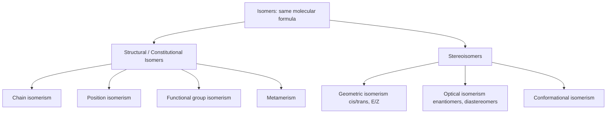
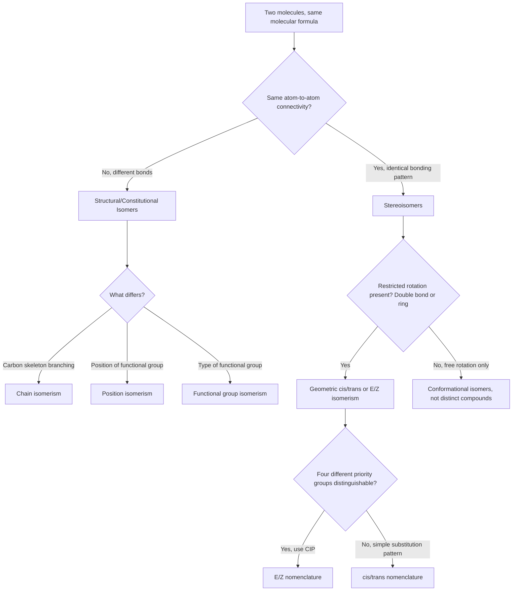

## Structural and Geometric Isomerism

### Overview

**Isomers** are compounds that share the same molecular formula but differ in the arrangement of their atoms. Isomerism is broadly divided into **structural (constitutional) isomerism**, where atoms are connected differently, and **stereoisomerism**, where connectivity is identical but spatial arrangement differs. Geometric isomerism is a specific subtype of stereoisomerism arising from restricted rotation.

### Classification of Isomerism

### Structural (Constitutional) Isomerism

Structural isomers have the same molecular formula but a **different order of atomic connectivity** — different bonds are broken and formed to convert one isomer into another.

**Chain isomerism**

Differences arise from variation in the arrangement (branching pattern) of the carbon skeleton itself, with the same functional group in each isomer.

**Example:** $\text{C}_4\text{H}_{10}$ has two chain isomers:

- n-butane: $\text{CH}_3\text{–CH}_2\text{–CH}_2\text{–CH}_3$ (straight chain)
- isobutane (2-methylpropane): $\text{CH}_3\text{–CH}(\text{CH}_3)\text{–CH}_3$ (branched chain)

**Position isomerism**

The carbon skeleton and functional group are identical, but the functional group (or substituent) is attached at a different position along the chain.

**Example:** $\text{C}_3\text{H}_7\text{Cl}$ has two position isomers:

- 1-chloropropane: $\text{CH}_3\text{CH}_2\text{CH}_2\text{Cl}$
- 2-chloropropane: $\text{CH}_3\text{CHClCH}_3$

**Functional group isomerism**

Isomers belong to entirely different classes of compound (different functional groups) despite sharing a molecular formula. These isomers often have dramatically different chemical and physical properties.

**Example:** $\text{C}_2\text{H}_6\text{O}$ has two functional group isomers:

- Ethanol (an alcohol): $\text{CH}_3\text{CH}_2\text{OH}$, boiling point $78°\text{C}$
- Dimethyl ether (an ether): $\text{CH}_3\text{–O–CH}_3$, boiling point $-24°\text{C}$

**Example:** $\text{C}_3\text{H}_6\text{O}$ can be propanal (an aldehyde) or propan-2-one/acetone (a ketone), or the cyclic ether oxetane in some broader treatments — illustrating how a single molecular formula can correspond to entirely distinct functional classes.

**Metamerism**

A subtype of structural isomerism (sometimes treated separately, sometimes as a special case of chain/position isomerism) occurring in compounds with the same functional group but different alkyl groups distributed around it.

**Example:** $\text{C}_4\text{H}_{10}\text{O}$ ethers:

- Methyl propyl ether: $\text{CH}_3\text{–O–CH}_2\text{CH}_2\text{CH}_3$
- Diethyl ether: $\text{CH}_3\text{CH}_2\text{–O–CH}_2\text{CH}_3$

### Structural Isomer Count Growth

As established in carbon catenation discussions, the number of possible structural isomers grows rapidly (combinatorially) with the number of carbons in a chain:

| Molecular Formula | Number of Structural Isomers |
| --- | --- |
| $\text{C}_4\text{H}_{10}$ | 2 |
| $\text{C}_5\text{H}_{12}$ | 3 |
| $\text{C}_6\text{H}_{14}$ | 5 |
| $\text{C}_7\text{H}_{16}$ | 9 |
| $\text{C}_8\text{H}_{18}$ | 18 |

### Stereoisomerism: Shared Connectivity, Different Spatial Arrangement

Unlike structural isomers, **stereoisomers** have identical atom-to-atom connectivity (the same bonds exist between the same atoms); they differ only in the three-dimensional spatial arrangement of atoms. Interconverting between certain stereoisomers requires breaking and reforming bonds (as with geometric/optical isomers), while others (conformers) interconvert freely via bond rotation.

### Geometric (Cis-Trans) Isomerism

Geometric isomerism arises when **rotation around a bond is restricted**, "locking" substituents into fixed spatial positions relative to one another. This restriction most commonly arises from:

1. **Double bonds (C=C):** the π bond prevents free rotation, since rotation would require breaking the π overlap
2. **Ring structures:** substituents on a ring are constrained to either the same face (cis) or opposite faces (trans) of the ring plane

**Requirements for geometric isomerism in alkenes**

For a C=C double bond to exhibit geometric isomerism, **each carbon of the double bond must bear two different substituents**. If either carbon has two identical substituents, geometric isomerism is not possible.

$$\underset{a}{\overset{b}{\Large\text{C}}}=\underset{c}{\overset{d}{\Large\text{C}}} \quad \text{exhibits geometric isomerism only if } a \neq b \text{ and } c \neq d$$

**Example — But-2-ene:** $\text{CH}_3\text{–CH=CH–CH}_3$

- **cis-but-2-ene:** both methyl groups on the same side of the double bond
- **trans-but-2-ene:** methyl groups on opposite sides

These are genuinely distinct compounds with different physical properties (cis-but-2-ene bp $\approx 4°\text{C}$; trans-but-2-ene bp $\approx 1°\text{C}$; [Unverified] exact literature values may vary slightly by source), because the differing dipole moments and packing efficiency affect intermolecular forces.

**Counter-example:** 1,1-dichloroethene, $\text{Cl}_2\text{C=CH}_2$, does **not** exhibit geometric isomerism because one carbon of the double bond bears two identical chlorine substituents.

### Cis-Trans Isomerism Diagram (svg_diagram)

<svg xmlns="http://www.w3.org/2000/svg" viewBox="0 0 700 260" font-family="Helvetica, Arial, sans-serif" font-size="13">
<text x="350" y="22" font-size="16" font-weight="bold" text-anchor="middle">Cis vs Trans Isomerism in But-2-ene (svg_diagram)</text>

<text x="170" y="55" text-anchor="middle" font-weight="bold">cis-but-2-ene</text>

<line x1="120" y1="140" x2="220" y2="140" stroke="#333" stroke-width="3" />

<line x1="120" y1="146" x2="220" y2="146" stroke="#333" stroke-width="3" />

<line x1="120" y1="140" x2="80" y2="100" stroke="#333" stroke-width="2" />

<line x1="220" y1="140" x2="260" y2="100" stroke="#333" stroke-width="2" />

<line x1="120" y1="140" x2="80" y2="180" stroke="#ccc" stroke-width="2" stroke-dasharray="3,3" />

<line x1="220" y1="140" x2="260" y2="180" stroke="#ccc" stroke-width="2" stroke-dasharray="3,3" />

<text x="80" y="90" text-anchor="middle">CH₃</text>

<text x="260" y="90" text-anchor="middle">CH₃</text>

<text x="80" y="195" text-anchor="middle" fill="#999">H</text>

<text x="260" y="195" text-anchor="middle" fill="#999">H</text>

<text x="170" y="230" text-anchor="middle" font-size="11">Same side: higher polarity, lower symmetry</text>

<text x="530" y="55" text-anchor="middle" font-weight="bold">trans-but-2-ene</text>

<line x1="480" y1="140" x2="580" y2="140" stroke="#333" stroke-width="3" />

<line x1="480" y1="146" x2="580" y2="146" stroke="#333" stroke-width="3" />

<line x1="480" y1="140" x2="440" y2="100" stroke="#333" stroke-width="2" />

<line x1="580" y1="140" x2="620" y2="180" stroke="#333" stroke-width="2" />

<line x1="480" y1="140" x2="440" y2="180" stroke="#ccc" stroke-width="2" stroke-dasharray="3,3" />

<line x1="580" y1="140" x2="620" y2="100" stroke="#ccc" stroke-width="2" stroke-dasharray="3,3" />

<text x="440" y="90" text-anchor="middle">CH₃</text>

<text x="620" y="90" text-anchor="middle" fill="#999">H</text>

<text x="440" y="195" text-anchor="middle" fill="#999">H</text>

<text x="620" y="195" text-anchor="middle">CH₃</text>

<text x="530" y="230" text-anchor="middle" font-size="11">Opposite sides: lower polarity, higher symmetry</text>

</svg>

### E/Z Nomenclature (CIP-Based System)

When substituents on a double bond cannot be clearly classified as simply "same group repeated" (i.e., when up to four *different* groups are present), the cis/trans naming system becomes ambiguous or inapplicable. The **E/Z system**, based on **Cahn-Ingold-Prelog (CIP) priority rules**, resolves this:

**Procedure:**

1. On each double-bond carbon, rank the two attached substituents by CIP priority (higher atomic number = higher priority; if tied, compare the next set of attached atoms)
2. If the two higher-priority groups are on the **same side** → **Z** (from German *zusammen*, "together")
3. If the two higher-priority groups are on **opposite sides** → **E** (from German *entgegen*, "opposite")

**Example:** For $\text{CHFCl=CHBr}$, compare priorities on each carbon:

- Carbon 1: F (higher, atomic number 9) vs. Cl (atomic number 17) — wait, Cl has higher atomic number than F, so Cl > F
- Carbon 2: Br (higher, atomic number 35) vs. H (lower)

If Cl and Br are on the same side → **Z**-isomer; if on opposite sides → **E**-isomer.

[Inference] Z and E do not always correspond directly to cis and trans as commonly assumed — a compound can be classified as "cis" by visual symmetry but be assigned "E" under CIP rules if the higher-priority groups happen to fall on opposite sides of otherwise visually "same-side" substituents. Students should apply CIP priority explicitly rather than assuming cis = Z and trans = E in all cases.

### CIP Priority Basics for Substituent Ranking

CIP priority is determined by:

1. **Atomic number of the directly attached atom** (higher atomic number wins)
2. If tied, compare the atomic numbers of atoms attached to that first atom, listed in decreasing order
3. Double and triple bonds are treated as duplicate single bonds to phantom atoms for ranking purposes (e.g., C=O is treated as C bonded to two O's, one real and one duplicate)

### Geometric Isomerism in Cyclic Compounds

Ring structures also restrict rotation, since ring closure prevents the free rotation available in open chains. Substituents on ring carbons can be described as cis (same face) or trans (opposite faces) of the ring plane.

**Example:** 1,2-dimethylcyclopropane

- **cis-1,2-dimethylcyclopropane:** both methyl groups project from the same face of the ring
- **trans-1,2-dimethylcyclopropane:** methyl groups project from opposite faces

This is structurally analogous to alkene cis/trans isomerism, since in both cases a rigid framework (double bond or ring) prevents the free rotation that would otherwise interconvert the two spatial arrangements.

### Distinguishing Structural Isomers from Stereoisomers: A Diagnostic Approach

### Physical and Chemical Consequences of Geometric Isomerism

Geometric isomers, despite sharing identical molecular formulas and connectivity, can differ substantially in:

- **Melting/boiling points:** trans isomers often pack more efficiently into crystal lattices (higher symmetry), frequently giving higher melting points, while cis isomers may have different boiling point trends due to net dipole moments
- **Dipole moment:** cis isomers of symmetric disubstituted alkenes typically have a net dipole moment (bond dipoles do not cancel), while trans isomers of the same compound may have a near-zero net dipole moment (bond dipoles cancel by symmetry)
- **Biological activity:** cis/trans (or E/Z) configuration can dramatically affect biological function — the most cited example is retinal, where cis-trans isomerization about a specific double bond is the fundamental molecular event underlying vision, and unsaturated fatty acids exhibit different biological handling depending on cis versus trans configuration

**Example — Maleic acid vs. fumaric acid** (both $\text{C}_4\text{H}_4\text{O}_4$, but-2-enedioic acid):

- **Maleic acid (cis):** melting point $\approx 130$–$139°\text{C}$; can undergo intramolecular interactions/cyclization more readily due to proximity of the two carboxyl groups
- **Fumaric acid (trans):** melting point $\approx 287°\text{C}$ (much higher due to symmetric packing); the biologically relevant isomer, appearing in the citric acid cycle

[Unverified] Specific melting point values are commonly cited across chemistry references but exact figures can vary slightly by source and measurement technique; the key comparative point — that fumaric acid's melting point is dramatically higher than maleic acid's — is the well-established teaching takeaway.

**Key Points**

- Structural isomers differ in atomic connectivity (bonds are different); stereoisomers share identical connectivity but differ in 3D spatial arrangement
- Chain, position, and functional group isomerism are the three principal subtypes of structural isomerism
- Geometric isomerism requires restricted rotation (via a double bond or ring) AND each restricted carbon/ring position must bear two different substituents
- The E/Z system (CIP-based) is more rigorous than cis/trans and is required when four distinct substituents are present around the restricted bond
- Geometric isomers can differ significantly in physical properties (melting point, dipole moment) and biological activity despite sharing a molecular formula

**Related Topics**

- Optical isomerism and chirality (enantiomers, diastereomers, R/S nomenclature)
- Conformational isomerism (Newman projections, ring conformations)
- Cahn-Ingold-Prelog priority rules in depth
- Functional group seniority and IUPAC nomenclature
- Biological relevance of stereochemistry (drug action, enzyme specificity)