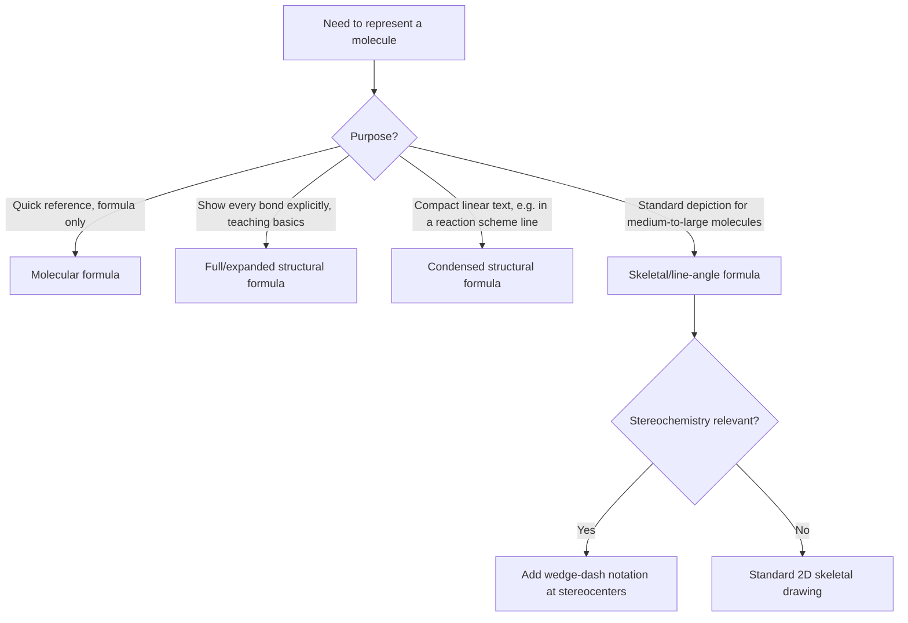

## Common Drawing Conventions for Organic Structures

### Overview

Organic chemists use several standardized shorthand notations to represent molecular structures efficiently, balancing clarity, speed of drawing, and the amount of structural information conveyed. Understanding how to interconvert between these representations is a foundational skill, since real molecules — especially larger ones — are rarely drawn with every atom and bond shown explicitly.

### Types of Structural Formulas

**Molecular formula**

Shows only the count of each element present, with no connectivity information at all.

**Example:** Butane's molecular formula is $\text{C}_4\text{H}_{10}$ — this alone cannot distinguish n-butane from isobutane.

**Full (expanded) structural formula**

Shows every atom and every bond explicitly, including all C–H bonds. This is the most information-dense but also most visually cluttered representation.

**Example:** Ethanol drawn in full structural form shows the carbon skeleton with every hydrogen individually attached: $\text{H–C(H)(H)–C(H)(H)–O–H}$, typically rendered as a 2D diagram with explicit lines for every bond.

**Condensed structural formula**

Groups atoms together without drawing every individual bond, using a linear text-like notation that is much faster to write while retaining connectivity information.

**Example:** Ethanol condensed: $\text{CH}_3\text{CH}_2\text{OH}$

**Example:** Isobutane condensed: $\text{(CH}_3)_2\text{CHCH}_3$ or $\text{CH}_3\text{CH(CH}_3\text{)CH}_3$

Condensed formulas commonly use parentheses to indicate branching, e.g., $\text{CH}_3\text{CH}_2\text{CH(CH}_3\text{)CH}_2\text{CH}_3$ for 3-methylpentane.

**Skeletal (line-angle/zigzag) formula**

The most common shorthand used in modern organic chemistry, especially for larger molecules. Key conventions:

1. **Carbon atoms are not labeled explicitly** — each vertex (corner) and each line terminus represents a carbon atom
2. **Hydrogen atoms bonded to carbon are not shown** — the number of implicit hydrogens is inferred from carbon's tetravalency (4 minus the number of bonds explicitly drawn)
3. **Heteroatoms (O, N, S, halogens, etc.) are always shown explicitly**, along with any hydrogens directly bonded to them (e.g., O–H, N–H are drawn out)
4. **Chain bonds are drawn in a zigzag pattern**, approximating the ~109.5° tetrahedral bond angle for $sp^3$ carbons or ~120° for $sp^2$ carbons
5. **Double and triple bonds** are shown as two or three parallel lines respectively, following the same connectivity as the skeleton

**Example — pentane skeletal formula:** a simple zigzag line with 4 line segments (5 vertices/endpoints = 5 carbons); each terminal carbon implicitly has 3 H's, each internal carbon implicitly has 2 H's.

### Skeletal Formula Hydrogen-Counting Convention

For any carbon vertex in a skeletal structure, the implicit hydrogen count is:

$$\text{Implicit H count} = 4 - (\text{number of explicit bonds shown at that vertex})$$

This accounts for all bonds at that vertex, including bonds to other carbons, heteroatoms, and multiple bonds (a double bond counts as 2 toward this total, a triple bond counts as 3).

| Vertex Type | Explicit Bonds Shown | Implicit H Count |
| --- | --- | --- |
| Chain terminus (end of a line) | 1 | 3 |
| Middle of a straight chain | 2 | 2 |
| Branch point (3 chain bonds) | 3 | 1 |
| Fully substituted carbon (4 chain bonds) | 4 | 0 |
| Carbon of a C=C double bond, chain terminus | 1 (double) + 0 | 2 |
| Carbon of a C=C double bond, mid-chain | 1 (double) + 1 (single) | 1 |

### Skeletal Formula Examples with Implicit Hydrogens (svg_diagram)

<svg xmlns="http://www.w3.org/2000/svg" viewBox="0 0 760 260" font-family="Helvetica, Arial, sans-serif" font-size="12">
<text x="380" y="22" font-size="16" font-weight="bold" text-anchor="middle">Skeletal Formula Convention (svg_diagram)</text>

<text x="150" y="55" text-anchor="middle" font-weight="bold">Pentane</text>

<polyline points="60,120 100,90 140,120 180,90 220,120" fill="none" stroke="#333" stroke-width="2.5" />

<text x="60" y="140" text-anchor="middle" font-size="10" fill="#999">CH₃</text>

<text x="100" y="80" text-anchor="middle" font-size="10" fill="#999">CH₂</text>

<text x="140" y="140" text-anchor="middle" font-size="10" fill="#999">CH₂</text>

<text x="180" y="80" text-anchor="middle" font-size="10" fill="#999">CH₂</text>

<text x="220" y="140" text-anchor="middle" font-size="10" fill="#999">CH₃</text>

<text x="500" y="55" text-anchor="middle" font-weight="bold">Pent-2-ene (with O–H example)</text>

<polyline points="400,120 440,90 480,120" fill="none" stroke="#333" stroke-width="2.5" />

<line x1="440" y1="88" x2="480" y2="118" stroke="#333" stroke-width="2.5" transform="translate(0,4)" />

<polyline points="480,120 520,90 560,120" fill="none" stroke="#333" stroke-width="2.5" />

<line x1="560" y1="120" x2="600" y2="100" stroke="`#c0392b`" stroke-width="2.5" />

<text x="605" y="98" text-anchor="middle" fill="`#c0392b`" font-size="13">OH</text>

<text x="500" y="145" font-size="10" text-anchor="middle" fill="#999">Double bond = 2 parallel lines</text>

<text x="380" y="230" text-anchor="middle" font-size="11" fill="#555">Vertices/endpoints = carbon atoms (unlabeled); heteroatoms (O, N, X) always shown explicitly</text>

</svg>

### Special Notational Conventions

**Wedge-and-dash (3D perspective) notation**

Used to indicate three-dimensional stereochemistry at a given carbon, essential for showing chirality:

- **Bold wedge (solid triangle):** bond projecting **out of the page**, toward the viewer
- **Dashed/hashed wedge:** bond projecting **into the page**, away from the viewer
- **Plain line:** bond lying approximately **in the plane of the page**

**Convention:** typically two bonds are drawn as plain lines (in-plane), one as a wedge, and one as a dash, representing the tetrahedral geometry of an $sp^3$ carbon stereocenter.

**Ring representations**

- Rings are drawn as closed polygons (triangle for cyclopropane, pentagon for cyclopentane, hexagon for cyclohexane, etc.), following the same skeletal convention where vertices are unlabeled carbons
- **Aromatic rings (benzene):** drawn as a hexagon with either three alternating double bonds explicitly shown, or a circle inscribed within the hexagon to represent delocalized π-electron density (the circle convention is common in introductory contexts but is sometimes discouraged in rigorous mechanistic drawing since it obscures individual π-bond/electron-pushing analysis)

**Condensed ring/fused system shorthand**

Larger polycyclic structures (steroids, fused aromatic systems) are drawn with shared edges between polygons, with each shared edge representing a shared C–C bond between the two rings, following the same implicit-hydrogen-counting rules at each vertex.

### R Group Notation

**R** (and R', R'', etc. for distinguishing multiple different groups) is a generic placeholder representing "any alkyl or aryl group" or, more loosely in some contexts, "the rest of the molecule not specifically relevant to the point being illustrated." This notation is used to generalize a functional group's reactivity pattern without specifying an exact structure.

**Example:** The general alcohol functional group is written R–OH, indicating that any carbon-based group can occupy the R position, and the reactivity being discussed pertains specifically to the –OH group regardless of what R actually is.

Related placeholder conventions:

- **Ar** — specifically denotes an aryl (aromatic ring) group, when the distinction between alkyl and aromatic behavior matters
- **X** — conventionally denotes a halogen (F, Cl, Br, I) in a general sense, e.g., R–X for a generic alkyl halide

### Curved Arrow Notation (Mechanism Drawing)

Though not a structural drawing convention per se, curved arrows are the standard notation for showing electron movement in reaction mechanisms, and are drawn according to strict conventions:

- **Full-headed curved arrow (both barbs):** represents movement of a pair of electrons (2 electrons)
- **Half-headed curved arrow ("fish-hook," single barb):** represents movement of a single electron, used specifically in radical mechanisms
- The tail of the arrow originates from the source of electron density (a lone pair, a π bond, or a σ bond being broken)
- The head of the arrow points to the destination of the electron pair (a new bond being formed, or an atom that will bear the resulting negative charge/lone pair)

### Comparing Representations for the Same Molecule

**Example — 2-methylbutan-1-ol, all four representations:**

| Representation | Depiction |
| --- | --- |
| Molecular formula | $\text{C}_5\text{H}_{12}\text{O}$ |
| Full structural | Every C, H, O and bond drawn individually |
| Condensed | $\text{CH}_3\text{CH}_2\text{CH(CH}_3\text{)CH}_2\text{OH}$ |
| Skeletal | Zigzag of 4 carbons with a methyl branch at C2 (counting from the CH₂OH end) and OH shown explicitly at the terminus |

### Drawing Convention Selection Logic (Mermaid)

### Common Errors in Reading/Drawing Skeletal Structures

- **Forgetting to count implicit hydrogens correctly at branch points:** a vertex with three lines converging has only 1 implicit hydrogen, not 2, a common student error
- **Omitting explicit hydrogens on heteroatoms:** an –OH or –NH₂ group must show the H explicitly even in skeletal notation, since only carbon-bonded hydrogens are omitted
- **Misreading ring fusion points:** shared vertices between fused rings represent a single carbon shared by both rings, not two separate carbons
- **Confusing double bond line spacing with two separate single bonds:** the two parallel lines of a double bond must be clearly distinguishable from two adjacent single bonds in a ring or chain

**Key Points**

- Skeletal (line-angle) formulas are the standard shorthand: vertices/line-ends represent unlabeled carbon atoms, hydrogens on carbon are implicit, and heteroatoms are always shown explicitly with their attached hydrogens
- Implicit hydrogen count at any carbon vertex equals 4 minus the number of explicit bonds shown (counting double bonds as 2, triple bonds as 3)
- Wedge-and-dash notation encodes three-dimensional stereochemistry: wedges project toward the viewer, dashes project away
- R, Ar, and X are generic placeholder notations used to generalize functional group reactivity without specifying exact structure
- Curved arrows (full-headed for electron pairs, fish-hook for single electrons) are the standard convention for depicting mechanism, distinct from structural drawing conventions

**Related Topics**

- Wedge-dash notation and representing chirality (R/S nomenclature)
- Curved arrow mechanism notation in depth (nucleophilic, electrophilic, radical mechanisms)
- Newman and sawhorse projections for conformational analysis
- Fischer projections for carbohydrate stereochemistry
- Aromatic ring representation conventions (Kekulé vs. circle notation)