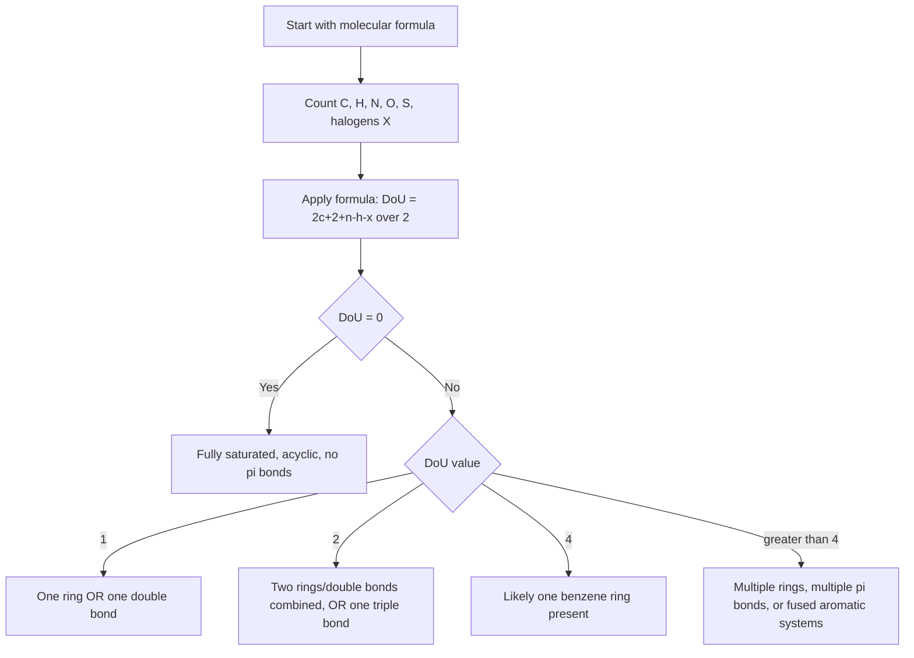

## Degree of Unsaturation

### Overview

The **degree of unsaturation** (DoU), also called the **index of hydrogen deficiency (IHD)** or **degrees of unsaturation index (DBE, "double bond equivalents")**, is a calculation performed directly from a molecular formula that reveals how many rings and/or multiple bonds (π bonds) a molecule must contain, before any structure is drawn. It is one of the most useful diagnostic tools in structure elucidation, since it dramatically narrows the possible structures consistent with a given formula.

### Conceptual Basis

A fully saturated acyclic hydrocarbon with $n$ carbons has the general formula $\text{C}_n\text{H}_{2n+2}$ (an alkane). Every structural feature that reduces the hydrogen count below this saturated maximum corresponds to either:

- **One ring** (formation of a ring removes 2 hydrogens relative to the open-chain saturated formula), or
- **One π bond** (each degree of unsaturation from a double bond removes 2 hydrogens; a triple bond, containing two π bonds, removes 4 hydrogens and thus counts as 2 degrees of unsaturation)

Each "degree of unsaturation" therefore corresponds to the loss of exactly 2 hydrogen atoms relative to the fully saturated acyclic reference formula.

### General Formula for Degree of Unsaturation

For a molecule with the general formula $\text{C}_c\text{H}_h\text{N}_n\text{O}_o\text{X}_x$ (where X represents any halogen: F, Cl, Br, I), the degree of unsaturation is calculated as:

$$\text{DoU} = \frac{2c + 2 + n - h - x}{2}$$

**Key rules embedded in this formula:**

- **Carbon (C):** contributes $2c$ to the numerator (each carbon can theoretically bond to 2 more hydrogens beyond a linear chain reference, reflecting the $2n+2$ saturated hydrocarbon pattern)
- **Hydrogen (H):** subtracted directly, since it is the quantity being compared against the saturated maximum
- **Halogens (X = F, Cl, Br, I):** treated exactly like hydrogen (monovalent, subtracted), since a halogen occupies a bonding position that would otherwise be filled by hydrogen
- **Oxygen (O), Sulfur (S):** **do not appear in the formula at all** — divalent atoms with two single bonds do not change the hydrogen count relative to the saturated hydrocarbon reference (inserting an oxygen into a C–C bond, as in an ether, or into a C–H bond, as in an alcohol, does not change the total hydrogen count)
- **Nitrogen (N) and other trivalent atoms (e.g., P in some contexts):** contribute $+1$ per atom, since a trivalent atom can accommodate one additional hydrogen compared to a divalent atom, effectively raising the saturated reference hydrogen count

### Simplified Formula Without Nitrogen or Halogens

For molecules containing only C, H, and O (a very common case in introductory organic chemistry):

$$\text{DoU} = \frac{2c + 2 - h}{2}$$

### Worked Example 1: Simple Hydrocarbon

**Molecule:** $\text{C}_6\text{H}_{12}$

$$\text{DoU} = \frac{2(6) + 2 - 12}{2} = \frac{12 + 2 - 12}{2} = \frac{2}{2} = 1$$

**Interpretation:** DoU = 1 means the molecule contains exactly one ring OR exactly one double bond (but not both, and no triple bonds). This is consistent with either cyclohexane (1 ring, 0 π bonds) or hex-1-ene (0 rings, 1 π bond) — both share the formula $\text{C}_6\text{H}_{12}$, and DoU alone cannot distinguish between them; additional data (such as reaction with bromine water, or spectroscopic evidence) would be needed.

### Worked Example 2: Molecule with Oxygen

**Molecule:** $\text{C}_4\text{H}_8\text{O}$

$$\text{DoU} = \frac{2(4) + 2 - 8}{2} = \frac{8 + 2 - 8}{2} = \frac{2}{2} = 1$$

**Interpretation:** DoU = 1 is consistent with a ketone (e.g., butan-2-one, $\text{CH}_3\text{COCH}_2\text{CH}_3$), an aldehyde (e.g., butanal), a cyclic ether (e.g., tetrahydrofuran derivatives), or an unsaturated alcohol/ether — the oxygen's presence does not change the DoU calculation, but distinguishing among these structural possibilities requires further data (IR spectroscopy for C=O stretch, NMR, etc.).

### Worked Example 3: Molecule with Nitrogen

**Molecule:** $\text{C}_5\text{H}_{11}\text{N}$

$$\text{DoU} = \frac{2(5) + 2 + 1 - 11}{2} = \frac{10 + 2 + 1 - 11}{2} = \frac{2}{2} = 1$$

**Interpretation:** DoU = 1, consistent with either a ring (e.g., piperidine, a saturated 6-membered ring containing N) or an open-chain amine containing one C=C or C=N double bond.

### Worked Example 4: Molecule with a Halogen

**Molecule:** $\text{C}_3\text{H}_5\text{Cl}$

$$\text{DoU} = \frac{2(3) + 2 - 5 - 1}{2} = \frac{6 + 2 - 5 - 1}{2} = \frac{2}{2} = 1$$

**Interpretation:** DoU = 1, consistent with allyl chloride ($\text{CH}_2=\text{CH–CH}_2\text{Cl}$, one C=C double bond) or a chlorinated cyclopropane (one ring).

### Worked Example 5: Aromatic Ring (High DoU)

**Molecule:** Benzene, $\text{C}_6\text{H}_6$

$$\text{DoU} = \frac{2(6) + 2 - 6}{2} = \frac{12 + 2 - 6}{2} = \frac{8}{2} = 4$$

**Interpretation:** DoU = 4 is the signature value for a single benzene ring, accounting for 1 ring + 3 formal double bonds in the Kekulé structure (1 + 3 = 4). This is a critical diagnostic value: **any molecule containing exactly one unsubstituted or simply-substituted benzene ring contributes 4 degrees of unsaturation**, a pattern worth memorizing for rapid structure elucidation.

### DoU Contribution Reference Table

| Structural Feature | DoU Contribution |
| --- | --- |
| Ring (any size) | 1 |
| C=C double bond | 1 |
| C=O double bond | 1 |
| C≡C triple bond | 2 |
| C≡N triple bond | 2 |
| Benzene ring (monocyclic aromatic) | 4 (1 ring + 3 π bonds) |
| Naphthalene (fused bicyclic aromatic) | 7 |

### Degree of Unsaturation Calculation Flow (Mermaid)

### Degree of Unsaturation Reasoning Diagram (svg_diagram)

<svg xmlns="http://www.w3.org/2000/svg" viewBox="0 0 760 280" font-family="Helvetica, Arial, sans-serif" font-size="12">
<text x="380" y="22" font-size="16" font-weight="bold" text-anchor="middle">DoU = 1: Two Structurally Distinct Possibilities (svg_diagram)</text>

<text x="180" y="55" text-anchor="middle" font-weight="bold">Ring (cyclohexane)</text>

<polygon points="180,90 220,110 220,150 180,170 140,150 140,110" fill="none" stroke="#333" stroke-width="2.5" />

<text x="180" y="200" text-anchor="middle" font-size="11">C₆H₁₂, 1 ring, 0 π bonds</text>

<text x="560" y="55" text-anchor="middle" font-weight="bold">Double bond (hex-1-ene)</text>

<polyline points="460,150 500,120 540,150" fill="none" stroke="#333" stroke-width="2.5" />

<line x1="500" y1="118" x2="540" y2="148" stroke="#333" stroke-width="2.5" transform="translate(0,4)" />

<polyline points="540,150 580,120 620,150 660,120" fill="none" stroke="#333" stroke-width="2.5" />

<text x="560" y="200" text-anchor="middle" font-size="11">C₆H₁₂, 0 rings, 1 π bond</text>

<text x="380" y="250" text-anchor="middle" font-size="12" fill="#555">Both share DoU = 1 and molecular formula C₆H₁₂ — DoU narrows possibilities but does not uniquely determine structure</text>

</svg>

### Practical Application in Structure Elucidation

Degree of unsaturation calculation is typically the **first step** performed after obtaining a molecular formula from mass spectrometry (via molecular ion mass and, ideally, high-resolution exact mass to confirm the formula), before interpreting IR or NMR spectral data. It efficiently rules out entire classes of candidate structures.

**Worked example in a spectroscopy context:** A compound has the molecular formula $\text{C}_8\text{H}_8\text{O}$ (determined by mass spectrometry) and shows a strong IR absorption near $1715\ \text{cm}^{-1}$ (characteristic of C=O stretch).

$$\text{DoU} = \frac{2(8)+2-8}{2} = \frac{16+2-8}{2} = \frac{10}{2} = 5$$

DoU = 5 strongly suggests a benzene ring (accounting for 4 of the 5 degrees) plus one additional C=O (accounting for the remaining 1), consistent with a structure such as acetophenone ($\text{C}_6\text{H}_5\text{COCH}_3$, phenyl methyl ketone) — a conclusion reached by combining the DoU calculation with the IR carbonyl evidence, well before running NMR to confirm connectivity.

### Common Pitfalls in DoU Calculation

- **Forgetting that halogens subtract like hydrogen:** a common error is omitting the $-x$ term or, conversely, treating halogens as if they contributed like nitrogen (adding instead of subtracting)
- **Including oxygen/sulfur in the formula:** since divalent atoms do not change the calculation, mistakenly adding an oxygen term (e.g., $+o$ or $-o$) produces an incorrect result
- **Confusing DoU with the number of individual multiple bonds only:** DoU counts rings and π bonds together as an undifferentiated total; distinguishing between "how many rings" versus "how many double/triple bonds" specifically requires additional structural or spectroscopic evidence beyond the DoU number alone
- **Charged species and formal DoU:** the standard formula assumes a neutral, closed-shell molecule; ions and radicals require adjusted treatment not covered by the basic formula

**Key Points**

- Degree of unsaturation calculates the combined number of rings plus π bonds (double bonds count as 1, triple bonds count as 2) directly from a molecular formula
- Formula: $\text{DoU} = \dfrac{2c + 2 + n - h - x}{2}$, where oxygen and sulfur contribute nothing (divalent, no formula term), nitrogen contributes $+1$ (trivalent), and halogens subtract like hydrogen (monovalent)
- A DoU value of exactly 4 is the classic signature of a single benzene ring (1 ring + 3 formal double bonds)
- DoU narrows structural possibilities dramatically but does not, by itself, uniquely determine a structure — it is typically combined with IR and NMR spectroscopic data during structure elucidation

**Related Topics**

- Mass spectrometry and molecular formula determination
- IR spectroscopy: characteristic functional group absorptions
- NMR spectroscopy fundamentals (¹H and ¹³C)
- Structural isomerism and constitutional isomer enumeration
- Aromaticity and Hückel's rule