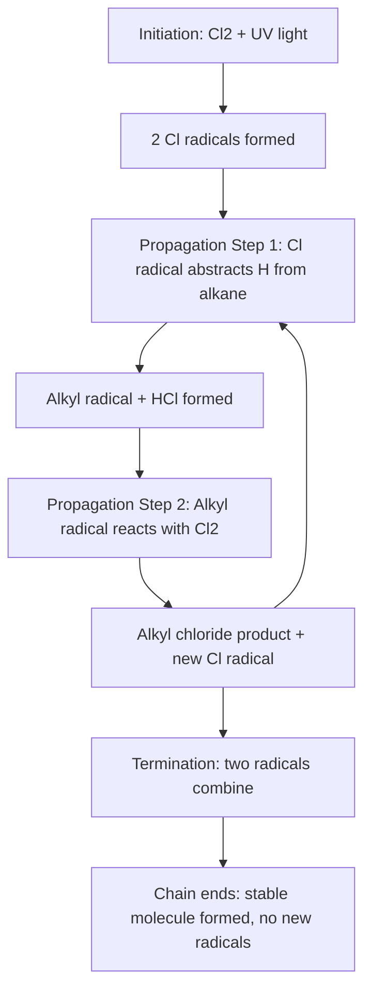

## Alkane Structure, Nomenclature, and Reactions

### Overview

Alkanes are the simplest class of organic compounds, consisting exclusively of carbon and hydrogen joined by single (σ) bonds, with the general formula $\text{C}_n\text{H}_{2n+2}$ for acyclic (open-chain) members. Often called **saturated hydrocarbons** or **paraffins** (from Latin *parum affinis*, "little affinity," reflecting their relatively low reactivity), alkanes serve as the structural and conceptual foundation for all of organic chemistry, since every other class of organic compound can be understood as an alkane skeleton bearing one or more functional groups.

### Structure and Bonding

**Hybridization and geometry**

Every carbon in an alkane is $sp^3$-hybridized, forming four equivalent σ bonds arranged tetrahedrally around each carbon center, with bond angles of approximately $109.5°$. Each σ bond arises from head-on overlap of hybrid orbitals (C–C bonds: $sp^3$–$sp^3$ overlap; C–H bonds: $sp^3$–$1s$ overlap).

**Bond lengths and strengths**

| Bond | Approximate Length (pm) | Approximate Bond Energy (kJ/mol) |
| --- | --- | --- |
| C–C | 154 | 347 |
| C–H | 109 | 413 |

**Free rotation and conformations**

Because all bonds in an alkane are σ bonds, rotation around any C–C bond is relatively unrestricted (though not entirely free — rotational barriers exist due to steric and electronic (torsional/hyperconjugative) effects). This gives rise to **conformational isomers** (conformers), which interconvert rapidly at room temperature without breaking any bonds:

- **Staggered conformation:** substituents on adjacent carbons are maximally separated (60° dihedral angle offsets), minimizing steric and torsional strain — this is the lower-energy, more stable arrangement
- **Eclipsed conformation:** substituents on adjacent carbons are aligned directly opposite one another, maximizing strain — this is the higher-energy, less stable arrangement

For ethane, the energy difference between fully staggered and fully eclipsed conformations is approximately $12$ kJ/mol, attributed primarily to torsional strain from unfavorable orbital interactions in the eclipsed form. [Inference] The relative contributions of steric repulsion versus hyperconjugative/torsional effects to this rotational barrier remain a subject of ongoing discussion in physical organic chemistry, though the net energy difference itself is well-established experimentally.

### Newman Projection Diagram (svg_diagram)

<svg xmlns="http://www.w3.org/2000/svg" viewBox="0 0 700 260" font-family="Helvetica, Arial, sans-serif" font-size="12">
<text x="350" y="22" font-size="16" font-weight="bold" text-anchor="middle">Staggered vs Eclipsed Conformations of Ethane (svg_diagram)</text>

<text x="170" y="55" text-anchor="middle" font-weight="bold">Staggered (lower energy)</text>

<circle cx="170" cy="140" r="55" fill="none" stroke="#333" stroke-width="2" />

<circle cx="170" cy="140" r="4" fill="#333" />

<line x1="170" y1="140" x2="170" y2="90" stroke="#333" stroke-width="2" />

<line x1="170" y1="140" x2="127" y2="165" stroke="#333" stroke-width="2" />

<line x1="170" y1="140" x2="213" y2="165" stroke="#333" stroke-width="2" />

<line x1="170" y1="140" x2="140" y2="105" stroke="`#c0392b`" stroke-width="2" />

<line x1="170" y1="140" x2="200" y2="105" stroke="`#c0392b`" stroke-width="2" />

<line x1="170" y1="140" x2="170" y2="196" stroke="`#c0392b`" stroke-width="2" />

<text x="170" y="230" text-anchor="middle" font-size="11">Front/back bonds offset by 60°</text>

<text x="530" y="55" text-anchor="middle" font-weight="bold">Eclipsed (higher energy)</text>

<circle cx="530" cy="140" r="55" fill="none" stroke="#333" stroke-width="2" />

<circle cx="530" cy="140" r="4" fill="#333" />

<line x1="530" y1="140" x2="530" y2="85" stroke="#333" stroke-width="2" />

<line x1="530" y1="140" x2="482" y2="167" stroke="#333" stroke-width="2" />

<line x1="530" y1="140" x2="578" y2="167" stroke="#333" stroke-width="2" />

<line x1="530" y1="140" x2="530" y2="93" stroke="`#c0392b`" stroke-width="2" stroke-dasharray="4,2" />

<line x1="530" y1="140" x2="490" y2="163" stroke="`#c0392b`" stroke-width="2" stroke-dasharray="4,2" />

<line x1="530" y1="140" x2="570" y2="163" stroke="`#c0392b`" stroke-width="2" stroke-dasharray="4,2" />

<text x="530" y="230" text-anchor="middle" font-size="11">Front/back bonds directly aligned</text>

</svg>

### Nomenclature of Alkanes

Following the general IUPAC framework: identify the longest continuous chain, number it to give substituents the lowest locants, name substituents alphabetically with locants, and append the suffix **-ane**.

**Basic root names (recap):** meth- (1C), eth- (2C), prop- (3C), but- (4C), pent- (5C), hex- (6C), hept- (7C), oct- (8C), non- (9C), dec- (10C)

**Worked example:** Name $\text{CH}_3\text{CH}_2\text{CH(CH}_3\text{)CH}_2\text{CH}(\text{CH}_3\text{)}_2$

1. Longest chain: identify the 6-carbon chain running through the branch points → hexane base
2. Number to give lowest locants to substituents: numbering from the end nearer the branches gives locants {2,4} rather than {3,5}
3. Substituents: methyl at C2, methyl at C4 (two methyl groups → "dimethyl")
4. Name: **2,4-dimethylhexane**

**Common alkyl group names** (used as substituent prefixes):

| Group | Structure | Name |
| --- | --- | --- |
| –CH₃ | Methyl | methyl |
| –CH₂CH₃ | Ethyl | ethyl |
| –CH₂CH₂CH₃ | n-Propyl | propyl |
| –CH(CH₃)₂ | Isopropyl | isopropyl (1-methylethyl) |
| –CH₂CH₂CH₂CH₃ | n-Butyl | butyl |
| –CH(CH₃)CH₂CH₃ | sec-Butyl | sec-butyl |
| –CH₂CH(CH₃)₂ | Isobutyl | isobutyl |
| –C(CH₃)₃ | tert-Butyl | tert-butyl |

**Cycloalkanes**

Ring-closed saturated hydrocarbons follow the general formula $\text{C}_n\text{H}_{2n}$ (one fewer H₂ than the acyclic alkane of the same carbon count, consistent with the ring contributing 1 degree of unsaturation). Named with the prefix **cyclo-**: cyclopropane, cyclobutane, cyclopentane, cyclohexane, etc.

### Physical Properties and Trends

**Boiling point trends**

- **Increases with chain length:** longer chains have greater surface area, increasing van der Waals (London dispersion) forces between molecules
- **Decreases with branching:** branched isomers are more compact and spherical, reducing surface contact area between molecules and therefore weakening intermolecular forces relative to their straight-chain isomers

**Example:** Among the $\text{C}_5\text{H}_{12}$ isomers: n-pentane (bp $36°\text{C}$) > isopentane/2-methylbutane (bp $28°\text{C}$) > neopentane/2,2-dimethylpropane (bp $9.5°\text{C}$), illustrating that increasing branching (and thus decreasing surface area) lowers boiling point despite identical molecular formula and molecular weight.

**Solubility**

Alkanes are nonpolar and are essentially insoluble in water (a polar solvent) but are readily miscible with other nonpolar organic solvents, consistent with the "like dissolves like" principle.

**Density**

Alkanes are generally less dense than water (density $< 1.0\ \text{g/mL}$), which is why petroleum-based hydrocarbon spills float on water surfaces.

### Reactions of Alkanes

Alkanes are relatively unreactive toward most common reagents (acids, bases, oxidizing/reducing agents under mild conditions) because C–C and C–H σ bonds are strong, nonpolar, and lack accessible lone pairs or π electrons for typical polar reaction mechanisms. Their two principal reaction classes both require harsh conditions (heat, light, or strong oxidants).

**Combustion**

Complete combustion of alkanes in excess oxygen produces carbon dioxide and water, releasing substantial energy — the basis of alkanes' major industrial use as fuels.

$$\text{C}_n\text{H}_{2n+2} + \left(\frac{3n+1}{2}\right)\text{O}_2 \rightarrow n\,\text{CO}_2 + (n+1)\,\text{H}_2\text{O} + \text{energy}$$

**Worked example — propane combustion:**

$$\text{C}_3\text{H}_8 + 5\,\text{O}_2 \rightarrow 3\,\text{CO}_2 + 4\,\text{H}_2\text{O}$$

Under conditions of insufficient oxygen (**incomplete combustion**), carbon monoxide (CO) or elemental carbon (soot, C) form instead of, or alongside, CO₂ — a significant practical/safety concern, since CO is a toxic, colorless, odorless gas that binds hemoglobin with much higher affinity than oxygen.

**Free radical halogenation**

Alkanes react with halogens (Cl₂, Br₂) under UV light or heat via a **free radical chain mechanism**, substituting a hydrogen atom with a halogen atom.

**Mechanism (three stages):**

1. **Initiation:** homolytic cleavage of the halogen molecule under UV light generates two halogen radicals

$$\text{Cl}_2 \xrightarrow{h\nu} 2\,\text{Cl}^{\bullet}$$

2. **Propagation (two repeating steps):** a halogen radical abstracts a hydrogen from the alkane, generating an alkyl radical and HX; the alkyl radical then reacts with another halogen molecule, generating the alkyl halide product and regenerating a halogen radical to continue the chain

$$\text{Cl}^{\bullet} + \text{CH}_4 \rightarrow \text{HCl} + {}^{\bullet}\text{CH}_3$$

$${}^{\bullet}\text{CH}_3 + \text{Cl}_2 \rightarrow \text{CH}_3\text{Cl} + \text{Cl}^{\bullet}$$

3. **Termination:** two radicals combine, consuming reactive species without regenerating new radicals, ending that chain sequence

$$\text{Cl}^{\bullet} + {}^{\bullet}\text{CH}_3 \rightarrow \text{CH}_3\text{Cl}$$

$$\text{Cl}^{\bullet} + \text{Cl}^{\bullet} \rightarrow \text{Cl}_2$$

$${}^{\bullet}\text{CH}_3 + {}^{\bullet}\text{CH}_3 \rightarrow \text{CH}_3\text{CH}_3$$

**Selectivity in halogenation:** because the alkyl radical intermediate's stability governs the rate of hydrogen abstraction, halogenation shows a site-selectivity trend related to C–H bond dissociation energy and radical stability: tertiary C–H bonds are abstracted preferentially over secondary, which are preferred over primary (tertiary radical > secondary radical > primary radical in stability, due to greater hyperconjugation and inductive electron donation from adjacent alkyl groups).

[Inference] Bromination shows substantially higher selectivity for tertiary over primary C–H bonds compared to chlorination, a difference generally attributed to the later, more radical-like (and thus more selective) transition state in the hydrogen-abstraction step for the less reactive bromine radical, following the reactivity-selectivity principle.

### Free Radical Halogenation Mechanism (Mermaid)

### Cracking (Industrial Reaction)

Long-chain alkanes (from petroleum fractional distillation) can be broken into shorter, more commercially valuable chains via **cracking**, typically producing a mixture of smaller alkanes and alkenes.

- **Thermal cracking:** high temperature and pressure, proceeds via a free-radical mechanism, tends to produce more terminal alkenes
- **Catalytic cracking:** uses zeolite or similar acidic catalysts at lower temperatures, proceeds via carbocation intermediates, tends to produce more branched products valuable for high-octane fuel

**Example:** $\text{C}_{10}\text{H}_{22} \rightarrow \text{C}_5\text{H}_{12} + \text{C}_5\text{H}_{10}$ (decane cracked into pentane and pentene)

### Alkane Reactivity Decision Diagram (svg_diagram)

<svg xmlns="http://www.w3.org/2000/svg" viewBox="0 0 760 260" font-family="Helvetica, Arial, sans-serif" font-size="12">
<text x="380" y="22" font-size="16" font-weight="bold" text-anchor="middle">Why Alkanes Resist Typical Polar Reagents (svg_diagram)</text>
<rect x="40" y="60" width="200" height="60" rx="6" fill="#eaf2f8" stroke="#333" />
<text x="140" y="83" text-anchor="middle">C-C and C-H bonds</text>
<text x="140" y="101" text-anchor="middle">Nonpolar, low bond dipole</text>
<rect x="290" y="60" width="200" height="60" rx="6" fill="#eaf2f8" stroke="#333" />
<text x="390" y="83" text-anchor="middle">No lone pairs or π bonds</text>
<text x="390" y="101" text-anchor="middle">No site for nucleophile/electrophile attack</text>
<rect x="540" y="60" width="200" height="60" rx="6" fill="#fadbd8" stroke="#333" />
<text x="640" y="83" text-anchor="middle">Result: chemically inert</text>
<text x="640" y="101" text-anchor="middle">toward acids, bases, most oxidants</text>
<line x1="240" y1="90" x2="290" y2="90" stroke="#333" stroke-width="2" marker-end="url(#arrowhead)" />
<line x1="490" y1="90" x2="540" y2="90" stroke="#333" stroke-width="2" marker-end="url(#arrowhead)" />
<rect x="180" y="160" width="400" height="70" rx="6" fill="#fdebd0" stroke="#333" />
<text x="380" y="185" text-anchor="middle" font-weight="bold">Reactivity requires forcing conditions:</text>
<text x="380" y="205" text-anchor="middle">UV light/heat (radical halogenation), or</text>
<text x="380" y="222" text-anchor="middle">high-temp combustion / catalytic cracking</text>
</svg>

**Key Points**

- Alkanes are fully saturated hydrocarbons ($\text{C}_n\text{H}_{2n+2}$ acyclic, $\text{C}_n\text{H}_{2n}$ cyclic) composed entirely of nonpolar $sp^3$ σ-bonded carbon and hydrogen
- Free rotation around C–C bonds produces conformational isomers (staggered lower energy, eclipsed higher energy) that interconvert without bond breaking
- Boiling point increases with chain length (more surface area, stronger London dispersion forces) and decreases with branching (more compact, less surface contact)
- The two principal alkane reactions — combustion and free radical halogenation — both require forcing conditions (flame/heat or UV light) since alkanes lack polar bonds, lone pairs, or π systems for typical reagent attack
- Radical halogenation proceeds via initiation, propagation, and termination steps, with site selectivity governed by relative radical stability (tertiary > secondary > primary)

**Related Topics**

- Alkenes and alkynes: structure, nomenclature, and addition reactions
- Free radical mechanisms and chain reactions in depth
- Petroleum refining: fractional distillation and cracking
- Conformational analysis: Newman projections and cyclohexane chair conformations
- Combustion thermochemistry and enthalpy calculations