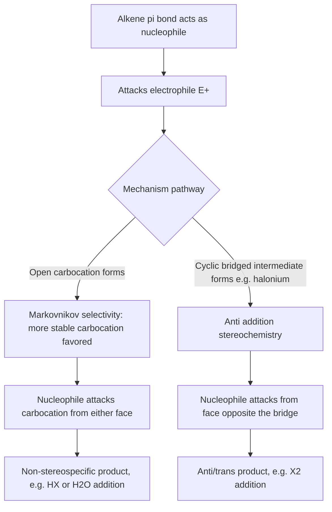

## Alkene Structure, Nomenclature, and Addition Reactions

### Overview

Alkenes are unsaturated hydrocarbons containing at least one carbon-carbon double bond (C=C), with the general formula $\text{C}_n\text{H}_{2n}$ for acyclic compounds with one double bond. The presence of the π bond fundamentally distinguishes alkene reactivity from alkanes: the exposed, relatively loosely held π electrons act as a nucleophile, making alkenes reactive toward electrophiles through characteristic **addition reactions** that convert the double bond into two new single bonds.

### Structure and Bonding

**Hybridization and geometry**

Each carbon of a C=C double bond is $sp^2$-hybridized, with three $sp^2$ hybrid orbitals arranged in a trigonal planar geometry (bond angles $\approx 120°$) and one unhybridized $p$ orbital perpendicular to this plane.

- **σ bond:** formed by direct end-on overlap of one $sp^2$ hybrid orbital from each carbon, along the internuclear axis
- **π bond:** formed by sideways (lateral) overlap of the unhybridized $p$ orbitals above and below the plane of the σ framework

**Consequence of π bonding: restricted rotation**

Unlike the free rotation possible around C–C σ bonds in alkanes, rotation around a C=C double bond is highly restricted, since rotating one carbon relative to the other would require breaking the π overlap. This restricted rotation is the structural origin of geometric (cis/trans, E/Z) isomerism.

**Bond length and strength comparison**

| Bond | Approximate Length (pm) | Approximate Bond Energy (kJ/mol) |
| --- | --- | --- |
| C–C (single) | 154 | 347 |
| C=C (double) | 134 | 611 |

Note that the C=C bond is shorter and stronger than a C–C single bond overall, but the π component alone (bond energy of the double bond minus the σ component, roughly $611 - 347 \approx 264$ kJ/mol) is weaker than a typical σ bond, making the π bond the more reactive, more easily broken component in addition reactions.

### Alkene sp2 Orbital Diagram (svg_diagram)

<svg xmlns="http://www.w3.org/2000/svg" viewBox="0 0 700 260" font-family="Helvetica, Arial, sans-serif" font-size="12">
<text x="350" y="22" font-size="16" font-weight="bold" text-anchor="middle">Sigma and Pi Bonding in Ethylene (svg_diagram)</text>
<circle cx="270" cy="140" r="10" fill="#333" />
<circle cx="430" cy="140" r="10" fill="#333" />
<line x1="280" y1="140" x2="420" y2="140" stroke="#2980b9" stroke-width="4" />
<text x="350" y="130" text-anchor="middle" fill="#2980b9" font-size="11">σ bond (sp²-sp² overlap)</text>
<ellipse cx="350" cy="100" rx="90" ry="18" fill="none" stroke="#c0392b" stroke-width="2.5" />
<ellipse cx="350" cy="180" rx="90" ry="18" fill="none" stroke="#c0392b" stroke-width="2.5" stroke-dasharray="4,3" />
<text x="350" y="220" text-anchor="middle" fill="#c0392b" font-size="11">π bond (p-orbital lateral overlap, above and below plane)</text>
<line x1="270" y1="140" x2="220" y2="110" stroke="#333" stroke-width="2" />
<line x1="270" y1="140" x2="220" y2="170" stroke="#333" stroke-width="2" />
<line x1="430" y1="140" x2="480" y2="110" stroke="#333" stroke-width="2" />
<line x1="430" y1="140" x2="480" y2="170" stroke="#333" stroke-width="2" />
<text x="220" y="100" text-anchor="middle" font-size="10">H</text>
<text x="220" y="185" text-anchor="middle" font-size="10">H</text>
<text x="480" y="100" text-anchor="middle" font-size="10">H</text>
<text x="480" y="185" text-anchor="middle" font-size="10">H</text>
</svg>

### Nomenclature of Alkenes

Following the general IUPAC framework, the suffix changes from -ane to **-ene**, and a locant indicating the lower-numbered carbon of the double bond is required (except when there is no ambiguity, as in ethene or propene).

**Numbering rule:** the parent chain is numbered to give the double bond the lowest possible locant, taking priority over substituent locants (unless a higher-seniority functional group is present, in which case that group takes numbering priority instead).

**Worked example:** Name $\text{CH}_3\text{CH}_2\text{CH}=\text{CH–CH}(\text{CH}_3\text{)CH}_3$

1. Longest chain containing the double bond: 6 carbons → hexene base
2. Number from the end giving the lower locant to the double bond: numbering from the right gives the double bond at C3 (counting: C1=CH₃ branch carbon... ), numbering from the left gives it at C3 as well in this specific case — apply the tie-breaker of lowest locant to the substituent (methyl), which favors numbering from the right
3. Name: **4-methylhex-2-ene** (or 4-methyl-2-hexene in older format)

**Multiple double bonds:** dienes, trienes, etc., each double bond requiring its own locant, e.g., **buta-1,3-diene** ($\text{CH}_2=\text{CH–CH}=\text{CH}_2$)

**Cycloalkenes:** the ring carbons bearing the double bond are conventionally numbered C1 and C2, e.g., **cyclohexene**

### Relative Stability of Alkenes

Alkene stability increases with the degree of substitution on the double bond (more alkyl groups attached to the sp² carbons), following the general order:

$$\text{tetrasubstituted} > \text{trisubstituted} > \text{disubstituted} \gtrsim \text{cis-disubstituted} > \text{monosubstituted}$$

This trend is explained by **hyperconjugation** (donation of electron density from adjacent C–H σ bonds into the empty π* orbital, stabilizing the alkene) and is experimentally confirmed by **heat of hydrogenation** data: more stable (more substituted) alkenes release *less* heat upon hydrogenation to the corresponding alkane, since they start from a lower-energy state.

**Example:** Comparing but-1-ene, cis-but-2-ene, and trans-but-2-ene (all $\text{C}_4\text{H}_8$, hydrogenating to butane):

- But-1-ene (monosubstituted): highest heat of hydrogenation (least stable alkene)
- cis-But-2-ene (disubstituted, cis): intermediate
- trans-But-2-ene (disubstituted, trans): lowest heat of hydrogenation among these three (most stable), since trans isomers generally experience less steric strain between substituents than cis isomers

### Addition Reactions: General Mechanism Pattern

The characteristic reactivity of alkenes is **electrophilic addition**: the electron-rich π bond attacks an electrophile, and the double bond is converted into two new σ bonds, with the two atoms of the added reagent ending up on the two former alkene carbons.

$$\text{C=C} + \text{E–Nu} \rightarrow \text{E–C–C–Nu}$$

### Hydrohalogenation (Addition of HX)

Alkenes react with hydrogen halides (HCl, HBr, HI) via a two-step electrophilic addition mechanism:

1. **Step 1:** the π bond attacks the electrophilic hydrogen of H–X, forming a carbocation intermediate and releasing $\text{X}^-$
2. **Step 2:** the halide ion (nucleophile) attacks the carbocation, forming the C–X bond

**Markovnikov's rule:** in unsymmetrical alkenes, the hydrogen adds to the carbon that already bears more hydrogens (equivalently, the halide ends up on the more substituted carbon), because the reaction proceeds through the **more stable carbocation intermediate** (tertiary > secondary > primary in stability, due to greater hyperconjugation and inductive stabilization from adjacent alkyl groups).

**Worked example:** $\text{CH}_3\text{–CH=CH}_2$ (propene) + HBr

- Protonation occurs at C1 (the terminal, less substituted carbon), generating the more stable secondary carbocation at C2
- Bromide then attacks C2

$$\text{CH}_3\text{–CH=CH}_2 + \text{HBr} \rightarrow \text{CH}_3\text{–CHBr–CH}_3 \quad \text{(2-bromopropane, Markovnikov product)}$$

The alternative, anti-Markovnikov product (1-bromopropane) would require formation of the less stable primary carbocation and is therefore the minor product under standard ionic conditions.

**Anti-Markovnikov addition via radical mechanism:** in the presence of peroxides, HBr specifically (not HCl or HI, due to specific bond energetics) adds via a radical chain mechanism instead, reversing the regiochemical outcome and placing Br on the less substituted carbon — a reaction sequence historically known as the "peroxide effect."

### Hydration (Addition of H₂O)

**Acid-catalyzed hydration** proceeds through the same carbocation mechanism as hydrohalogenation (using $\text{H}_3\text{O}^+$ as the electrophile source), also following Markovnikov selectivity, and is reversible with dehydration (the reverse reaction, favored at high temperature/low water concentration, following Le Chatelier's principle).

$$\text{CH}_2=\text{CH}_2 + \text{H}_2\text{O} \xrightarrow{\text{H}^+ \text{ catalyst}} \text{CH}_3\text{CH}_2\text{OH}$$

**Oxymercuration-demercuration** is a common alternative laboratory method that also gives Markovnikov selectivity but proceeds through a cyclic mercurinium ion (avoiding a fully free carbocation), which minimizes competing carbocation rearrangements.

**Hydroboration-oxidation** provides the complementary **anti-Markovnikov** and **syn-addition** outcome, proceeding through a concerted, non-carbocation four-centered transition state where boron adds to the less hindered (less substituted) carbon due to steric factors, and the overall process delivers H and OH to the same face of the former double bond.

### Halogenation (Addition of X₂)

Alkenes react with molecular halogens (Br₂, Cl₂) to form vicinal dihalides, proceeding through a cyclic **halonium ion** intermediate rather than a simple open carbocation.

$$\text{CH}_2=\text{CH}_2 + \text{Br}_2 \rightarrow \text{BrCH}_2\text{–CH}_2\text{Br}$$

**Stereochemical consequence — anti addition:** because the halonium ion bridges both carbons on one face, the nucleophile (halide) must attack from the opposite face in the second step, resulting in **anti (trans) stereochemistry** in the product — a mechanistically diagnostic result distinguishable from the syn addition seen in catalytic hydrogenation.

**Bromine water test:** addition of bromine water (Br₂/H₂O) to an alkene causes rapid decolorization (from orange/brown to colorless) as the bromine adds across the double bond, serving as a classic qualitative test to distinguish alkenes from alkanes.

### Catalytic Hydrogenation (Addition of H₂)

In the presence of a metal catalyst (commonly Pt, Pd, or Ni), alkenes add H₂ across the double bond to form the saturated alkane.

$$\text{CH}_2=\text{CH}_2 + \text{H}_2 \xrightarrow{\text{Pt, Pd, or Ni catalyst}} \text{CH}_3\text{CH}_3$$

**Mechanism note:** unlike the ionic mechanisms above, hydrogenation proceeds on the catalyst's metal surface, where both hydrogen atoms are delivered to the same face of the alkene (**syn addition**), a stereochemical outcome directly contrasting with the anti addition seen in halogenation.

### Comparison of Addition Reaction Stereochemistry and Selectivity

| Reaction | Reagent | Mechanism Type | Regiochemistry | Stereochemistry |
| --- | --- | --- | --- | --- |
| Hydrohalogenation | HX | Carbocation | Markovnikov | Not stereospecific (racemic at new stereocenter) |
| Acid-catalyzed hydration | H₂O/H⁺ | Carbocation | Markovnikov | Not stereospecific |
| Hydroboration-oxidation | BH₃ then H₂O₂/OH⁻ | Concerted, 4-centered | Anti-Markovnikov | Syn addition |
| Halogenation | X₂ | Halonium ion | N/A (symmetric reagent) | Anti addition |
| Catalytic hydrogenation | H₂/metal catalyst | Surface-mediated | N/A (symmetric reagent) | Syn addition |

### Electrophilic Addition Mechanism Flow (Mermaid)

### Markovnikov Addition Diagram (svg_diagram)

<svg xmlns="http://www.w3.org/2000/svg" viewBox="0 0 760 260" font-family="Helvetica, Arial, sans-serif" font-size="12">
<text x="380" y="22" font-size="16" font-weight="bold" text-anchor="middle">Markovnikov Addition of HBr to Propene (svg_diagram)</text>

<text x="130" y="60" text-anchor="middle" font-weight="bold">Step 1: Protonation</text>

<polyline points="60,120 100,90 140,120" fill="none" stroke="#333" stroke-width="2.5" />

<line x1="100" y1="88" x2="140" y2="118" stroke="#333" stroke-width="2.5" transform="translate(0,4)" />

<text x="60" y="140" text-anchor="middle" font-size="10">CH₃</text>

<text x="180" y="95" text-anchor="middle" fill="`#c0392b`">H⁺ attacks C1</text>

<line x1="145" y1="115" x2="175" y2="100" stroke="`#c0392b`" stroke-width="1.5" marker-end="url(#arrow)" />

<text x="130" y="180" text-anchor="middle" font-size="11">→ forms 2° carbocation at C2</text>

<text x="530" y="60" text-anchor="middle" font-weight="bold">Step 2: Br⁻ attacks</text>

<circle cx="480" cy="120" r="8" fill="#eee" stroke="#333" />

<text x="480" y="124" text-anchor="middle" font-size="9">C1</text>

<circle cx="530" cy="120" r="8" fill="`#f9e79f`" stroke="`#c0392b`" />

<text x="530" y="124" text-anchor="middle" font-size="9">C2+</text>

<circle cx="580" cy="120" r="8" fill="#eee" stroke="#333" />

<text x="580" y="124" text-anchor="middle" font-size="9">C3</text>

<line x1="488" y1="120" x2="522" y2="120" stroke="#333" stroke-width="2" />

<line x1="538" y1="120" x2="572" y2="120" stroke="#333" stroke-width="2" />

<line x1="620" y1="100" x2="538" y2="115" stroke="`#2980b9`" stroke-width="1.5" marker-end="url(#arrow)" />

<text x="630" y="95" text-anchor="middle" fill="`#2980b9`" font-size="11">Br⁻</text>

<text x="530" y="180" text-anchor="middle" font-size="11">→ Br bonds to more substituted C2</text>

<text x="380" y="230" text-anchor="middle" font-size="12" fill="#555">Product: 2-bromopropane (Br on the more substituted carbon)</text>

</svg>

### Alkene Diagnostic Tests

- **Bromine water:** rapid decolorization (orange/brown → colorless) confirms C=C or C≡C unsaturation
- **Baeyer's test (dilute cold $\text{KMnO}_4$):** purple permanganate is decolorized (or forms a brown $\text{MnO}_2$ precipitate) as the alkene is oxidized to a vicinal diol, another classic unsaturation test

**Key Points**

- Alkenes contain an $sp^2$-hybridized C=C double bond composed of one σ bond (end-on orbital overlap) and one π bond (lateral p-orbital overlap), the latter being the reactive site
- Restricted rotation around the double bond is the structural basis for cis/trans (E/Z) geometric isomerism
- Alkene stability increases with substitution (tetrasubstituted > trisubstituted > disubstituted > monosubstituted), confirmed experimentally via heats of hydrogenation
- Markovnikov's rule (H adds to the carbon with more H's already; the electrophile's other component ends up on the more substituted carbon) reflects the greater stability of more-substituted carbocation intermediates
- Different addition reactions proceed through distinct intermediates (open carbocation vs. bridged halonium ion vs. surface-mediated) producing different regiochemical and stereochemical outcomes (Markovnikov vs. anti-Markovnikov; syn vs. anti addition)

**Related Topics**

- Alkyne structure, nomenclature, and addition reactions
- Carbocation stability and rearrangements (hydride/alkyl shifts)
- Hydroboration-oxidation mechanism in depth
- Geometric (cis/trans, E/Z) isomerism
- Polymerization of alkenes (addition polymers)
- Oxidative cleavage of alkenes (ozonolysis)