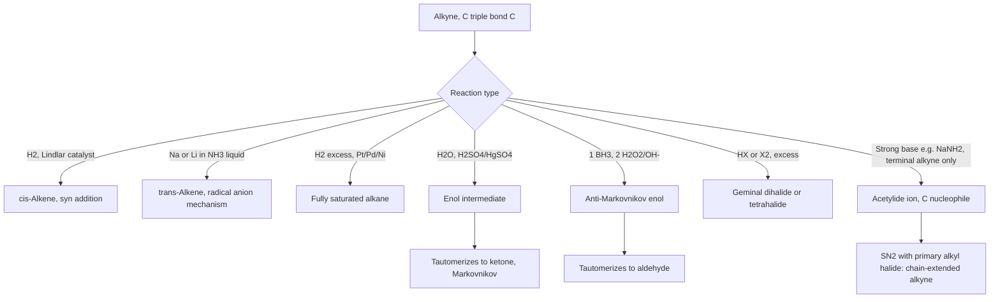

## Alkyne Structure, Nomenclature, and Reactions

### Overview

Alkynes are unsaturated hydrocarbons containing at least one carbon-carbon triple bond (C≡C), with the general formula $\text{C}_n\text{H}_{2n-2}$ for acyclic compounds with one triple bond. The triple bond consists of one σ bond and two mutually perpendicular π bonds, making alkynes even more unsaturated than alkenes (2 degrees of unsaturation per triple bond) and giving rise to distinctive linear geometry, unique acidity at terminal positions, and characteristic addition chemistry.

### Structure and Bonding

**Hybridization and geometry**

Each carbon of a C≡C triple bond is $sp$-hybridized, with two $sp$ hybrid orbitals arranged linearly (bond angle $180°$) and two unhybridized $p$ orbitals oriented perpendicular to each other and to the hybrid orbital axis.

- **One σ bond:** formed by direct end-on overlap of one $sp$ hybrid orbital from each carbon
- **Two π bonds:** formed by two separate sideways overlaps of the two perpendicular sets of unhybridized $p$ orbitals, creating a cylindrically symmetric electron density distribution around the internuclear axis when both π bonds are considered together

**Bond length and strength comparison**

| Bond | Approximate Length (pm) | Approximate Bond Energy (kJ/mol) |
| --- | --- | --- |
| C–C (single) | 154 | 347 |
| C=C (double) | 134 | 611 |
| C≡C (triple) | 120 | 837 |

The triple bond is the shortest and strongest of the three, though — as with the alkene π bond — the individual π components are each weaker than the σ bond, making them the reactive sites for addition chemistry.

### Alkyne Linear Geometry and Orbital Diagram (svg_diagram)

<svg xmlns="http://www.w3.org/2000/svg" viewBox="0 0 700 260" font-family="Helvetica, Arial, sans-serif" font-size="12">
<text x="350" y="22" font-size="16" font-weight="bold" text-anchor="middle">Sigma and Two Pi Bonds in Acetylene (svg_diagram)</text>
<circle cx="270" cy="140" r="10" fill="#333" />
<circle cx="430" cy="140" r="10" fill="#333" />
<line x1="280" y1="140" x2="420" y2="140" stroke="#2980b9" stroke-width="4" />
<text x="350" y="128" text-anchor="middle" fill="#2980b9" font-size="11">σ bond (sp-sp overlap)</text>
<ellipse cx="350" cy="100" rx="90" ry="16" fill="none" stroke="#c0392b" stroke-width="2.5" />
<ellipse cx="350" cy="180" rx="90" ry="16" fill="none" stroke="#c0392b" stroke-width="2.5" stroke-dasharray="4,3" />
<text x="350" y="215" text-anchor="middle" fill="#c0392b" font-size="11">π bond #1 (vertical plane)</text>
<ellipse cx="350" cy="140" rx="16" ry="90" fill="none" stroke="#27ae60" stroke-width="2" stroke-dasharray="2,3" />
<text x="450" y="235" text-anchor="middle" fill="#27ae60" font-size="11">π bond #2 (horizontal plane, perpendicular to π bond #1)</text>
<line x1="270" y1="140" x2="220" y2="140" stroke="#333" stroke-width="2" />
<line x1="430" y1="140" x2="480" y2="140" stroke="#333" stroke-width="2" />
<text x="210" y="145" text-anchor="middle" font-size="10">H</text>
<text x="490" y="145" text-anchor="middle" font-size="10">H</text>
</svg>

### Nomenclature of Alkynes

Following the general IUPAC framework, the suffix changes from -ane to **-yne**, with the numbering rule giving the lowest locant to the triple bond (subject to the same seniority priority as alkenes if a higher-ranking functional group is present).

**Worked example:** Name $\text{CH}_3\text{C}\equiv\text{CCH}_2\text{CH}_3$

1. Longest chain containing the triple bond: 5 carbons → pentyne base
2. Numbering: from the left, triple bond spans C2–C3 (locant 2); from the right, it would span C3–C4 (locant 3). Lowest locant rule selects numbering from the left.
3. Name: **pent-2-yne**

**Terminal vs. internal alkynes:** a **terminal alkyne** has the triple bond at the end of the chain (C≡C–H, bearing an acidic terminal hydrogen), while an **internal alkyne** has the triple bond located between two carbon substituents (no triple-bond-adjacent H).

**Example — terminal alkyne:** pent-1-yne, $\text{HC}\equiv\text{C–CH}_2\text{CH}_2\text{CH}_3$

**Example — internal alkyne:** pent-2-yne, $\text{CH}_3\text{–C}\equiv\text{C–CH}_2\text{CH}_3$

**Compounds with multiple unsaturations:** when both double and triple bonds are present, the suffix combines as **-en-yne** (or **-yn-ene**, depending on convention/software, though "-en-yne" combining both locants is the standard IUPAC approach), with the double bond generally cited before the triple bond in the combined suffix, and numbering chosen to give the lowest locant set to the unsaturations as a whole (with the double bond receiving priority in case of a tie, under current IUPAC recommendations).

### Acidity of Terminal Alkynes

Terminal alkynes possess a uniquely acidic C–H bond (approximate $pK_a \approx 25$) compared to alkenes ($pK_a \approx 44$) and alkanes ($pK_a \approx 50$). This acidity arises from the **hybridization of the carbon bearing the hydrogen**:

$$\text{Percent s-character: } sp \, (50\%) > sp^2 \, (33\%) > sp^3 \, (25\%)$$

Greater s-character means the bonding (and resulting lone pair, after deprotonation) electron density is held closer to the nucleus, stabilizing the resulting carbanion (acetylide anion) and making the conjugate acid more acidic.

| Hybridization | Example C–H | Approximate $pK_a$ |
| --- | --- | --- |
| $sp^3$ | Ethane | ~50 |
| $sp^2$ | Ethylene | ~44 |
| $sp$ | Acetylene | ~25 |

**Deprotonation to form acetylides:** strong bases such as sodium amide ($\text{NaNH}_2$) or organolithium reagents can deprotonate terminal alkynes to form **acetylide ions**, which are useful carbon nucleophiles in synthesis:

$$\text{R–C}\equiv\text{C–H} + \text{NaNH}_2 \rightarrow \text{R–C}\equiv\text{C:}^-\text{Na}^+ + \text{NH}_3$$

**Synthetic application:** acetylide ions act as strong nucleophiles in $S_N2$ reactions with primary alkyl halides, forming a new C–C bond and extending the carbon chain — a classic method for alkyne chain elongation:

$$\text{R–C}\equiv\text{C:}^-\text{Na}^+ + \text{R'–CH}_2\text{–Br} \rightarrow \text{R–C}\equiv\text{C–CH}_2\text{–R'} + \text{NaBr}$$

### Addition Reactions of Alkynes

Because alkynes contain two π bonds, they can undergo **sequential addition**: one equivalent of reagent adds across one π bond to form an alkene intermediate, and (if excess reagent is present) a second equivalent adds across the remaining π bond to reach the fully saturated product.

**Hydrohalogenation (Markovnikov addition of HX)**

Follows the same carbocation-based mechanism logic as alkenes; with excess HX, both equivalents add with Markovnikov regiochemistry, placing both halogens on the same (more substituted) carbon (a **geminal dihalide**).

$$\text{CH}_3\text{–C}\equiv\text{CH} + \text{HBr} \rightarrow \text{CH}_3\text{–CBr=CH}_2 \xrightarrow{\text{HBr (excess)}} \text{CH}_3\text{–CBr}_2\text{–CH}_3$$

**Halogenation (addition of X₂)**

Analogous to alkene halogenation via a bridged halonium-type intermediate; with excess halogen, both π bonds react to give a **tetrahalide**.

$$\text{HC}\equiv\text{CH} + 2\,\text{Br}_2 \rightarrow \text{CHBr}_2\text{–CHBr}_2$$

**Hydration (Markovnikov, via mercury catalysis)**

Acid-catalyzed hydration of alkynes (typically using $\text{H}_2\text{SO}_4$/$\text{HgSO}_4$ as catalyst) proceeds through an unstable **enol** intermediate, which rapidly tautomerizes to the more stable carbonyl (keto) form — this is the primary industrial/laboratory route from alkynes to ketones (or, for terminal alkynes, methyl ketones specifically, following Markovnikov addition of water to the more substituted carbon).

$$\text{CH}_3\text{–C}\equiv\text{CH} + \text{H}_2\text{O} \xrightarrow{\text{H}_2\text{SO}_4, \text{HgSO}_4} \left[\text{CH}_3\text{–C(OH)=CH}_2\right] \xrightarrow{\text{tautomerization}} \text{CH}_3\text{–CO–CH}_3$$

**Keto-enol tautomerization** is governed by the general equilibrium:

$$\text{C=C–OH (enol)} \rightleftharpoons \text{C–C=O (keto)}$$

with the keto form overwhelmingly favored at equilibrium for most simple systems due to the greater strength of the C=O π bond relative to the C=C π bond of the enol.

**Anti-Markovnikov hydration (hydroboration-oxidation)**

Analogous to the alkene case, hydroboration-oxidation of a terminal alkyne delivers the anti-Markovnikov product: the boron (and subsequently the OH after oxidation) adds to the less substituted, terminal carbon, and the resulting enol tautomerizes to an **aldehyde** rather than a ketone — a useful complementary regiochemical outcome to the mercury-catalyzed method.

$$\text{R–C}\equiv\text{CH} \xrightarrow{\text{1) BH}_3\text{; 2) H}_2\text{O}_2\text{, OH}^-} \left[\text{R–CH=CH–OH}\right] \xrightarrow{\text{tautomerization}} \text{R–CH}_2\text{–CHO}$$

### Reduction of Alkynes

**Full reduction (catalytic hydrogenation)**

Using standard heterogeneous catalysts (Pt, Pd, Ni), alkynes are fully reduced to alkanes, with both π bonds hydrogenated sequentially and typically no way to stop cleanly at the alkene stage.

$$\text{R–C}\equiv\text{C–R'} + 2\,\text{H}_2 \xrightarrow{\text{Pt, Pd, or Ni}} \text{R–CH}_2\text{–CH}_2\text{–R'}$$

**Partial reduction to the alkene: Lindlar's catalyst**

A poisoned/deactivated palladium catalyst (Pd deposited on $\text{CaCO}_3$, treated with lead acetate and quinoline) allows the reaction to be stopped cleanly at the alkene stage, producing the **cis (Z)-alkene** specifically via syn addition of both hydrogens to the same face of the triple bond.

$$\text{R–C}\equiv\text{C–R'} + \text{H}_2 \xrightarrow{\text{Lindlar's catalyst}} \text{cis-R–CH=CH–R'}$$

**Partial reduction to the trans-alkene: dissolving metal reduction**

Using sodium or lithium metal dissolved in liquid ammonia ($\text{Na/NH}_3(l)$), alkynes are reduced via a radical-anion mechanism to give the **trans (E)-alkene** selectively, providing the complementary stereochemical outcome to Lindlar's catalyst.

$$\text{R–C}\equiv\text{C–R'} \xrightarrow{\text{Na, NH}_3(l)} \text{trans-R–CH=CH–R'}$$

### Comparison of Alkyne Reduction Methods

| Method | Reagent | Product Alkene Geometry |
| --- | --- | --- |
| Full hydrogenation | H₂, Pt/Pd/Ni | N/A — goes fully to alkane |
| Lindlar's catalyst | H₂, Pd/CaCO₃ (poisoned), quinoline | cis (Z)-alkene |
| Dissolving metal reduction | Na or Li, NH₃(l) | trans (E)-alkene |

### Alkyne Reaction Pathway Overview (Mermaid)

### Keto-Enol Tautomerization Diagram (svg_diagram)

<svg xmlns="http://www.w3.org/2000/svg" viewBox="0 0 700 220" font-family="Helvetica, Arial, sans-serif" font-size="12">
<text x="350" y="22" font-size="16" font-weight="bold" text-anchor="middle">Enol to Keto Tautomerization (svg_diagram)</text>

<text x="150" y="90" text-anchor="middle" font-weight="bold">Enol form (unstable)</text>

<polyline points="80,140 130,110 180,140" fill="none" stroke="#333" stroke-width="2.5" />

<line x1="130" y1="108" x2="180" y2="138" stroke="#333" stroke-width="2.5" transform="translate(0,4)" />

<line x1="80" y1="140" x2="40" y2="110" stroke="`#c0392b`" stroke-width="2" />

<text x="30" y="98" text-anchor="middle" fill="`#c0392b`">OH</text>

<line x1="230" y1="130" x2="280" y2="130" stroke="#333" stroke-width="2" marker-end="url(#arrow)" />
<text x="255" y="120" text-anchor="middle" font-size="11">tautomerize</text>

<text x="480" y="90" text-anchor="middle" font-weight="bold">Keto form (stable, favored)</text>

<line x1="400" y1="140" x2="450" y2="140" stroke="#333" stroke-width="2.5" />

<line x1="450" y1="140" x2="500" y2="140" stroke="#333" stroke-width="2.5" />

<line x1="450" y1="138" x2="450" y2="105" stroke="`#c0392b`" stroke-width="2.5" />

<line x1="456" y1="138" x2="456" y2="105" stroke="`#c0392b`" stroke-width="2.5" />

<text x="450" y="95" text-anchor="middle" fill="`#c0392b`">O</text>

<text x="350" y="195" text-anchor="middle" font-size="11" fill="#555">Equilibrium strongly favors keto form: stronger C=O π bond vs. weaker C=C π bond of enol</text>

</svg>

**Key Points**

- Alkynes contain an $sp$-hybridized C≡C triple bond (one σ bond + two perpendicular π bonds), giving linear geometry and the shortest, strongest carbon-carbon bond among the three hydrocarbon classes
- Terminal alkyne C–H bonds are uniquely acidic ($pK_a \approx 25$) due to high $sp$ s-character, allowing deprotonation to synthetically useful acetylide nucleophiles
- Because two π bonds are present, alkynes can undergo sequential addition with excess reagent (HX, X₂) to reach fully saturated dihalide/tetrahalide products
- Mercury-catalyzed hydration gives Markovnikov ketones (via unstable enol intermediates that tautomerize); hydroboration-oxidation gives the complementary anti-Markovnikov aldehyde product
- Lindlar's catalyst (poisoned Pd) gives syn addition to the cis-alkene; dissolving metal reduction (Na/NH₃) gives the complementary trans-alkene — these two methods together allow selective, stereocontrolled partial reduction of alkynes

**Related Topics**

- Alkene structure, nomenclature, and addition reactions
- Keto-enol tautomerism and enolate chemistry
- Carbanion and acetylide chemistry in synthesis
- Degree of unsaturation calculations
- Retrosynthetic analysis using alkyne chain-extension reactions