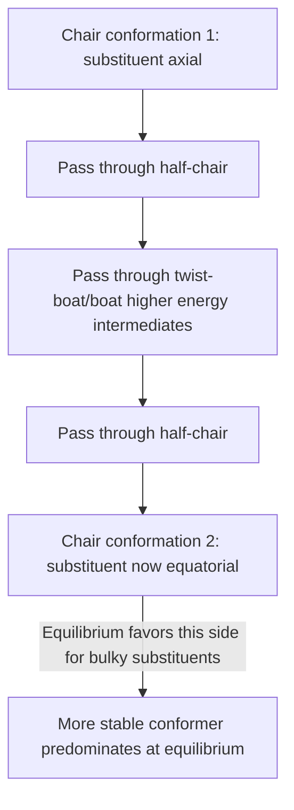

## Cycloalkanes and Ring Strain

### Overview

Cycloalkanes are saturated hydrocarbons in which the carbon atoms form a closed ring, with the general formula $\text{C}_n\text{H}_{2n}$ for a single ring (one degree of unsaturation, contributed entirely by the ring closure rather than any π bond). While cycloalkanes share the same $sp^3$ hybridization and single-bond character as acyclic alkanes, the geometric constraint of ring closure introduces **ring strain**, a destabilizing energy that varies dramatically with ring size and profoundly influences both stability and reactivity.

### Components of Ring Strain

Total ring strain is generally decomposed into several contributing factors:

**Angle strain (Baeyer strain)**

Arises when the actual bond angles in a ring are forced to deviate from the ideal $sp^3$ tetrahedral angle of $109.5°$. Smaller rings must compress this angle significantly (e.g., $60°$ in cyclopropane), while larger rings can sometimes pucker to approach the ideal angle.

**Torsional strain (Pitzer strain)**

Arises from eclipsing interactions between substituents on adjacent ring carbons — analogous to the eclipsed conformation strain discussed for acyclic alkanes (Newman projection analysis), but here the ring geometry can prevent the ring from freely rotating into the more favorable staggered arrangement.

**Steric (transannular) strain**

Arises in medium-sized rings (typically 8–11 carbons) from unfavorable steric interactions between non-adjacent atoms across the ring, since the ring geometry can force these atoms into close proximity despite not being directly bonded.

### Total Ring Strain Energy by Ring Size

| Ring Size | Approximate Total Strain Energy (kJ/mol) | Dominant Strain Type |
| --- | --- | --- |
| Cyclopropane (3) | ~115 | Angle strain (severe) |
| Cyclobutane (4) | ~110 | Angle strain + torsional (eclipsing) |
| Cyclopentane (5) | ~26 | Minimal (slight puckering relieves most strain) |
| Cyclohexane (6) | ~0 (essentially strain-free) | None significant (chair conformation) |
| Cycloheptane (7) | ~26 | Torsional + slight angle strain |
| Cyclooctane (8) | ~40 | Transannular + torsional |

[Unverified] Exact strain energy values vary somewhat between literature sources depending on the specific measurement/calculation method (heat of combustion comparison versus computational methods), but the overall trend — a strain maximum at cyclopropane/cyclobutane, a minimum at cyclohexane, and a secondary rise through the medium-ring range — is consistently reported across sources.

### Ring Strain vs. Ring Size Trend (Chart Description)

The relationship between ring size and total strain energy is famously non-monotonic: strain is highest for the smallest rings (3- and 4-membered), drops to a near-zero minimum at cyclohexane, rises again modestly through the medium-ring range (8–11 carbons, dominated by transannular strain), and then gradually decreases again toward zero for very large "macrocyclic" rings, which behave essentially like flexible, strain-free acyclic chains that happen to be closed into a loop.

### Cyclopropane: Extreme Angle Strain

Cyclopropane's three carbons are constrained to a planar triangular geometry with internal bond angles of exactly $60°$, a severe deviation from the ideal $109.5°$ tetrahedral angle. This produces:

- **"Banana bonds" (bent bonds):** rather than perfect end-on $sp^3$–$sp^3$ overlap, the C–C bonding orbitals in cyclopropane overlap at an angle, curving outward from the direct internuclear line — a compromise that partially relieves angle strain but results in weaker, more reactive C–C bonds than typical alkane C–C bonds
- **Complete eclipsing:** since the ring is planar, all adjacent C–H bonds are fully eclipsed, contributing significant torsional strain on top of the angle strain
- **Enhanced reactivity:** the weakened, strained C–C bonds make cyclopropane unusually reactive for a saturated hydrocarbon, capable of undergoing ring-opening addition reactions (e.g., with $\text{Br}_2$ or HBr) that are unusual for ordinary alkanes, which typically require radical conditions instead

### Cyclobutane: Puckering to Reduce Strain

Cyclobutane, though nominally planar in a simple drawing, actually adopts a slightly **puckered (folded)** conformation in reality, with one carbon displaced out of the plane of the other three by roughly $25°$. This puckering slightly worsens angle strain (moving bond angles further from $90°$ planar geometry) but more than compensates by significantly relieving torsional (eclipsing) strain, resulting in a net lower-energy structure than the fully planar form.

### Cyclopentane: The "Envelope" Conformation

Cyclopentane's internal angle in a planar pentagon ($108°$) is already quite close to the ideal tetrahedral angle, so angle strain is minimal. However, a fully planar structure would still force significant eclipsing of adjacent C–H bonds. Cyclopentane therefore adopts a slightly non-planar **envelope conformation** (four carbons roughly coplanar, one carbon displaced out of plane, resembling an open envelope flap), which relieves most torsional strain while keeping angle strain low, resulting in cyclopentane's relatively low total strain energy.

### Cyclohexane: The Strain-Free Chair Conformation

Cyclohexane is the most important and thoroughly studied cycloalkane because its most stable conformation, the **chair conformation**, achieves essentially **zero ring strain**: all bond angles are very close to the ideal $109.5°$, and all adjacent C–H bonds are perfectly staggered when viewed down any C–C bond (Newman projection), eliminating both angle strain and torsional strain simultaneously.

**Axial and equatorial positions**

In the chair conformation, each carbon bears one **axial** hydrogen (pointing roughly perpendicular to the mean plane of the ring, alternating up/down around the ring) and one **equatorial** hydrogen (pointing roughly outward, in the general plane of the ring).

**Ring flip**

Cyclohexane rapidly interconverts between two equivalent chair conformations via a process called **ring flipping**, passing through higher-energy intermediate conformations (half-chair, boat, twist-boat). Critically, ring flipping **converts every axial position into an equatorial position and vice versa** — a substituent that was axial in one chair becomes equatorial in the flipped chair, and vice versa.

**Substituent preference for equatorial position**

For a monosubstituted cyclohexane, the conformer with the substituent in the **equatorial** position is generally more stable (lower energy) than the axial conformer, because the axial position experiences unfavorable **1,3-diaxial interactions** with the other axial hydrogens/groups on the same face of the ring — steric strain directly analogous to gauche interactions in acyclic systems.

**A-values:** the energy preference for the equatorial position over axial, for a given substituent, is quantified by its **A-value** (in kJ/mol). Bulkier substituents have larger A-values, reflecting a stronger preference for the less crowded equatorial position.

| Substituent | Approximate A-value (kJ/mol) |
| --- | --- |
| –F | 1.0 |
| –CH₃ | 7.6 |
| –CH₂CH₃ | 7.9 |
| –CH(CH₃)₂ (isopropyl) | 9.0 |
| –C(CH₃)₃ (tert-butyl) | ~21 (effectively "locks" the ring conformation) |

The very large A-value of the tert-butyl group means a tert-butylcyclohexane ring is overwhelmingly locked into the conformation with tert-butyl equatorial, since the axial alternative is prohibitively strained — a useful synthetic tool for "locking" a cyclohexane ring's conformation to study the reactivity of other substituents in a defined geometric relationship.

### Cyclohexane Chair Conformation Diagram (svg_diagram)

<svg xmlns="http://www.w3.org/2000/svg" viewBox="0 0 700 280" font-family="Helvetica, Arial, sans-serif" font-size="12">
<text x="350" y="22" font-size="16" font-weight="bold" text-anchor="middle">Cyclohexane Chair: Axial and Equatorial Positions (svg_diagram)</text>

<polyline points="150,140 220,110 290,140 360,110 430,140 500,110 150,140" fill="none" stroke="#333" stroke-width="2.5" />
<line x1="500" y1="110" x2="150" y2="140" stroke="#333" stroke-width="2.5" stroke-dasharray="0" />

<line x1="150" y1="140" x2="150" y2="190" stroke="#c0392b" stroke-width="2" />
<line x1="220" y1="110" x2="220" y2="65" stroke="#c0392b" stroke-width="2" />
<line x1="290" y1="140" x2="290" y2="190" stroke="#c0392b" stroke-width="2" />
<line x1="360" y1="110" x2="360" y2="65" stroke="#c0392b" stroke-width="2" />
<line x1="430" y1="140" x2="430" y2="190" stroke="#c0392b" stroke-width="2" />
<line x1="500" y1="110" x2="500" y2="65" stroke="#c0392b" stroke-width="2" />
<text x="500" y="55" text-anchor="middle" fill="#c0392b" font-size="11">axial</text>

<line x1="150" y1="140" x2="110" y2="120" stroke="#2980b9" stroke-width="2" />
<line x1="220" y1="110" x2="260" y2="130" stroke="#2980b9" stroke-width="2" />
<line x1="290" y1="140" x2="250" y2="160" stroke="#2980b9" stroke-width="2" />
<line x1="360" y1="110" x2="400" y2="90" stroke="#2980b9" stroke-width="2" />
<line x1="430" y1="140" x2="390" y2="160" stroke="#2980b9" stroke-width="2" />
<line x1="500" y1="110" x2="540" y2="130" stroke="#2980b9" stroke-width="2" />
<text x="540" y="145" text-anchor="middle" fill="#2980b9" font-size="11">equatorial</text>

<text x="350" y="240" text-anchor="middle" font-size="11" fill="#555">Ring flip converts every axial position to equatorial, and every equatorial to axial</text>

</svg>

### Ring Flip Interconversion (Mermaid)

### 1,2-Disubstituted Cyclohexanes: cis/trans and Diequatorial Preference

For disubstituted cyclohexanes, the analysis becomes more nuanced because both substituents' axial/equatorial preferences must be considered together, and cis/trans relationship interacts with ring-flipping in specific ways depending on substitution pattern:

**1,2-disubstituted:** cis isomer must have one substituent axial and one equatorial in either chair form (they cannot both be equatorial simultaneously); trans isomer can have both substituents equatorial simultaneously (diequatorial), making trans-1,2-disubstituted cyclohexanes generally more stable than their cis counterparts when both substituents are similar in size.

**1,4-disubstituted:** the pattern reverses — trans-1,4 has one axial/one equatorial, while cis-1,4 can achieve diequatorial placement, making cis-1,4-disubstituted generally more stable in this case.

[Inference] The general rule connecting cis/trans relationship to diequatorial possibility alternates depending on whether the substitution pattern is 1,2 / 1,4 (same parity, where trans = diequatorial-capable) versus 1,3 (opposite parity, where cis = diequatorial-capable); this pattern is a well-established consequence of chair geometry and is a standard teaching point, though students often find it easier to work out per specific case using models rather than memorizing the alternating rule directly.

### Heat of Combustion as Experimental Evidence for Ring Strain

Ring strain energy is experimentally determined by comparing the **heat of combustion per CH₂ unit** across different ring sizes against the "strain-free" reference value (extrapolated from long-chain acyclic alkanes, where each additional $\text{CH}_2$ contributes a consistent increment to the heat of combustion).

$$\text{Ring strain energy} = \left(\text{Actual heat of combustion} - n \times \text{Reference kJ/mol per CH}_2\right)$$

A ring with a heat of combustion per $\text{CH}_2$ unit **higher** than the acyclic reference value is releasing "extra" energy upon combustion, revealing that the ring's ground state was higher in energy (more strained) than a strain-free equivalent — this is precisely how the strain energy table earlier in this document was experimentally derived.

### Ring Strain and Reactivity: Practical Consequences

- **Cyclopropane derivatives** are unusually prone to ring-opening reactions (electrophilic addition, catalytic hydrogenolysis) because relieving the severe angle strain provides a strong thermodynamic driving force
- **Cyclohexane derivatives**, by contrast, are essentially as unreactive as acyclic alkanes toward addition-type ring-opening, since there is no significant strain to relieve
- **Baeyer strain theory**, proposed historically (and now understood with the more complete framework above, since the original theory did not account for ring puckering), initially predicted incorrectly that all rings other than cyclopentane and cyclohexane should be highly unstable — a prediction later corrected by the recognition that larger rings can pucker into non-planar conformations that substantially escape the strain the earliest planar-ring models assumed

**Key Points**

- Ring strain has three components: angle strain (deviation from $109.5°$), torsional strain (eclipsing interactions), and transannular strain (in medium rings, 8–11 carbons)
- Total strain energy is highest for cyclopropane/cyclobutane (severe angle strain), drops to essentially zero at cyclohexane (which adopts a fully staggered, ideal-angle chair conformation), and rises again modestly for medium rings due to transannular interactions
- Cyclohexane's chair conformation has alternating axial and equatorial positions; ring flipping interconverts every axial position to equatorial and vice versa
- Bulky substituents strongly prefer the equatorial position (quantified by A-values) to avoid 1,3-diaxial steric strain, with tert-butyl's large A-value effectively locking ring conformation
- Ring strain is experimentally quantified via heat of combustion per CH₂ unit compared against a strain-free acyclic reference value

**Related Topics**

- Alkane conformational analysis (Newman projections, staggered/eclipsed)
- Conformational analysis of substituted cyclohexanes (1,2-, 1,3-, 1,4-disubstitution patterns)
- Ring-opening reactions of strained cycloalkanes
- Baeyer strain theory: historical development
- Polycyclic ring systems and fused/bridged bicyclics