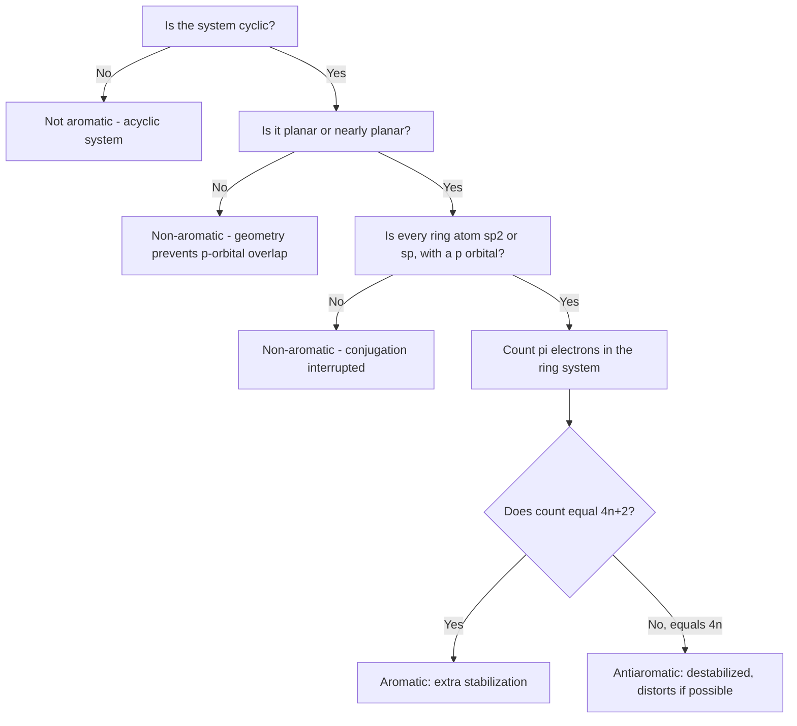

## Aromatic Hydrocarbons and the Structure of Benzene

### Overview

Aromatic hydrocarbons are a distinct class of unsaturated cyclic compounds exhibiting unusual stability, characteristic reactivity (substitution rather than addition), and a specific set of structural and electronic requirements collectively termed **aromaticity**. Benzene, $\text{C}_6\text{H}_6$, is the archetypal aromatic compound, and understanding its structure resolved one of the most significant historical puzzles in structural organic chemistry.

### The Historical Puzzle of Benzene's Structure

Benzene's molecular formula, $\text{C}_6\text{H}_6$, gives a degree of unsaturation of 4:

$$\text{DoU} = \frac{2(6)+2-6}{2} = \frac{8}{2} = 4$$

A DoU of 4 suggested a highly unsaturated structure, yet benzene's chemical behavior was strikingly inconsistent with the reactivity expected of a molecule containing three isolated double bonds. Benzene:

- Does **not** readily undergo the characteristic addition reactions of alkenes (e.g., it does not rapidly decolorize bromine water, unlike true alkenes)
- Has a **much lower heat of hydrogenation** than would be predicted by simply summing three independent C=C double bond hydrogenations
- Shows **all six C–C bond lengths as equal** (approximately $139\ \text{pm}$), intermediate between a typical C–C single bond ($154\ \text{pm}$) and C=C double bond ($134\ \text{pm}$) — inconsistent with a structure containing three distinct, localized double bonds and three distinct single bonds, which would show two different bond lengths

### Kekulé's Structure and Its Limitation

Friedrich August Kekulé proposed the cyclohexatriene structure (a six-membered ring with three alternating double bonds), which successfully accounted for benzene's molecular formula and monosubstitution pattern. However, this simple structure predicted two different C–C bond lengths (alternating short double bonds and long single bonds), contradicting the experimentally observed uniform bond length.

**Resonance resolution:** the modern resolution treats the true structure of benzene as a **resonance hybrid** of two equivalent Kekulé structures (with the double bonds shifted to the alternate set of positions), where the actual electron distribution is an average of both contributing structures — not two structures rapidly interconverting, but a single, unchanging molecule whose true electronic structure lies between the two idealized drawings.

### Resonance Structures of Benzene (svg_diagram)

<svg xmlns="http://www.w3.org/2000/svg" viewBox="0 0 700 260" font-family="Helvetica, Arial, sans-serif" font-size="12">
<text x="350" y="22" font-size="16" font-weight="bold" text-anchor="middle">Benzene Resonance Hybrid (svg_diagram)</text>

<text x="130" y="55" text-anchor="middle" font-weight="bold">Kekulé structure 1</text>

<polygon points="130,90 175,115 175,165 130,190 85,165 85,115" fill="none" stroke="#333" stroke-width="2" />

<line x1="90" y1="118" x2="125" y2="97" stroke="`#c0392b`" stroke-width="2" />

<line x1="135" y1="162" x2="170" y2="141" stroke="`#c0392b`" stroke-width="2" />

<line x1="88" y1="162" x2="88" y2="118" stroke="`#c0392b`" stroke-width="2" />

<text x="280" y="140" text-anchor="middle" font-size="20">⇌</text>

<text x="420" y="55" text-anchor="middle" font-weight="bold">Kekulé structure 2</text>

<polygon points="420,90 465,115 465,165 420,190 375,165 375,115" fill="none" stroke="#333" stroke-width="2" />

<line x1="380" y1="118" x2="420" y2="93" stroke="`#c0392b`" stroke-width="2" transform="translate(0,0)" />

<line x1="425" y1="93" x2="460" y2="114" stroke="`#c0392b`" stroke-width="2" />

<line x1="425" y1="187" x2="460" y2="166" stroke="`#c0392b`" stroke-width="2" />

<text x="560" y="140" text-anchor="middle" font-size="20">≡</text>

<text x="630" y="55" text-anchor="middle" font-weight="bold" font-size="11">Delocalized</text>

<polygon points="630,90 660,108 660,148 630,166 600,148 600,108" fill="none" stroke="#333" stroke-width="2" />

<circle cx="630" cy="128" r="22" fill="none" stroke="`#2980b9`" stroke-width="2" />

<text x="350" y="230" text-anchor="middle" font-size="11" fill="#555">True structure: single hybrid with 6 equivalent, delocalized π electrons — not two interconverting molecules</text>

</svg>

### Molecular Orbital Description of Benzene

The modern, more rigorous description treats benzene's aromaticity through **molecular orbital (MO) theory**: each of the six ring carbons is $sp^2$-hybridized (trigonal planar, $120°$ bond angles), leaving one unhybridized $p$ orbital per carbon perpendicular to the ring plane. These six $p$ orbitals combine to form six **π molecular orbitals**, delocalized around the entire ring rather than localized between specific carbon pairs.

- **Three bonding π MOs** (lower energy) are filled with the six π electrons total
- **Three antibonding π* MOs** (higher energy) remain empty in the ground state

This delocalization spreads the π electron density evenly around the ring, consistent with the observed uniform bond lengths, and the resulting extra stabilization (relative to a hypothetical localized cyclohexatriene) is termed **resonance energy** or **aromatic stabilization energy**.

### Quantifying Aromatic Stabilization: Heat of Hydrogenation Comparison

The experimental magnitude of benzene's extra stability is determined by comparing its actual heat of hydrogenation to the value predicted by extrapolating from simpler, non-conjugated alkenes.

| Compound | Heat of Hydrogenation (kJ/mol) |
| --- | --- |
| Cyclohexene (1 double bond) | ~120 |
| "Hypothetical" cyclohexatriene (3× cyclohexene value, predicted) | ~360 |
| Benzene (actual, experimental) | ~208 |

**Resonance (aromatic stabilization) energy:**

$$\text{Resonance energy} \approx 360 - 208 = 152\ \text{kJ/mol}$$

[Unverified] Exact numerical values for benzene's heat of hydrogenation and resonance energy vary slightly across textbook sources (commonly cited resonance energy figures range from approximately 150 to 152 kJ/mol depending on the reference cyclohexene value and measurement method used), but the qualitative conclusion — a substantial (over 100 kJ/mol) extra stabilization relative to the hypothetical localized triene — is a well-established and consistently reported result.

### Hückel's Rule: The Criteria for Aromaticity

For a cyclic, planar, fully conjugated system to be considered **aromatic** (and thus exhibit the characteristic extra stability), it must satisfy all of the following criteria:

1. **Cyclic:** the system must form a closed ring
2. **Planar:** all ring atoms must lie in (or very close to) a single plane, allowing continuous overlap of the participating $p$ orbitals
3. **Fully conjugated:** every ring atom must have an unhybridized $p$ orbital available for the π system (typically requiring each ring atom to be $sp^2$ or $sp$ hybridized)
4. **Hückel's rule (4n+2 π electrons):** the total number of π electrons in the ring system must equal $4n + 2$, where $n$ is a non-negative integer (0, 1, 2, 3, ...)

$$\text{Number of } \pi \text{ electrons} = 4n + 2 \quad (n = 0, 1, 2, 3, \ldots)$$

For benzene: $n = 1$, giving $4(1) + 2 = 6$ π electrons, matching benzene's six p-orbital electrons exactly.

| $n$ | $4n+2$ π electrons | Example |
| --- | --- | --- |
| 0 | 2 | Cyclopropenyl cation |
| 1 | 6 | Benzene, cyclopentadienyl anion, tropylium cation |
| 2 | 10 | Naphthalene |
| 3 | 14 | Anthracene, phenanthrene |

### Antiaromaticity and Non-Aromaticity

**Antiaromatic** systems satisfy the cyclic, planar, and fully conjugated criteria but have $4n$ π electrons (not $4n+2$) — these systems are actually **destabilized** relative to a comparable open-chain (non-cyclic) reference, and typically distort away from planarity or otherwise avoid the antiaromatic electronic configuration if a lower-energy alternative geometry is accessible.

**Example:** Cyclobutadiene (4 π electrons, $n=1$ in the $4n$ series) is a classic antiaromatic system; in practice, it is extremely unstable and reactive, and adopts a rectangular (not square) geometry with alternating bond lengths to partially avoid the full destabilization of a perfectly symmetric antiaromatic structure.

**Non-aromatic** systems simply fail one or more of the basic structural criteria (not cyclic, not planar, or not fully conjugated) and are neither stabilized nor destabilized by aromaticity considerations — they behave according to ordinary alkene/diene reactivity patterns.

**Example:** Cycloheptatriene (with one $sp^3$ carbon interrupting full conjugation) is non-aromatic in its neutral form, since the ring is not fully conjugated; however, loss of a hydride from that $sp^3$ carbon generates the fully conjugated, 6 π-electron **tropylium cation**, which is aromatic.

### Aromaticity Classification Flow (Mermaid)

### Substituted Benzene Nomenclature

**Monosubstituted benzenes:** named either by adding the substituent prefix directly to "benzene" (e.g., chlorobenzene, nitrobenzene) or by using retained common names for certain long-established derivatives (toluene = methylbenzene; phenol = hydroxybenzene; aniline = aminobenzene).

**Disubstituted benzenes:** relative positions indicated by either numerical locants (1,2- / 1,3- / 1,4-) or the traditional ortho/meta/para prefixes:

- **ortho (o-), 1,2-:** adjacent substituents
- **meta (m-), 1,3-:** substituents separated by one ring carbon
- **para (p-), 1,4-:** substituents directly across the ring

**Polysubstituted benzenes:** numbered to give the lowest overall locant set, following the same lowest-locant principles as other IUPAC nomenclature, with substituents alphabetized in the assembled name.

### Fused Polycyclic Aromatic Hydrocarbons (PAHs)

Aromatic rings can be fused (sharing an edge/bond) to build larger polycyclic aromatic systems, each satisfying Hückel's rule when the π electron count of the fully conjugated system is considered as a whole.

| Compound | Number of Fused Rings | Total π Electrons |
| --- | --- | --- |
| Naphthalene | 2 | 10 |
| Anthracene (linear fusion) | 3 | 14 |
| Phenanthrene (angular fusion) | 3 | 14 |
| Pyrene | 4 | 16 |

[Inference] Larger PAHs generally show decreasing per-ring aromatic stabilization energy as ring count increases, and several PAHs (including some of significant environmental/toxicological concern, such as benzo[a]pyrene) are notable for combustion-related formation and biological reactivity, though detailed toxicological mechanisms are outside the structural scope of this overview.

### Characteristic Reactivity: Substitution over Addition

Because addition reactions would disrupt the aromatic π system and forfeit its substantial resonance stabilization, benzene and other aromatic compounds strongly favor **electrophilic aromatic substitution (EAS)** over the addition reactions characteristic of simple alkenes — a mechanistic contrast directly linked to the special thermodynamic stability conferred by aromaticity.

$$\text{Ar–H} + \text{E}^+ \rightarrow \text{Ar–E} + \text{H}^+$$

In substitution, a hydrogen is replaced while the aromatic ring (and its stabilization energy) is regenerated in the product; in addition (which would occur with a simple alkene), the π system would be permanently consumed, losing the aromatic stabilization energy entirely — providing the thermodynamic rationale for benzene's preference for substitution.

### Electron Density and Bond Length Diagram (svg_diagram)

<svg xmlns="http://www.w3.org/2000/svg" viewBox="0 0 620 260" font-family="Helvetica, Arial, sans-serif" font-size="12">
<text x="310" y="22" font-size="16" font-weight="bold" text-anchor="middle">Benzene: Uniform Bond Length and Delocalized π Cloud (svg_diagram)</text>
<polygon points="310,60 355,85 355,135 310,160 265,135 265,85" fill="none" stroke="#333" stroke-width="2.5" />
<circle cx="310" cy="110" r="35" fill="none" stroke="#2980b9" stroke-width="2.5" stroke-dasharray="4,3" />

<text x="310" y="200" text-anchor="middle" font-size="11">All 6 C-C bonds: ~139 pm (intermediate between single 154 pm and double 134 pm)</text>

<text x="310" y="220" text-anchor="middle" font-size="11">Circle represents delocalized π electron density above and below the ring plane</text>

</svg>

**Key Points**

- Benzene's uniform C–C bond lengths (~139 pm, intermediate between single and double bond lengths) contradict a simple Kekulé cyclohexatriene structure and are explained by resonance/delocalization of the π electron system
- Aromatic stabilization (resonance energy) is quantified experimentally as the difference between benzene's actual heat of hydrogenation (~208 kJ/mol) and the value predicted for a hypothetical localized cyclohexatriene (~360 kJ/mol), giving roughly 150 kJ/mol of extra stability
- Hückel's rule requires a cyclic, planar, fully conjugated system with $4n+2$ π electrons for aromaticity; systems with $4n$ π electrons under the same structural conditions are antiaromatic and destabilized
- Aromatic compounds favor electrophilic aromatic substitution over addition, since substitution preserves the ring's stabilizing π system while addition would permanently destroy it

**Related Topics**

- Electrophilic aromatic substitution mechanism and directing effects
- Molecular orbital theory of conjugated π systems
- Fused polycyclic aromatic hydrocarbons and their properties
- Resonance structures and curved-arrow resonance notation
- Heterocyclic aromatic compounds (pyridine, furan, pyrrole, thiophene)