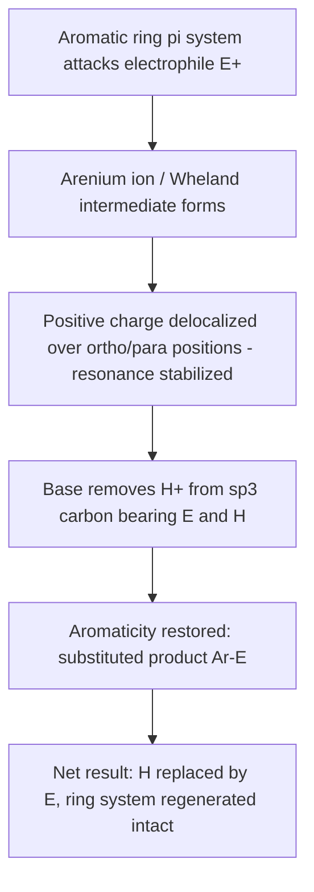
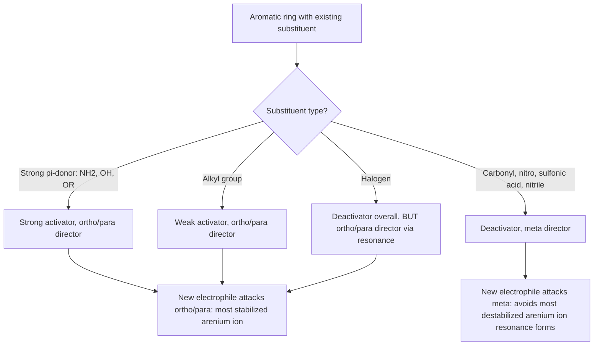

## Electrophilic Aromatic Substitution

### Overview

Electrophilic aromatic substitution (EAS) is the dominant reaction pathway for aromatic compounds, in which an electrophile replaces a hydrogen atom on the aromatic ring while the ring's delocalized π system — and its associated aromatic stabilization — is fully regenerated in the product. This mechanistic preference for substitution over addition is the direct chemical consequence of aromaticity, since addition would permanently sacrifice the resonance stabilization that makes aromatic rings unusually stable.

### General Mechanism: Two-Step Addition-Elimination Sequence

Despite being classified as a "substitution," EAS actually proceeds through an initial **addition** step followed by an **elimination** step, making it mechanistically distinct from both simple nucleophilic substitution and simple electrophilic addition.

**Step 1: Electrophilic attack (rate-determining step)**

The electron-rich aromatic π system attacks an electrophile, forming a new C–E bond and generating a resonance-stabilized cationic intermediate in which the aromaticity is temporarily disrupted.

**Step 2: Deprotonation (rearomatization)**

A base (often the conjugate base generated in step 1, or the solvent) removes the proton from the carbon that bears both the new substituent and a hydrogen, regenerating the fully conjugated, aromatic ring system.

$$\text{Ar–H} + \text{E}^+ \xrightarrow{\text{step 1}} \left[\text{arenium ion / Wheland intermediate}\right] \xrightarrow{\text{step 2: -H}^+} \text{Ar–E}$$

### The Arenium Ion (Wheland Intermediate)

The key intermediate in every EAS mechanism is the **arenium ion** (also called the **sigma complex** or **Wheland intermediate**): a non-aromatic, resonance-stabilized carbocation in which one ring carbon has become $sp^3$-hybridized (bearing both the new electrophile and the original hydrogen), while the remaining four ring carbons still bear a delocalized allylic-type cationic system spread over three resonance structures.

**Resonance stabilization of the arenium ion:** the positive charge is delocalized onto three ring carbons (ortho and para positions relative to the new substituent), which is precisely why the mechanism is compatible with a subsequent deprotonation regenerating full aromaticity — the intermediate is not simply "any carbocation" but one specifically stabilized by the remaining conjugated π system.

### Arenium Ion Resonance Structures (svg_diagram)

<svg xmlns="http://www.w3.org/2000/svg" viewBox="0 0 780 260" font-family="Helvetica, Arial, sans-serif" font-size="11">
<text x="390" y="22" font-size="16" font-weight="bold" text-anchor="middle">Arenium Ion (Wheland Intermediate) Resonance (svg_diagram)</text>

<polygon points="110,80 150,102 150,146 110,168 70,146 70,102" fill="none" stroke="#333" stroke-width="2" />
<text x="110" y="60" text-anchor="middle" font-size="10">E, H (sp³)</text>
<circle cx="150" cy="102" r="4" fill="#c0392b" />
<text x="170" y="106" fill="#c0392b" font-size="12">+</text>

<text x="215" y="140" text-anchor="middle" font-size="18">⇌</text>

<polygon points="290,80 330,102 330,146 290,168 250,146 250,102" fill="none" stroke="#333" stroke-width="2" />
<text x="290" y="60" text-anchor="middle" font-size="10">E, H (sp³)</text>
<circle cx="290" cy="168" r="4" fill="#c0392b" />
<text x="290" y="195" fill="#c0392b" font-size="12">+</text>

<text x="395" y="140" text-anchor="middle" font-size="18">⇌</text>

<polygon points="470,80 510,102 510,146 470,168 430,146 430,102" fill="none" stroke="#333" stroke-width="2" />
<text x="470" y="60" text-anchor="middle" font-size="10">E, H (sp³)</text>
<circle cx="430" cy="146" r="4" fill="#c0392b" />
<text x="410" y="150" fill="#c0392b" font-size="12">+</text>

<text x="390" y="230" text-anchor="middle" font-size="12" fill="#555">Positive charge delocalized onto ortho and para ring carbons relative to the new substituent (E)</text>

</svg>

### EAS Mechanism Flow (Mermaid)

### Major Classes of Electrophilic Aromatic Substitution

**Halogenation**

Requires a Lewis acid catalyst (e.g., $\text{FeBr}_3$, $\text{FeCl}_3$, $\text{AlCl}_3$) to polarize the halogen molecule and generate a sufficiently reactive electrophile, since molecular halogens alone are not electrophilic enough to react directly with the relatively unreactive aromatic π system.

$$\text{C}_6\text{H}_6 + \text{Br}_2 \xrightarrow{\text{FeBr}_3} \text{C}_6\text{H}_5\text{Br} + \text{HBr}$$

The Lewis acid coordinates to the halogen, polarizing the Br–Br bond and generating an activated $\text{Br}^{\delta+}$ electrophile (often depicted as a discrete $\text{Br}^+$ for mechanistic simplicity).

**Nitration**

Uses a mixture of concentrated nitric acid and concentrated sulfuric acid, generating the **nitronium ion** ($\text{NO}_2^+$) as the active electrophile in situ:

$$\text{HNO}_3 + 2\,\text{H}_2\text{SO}_4 \rightarrow \text{NO}_2^+ + \text{H}_3\text{O}^+ + 2\,\text{HSO}_4^-$$

$$\text{C}_6\text{H}_6 + \text{NO}_2^+ \rightarrow \text{C}_6\text{H}_5\text{NO}_2 + \text{H}^+$$

Nitrobenzene is a key synthetic intermediate, since the nitro group can subsequently be reduced to an amine (aniline), a widely used building block in synthesis.

**Sulfonation**

Uses fuming sulfuric acid (containing dissolved $\text{SO}_3$) or concentrated $\text{H}_2\text{SO}_4$ itself, with $\text{SO}_3$ (or its protonated form) acting as the electrophile:

$$\text{C}_6\text{H}_6 + \text{SO}_3 \xrightarrow{\text{H}_2\text{SO}_4}\text{C}_6\text{H}_5\text{SO}_3\text{H}$$

Sulfonation is notable for being **reversible** under aqueous acidic conditions at elevated temperature, a property exploited synthetically to use the sulfonic acid group as a temporary "blocking group" that can later be removed.

**Friedel-Crafts Alkylation**

Uses an alkyl halide with a Lewis acid catalyst (typically $\text{AlCl}_3$), generating a carbocation electrophile:

$$\text{C}_6\text{H}_6 + \text{R–Cl} \xrightarrow{\text{AlCl}_3} \text{C}_6\text{H}_5\text{–R} + \text{HCl}$$

**Key limitations:** Friedel-Crafts alkylation suffers from several well-known complications: (1) **carbocation rearrangement** — since a genuine carbocation intermediate forms, primary alkyl halides tend to rearrange to more stable secondary/tertiary carbocations before ring attack, often giving unexpected rearranged products; (2) **polyalkylation** — since the alkyl product ring is more electron-rich (more reactive) than the starting benzene, over-alkylation is a common side reaction; (3) the reaction **fails entirely on strongly deactivated rings** (see directing effects below), since a sufficiently electron-poor ring cannot generate a stabilized arenium ion with a simple alkyl electrophile.

**Friedel-Crafts Acylation**

Uses an acyl halide (or acid anhydride) with a Lewis acid catalyst, generating an **acylium ion** ($\text{R–C}\equiv\text{O}^+$) electrophile:

$$\text{C}_6\text{H}_6 + \text{R–COCl} \xrightarrow{\text{AlCl}_3} \text{C}_6\text{H}_5\text{–CO–R} + \text{HCl}$$

**Advantage over alkylation:** the acylium ion is resonance-stabilized (positive charge delocalized between carbon and oxygen) and therefore does **not** undergo the carbocation rearrangements that plague alkylation; additionally, the resulting ketone product is a deactivating group (see below), which **prevents polyacylation**, making Friedel-Crafts acylation the generally preferred, more reliable method for introducing a single carbon substituent onto an aromatic ring — often followed by a subsequent reduction (e.g., Clemmensen or Wolff-Kishner reduction) if the ultimate goal is an unbranched alkyl chain rather than a ketone.

### Directing Effects: How Existing Substituents Control Regiochemistry

When an aromatic ring already bears a substituent, that substituent strongly influences both the **rate** of further EAS (activating vs. deactivating) and the **position** (regiochemistry) at which the new substituent is introduced (ortho/para-directing vs. meta-directing).

**Activating, ortho/para-directing groups**

Electron-donating groups increase electron density in the ring (especially at ortho and para positions relative to themselves), stabilizing the arenium ion intermediate when attack occurs at those positions, and thus both accelerating the reaction and directing substitution there.

| Group | Relative Strength | Mechanism of Donation |
| --- | --- | --- |
| –NH₂, –NHR, –NR₂ | Strong activator | Resonance donation (lone pair into ring) |
| –OH, –OR | Strong activator | Resonance donation (lone pair into ring) |
| –NHCOR (amide) | Moderate activator | Resonance donation (attenuated by carbonyl) |
| –R (alkyl groups) | Weak activator | Inductive/hyperconjugative donation |

**Deactivating, meta-directing groups**

Electron-withdrawing groups (especially those with a positively polarized atom directly attached to the ring, or a π system that can accept electron density via resonance) destabilize the arenium ion most severely at ortho/para positions, so substitution is directed instead to the meta position, where the destabilizing resonance interaction is avoided.

| Group | Relative Strength | Mechanism of Withdrawal |
| --- | --- | --- |
| –NO₂ | Strong deactivator | Resonance withdrawal + induction |
| –C≡N | Strong deactivator | Resonance withdrawal + induction |
| –CHO, –COR, –COOH, –COOR | Moderate-strong deactivator | Resonance withdrawal (carbonyl) |
| –SO₃H | Moderate deactivator | Resonance + inductive withdrawal |

**Halogens: the special exception**

Halogens (–F, –Cl, –Br, –I) are uniquely both **deactivating** (due to strong inductive electron withdrawal, since halogens are highly electronegative) **and ortho/para-directing** (due to resonance donation of a lone pair into the ring, despite the net inductive withdrawal dominating the overall rate). This combination — deactivating overall rate, yet directing to ortho/para positions specifically — distinguishes halogens from every other substituent class, where activating/deactivating character and directing preference otherwise correlate consistently.

### Directing Effects Summary Diagram (svg_diagram)

<svg xmlns="http://www.w3.org/2000/svg" viewBox="0 0 780 300" font-family="Helvetica, Arial, sans-serif" font-size="12">
<text x="390" y="22" font-size="16" font-weight="bold" text-anchor="middle">Substituent Effects on EAS Rate and Regiochemistry (svg_diagram)</text>
<rect x="30" y="50" width="220" height="90" rx="6" fill="#d5f5e3" stroke="#333" />
<text x="140" y="72" text-anchor="middle" font-weight="bold">Strong Activators</text>
<text x="140" y="90" text-anchor="middle" font-size="11">-NH2, -OH, -OR</text>
<text x="140" y="108" text-anchor="middle" font-size="11">Ortho/para-directing</text>
<text x="140" y="126" text-anchor="middle" font-size="11">Resonance donation</text>
<rect x="280" y="50" width="220" height="90" rx="6" fill="#fcf3cf" stroke="#333" />
<text x="390" y="72" text-anchor="middle" font-weight="bold">Weak Activators</text>
<text x="390" y="90" text-anchor="middle" font-size="11">-CH3, -R (alkyl)</text>
<text x="390" y="108" text-anchor="middle" font-size="11">Ortho/para-directing</text>
<text x="390" y="126" text-anchor="middle" font-size="11">Inductive/hyperconjugation</text>
<rect x="530" y="50" width="220" height="90" rx="6" fill="#fadbd8" stroke="#333" />
<text x="640" y="72" text-anchor="middle" font-weight="bold">Deactivators</text>
<text x="640" y="90" text-anchor="middle" font-size="11">-NO2, -COR, -CN, -SO3H</text>
<text x="640" y="108" text-anchor="middle" font-size="11">Meta-directing</text>
<text x="640" y="126" text-anchor="middle" font-size="11">Resonance/inductive withdrawal</text>
<rect x="280" y="180" width="220" height="90" rx="6" fill="#eaeded" stroke="#333" />
<text x="390" y="202" text-anchor="middle" font-weight="bold">Halogens (Special Case)</text>
<text x="390" y="220" text-anchor="middle" font-size="11">-F, -Cl, -Br, -I</text>
<text x="390" y="238" text-anchor="middle" font-size="11">Ortho/para-directing, YET</text>
<text x="390" y="256" text-anchor="middle" font-size="11">net deactivating (induction &gt; resonance)</text>
</svg>

### Worked Example: Predicting the Product of a Multi-Substituent EAS

**Question:** Nitration of toluene (methylbenzene) — where does the nitro group go?

**Analysis:** The methyl group is a weak activator and an ortho/para director. Nitration of toluene therefore proceeds faster than nitration of benzene itself, and the nitro group is introduced predominantly at the ortho and para positions relative to the existing methyl group (giving a mixture of ortho- and para-nitrotoluene, with the para product often favored somewhat due to steric hindrance disfavoring ortho attack).

**When two substituents are already present with conflicting directing effects:** the stronger activating group generally dominates in determining the position of new substitution, and steric effects can further disfavor positions between two existing substituents (positions of high steric crowding).

### Rate and Regiochemistry Decision Logic (Mermaid)

**Key Points**

- EAS proceeds through a two-step addition-elimination mechanism: electrophilic attack forms a resonance-stabilized arenium ion (Wheland intermediate), followed by deprotonation that regenerates full aromaticity
- The five classic EAS reactions are halogenation, nitration, sulfonation, and Friedel-Crafts alkylation/acylation, each generating a specific electrophile ($\text{X}^+$, $\text{NO}_2^+$, $\text{SO}_3$, $\text{R}^+$, or $\text{RCO}^+$)
- Friedel-Crafts acylation is generally preferred over alkylation because the acylium ion resists carbocation rearrangement and the ketone product is deactivating, preventing polysubstitution
- Substituents are classified as activating/ortho-para-directing, deactivating/meta-directing, or (uniquely, for halogens) deactivating yet ortho/para-directing, based on their net inductive and resonance electronic effects on the arenium ion intermediate's stability

**Related Topics**

- Aromatic hydrocarbons and the structure of benzene (aromaticity, Hückel's rule)
- Nucleophilic aromatic substitution (contrast mechanism)
- Carbocation stability and rearrangement
- Synthesis strategy: order of substituent introduction in multi-step aromatic synthesis
- Reduction of nitro groups and ketones (aniline synthesis, Clemmensen/Wolff-Kishner reduction)