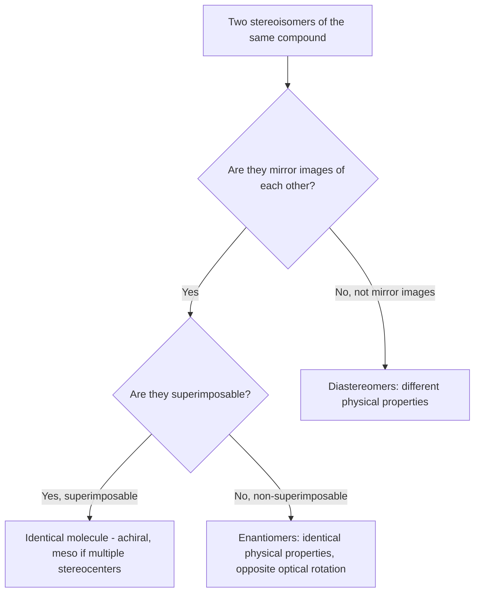

## Chirality and Stereocenters

### Overview

Chirality is a geometric property of a molecule that lacks certain internal symmetry elements, causing it to be non-superimposable on its own mirror image — analogous to how a left hand and right hand are mirror images that cannot be perfectly overlaid. This property underlies **optical isomerism** (a subtype of stereoisomerism) and has profound consequences in biology, pharmacology, and synthetic chemistry, since living systems are themselves built from chiral molecules and often interact very differently with the two mirror-image forms of a chiral compound.

### Defining Chirality

A molecule is **chiral** if it is non-superimposable on its mirror image. A molecule is **achiral** if it is identical to (superimposable on) its mirror image.

**Formal symmetry criterion:** a molecule is achiral if and only if it possesses an **improper axis of rotation** ($S_n$), which includes as special cases a plane of symmetry ($\sigma$, equivalent to $S_1$) or a center of inversion ($i$, equivalent to $S_2$). A molecule lacking any $S_n$ symmetry element is necessarily chiral.

[Inference] While the formal $S_n$ criterion is the rigorous and complete test for chirality, most introductory-level identification relies on the simpler (though not universally sufficient) heuristic of checking for an internal plane of symmetry, since molecules requiring the full $S_n$ test for correct classification are relatively uncommon in typical introductory coursework.

### Stereocenters: The Most Common Source of Chirality

A **stereocenter** (also called a **chiral center** or, historically, an **asymmetric carbon**) is an atom — most commonly an $sp^3$-hybridized carbon — bonded to four different substituents. Swapping any two of these four substituents produces a different stereoisomer, which is the structural definition that connects stereocenters to chirality.

**Identifying a stereocenter:** examine each $sp^3$ carbon in a molecule and determine whether all four attached groups are distinct from one another (comparing entire substituent groups, not just the immediately attached atom).

**Worked example:** 2-bromobutane, $\text{CH}_3\text{–CHBr–CH}_2\text{–CH}_3$

Examining C2 (the carbon bearing Br): its four substituents are –H, –Br, –CH₃, and –CH₂CH₃ — all four are distinct, so **C2 is a stereocenter**.

**Counter-example:** 2-bromopropane, $\text{CH}_3\text{–CHBr–CH}_3$

Examining C2: its four substituents are –H, –Br, –CH₃, and –CH₃ — two of the four substituents (both methyl groups) are identical, so **C2 is NOT a stereocenter**.

### Stereocenter Identification Diagram (svg_diagram)

<svg xmlns="http://www.w3.org/2000/svg" viewBox="0 0 700 260" font-family="Helvetica, Arial, sans-serif" font-size="12">
<text x="350" y="22" font-size="16" font-weight="bold" text-anchor="middle">Stereocenter vs Non-Stereocenter (svg_diagram)</text>

<text x="170" y="55" text-anchor="middle" font-weight="bold">2-bromobutane: C2 IS a stereocenter</text>

<circle cx="170" cy="130" r="10" fill="#333" />

<line x1="170" y1="120" x2="170" y2="80" stroke="`#c0392b`" stroke-width="2" />

<text x="170" y="70" text-anchor="middle" fill="`#c0392b`">Br</text>

<line x1="162" y1="138" x2="120" y2="170" stroke="#333" stroke-width="2" />

<text x="105" y="185" text-anchor="middle">H</text>

<line x1="178" y1="138" x2="130" y2="140" stroke="#333" stroke-width="2" />

<text x="110" y="140" text-anchor="middle">CH₃</text>

<line x1="178" y1="130" x2="230" y2="130" stroke="#333" stroke-width="2" />

<text x="260" y="135" text-anchor="middle">CH₂CH₃</text>

<text x="170" y="220" text-anchor="middle" font-size="11">4 different groups: H, Br, CH₃, CH₂CH₃</text>

<text x="530" y="55" text-anchor="middle" font-weight="bold">2-bromopropane: C2 is NOT</text>

<circle cx="530" cy="130" r="10" fill="#333" />

<line x1="530" y1="120" x2="530" y2="80" stroke="`#c0392b`" stroke-width="2" />

<text x="530" y="70" text-anchor="middle" fill="`#c0392b`">Br</text>

<line x1="522" y1="138" x2="480" y2="170" stroke="#333" stroke-width="2" />

<text x="465" y="185" text-anchor="middle">H</text>

<line x1="538" y1="138" x2="580" y2="170" stroke="#999" stroke-width="2" />

<text x="595" y="185" text-anchor="middle" fill="#999">CH₃</text>

<line x1="538" y1="130" x2="590" y2="120" stroke="#999" stroke-width="2" />

<text x="610" y="115" text-anchor="middle" fill="#999">CH₃</text>

<text x="530" y="220" text-anchor="middle" font-size="11">Two identical CH₃ groups — not a stereocenter</text>

</svg>

### Enantiomers: Non-Superimposable Mirror Images

**Enantiomers** are a pair of stereoisomers that are non-superimposable mirror images of one another. A molecule with one stereocenter has exactly two possible stereoisomers, which form one enantiomeric pair.

**Key properties of enantiomers:**

- **Identical physical properties** (melting point, boiling point, density, solubility, refractive index) in an achiral environment
- **Identical chemical reactivity** toward achiral reagents
- **Opposite optical rotation:** each enantiomer rotates plane-polarized light by an equal magnitude but in opposite directions (see optical activity below)
- **Different behavior in a chiral environment:** enantiomers can react at different rates with other chiral molecules (including biological receptors, enzymes, and other chiral reagents), which is the basis for their differing biological/pharmacological effects

### CIP (R/S) Nomenclature for Stereocenters

The **Cahn-Ingold-Prelog (CIP)** system assigns an unambiguous descriptor, **R** (from Latin *rectus*, "right") or **S** (from Latin *sinister*, "left"), to each stereocenter, allowing precise naming of a specific stereoisomer.

**Step-by-step procedure:**

1. **Rank the four substituents by priority** using CIP rules: compare the atomic number of the atoms directly attached to the stereocenter; higher atomic number = higher priority. If there is a tie, proceed outward to the next set of attached atoms, comparing in order of decreasing priority.
2. **Orient the molecule** so that the lowest-priority substituent (priority 4) points directly away from the viewer.
3. **Trace a path** from priority 1 → priority 2 → priority 3.
4. **Assign the descriptor:** if this path traces **clockwise**, the configuration is **R**; if **counterclockwise**, the configuration is **S**.

**Worked example — assigning R/S to (2-bromobutane), C2 stereocenter:**

Substituents on C2: –Br, –CH₂CH�3, –CH₃, –H

**Priority ranking:**

1. –Br (highest: Br atomic number 35, directly attached)
2. –CH₂CH₃ (attached atom is C; its substituents include C, H, H at the first point of difference — compare to CH₃'s attached atoms of H, H, H — ethyl's carbon "wins" over methyl's set)
3. –CH₃ (attached atom is C, with only H, H, H as its substituents)
4. –H (lowest: hydrogen, atomic number 1)

With –H (lowest priority) pointing away from the viewer, tracing Br → CH₂CH�3 → CH₃: if this path is clockwise, the center is **(R)**; if counterclockwise, **(S)** — the actual assignment depends on the specific 3D orientation drawn, which must be determined from an actual wedge-dash structure or model rather than from the connectivity alone.

### R/S Assignment Diagram (svg_diagram)

<svg xmlns="http://www.w3.org/2000/svg" viewBox="0 0 700 280" font-family="Helvetica, Arial, sans-serif" font-size="12">
<text x="350" y="22" font-size="16" font-weight="bold" text-anchor="middle">CIP Priority and R/S Assignment (svg_diagram)</text>
<circle cx="350" cy="140" r="12" fill="#333" />
<line x1="350" y1="128" x2="350" y2="80" stroke="#c0392b" stroke-width="2.5" />
<text x="350" y="68" text-anchor="middle" fill="#c0392b" font-weight="bold">1 (Br)</text>
<line x1="340" y1="148" x2="290" y2="185" stroke="#333" stroke-width="2.5" />
<text x="270" y="200" text-anchor="middle" font-weight="bold">2 (CH₂CH₃)</text>
<line x1="360" y1="148" x2="410" y2="185" stroke="#333" stroke-width="2.5" />
<text x="430" y="200" text-anchor="middle" font-weight="bold">3 (CH₃)</text>
<line x1="350" y1="152" x2="350" y2="195" stroke="#999" stroke-width="2.5" stroke-dasharray="4,2" />
<text x="350" y="220" text-anchor="middle" fill="#999">4 (H) — points away</text>
<path d="M 350 90 A 80 80 0 0 1 405 175" fill="none" stroke="#2980b9" stroke-width="2" marker-end="url(#arrow)" />
<text x="450" y="130" fill="#2980b9" font-size="13">Clockwise 1→2→3 = R</text>

<text x="350" y="255" text-anchor="middle" font-size="11" fill="#555">View with lowest priority (4) pointing away from viewer, then trace 1→2→3</text>

</svg>

### Fischer Projections: An Alternative 2D Representation

**Fischer projections** are a specialized 2D drawing convention historically favored for carbohydrate and amino acid stereochemistry, following a strict interpretive rule:

- **Horizontal lines** represent bonds pointing **toward the viewer** (out of the page)
- **Vertical lines** represent bonds pointing **away from the viewer** (into the page)
- The molecule is drawn as a cross, with the stereocenter at the intersection

**Critical manipulation rules:** a Fischer projection can be rotated 180° in the plane of the page without changing the represented stereochemistry, but rotation by 90° inverts the configuration; similarly, swapping any two groups inverts the configuration, and swapping two pairs of groups (an even number of swaps) restores the original configuration.

### Optical Activity and the Polarimeter

Chiral molecules exhibit **optical activity**: the ability to rotate the plane of plane-polarized light passing through a sample. This is measured using a **polarimeter**.

- **Dextrorotatory (+):** rotates plane-polarized light clockwise (to the right, as viewed facing the oncoming light)
- **Levorotatory (−):** rotates plane-polarized light counterclockwise (to the left)

**Important distinction:** the (+)/(−) rotation direction is an experimentally measured property and has **no fixed relationship** to the (R)/(S) descriptor — an (R) configuration is not inherently "+" or "−"; the actual sign must be determined experimentally for each specific compound, since it depends on the detailed electronic structure of the whole molecule, not merely the spatial arrangement descriptor.

**Specific rotation** is a standardized, concentration- and path-length-independent quantity used to characterize a chiral compound:

$$[\alpha] = \frac{\alpha_{\text{observed}}}{c \times l}$$

where $\alpha_{\text{observed}}$ is the measured rotation (degrees), $c$ is concentration (g/mL), and $l$ is the path length (dm).

### Racemic Mixtures

A **racemic mixture** (or racemate) is a 1:1 mixture of two enantiomers. Because the two enantiomers rotate light by equal magnitude but opposite direction, their optical rotations exactly cancel, so a racemic mixture shows **zero net optical rotation** despite consisting entirely of chiral molecules.

Racemic mixtures commonly form when a chiral product is generated from an achiral (or racemic) starting material via a mechanism that offers no preference for either face of attack — for example, addition of $\text{HBr}$ to an unsymmetrical alkene generates a planar carbocation intermediate that can be attacked with equal probability from either face, producing a racemic product even though the individual product molecules are chiral.

### Molecules with Multiple Stereocenters: Diastereomers and Meso Compounds

For a molecule with $n$ independent stereocenters, the maximum possible number of stereoisomers is $2^n$ (this is an upper bound, reduced in cases of internal symmetry).

**Diastereomers** are stereoisomers that are **not** mirror images of each other (in contrast to enantiomers, which are mirror images). Diastereomers, unlike enantiomers, have genuinely **different physical properties** (different melting points, boiling points, solubilities, etc.), since they are not related by the perfect mirror symmetry that forces enantiomers' properties to be identical in an achiral environment.

**Meso compounds** are a special case: molecules containing multiple stereocenters that nonetheless possess an internal plane of symmetry, making the molecule as a whole **achiral** despite containing individual stereocenters. A meso compound is superimposable on its own mirror image, and therefore has no enantiomer (its "mirror image" is simply itself).

**Example — tartaric acid** ($\text{HOOC–CHOH–CHOH–COOH}$, 2 stereocenters):

- $(2R,3R)$-tartaric acid and $(2S,3S)$-tartaric acid form a genuine enantiomeric pair (both chiral, optically active, equal and opposite rotation)
- $(2R,3S)$-tartaric acid is the **meso** form: it possesses an internal mirror plane relating the two stereocenters, making the molecule achiral and optically inactive, despite having two defined stereocenters

This means tartaric acid has only **3** stereoisomers total (not the maximum $2^2=4$ predicted naively), since the $(2R,3S)$ and $(2S,3R)$ labels both describe the identical achiral meso compound.

### Stereoisomer Relationship Classification (Mermaid)

### Biological and Pharmacological Significance

Because biological receptors, enzymes, and other macromolecules are themselves chiral (built from L-amino acids and D-sugars), they typically interact very differently with the two enantiomers of a chiral drug or biomolecule — one enantiomer may be therapeutically active while the other is inactive, differently metabolized, or in some documented historical cases, harmful.

[Inference] The differing biological activity of enantiomers is a well-established general principle in pharmacology (a chiral binding site interacts diastereomerically, not enantiomerically, with each of the two enantiomers of a chiral drug), though the specific magnitude and nature of the difference — and whether it is beneficial, neutral, or harmful — varies enormously from compound to compound and must be evaluated case by case rather than assumed from chirality alone.

**Key Points**

- A molecule is chiral if it is non-superimposable on its mirror image, formally corresponding to the absence of an improper rotation axis ($S_n$, including simple mirror planes and inversion centers as special cases)
- A stereocenter is typically an $sp^3$ carbon bonded to four different substituents; swapping any two substituents generates a different stereoisomer
- CIP (R/S) nomenclature assigns priority to substituents by atomic number (working outward at ties) and determines the descriptor by the clockwise (R) or counterclockwise (S) path from priority 1→2→3 with priority 4 pointing away
- Enantiomers share identical physical properties and equal-but-opposite optical rotation; diastereomers (non-mirror-image stereoisomers) have genuinely different physical properties
- A racemic mixture (1:1 enantiomer mixture) shows zero net optical rotation despite consisting of chiral molecules; a meso compound is achiral overall despite containing individual stereocenters, due to an internal symmetry plane

**Related Topics**

- Structural and geometric isomerism (contrast with stereoisomerism)
- Fischer projections applied to carbohydrate stereochemistry
- Optical resolution of racemic mixtures
- Reaction stereochemistry: stereospecific and stereoselective reactions
- Chirality in drug design and pharmacology (thalidomide and related case studies)