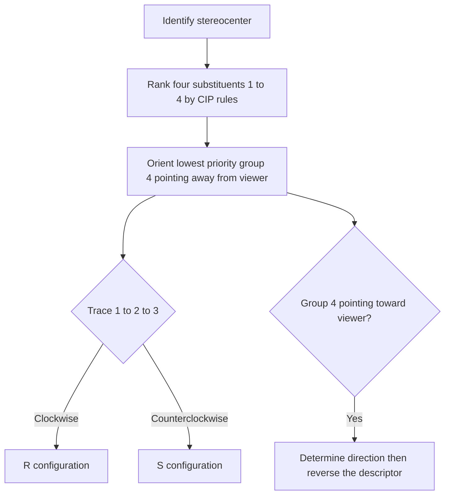

## R and S Nomenclature


### Overview

The **Cahn–Ingold–Prelog (CIP) system** assigns an unambiguous descriptor, $R$ (Latin *rectus*, right) or $S$ (Latin *sinister*, left), to each stereogenic center in a molecule. Unlike the older D/L system, which is tied to a reference compound (glyceraldehyde), the R/S system is derived from the molecule's own structure and applies to any tetrahedral (and many other) stereocenters. The descriptor is a property of the **3D arrangement of substituents ranked by priority**, and it does **not** correlate directly with the direction of optical rotation ($+$/$-$) or with D/L.

**Key Points**

- Each stereocenter receives an independent descriptor; a molecule with $n$ stereocenters has up to $2^n$ stereoisomers.
- Assignment requires two steps: (1) rank the four substituents by CIP priority; (2) view the molecule with the lowest-priority group pointing away and trace $1 \to 2 \to 3$.
- Clockwise = $R$; counterclockwise = $S$.
- Enantiomers have opposite descriptors at every center; diastereomers differ at one or more (but not all) centers.
- Changing a substituent can flip the descriptor **without** changing the spatial arrangement, because priorities may change.

---

### Stereogenic Centers

A **stereocenter** (stereogenic center) is an atom whose exchange of two substituents produces a stereoisomer. The most common case is an $sp^3$ carbon bearing four **different** groups (a chirality center).

$$\text{Max stereoisomers} = 2^n$$

where $n$ is the number of stereocenters. This maximum is reduced when meso forms exist (internal symmetry).

**Common stereogenic centers beyond carbon**

- Quaternary ammonium nitrogen with four different groups (configurationally stable)
- Phosphorus in phosphines, phosphonium salts, and phosphates (P-stereogenic)
- Sulfur in sulfoxides ($R{-}S(=O){-}R'$) and sulfonium salts
- Silicon, germanium, and other tetrahedral centers
- Metal centers in coordination complexes (though these often use different descriptors)

**Non-centers**

- A carbon with two identical substituents (e.g., $CH_2$, $CH_3$, $CCl_2$)
- Planar $sp^2$ centers (though they may contribute to $E/Z$ isomerism)
- Simple amines: nitrogen inversion rapidly interconverts enantiomers at room temperature

---

### The CIP Sequence Rules

Priorities are assigned by comparing atoms and, where necessary, exploring outward from the stereocenter through successive spheres. The rules are applied **in order**; a later rule is used only if all previous rules fail to distinguish the groups.

#### Rule 1: Atomic Number

Higher atomic number receives higher priority. Compare the atoms **directly attached** to the stereocenter first.

$$I > Br > Cl > S > P > F > O > N > C > H$$

Isotopes: for atoms of the same atomic number, the higher **mass number** takes precedence (this is a lower-tier rule, applied later; see Rule 2 below), so $D > H$ and $^{13}C > ^{12}C$ when needed.

**Example 1: Rule 1 in action**

For $CHFClBr$ (bromochlorofluoromethane):

| Substituent | Atomic number | Priority |
| --- | --- | --- |
| $Br$ | 35 | 1 |
| $Cl$ | 17 | 2 |
| $F$ | 9 | 3 |
| $H$ | 1 | 4 |

#### Comparing Ties: Sets of Substituents

When the atoms directly attached are identical, move to the next sphere. Compare the **set** of atoms attached to each, listed in decreasing order of atomic number, and compare the sets **term by term at the first point of difference** (not by summing atomic numbers).

**Example 2: Comparing $-CH_2CH_3$ and $-CH(CH_3)_2$ and $-CH_2OH$**

At the stereocenter, all three are attached through carbon. Look at the substituent sets on that first carbon:

| Group | Substituent set on first C | Notes |
| --- | --- | --- |
| $-CH_2OH$ | $(O, H, H)$ | Highest first atom = O |
| $-CH(CH_3)_2$ | $(C, C, H)$ |  |
| $-CH_2CH_3$ | $(C, H, H)$ |  |

Ranking: $-CH_2OH > -CH(CH_3)_2 > -CH_2CH_3$.

Comparison is made at the **first point of difference**: $(O,H,H)$ beats $(C,C,H)$ because $O > C$ at the first position, regardless of what follows. $(C,C,H)$ beats $(C,H,H)$ at the second position.

#### Rule 2: Isotopes (Mass Number)

If Rule 1 (including its exploration of all spheres) cannot distinguish groups, the group containing the isotope of **higher mass number** ranks higher.

$$T > D > H, \qquad ^{14}C > ^{13}C > ^{12}C$$

This is why isotopically labeled compounds such as $CHDTX$ (with three different hydrogen isotopes) can be chiral.

*Note:* In the full CIP hierarchy, the rules between atomic number/isotopes and the $Z/E$ and like/unlike rules are more extensive (Rules 3–5 handle double-bond geometry, and relative configuration of stereocenters within the substituents). For most introductory and intermediate work, Rules 1, 2 and the double-bond duplication convention below suffice.

#### Multiple Bonds: Duplicate Atoms

Double and triple bonds are treated as if each bond were a separate single bond to a **duplicate atom**. The duplicate atom carries only "phantom" substituents (atomic number zero) and does not extend the search further.

| Group | Treated as |
| --- | --- |
| $-CH=CH_2$ | $C$ bearing $(C, C_{dup}, H)$; the far $C$ bears $(C_{dup}, H, H)$ |
| $-C \equiv CH$ | $C$ bearing $(C, C_{dup}, C_{dup})$ |
| $-CHO$ | $C$ bearing $(O, O_{dup}, H)$ |
| $-COOH$ | $C$ bearing $(O, O, O_{dup})$ |
| $-C_6H_5$ (phenyl) | ring carbon bearing $(C, C, C_{dup})$ |

**Example 3: Ranking vinyl, isopropyl, and ethyl**

| Group | Set on first C | Rank |
| --- | --- | --- |
| $-CH=CH_2$ | $(C, C_{dup}, H)$ | ties with isopropyl at this sphere |
| $-CH(CH_3)_2$ | $(C, C, H)$ | ties at this sphere |
| $-CH_2CH_3$ | $(C, H, H)$ | lowest |

Vinyl and isopropyl tie at the first sphere. Go to the next sphere: explore branches from highest-priority atoms first.

- Vinyl: the real carbon bears $(C_{dup}, H, H)$; the duplicate carbon bears $(0, 0, 0)$.
- Isopropyl: each methyl carbon bears $(H, H, H)$.

Compare the highest-ranked branches: $(C, H, H)$ vs $(H, H, H)$. Vinyl wins. Therefore: $-CH=CH_2 > -CH(CH_3)_2 > -CH_2CH_3$.

#### Hierarchical Digraph Approach

For complex substituents, construct a **hierarchical digraph** (tree) rooted at the stereocenter:

1. Draw each substituent as a branch.
2. At each sphere, compare atoms in **decreasing atomic number order**.
3. Explore branches in order of already-established priority.
4. Continue outward until the first difference is found.

This ensures the comparison is always made at the **first point of difference**, exploring in the same priority order on both sides.

---

### Assigning R or S: Stepwise Procedure

1. **Identify** the stereocenter.
2. **Rank** the four substituents 1 (highest) to 4 (lowest) using the CIP rules.
3. **Orient** the molecule so that priority 4 points **away** from the viewer.
4. **Trace** the path $1 \to 2 \to 3$.
5. **Assign**: clockwise = $R$; counterclockwise = $S$.



#### Mnemonic and Geometry (svg_diagram)

<svg xmlns="http://www.w3.org/2000/svg" viewBox="0 0 620 260" width="620" height="260" font-family="Arial, sans-serif">
<title>R and S Assignment (svg_diagram)</title>
<text x="310" y="22" text-anchor="middle" font-size="16" font-weight="bold">R and S Assignment (svg_diagram)</text>
<text x="150" y="52" text-anchor="middle" font-size="14" font-weight="bold" fill="#c0392b">R (clockwise)</text>
<circle cx="150" cy="140" r="6" fill="#333" />
<circle cx="150" cy="95" r="16" fill="#fadbd8" stroke="#c0392b" />
<text x="150" y="100" text-anchor="middle" font-size="14">1</text>
<circle cx="195" cy="170" r="16" fill="#fadbd8" stroke="#c0392b" />
<text x="195" y="175" text-anchor="middle" font-size="14">2</text>
<circle cx="105" cy="170" r="16" fill="#fadbd8" stroke="#c0392b" />
<text x="105" y="175" text-anchor="middle" font-size="14">3</text>
<path d="M 162 82 Q 215 100 208 155" fill="none" stroke="#c0392b" stroke-width="2" marker-end="url(#cw)" />
<path d="M 178 184 Q 150 205 122 184" fill="none" stroke="#c0392b" stroke-width="2" marker-end="url(#cw)" />
<text x="150" y="235" text-anchor="middle" font-size="12">4 points away (behind page)</text>

<text x="470" y="52" text-anchor="middle" font-size="14" font-weight="bold" fill="#2471a3">S (counterclockwise)</text>
<circle cx="470" cy="140" r="6" fill="#333" />
<circle cx="470" cy="95" r="16" fill="#d6eaf8" stroke="#2471a3" />
<text x="470" y="100" text-anchor="middle" font-size="14">1</text>
<circle cx="425" cy="170" r="16" fill="#d6eaf8" stroke="#2471a3" />
<text x="425" y="175" text-anchor="middle" font-size="14">2</text>
<circle cx="515" cy="170" r="16" fill="#d6eaf8" stroke="#2471a3" />
<text x="515" y="175" text-anchor="middle" font-size="14">3</text>
<path d="M 458 82 Q 405 100 412 155" fill="none" stroke="#2471a3" stroke-width="2" marker-end="url(#ccw)" />
<path d="M 442 184 Q 470 205 498 184" fill="none" stroke="#2471a3" stroke-width="2" marker-end="url(#ccw)" />
<text x="470" y="235" text-anchor="middle" font-size="12">4 points away (behind page)</text>
</svg>

#### When the Lowest-Priority Group Points Toward the Viewer

If group 4 points toward you (wedge bond, or toward the viewer in a Fischer/Newman/other drawing), trace $1 \to 2 \to 3$ as seen, then **reverse** the result:

- Apparent clockwise → actual $S$
- Apparent counterclockwise → actual $R$

#### Handling Hydrogen on a Flat Drawing

For a stereocenter drawn with three bonds in the plane and one implicit $H$:

- If $H$ is on a **hashed** bond (away): read directly.
- If $H$ is on a **wedged** bond (toward you): read, then reverse.
- If the drawing shows two in-plane bonds, one wedge, and one hash, view along the axis from the side opposite the lowest priority group, or use the swap method below.

#### The Swap Method

Swapping any two substituents on a stereocenter inverts its configuration. This gives a reliable shortcut:

1. If group 4 is not pointing away, swap it with the group that is.
2. Determine the direction of $1 \to 2 \to 3$ in the swapped structure.
3. Reverse the answer (because you performed one swap).

Two swaps return the original configuration.

---

### Worked Examples

#### Example 4: Bromochlorofluoromethane

Consider $CHFClBr$ with priorities $Br\ (1) > Cl\ (2) > F\ (3) > H\ (4)$.

With $H$ pointing away from the viewer and $Br \to Cl \to F$ appearing clockwise, the configuration is $(R)\text{-bromochlorofluoromethane}$. The mirror image, with counterclockwise sequence, is the $S$ enantiomer.

#### Example 5: 2-Butanol

The stereocenter is $C2$, bearing $-OH$, $-CH_3$, $-CH_2CH_3$, and $-H$.

| Group | First atom | Priority |
| --- | --- | --- |
| $-OH$ | $O$ | 1 |
| $-CH_2CH_3$ | $C\ (C,H,H)$ | 2 |
| $-CH_3$ | $C\ (H,H,H)$ | 3 |
| $-H$ | $H$ | 4 |

Ethyl beats methyl because $(C,H,H) > (H,H,H)$ at the first point of difference. If, with $H$ pointing back, the sequence $OH \to CH_2CH_3 \to CH_3$ runs clockwise, the compound is $(R)\text{-butan-2-ol}$.

#### Example 6: Lactic Acid (2-Hydroxypropanoic Acid)

The stereocenter $C2$ bears $-OH$, $-COOH$, $-CH_3$, $-H$.

| Group | Set on first atom | Priority |
| --- | --- | --- |
| $-OH$ | $O$ | 1 |
| $-COOH$ | $(O, O, O_{dup})$ | 2 |
| $-CH_3$ | $(H, H, H)$ | 3 |
| $-H$ | $H$ | 4 |

Note: $-OH$ ranks above $-COOH$ because the directly attached atom is $O$ vs $C$ (Rule 1 at the first sphere).

Natural (L-)lactic acid (the one produced in muscle) is $(S)\text{-lactic acid}$, which is also the $(+)$-enantiomer in some conditions; the sign of rotation, however, is **not** determined by $R/S$ and can vary with solvent, pH, and concentration.

#### Example 7: Alanine and Cysteine (A Classic Flip)

L-Alanine is $(S)$. L-Cysteine is $(R)$, yet both share the same spatial arrangement (both are L-amino acids).

The reason is a priority change at the side chain:

| Amino acid | Side chain | Priorities at $C\alpha$ |
| --- | --- | --- |
| Alanine | $-CH_3$ | $-NH_2 > -COOH > -CH_3 > -H$ |
| Cysteine | $-CH_2SH$ | $-NH_2 > -CH_2SH > -COOH > -H$ |

In cysteine, $-CH_2SH$ has the set $(S, H, H)$ on its first carbon, which outranks $-COOH$ with $(O, O, O_{dup})$ because $S > O$ at the first position. This swaps priorities 2 and 3 and flips the descriptor from $S$ to $R$ without any change in geometry.

**Key Points**

- Most L-amino acids are $S$; cysteine is $R$ (and selenocysteine similarly).
- D/L and R/S are unrelated systems that happen to agree often.

#### Example 8: Isotopic Chirality

$CHDTX$-type compounds, such as $(R)\text{-}CH_3CHDOH$ ($1$-deuterioethanol), are chiral solely because of $H$ vs $D$. Here $D$ outranks $H$ by mass (Rule 2), so priorities are $OH > CH_3 > D > H$.

---

### Multiple Stereocenters

Each center is assigned independently. Name stereocenters with locants in the descriptor:

$$(2R,3S)\text{-2,3-dibromobutane}$$

#### Relationships Between Stereoisomers

| Relationship | Descriptors (for a two-center molecule) |
| --- | --- |
| Identical | $(R,R)$ and $(R,R)$ |
| Enantiomers | $(R,R)$ and $(S,S)$ |
| Diastereomers | $(R,R)$ and $(R,S)$ |
| Meso (achiral diastereomer) | $(R,S)$ in a molecule with an internal mirror plane |

#### Example 9: Tartaric Acid

Tartaric acid has two stereocenters ($C2$, $C3$).

| Isomer | Descriptors | Optical activity |
| --- | --- | --- |
| L-(+)-tartaric acid | $(2R,3R)$ | Active |
| D-(−)-tartaric acid | $(2S,3S)$ | Active (enantiomer of above) |
| meso-tartaric acid | $(2R,3S)$ | Inactive (internal mirror plane) |

Only **three** stereoisomers exist (not four) because the $(2R,3S)$ and $(2S,3R)$ forms are the same meso compound.

**Key Points**

- If a molecule has a meso form, the descriptor set is not sufficient by itself to identify enantiomer pairs; check for an internal mirror plane.
- In a meso compound, corresponding centers have opposite descriptors, but the reverse is not always true for compounds with unlike substituents.

---

### Working with Fischer Projections

In a Fischer projection, horizontal bonds point **toward** the viewer and vertical bonds point **away**.

#### Procedure

1. Rank substituents 1–4.
2. Trace $1 \to 2 \to 3$ on the flat drawing.
3. If group 4 is on a **vertical** bond (pointing away): read the direction directly.
4. If group 4 is on a **horizontal** bond (pointing toward you): read the direction, then **reverse** the result.

#### Useful Rules

- Rotating a Fischer projection $180^\circ$ in the plane preserves configuration.
- Rotating $90^\circ$ in the plane **inverts** configuration.
- Swapping any two substituents inverts configuration; swapping two pairs restores it.

**Example 10: (R)-Glyceraldehyde (D-Glyceraldehyde)**

Priorities: $-OH > -CHO > -CH_2OH > -H$.

The $-CHO$ group carries $(O, O_{dup}, H)$ and $-CH_2OH$ carries $(O, H, H)$. At the first point of difference ($O_{dup}$ vs $H$ in the second position), $-CHO$ wins.

In the standard Fischer projection with $-CHO$ at the top, $-CH_2OH$ at the bottom, $-OH$ on the right, and $-H$ on the left, $H$ is on a horizontal bond (toward the viewer). The path $OH \to CHO \to CH_2OH$ appears counterclockwise; reversing gives $R$. Thus D-glyceraldehyde is $(R)$.

---

### Stereocenters in Rings

For ring stereocenters, the two ring branches are compared by exploring outward in both directions until a difference is found.

**Example 11: 2-Methylcyclohexanone**

At $C2$, the substituents are: $C1$ ($C=O$, with $(O, O_{dup}, C)$), $C3$ ($CH_2$, with $(C, H, H)$), $-CH_3$, and $-H$.

Priorities: $C1 > C3 > CH_3 > H$.

#### Ring Duplicate Atoms

When exploring ring branches, the search eventually returns to the stereocenter. Ring closure is handled by inserting a **duplicate atom** at the point where the path returns to an atom already in the current branch. The duplicate has atomic number equal to the atom it duplicates, but carries phantom substituents.

---

### Pseudoasymmetric Centers ($r$ and $s$)

A **pseudoasymmetric center** bears four different groups, two of which are enantiomorphic (mirror-image) ligands, e.g., one $R$-configured and one $S$-configured branch. Its descriptor is written in **lowercase** $r$ or $s$.

Such centers commonly appear in meso-like compounds such as $(2R,3r,4S)\text{-2,3,4-trihydroxypentanedioic acid}$ (trihydroxyglutaric acid).

**Key Points**

- Lowercase $r/s$ signals a stereocenter whose configuration depends on the *relative* configuration of other stereocenters.
- In CIP priority rules, $R$ ranks higher than $S$ (and like descriptors rank higher than unlike) when needed to break ties (Rules 4 and 5).

---

### Beyond Tetrahedral Carbon

#### Sulfoxides and Phosphines

The lone pair is treated as the lowest priority group (atomic number zero).

**Example 12: Methyl phenyl sulfoxide**

At sulfur: $O > C_6H_5 > CH_3 > \text{lone pair}$.

Note that phosphorus- and sulfur-stereogenic compounds are configurationally stable at room temperature in many cases (sulfoxides especially), enabling their use as chiral auxiliaries and in drugs such as esomeprazole (the $S$-enantiomer of omeprazole).

#### Amines

Simple amines undergo rapid pyramidal inversion (barrier typically ~5–6 kcal/mol for ammonia and ~6–10 kcal/mol for many trialkylamines), so enantiomers interconvert too quickly to isolate. Exceptions include:

- Bridgehead amines (Tröger's base)
- Quaternary ammonium salts
- Aziridines and other strained systems with elevated inversion barriers

#### Axial and Planar Chirality

Chirality without a stereogenic center is described using related descriptors:

| Type | Descriptors | Example |
| --- | --- | --- |
| Axial chirality | $R_a/S_a$ (or $P/M$) | BINOL, allenes, hindered biaryls |
| Planar chirality | $R_p/S_p$ | Certain metallocenes, cyclophanes |
| Helical chirality | $P/M$ | Helicenes |

#### Coordination Compounds

Octahedral and other metal complexes often use $\Delta/\Lambda$ (helicity) and CIP-based extensions (e.g., $OC\text{-}6\text{-}xx$ polyhedral symbols) rather than simple $R/S$.

---

### Relationship to Other Systems

| System | Basis | Relation to R/S |
| --- | --- | --- |
| D/L | Comparison to glyceraldehyde (Fischer projection) | No fixed correlation |
| $(+)/(-)$ or $d/l$ | Experimentally measured optical rotation | No fixed correlation; must be measured |
| $E/Z$ | Double-bond geometry using CIP priorities | Uses the same priority rules |
| $cis/trans$ | Relative position on a ring or double bond | Independent of CIP |
| $syn/anti$, $erythro/threo$ | Relative configuration in acyclic systems | Related but not identical |

**Key Points**

- The CIP rules are **shared** across $R/S$ and $E/Z$: the higher-priority group on each end of a double bond determines $Z$ (same side) or $E$ (opposite sides).
- Optical rotation sign is an experimental observable; $R/S$ is a structural descriptor. A $(R)$ compound may be $(+)$ or $(-)$.

---

### Practical Strategies and Tools

#### Systematic Checklist

1. Confirm the center is genuinely stereogenic (four different substituents, or an equivalent).
2. Write out the substituent sets sphere by sphere.
3. Remember duplicate atoms for $C=C$, $C=O$, $C \equiv C$, and aromatic systems.
4. Verify orientation of the lowest-priority group before reading the sense of rotation.
5. Double-check by the swap method or by building/using a model.

#### Computational Assignment

Cheminformatics toolkits implement CIP assignment. The following RDKit example prints CIP labels for a SMILES string. Behavior may vary by RDKit version: older releases use a legacy algorithm, and newer releases provide a more rigorous implementation.

```python
from rdkit import Chem
from rdkit.Chem import rdCIPLabeler

smiles = "C[C@H](O)CC"  # 2-butanol, one enantiomer
mol = Chem.MolFromSmiles(smiles)

# Legacy assignment
Chem.AssignStereochemistry(mol, cleanIt=True, force=True)
print([(a.GetIdx(), a.GetProp("_CIPCode"))
       for a in mol.GetAtoms() if a.HasProp("_CIPCode")])

# New, more rigorous CIP labeler (available in recent RDKit releases)
rdCIPLabeler.AssignCIPLabels(mol)
print([(a.GetIdx(), a.GetProp("_CIPCode"))
       for a in mol.GetAtoms() if a.HasProp("_CIPCode")])
```

**Output** (representative; depends on RDKit version)



```
[(1, 'S')]
[(1, 'S')]
```

The legacy and new algorithms agree on simple cases but can disagree for molecules that require deep exploration of the digraph or the later CIP rules.

#### SMILES Notation and Descriptors

The `@` and `@@` tokens in SMILES encode spatial arrangement (counterclockwise/clockwise looking from the first neighbor), **not** $R/S$ directly. The mapping to $R/S$ depends on the priority ranking of the neighbors, so the same `@` can correspond to $R$ in one molecule and $S$ in another.

#### Model Building

Physical or virtual molecular models eliminate most orientation errors, particularly for ring systems and molecules with a wedged lowest-priority group.

---

### Common Pitfalls

**Key Points**

- Comparing atoms by *summing* atomic numbers instead of comparing term by term at the first point of difference.
- Stopping at the first sphere when the atoms tie, or failing to explore the higher-priority branch first.
- Forgetting duplicate atoms for multiple bonds and aromatic rings.
- Reading the direction with $H$ pointing toward the viewer without reversing.
- Assuming $R$ means $(+)$ or dextrorotatory, or that $S$ means $(-)$.
- Assuming that L-amino acids are always $S$ (cysteine is $R$).
- Assuming a change in descriptor implies a change in geometry; substituent changes can flip priorities.
- Counting a carbon with two identical branches, or a ring carbon where both paths are identical, as a stereocenter.
- Overlooking meso compounds when enumerating stereoisomers ($2^n$ is an upper bound).
- Rotating Fischer projections by $90^\circ$ and forgetting the configuration inversion.

---

### Conclusion

R and S nomenclature, built on the CIP sequence rules, provides a rigorous, structure-based descriptor of absolute configuration at each stereogenic center. Mastery rests on three skills: systematic priority ranking through successive spheres (including duplicate atoms for multiple bonds), correct three-dimensional orientation with the lowest-priority group directed away from the viewer, and careful handling of special cases (Fischer projections, rings, isotopes, heteroatom centers, and pseudoasymmetric centers). Because $R/S$ is independent of optical rotation and of D/L, it must always be derived from structure rather than inferred from other properties.

---

### Related Topics

- Enantiomers, diastereomers, and meso compounds
- Optical activity, specific rotation, and enantiomeric excess
- Fischer projections and D/L nomenclature for carbohydrates and amino acids
- $E/Z$ nomenclature for alkenes
- Axial, planar, and helical chirality ($R_a/S_a$, $R_p/S_p$, $P/M$)
- Relative configuration: $syn/anti$, $erythro/threo$, $cis/trans$
- Resolution of racemates and asymmetric synthesis
- Conformational analysis and Newman projections
- Chirality in pharmaceuticals and biological recognition
- Computational stereochemistry and CIP algorithms (rdkit, OpenBabel, IUPAC 2013 recommendations)