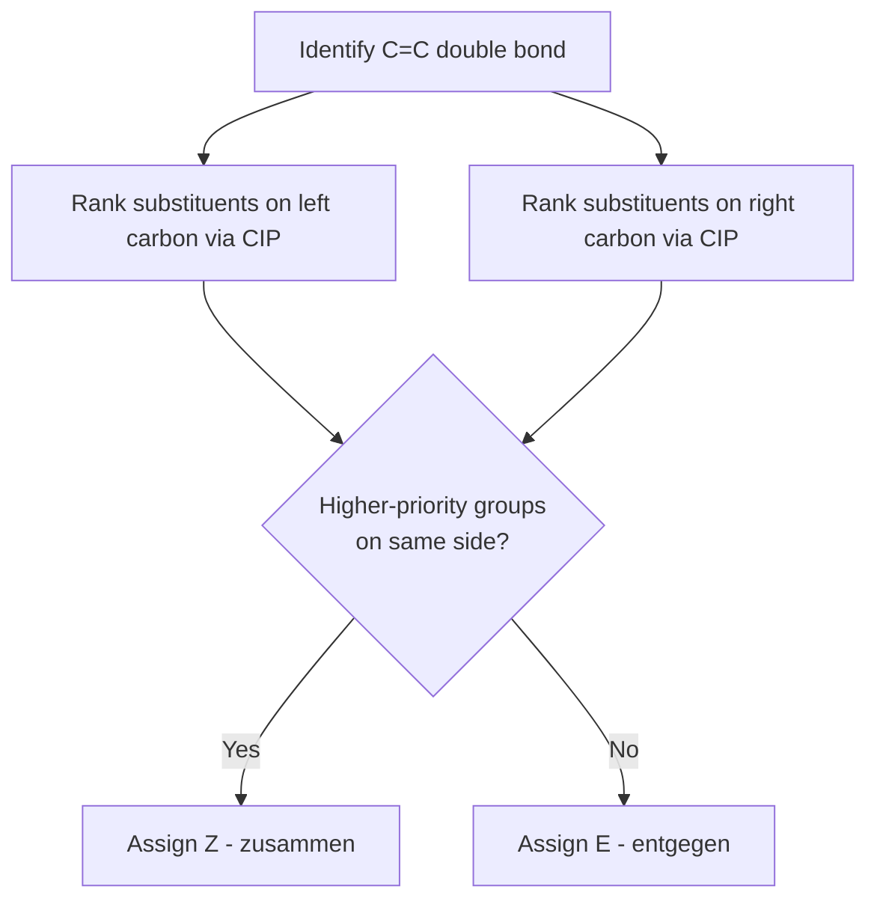

## E and Z Nomenclature

### Overview

E/Z nomenclature is the IUPAC system used to unambiguously specify the configuration of substituents around a double bond (or other stereogenic units with restricted rotation, such as certain ring systems and cumulated dienes) when the older *cis/trans* system becomes ambiguous. The letters stand for the German words *Entgegen* (opposite) and *Zusammen* (together).

### Why cis/trans Fails

The *cis/trans* system only works cleanly when each carbon of the double bond bears one hydrogen and one other group, so there is an obvious "reference" substituent to compare. Once each doubly-bonded carbon carries two different non-hydrogen substituents, there is no automatic way to decide which pair of groups should be compared as "same side" or "opposite side." E/Z nomenclature resolves this by ranking the two substituents on each carbon using the Cahn–Ingold–Prelog (CIP) priority rules, so a definite, non-arbitrary comparison can always be made.

### CIP Priority Rules (Applied to Each Double-Bond Carbon)

**Step 1: Atomic number comparison**

At each sp² carbon of the double bond, compare the atomic number of the atom directly attached. Higher atomic number = higher priority.

**Step 2: Duplicate atom convention for multiple bonds**

A double or triple bond is treated as if each atom were duplicated, bonded to a phantom atom of the same type with atomic number equal to the real atom, but no further substituents. For example, C=O is treated as C bonded to (O, O-duplicate) and O bonded to (C, C-duplicate).

**Step 3: Sphere-by-sphere comparison**

If the first atoms attached are tied, move outward to the next set of atoms attached to those first atoms, comparing sets in order of decreasing priority until a difference is found.

**Step 4: Isotope tie-breaking**

If atomic number ties persist (isotopes), higher atomic mass takes priority (e.g., deuterium > protium).

### Assigning E or Z

**Procedure:**

1. On the left-hand carbon of the C=C double bond, rank the two substituents: higher priority (a) vs. lower priority (b).
2. On the right-hand carbon, rank the two substituents: higher priority (a′) vs. lower priority (b′).
3. Compare the spatial relationship of the two higher-priority groups (a and a′):
   - If the two higher-priority groups are on the **same side** of the double bond → **Z** (*zusammen*, together)
   - If the two higher-priority groups are on **opposite sides** → **E** (*entgegen*, opposite)

**Key Points**

- E/Z assignment is independent of the molecular name's "cis" or "trans" labeling; a compound can be cis but E, or cis but Z, depending on priorities.
- E/Z descriptors are italicized and placed in parentheses with a locant when needed: (2*E*,4*Z*)-hexa-2,4-diene.
- A double bond with a terminal =CH₂ group or with two identical substituents on one carbon has no E/Z isomerism, since the priority comparison on that carbon is undefined (there is no "higher" vs. "lower" — both substituents are the same).

### Worked Examples

**Example 1: 2-Bromo-2-butene, CH₃–CBr=CH–CH₃**

Left carbon substituents: Br and CH₃. Priority: Br (Z=35) > CH₃ (Z=6).

Right carbon substituents: H and CH₃. Priority: CH₃ (Z=6) > H (Z=1).

- If Br and CH₃ (right-side higher priority) are on the same side → **Z**-2-bromo-2-butene
- If on opposite sides → **E**-2-bromo-2-butene

Note this is the classic case where the *higher-priority* group on the left (Br) is a heavier atom than the group with which it might be visually "aligned" in a cis-drawn structure, so the E/Z label does not necessarily match the cis/trans label.

**Example 2: Comparing cis/trans mismatch — 1-Bromo-1-chloropropene, CH₃–CH=CBrCl**

Left carbon: H and CH₃ → CH₃ higher priority.

Right carbon: Br and Cl → Br higher priority (Z=35 vs 17).

If CH₃ and Br are on the same side, this would traditionally be drawn similarly to a "cis" arrangement of the two halogens, but by CIP rules it is designated Z because the two *highest-priority* groups (CH₃ and Br) are together — illustrating why cis/trans and E/Z can diverge.

**Example 3: Duplicate-atom rule — comparing –CH=CH₂ vs. –CHO**

For a vinyl group (–CH=CH₂) attached to a stereocenter carbon, the attached carbon's substituents are treated as (C, C-duplicate, H). For an aldehyde group (–CHO), the carbon's substituents are treated as (O, O-duplicate, H). Comparing first atoms: O > C, so –CHO outranks –CH=CH₂ despite both having a "carbon" as the literal first atom in a naive comparison.

### Multiple Double Bonds and Locants

For polyenes, each double bond is assigned its own E or Z descriptor with the appropriate locant:

(2*E*,4*Z*,6*E*)-octa-2,4,6-triene

Each descriptor applies only to the double bond at that locant; the CIP analysis must be performed independently at each site.

### Diagram: Decision Process for Assigning E/Z

### Structural Comparison (svg_diagram)

<svg xmlns="http://www.w3.org/2000/svg" viewBox="0 0 640 320">
<text x="320" y="24" text-anchor="middle" font-size="16" font-weight="bold">E and Z configurations (svg_diagram)</text>

<text x="150" y="55" text-anchor="middle" font-size="14" font-weight="bold">Z isomer</text>

<line x1="80" y1="150" x2="150" y2="110" stroke="black" stroke-width="2" />

<line x1="150" y1="110" x2="220" y2="150" stroke="black" stroke-width="2" />

<line x1="146" y1="118" x2="216" y2="158" stroke="black" stroke-width="2" />

<line x1="80" y1="150" x2="80" y2="200" stroke="black" stroke-width="2" />

<line x1="150" y1="110" x2="150" y2="60" stroke="black" stroke-width="2" />

<line x1="220" y1="150" x2="220" y2="200" stroke="black" stroke-width="2" />

<text x="70" y="215" font-size="13">a (high)</text>

<text x="140" y="50" font-size="13">b (low)</text>

<text x="205" y="215" font-size="13">a' (high)</text>

<text x="60" y="145" font-size="11">(left C)</text>

<text x="225" y="145" font-size="11">(right C)</text>

<text x="150" y="270" text-anchor="middle" font-size="12">high-priority groups (a, a') same side → Z</text>

<text x="480" y="55" text-anchor="middle" font-size="14" font-weight="bold">E isomer</text>

<line x1="410" y1="150" x2="480" y2="110" stroke="black" stroke-width="2" />

<line x1="480" y1="110" x2="550" y2="150" stroke="black" stroke-width="2" />

<line x1="476" y1="118" x2="546" y2="158" stroke="black" stroke-width="2" />

<line x1="410" y1="150" x2="410" y2="200" stroke="black" stroke-width="2" />

<line x1="480" y1="110" x2="480" y2="60" stroke="black" stroke-width="2" />

<line x1="550" y1="150" x2="550" y2="100" stroke="black" stroke-width="2" />

<text x="400" y="215" font-size="13">a (high)</text>

<text x="470" y="50" font-size="13">b (low)</text>

<text x="535" y="90" font-size="13">a' (high)</text>

<text x="390" y="145" font-size="11">(left C)</text>

<text x="555" y="145" font-size="11">(right C)</text>

<text x="480" y="270" text-anchor="middle" font-size="12">high-priority groups (a, a') opposite sides → E</text>

</svg>

### Common Pitfalls

- **Confusing E/Z with cis/trans**: These systems are conceptually related but not interchangeable; always apply CIP priority rather than assuming cis = Z or trans = E.
- **Forgetting the duplicate-atom rule** when comparing substituents that themselves contain multiple bonds (C=O, C≡N, aromatic rings).
- **Applying E/Z to a carbon bearing two identical substituents**, where the descriptor is undefined because no isomerism exists at that carbon.
- **Stopping the CIP comparison at the first sphere** when atoms tie, rather than continuing outward through subsequent spheres.

### Related Topics

- Cahn–Ingold–Prelog (CIP) priority rules in full (including R/S assignment for chirality)
- cis/trans nomenclature and its historical relationship to E/Z
- Geometric isomerism in cyclic systems
- Stereochemistry of cumulated dienes (allenes) and their E/Z-like descriptors
- Effect of E/Z configuration on physical properties (boiling point, dipole moment, reactivity)
- Application of E/Z in naming natural products (e.g., retinal, fatty acids)