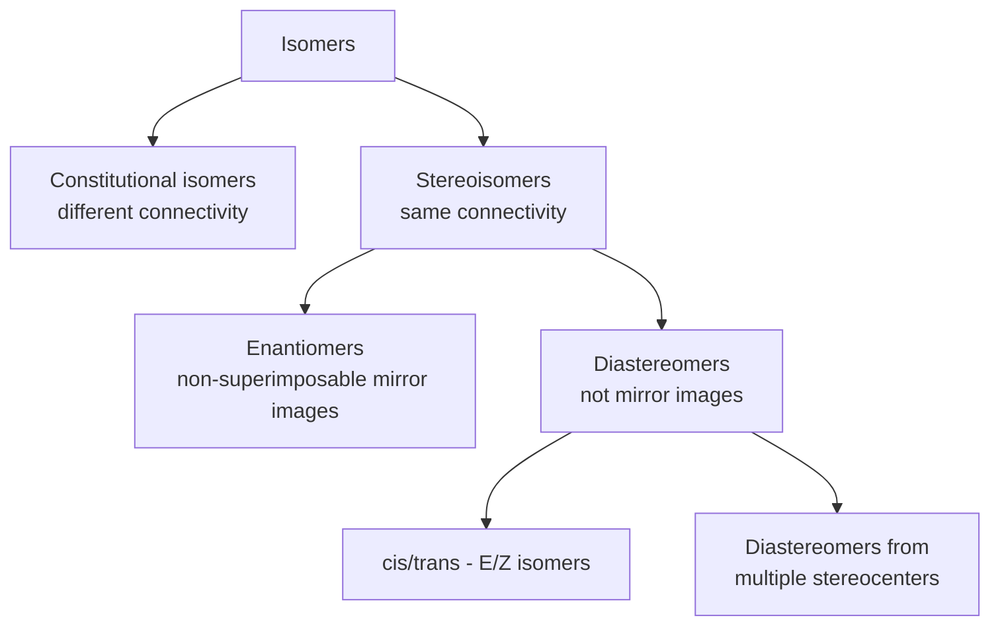

## Enantiomers and Diastereomers

### Overview

Enantiomers and diastereomers are the two subcategories of stereoisomers: molecules with identical molecular formulas and identical connectivity (constitution) but different spatial arrangements of atoms. Distinguishing them correctly requires understanding chirality, stereocenters, and how multiple stereocenters interact.

### Stereoisomer Classification

### Enantiomers

**Definition**: Enantiomers are stereoisomers that are non-superimposable mirror images of each other. A molecule that has a non-superimposable mirror image is termed *chiral*; the molecule and its mirror image together constitute an enantiomeric pair.

**Structural requirement**: Chirality most commonly arises from a stereocenter — typically a carbon bonded to four different substituents (a stereogenic carbon). Chirality can also arise without a classical stereocenter, from axial chirality (allenes, biphenyls with restricted rotation) or planar chirality.

**Key Points**

- Enantiomers have identical constitution (same atoms, same bonds).
- Enantiomers have identical physical properties in an achiral environment: same melting point, boiling point, density, refractive index, and solubility in achiral solvents.
- Enantiomers differ in their interaction with plane-polarized light: one rotates it clockwise (dextrorotatory, *d* or +) and the other rotates it counterclockwise by an equal magnitude (levorotatory, *l* or −). This property is called optical activity.
- Enantiomers react identically with achiral reagents but can react at different rates, or give different products, with chiral reagents (including biological molecules such as enzymes and receptors).
- A 1:1 mixture of two enantiomers is a *racemic mixture* (racemate), which shows no net optical rotation because the rotations cancel.
- The relationship between two enantiomers is described by the R/S (CIP) descriptors at each stereocenter: a molecule with one stereocenter designated *R* has an enantiomer designated *S*, with all other spatial relationships unchanged.

**Example**

(*R*)-2-butanol and (*S*)-2-butanol are enantiomers. Both have the formula C₄H₁₀O and identical connectivity (OH, CH₃, H, and CH₂CH₃ on the stereocenter), but the spatial arrangement at the stereocenter is mirrored. They have identical boiling points (~99.5 °C) but rotate plane-polarized light in opposite directions.

### Diastereomers

**Definition**: Diastereomers are stereoisomers that are *not* mirror images of each other. This includes:

1. Stereoisomers arising from two or more stereocenters where at least one, but not all, stereocenters differ in configuration.
2. cis/trans (E/Z) isomers of alkenes or rings, since these are also non-mirror-image stereoisomers.

**Key Points**

- Diastereomers are, in general, distinct compounds with different physical properties: different melting points, boiling points, densities, solubilities, and (usually) different specific rotations.
- Diastereomers can be separated by ordinary physical methods (distillation, crystallization, chromatography) because their physical properties differ — unlike enantiomers, which require a chiral environment to separate.
- Diastereomers react at different rates even with achiral reagents, since their spatial arrangements differ in ways that affect steric and electronic interactions.

**Example: Tartaric Acid System**

Tartaric acid, HOOC–CHOH–CHOH–COOH, has two stereocenters, giving rise to a well-known set of relationships:

- (2*R*,3*R*)-tartaric acid and (2*S*,3*S*)-tartaric acid are non-superimposable mirror images → **enantiomers** (this pair is optically active; one is "D-(−)-tartaric acid," the other "L-(+)-tartaric acid" historically).
- (2*R*,3*S*)-tartaric acid: this stereoisomer possesses an internal mirror plane relating the two stereocenters, making it superimposable on its own mirror image. It is achiral despite having two stereocenters — this is a **meso compound**.
- The (2*R*,3*R*) or (2*S*,3*S*) forms compared with the (2*R*,3*S*) meso form are **diastereomers** of each other: same connectivity, not mirror images, and they have measurably different melting points and solubility.

### Meso Compounds

**Definition**: A meso compound contains multiple stereocenters but is achiral overall because it possesses an internal symmetry element (typically an internal mirror plane) that makes the molecule identical to its own mirror image.

**Key Points**

- Meso compounds are optically inactive despite containing stereocenters.
- A meso compound is not a racemic mixture; it is a single achiral compound, not a 1:1 blend of two enantiomers.
- Recognizing a meso compound requires checking whether the molecule (or a readily accessible conformation of it, e.g., via bond rotation for open-chain systems) has an internal mirror plane or center of symmetry.

### Determining the Number of Stereoisomers

For a molecule with *n* stereocenters, the maximum number of stereoisomers is $2^n$, but this maximum is reduced when meso forms are present (since two of the theoretical stereocenter combinations collapse into a single achiral meso compound).

**Example calculation**: For tartaric acid, $n = 2$, so the naive count is $2^2 = 4$: (R,R), (S,S), (R,S), (S,R). However, (R,S) and (S,R) are the same compound (the meso form, due to the internal mirror symmetry), so the actual count of distinct stereoisomers is **3**: one enantiomeric pair (R,R)/(S,S) and one meso compound.

### Relationship Summary Table

| Relationship | Mirror images? | Same physical properties? | Optical rotation | Separable by normal methods |
| --- | --- | --- | --- | --- |
| Enantiomers | Yes | Identical (achiral environment) | Equal magnitude, opposite sign | No (requires chiral resolution) |
| Diastereomers | No | Different | Different (magnitude and/or sign) | Yes |
| Identical molecule | — | Identical | Identical | — |

### Distinguishing Enantiomers from Diastereomers: Worked Procedure

1. Confirm the two structures have identical molecular formula and connectivity (if not, they are constitutional isomers, not stereoisomers).
2. Assign CIP (R/S or E/Z) descriptors at every stereocenter/double bond in both structures.
3. Compare descriptor by descriptor:
   - If **every** descriptor is inverted (all R become S and vice versa, or all E become Z and vice versa, consistently at every stereogenic unit) → **enantiomers** (assuming no internal symmetry converts the pair into identical meso structures).
   - If **some but not all** descriptors are inverted → **diastereomers**.
   - If all descriptors are identical → the structures represent the same compound.

**Example**: (2*R*,3*R*,4*S*)-compound vs. (2*S*,3*S*,4*R*)-compound → all three centers inverted → enantiomers.

(2*R*,3*R*,4*S*)-compound vs. (2*R*,3*S*,4*S*)-compound → only the C3 descriptor differs → diastereomers.

### Physical and Biological Significance

**Key Points**

- Because diastereomers have different physical properties, they can be separated and independently characterized; this underlies techniques such as diastereomeric salt formation for resolving racemic mixtures (reacting a racemate with a single enantiomer of a chiral resolving agent produces a pair of diastereomeric salts with different solubilities).
- Enantiomers frequently have different biological activity because biological receptors and enzymes are themselves chiral; one enantiomer of a drug may be therapeutically active while the other is inactive or produces different effects. [Inference — the direction and magnitude of such differences are compound-specific and must be established experimentally for each case.]

### Related Topics

- R/S (CIP) nomenclature for assigning absolute configuration
- Fischer projections and their use in representing stereoisomers of sugars and tartaric acid
- Optical activity and polarimetry
- Resolution of racemic mixtures (diastereomeric salt formation, chiral chromatography)
- Meso compound identification strategies for symmetric polyol and diacid systems
- Relative vs. absolute configuration (syn/anti, threo/erythro descriptors)