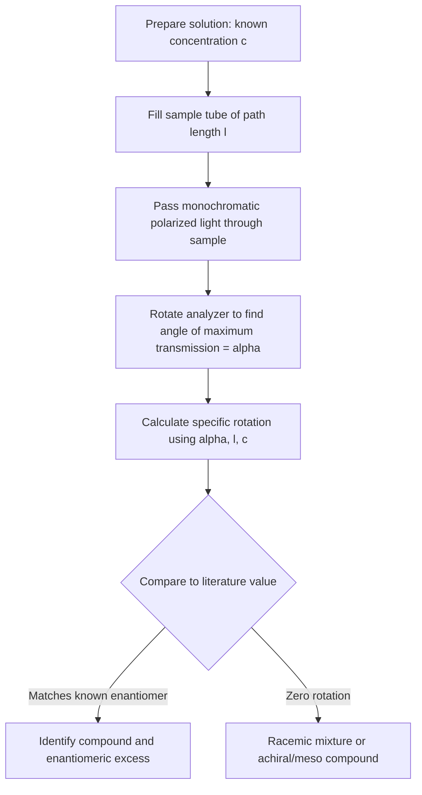

## Optical Activity

### Overview

Optical activity is the ability of a chiral substance to rotate the plane of plane-polarized light as it passes through the substance. This phenomenon provides a physical, measurable basis for detecting and quantifying chirality in molecules and is fundamental to characterizing enantiomers.

### Plane-Polarized Light

Ordinary light consists of electromagnetic waves oscillating in all planes perpendicular to the direction of propagation. When passed through a polarizing filter (e.g., a Nicol prism or polarizing film), only the component oscillating in a single plane is transmitted, producing **plane-polarized light**.

**Key Points**

- Plane-polarized light can be conceptually described as the superposition of two circularly polarized components of equal magnitude rotating in opposite directions (left- and right-circularly polarized light).
- When plane-polarized light passes through a chiral (optically active) medium, the two circular components travel at slightly different speeds (they experience different refractive indices, $n_L \neq n_R$, a phenomenon called circular birefringence). This differential propagation causes the recombined wave to emerge with its plane of polarization rotated by some angle.

### The Polarimeter

**Instrument components:**

1. A light source (typically monochromatic, often the sodium D-line at 589 nm).
2. A fixed polarizer, producing plane-polarized light.
3. A sample tube of known, fixed length containing the substance under test.
4. A rotatable analyzer (a second polarizer) with a calibrated angular scale, used to determine the angle through which the plane of polarization has been rotated.

**Procedure**: Light is polarized, passed through the sample, and then through the analyzer. The analyzer is rotated until maximum light transmission (or, in practice, until a null/minimum point using a split-field technique for greater precision) is observed. The angle of rotation required, $\alpha$, is the **observed rotation**.

### Specific Rotation

Since the observed rotation angle $\alpha$ depends on concentration, path length, wavelength, and temperature, a standardized quantity called **specific rotation**, $[\alpha]$, is defined to allow comparison between different measurements and different substances:

$$[\alpha]^{T}_{\lambda} = \frac{\alpha}{l \cdot c}$$

where:

- $\alpha$ = observed rotation in degrees
- $l$ = path length of the sample tube, in decimeters (dm)
- $c$ = concentration of the solution, in g/mL
- $T$ = temperature (°C), $\lambda$ = wavelength of light used (commonly the sodium D-line, denoted D)

**Key Points**

- Specific rotation is an intensive physical property characteristic of a pure chiral substance under specified conditions, analogous to melting point or refractive index, and is commonly reported in reference tables.
- Reported as $[\alpha]^{25}_{D} = +XX°$ or $-XX°$, specifying temperature and wavelength.
- For pure liquids (rather than solutions), a modified formula uses density in place of concentration.

### Dextrorotatory and Levorotatory

- **Dextrorotatory (+ or *d*)**: rotates the plane of polarized light clockwise (to the right), as viewed facing the oncoming light source.
- **Levorotatory (− or *l*)**: rotates the plane of polarized light counterclockwise (to the left).

**Key Points**

- The sign of rotation (+/−) is an experimentally measured property and **cannot be predicted from the R/S configuration alone**; there is no general correlation between CIP descriptor (R or S) and the direction of optical rotation. A compound designated *R* may be dextrorotatory or levorotatory depending on the specific substituents — this must be determined experimentally.
- Two enantiomers of a given compound always have specific rotations that are equal in magnitude but opposite in sign, e.g., (+)-glyceraldehyde and (−)-glyceraldehyde.
- Do not confuse the (+)/(−) or *d*/*l* optical-rotation notation with the D/L configurational notation used in carbohydrate and amino acid nomenclature (relative configuration referenced to glyceraldehyde); these are historically related but conceptually distinct labeling systems.

### Requirements for Optical Activity

**Key Points**

- A substance is optically active only if it is chiral, i.e., non-superimposable on its mirror image.
- The presence of a stereocenter is a common but not universal cause of chirality; axial chirality (allenes, certain biaryls) and planar chirality can also produce optically active compounds without a classical stereocenter.
- A molecule with stereocenters that is nonetheless *achiral* due to an internal mirror plane (a meso compound) shows **no** optical activity, since the internal symmetry causes the rotations from each half of the molecule to cancel.

### Racemic Mixtures and Optical Purity

**Racemic mixture (racemate)**: An exactly 1:1 mixture of two enantiomers.

**Key Points**

- A racemic mixture shows **zero net optical rotation**, because the equal-and-opposite rotations from each enantiomer cancel exactly.
- A racemic mixture is denoted with the prefix (±) or *rac*-.
- **Optical purity (enantiomeric excess, ee)** quantifies the composition of a mixture that is not perfectly racemic nor perfectly pure:

$$\%\,ee = \frac{[\alpha]_{\text{observed}}}{[\alpha]_{\text{pure enantiomer}}} \times 100\%$$

$$\%\,ee = \%R - \%S \quad \text{(or } \%S - \%R\text{, whichever is in excess)}$$

**Worked Example**: A sample of 2-butanol shows an observed specific rotation of $+9.2°$. Pure (*R*)-2-butanol (assumed to be the dextrorotatory enantiomer for this example) has $[\alpha] = +13.9°$.

$$\%\,ee = \frac{9.2}{13.9} \times 100\% \approx 66\%$$

An ee of 66% corresponds to a mixture that is 83% of the dominant enantiomer and 17% of the other, since:

$$\%\,ee = \%\text{major} - \%\text{minor}, \quad \%\text{major} + \%\text{minor} = 100\%$$

Solving: $\%\text{major} = \frac{100 + 66}{2} = 83\%$, $\%\text{minor} = 17\%$.

### Diagram: Polarimeter Schematic (svg_diagram)

<svg xmlns="http://www.w3.org/2000/svg" viewBox="0 0 700 220">
<text x="350" y="24" text-anchor="middle" font-size="16" font-weight="bold">Polarimeter schematic (svg_diagram)</text>
<circle cx="60" cy="120" r="18" fill="none" stroke="black" stroke-width="2" />
<text x="60" y="160" text-anchor="middle" font-size="12">Light source</text>
<line x1="78" y1="120" x2="150" y2="120" stroke="black" stroke-width="2" marker-end="url(#arrow)" />
<rect x="150" y="90" width="20" height="60" fill="none" stroke="black" stroke-width="2" />
<text x="160" y="170" text-anchor="middle" font-size="12">Polarizer</text>
<line x1="170" y1="120" x2="150" y2="120" stroke="none" />
<line x1="170" y1="120" x2="260" y2="120" stroke="black" stroke-width="2" marker-end="url(#arrow)" />
<text x="215" y="105" text-anchor="middle" font-size="11">plane-polarized</text>
<rect x="260" y="95" width="120" height="50" fill="none" stroke="black" stroke-width="2" />
<text x="320" y="170" text-anchor="middle" font-size="12">Sample tube (l)</text>
<text x="320" y="185" text-anchor="middle" font-size="11">chiral solution, conc. c</text>
<line x1="380" y1="120" x2="470" y2="120" stroke="black" stroke-width="2" marker-end="url(#arrow)" />
<text x="425" y="105" text-anchor="middle" font-size="11">rotated by α</text>
<rect x="470" y="90" width="20" height="60" fill="none" stroke="black" stroke-width="2" transform="rotate(20 480 120)" />
<text x="480" y="170" text-anchor="middle" font-size="12">Analyzer</text>
<text x="480" y="185" text-anchor="middle" font-size="11">(rotatable, reads α)</text>
<line x1="500" y1="120" x2="580" y2="120" stroke="black" stroke-width="2" marker-end="url(#arrow)" />
<circle cx="610" cy="120" r="4" fill="black" />
<text x="610" y="145" text-anchor="middle" font-size="12">Observer</text>
</svg>

### Optical Activity Measurement Workflow

### Common Pitfalls

- **Assuming R/S correlates with (+)/(−)**: These are independent — the sign of rotation must be measured experimentally, not deduced from configuration.
- **Confusing racemic mixtures with meso compounds**: Both show zero optical rotation, but a racemic mixture is a 1:1 blend of two distinct chiral molecules, whereas a meso compound is a single achiral molecule.
- **Neglecting wavelength and temperature dependence**: Specific rotation values are only comparable when measured under matching conditions (same $\lambda$, same $T$); values reported without these qualifiers are incomplete.
- **Ignoring solvent and concentration effects**: Specific rotation can vary measurably with solvent choice and concentration due to intermolecular interactions (e.g., hydrogen bonding, aggregation), so literature comparisons should use matched conditions where possible. [Inference — the magnitude of such solvent/concentration dependence is compound-specific.]

### Related Topics

- Enantiomers and diastereomers (source of optical activity)
- R/S (CIP) nomenclature and its non-correlation with optical rotation sign
- Circular dichroism and optical rotatory dispersion (ORD) as related chiroptical techniques
- Racemization mechanisms and kinetics
- Methods for determining absolute configuration (X-ray crystallography, chemical correlation)
- Chiral resolution techniques (diastereomeric salts, chiral HPLC)