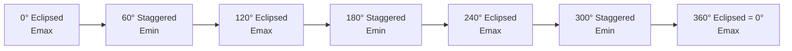
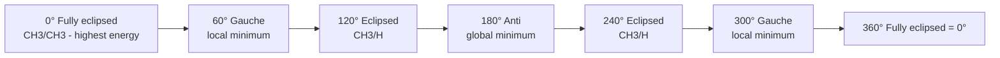

## Conformational Analysis

### Overview

Conformational analysis is the study of the energies and spatial arrangements adopted by a molecule as a result of rotation about single (σ) bonds. Unlike configurational stereoisomers (enantiomers, diastereomers), conformers are interconvertible at room temperature by bond rotation alone, without breaking any bonds. Conformational analysis explains reactivity, stability, and physical properties in terms of these low-barrier rotational states.

### Conformers vs. Configurational Isomers

**Key Points**

- Conformers (rotamers) are different spatial arrangements of the same molecule generated by rotation around single bonds; interconversion typically requires only a few kcal/mol and occurs rapidly at room temperature.
- Configurational isomers (enantiomers, diastereomers, E/Z isomers) require bond-breaking to interconvert and are, for practical purposes, configurationally stable and isolable.
- Conformers are generally not isolable as separate compounds under ordinary conditions because interconversion is fast on laboratory timescales.

### Newman Projections

A Newman projection views a molecule along a chosen C–C bond axis: the front atom is represented as a point (with three bonds radiating from it), and the back atom is represented as a circle (with three bonds drawn from the circle's edge).

**Key torsional relationships:**

- **Eclipsed conformation**: front and back substituents are aligned (dihedral angle = 0°, 120°, 240°, etc.)
- **Staggered conformation**: front and back substituents are offset by 60° from eclipsed positions (dihedral angle = 60°, 180°, 300°)

### Diagram: Newman Projections of Ethane (svg_diagram)

<svg xmlns="http://www.w3.org/2000/svg" viewBox="0 0 640 320">
<text x="320" y="24" text-anchor="middle" font-size="16" font-weight="bold">Newman projections: ethane conformers (svg_diagram)</text>

<text x="160" y="55" text-anchor="middle" font-size="14" font-weight="bold">Staggered</text>

<circle cx="160" cy="160" r="45" fill="none" stroke="black" stroke-width="2" />

<circle cx="160" cy="160" r="3" fill="black" />

<line x1="160" y1="160" x2="160" y2="105" stroke="black" stroke-width="2" />

<line x1="160" y1="160" x2="121" y2="187" stroke="black" stroke-width="2" />

<line x1="160" y1="160" x2="199" y2="187" stroke="black" stroke-width="2" />

<line x1="160" y1="205" x2="160" y2="235" stroke="black" stroke-width="2" />

<line x1="122" y1="132" x2="100" y2="115" stroke="black" stroke-width="2" />

<line x1="198" y1="132" x2="220" y2="115" stroke="black" stroke-width="2" />

<text x="160" y="255" text-anchor="middle" font-size="11">back H (120° apart)</text>

<text x="480" y="55" text-anchor="middle" font-size="14" font-weight="bold">Eclipsed</text>

<circle cx="480" cy="160" r="45" fill="none" stroke="black" stroke-width="2" />

<circle cx="480" cy="160" r="3" fill="black" />

<line x1="480" y1="160" x2="480" y2="105" stroke="black" stroke-width="2" />

<line x1="480" y1="160" x2="441" y2="187" stroke="black" stroke-width="2" />

<line x1="480" y1="160" x2="519" y2="187" stroke="black" stroke-width="2" />

<line x1="480" y1="205" x2="480" y2="230" stroke="black" stroke-width="2" stroke-dasharray="2,2" />

<line x1="480" y1="205" x2="480" y2="180" stroke="black" stroke-width="2" />

<line x1="480" y1="105" x2="480" y2="80" stroke="black" stroke-width="2" stroke-dasharray="2,2" />

<text x="480" y="255" text-anchor="middle" font-size="11">back H eclipses front H</text>

</svg>

### Conformational Analysis of Ethane

**Torsional strain (eclipsing strain)**: The energy penalty associated with eclipsed conformations, arising primarily from repulsion between bonding electron pairs in the C–H bonds (electronic/hyperconjugative effects rather than simple steric bulk, since hydrogen atoms are small).

- Staggered ethane is the energy minimum.
- Eclipsed ethane is the energy maximum, roughly 12 kJ/mol (2.9 kcal/mol) higher than staggered — the rotational barrier for ethane.
- With three equivalent staggered and three equivalent eclipsed conformations, rotation about the C–C bond produces a smooth periodic energy profile with a period of 120°.

### Energy Profile of Ethane Rotation

### Conformational Analysis of Butane

Butane (CH₃CH₂CH₂CH�3) introduces steric interactions between the two methyl groups, giving rise to distinct named conformations when viewed along the C2–C3 bond:

| Dihedral angle (CH₃–C–C–CH₃) | Conformation name | Relative energy |
| --- | --- | --- |
| 180° | anti | Lowest (reference, 0 kJ/mol) |
| 60° | gauche | ~3.8 kJ/mol (0.9 kcal/mol) higher than anti |
| 120° | eclipsed (methyl/H) | Higher still |
| 0° | fully eclipsed (methyl/methyl) | Highest, ~19–25 kJ/mol above anti |

**Key Points**

- The **anti conformation** places the two methyl groups $180°$ apart, minimizing steric (van der Waals) strain between them; it is the most stable conformation and predominates at equilibrium.
- The **gauche conformation** places the methyl groups $60°$ apart, introducing steric strain from their proximity (gauche interaction/strain), making it higher in energy than anti but still a local minimum.
- Two equivalent gauche conformations exist (dihedral ±60°), related by the molecule's symmetry.
- The fully eclipsed conformation (methyl groups eclipsing each other at 0°) is the highest-energy point on the rotational profile due to combined torsional strain and severe steric (methyl–methyl) strain.
- At room temperature, butane exists predominantly as a rapidly interconverting mixture heavily weighted toward the anti conformation, with a measurable gauche population, consistent with a Boltzmann distribution over the energy differences. [Inference — precise population ratios depend on the exact energy values used and temperature.]

### Diagram: Butane Energy Profile

### Cyclohexane Conformations

Cyclohexane is the archetype for conformational analysis in ring systems, since its ring can adopt several distinct three-dimensional shapes that avoid the angle strain present in a hypothetical planar hexagon.

**Chair conformation**

- The most stable conformation of cyclohexane; all C–C–C bond angles are close to the ideal tetrahedral angle ($\approx 109.5°$), eliminating angle strain.
- All adjacent C–H bonds are perfectly staggered around the ring, eliminating torsional strain.
- Each carbon bears one **axial** substituent (pointing roughly parallel to the ring's symmetry axis) and one **equatorial** substituent (pointing roughly outward from the ring), alternating up/down around the ring.

**Boat conformation**

- Higher in energy than the chair, roughly 25–30 kJ/mol (6–7 kcal/mol) above chair, due to:
  - **Flagpole interactions**: steric strain between the two flagpole hydrogens at the "bow" and "stern" positions of the boat.
  - **Torsional strain**: eclipsing interactions along the sides of the boat (the C2–C3 and C5–C6 bonds are eclipsed, unlike in the chair).

**Twist-boat (skew-boat) conformation**

- A slightly twisted version of the boat that relieves some flagpole and torsional strain; lower in energy than the pure boat but still higher than the chair (roughly 21–23 kJ/mol above chair).
- Represents a local energy minimum on the ring-puckering pathway, unlike the boat, which is typically treated as a transition-state-like (or near-maximum) structure. [Inference — the precise categorization of boat vs. twist-boat as minima/maxima depends on the level of computational theory used.]

**Ring flip (chair–chair interconversion)**

- The two chair conformations of cyclohexane interconvert via a low-barrier pathway passing through half-chair, twist-boat, and boat intermediate geometries.
- Ring flipping converts every axial substituent to equatorial and vice versa, while leaving the "up/down" face designation of each substituent unchanged.
- The barrier to ring flipping in cyclohexane itself is approximately 45 kJ/mol (10.8 kcal/mol), fast enough at room temperature that the two chair forms interconvert on the order of thousands of times per second, so individual chair conformers of unsubstituted cyclohexane cannot be isolated at room temperature. [Inference — the exact interconversion rate is temperature-dependent and is derived from NMR line-shape/coalescence studies.]

### Diagram: Cyclohexane Ring Flip (svg_diagram)

<svg xmlns="http://www.w3.org/2000/svg" viewBox="0 0 640 260">
<text x="320" y="24" text-anchor="middle" font-size="16" font-weight="bold">Cyclohexane chair ring-flip (svg_diagram)</text>

<polyline points="80,140 140,110 220,130 260,105 200,150 120,165 80,140" fill="none" stroke="black" stroke-width="2" />

<line x1="140" y1="110" x2="140" y2="70" stroke="black" stroke-width="1.5" />

<line x1="260" y1="105" x2="260" y2="65" stroke="black" stroke-width="1.5" />

<line x1="80" y1="140" x2="80" y2="185" stroke="black" stroke-width="1.5" />

<line x1="200" y1="150" x2="200" y2="195" stroke="black" stroke-width="1.5" />

<text x="170" y="220" text-anchor="middle" font-size="12">Chair A</text>

<line x1="300" y1="140" x2="360" y2="140" stroke="black" stroke-width="2" marker-end="url(#arrow2)" />
<text x="330" y="130" text-anchor="middle" font-size="10">ring flip</text>

<polyline points="400,150 440,105 480,150 560,130 620,140 560,165 400,150" fill="none" stroke="black" stroke-width="2" />

<line x1="440" y1="105" x2="440" y2="65" stroke="black" stroke-width="1.5" />

<line x1="560" y1="130" x2="560" y2="90" stroke="black" stroke-width="1.5" />

<line x1="400" y1="150" x2="400" y2="195" stroke="black" stroke-width="1.5" />

<line x1="620" y1="140" x2="620" y2="185" stroke="black" stroke-width="1.5" />

<text x="510" y="220" text-anchor="middle" font-size="12">Chair B (axial ↔ equatorial swapped)</text>

</svg>

### Substituted Cyclohexanes and A-Values

For monosubstituted cyclohexanes, the equatorial position is generally preferred because axial substituents experience **1,3-diaxial interactions** — steric clashes with the axial hydrogens (or substituents) at the two other axial positions on the same face of the ring (C3 and C5 relative to a substituent at C1).

**A-value**: The A-value of a substituent is the free-energy difference (in kcal/mol) between its axial and equatorial placement in a monosubstituted cyclohexane, reflecting the substituent's preference for the equatorial position.

| Substituent | Approximate A-value (kcal/mol) |
| --- | --- |
| F | 0.15–0.3 |
| CH₃ | 1.7 |
| CH(CH₃)₂ (isopropyl) | 2.1 |
| C(CH₃)₃ (*tert*-butyl) | ≥ 4.7–5 |
| OH | 0.5–1.0 |
| Ph (phenyl) | 2.8–3.0 |

**Key Points**

- Larger A-values indicate a stronger equatorial preference due to greater steric bulk causing more severe 1,3-diaxial strain when axial.
- The *tert*-butyl group has such a high A-value that *tert*-butylcyclohexane is often treated as **conformationally locked**: the ring flip that would place the *tert*-butyl group axial is so disfavored that the compound exists overwhelmingly in the conformation with *tert*-butyl equatorial. [Inference — "locked" is a practical approximation; a small equilibrium population of the axial form still exists in principle.]

### Disubstituted Cyclohexanes

For disubstituted cyclohexanes, both **cis/trans relationship** and **ring position (1,2 / 1,3 / 1,4)** determine which conformer (and which substituent placements) are favored:

| Substitution pattern | cis relationship | trans relationship |
| --- | --- | --- |
| 1,2-disubstituted | one axial, one equatorial (in either chair) | diequatorial or diaxial possible |
| 1,3-disubstituted | diequatorial or diaxial possible | one axial, one equatorial |
| 1,4-disubstituted | one axial, one equatorial | diequatorial or diaxial possible |

**Key Points**

- For each pattern, the more stable chair conformer is generally the one that maximizes the number of larger substituents in equatorial positions, since equatorial placement minimizes 1,3-diaxial strain.
- For *trans*-1,4-disubstituted and *cis*-1,3-disubstituted cyclohexanes with two different-sized substituents, ring flipping allows access to a conformer with both groups equatorial, which strongly dominates the equilibrium population if there is a large size difference between the groups.

### Common Pitfalls

- **Confusing conformers with configurational stereoisomers**: Conformers interconvert by bond rotation without breaking bonds; enantiomers/diastereomers require bond-breaking. Ring-flip interconversion of chair conformers does not change the *cis/trans* relationship between substituents.
- **Assuming all substituents have similarly small A-values**: Bulky groups like *tert*-butyl dominate conformational preference and can force a normally-favored substituent into the axial position.
- **Forgetting that ring flip swaps axial/equatorial but not up/down face**: A substituent that is "up" stays "up" after a ring flip; only its axial/equatorial character changes.
- **Overgeneralizing energy values**: Barrier heights and A-values are specific to the parent system studied and can shift with additional substitution or solvent. [Inference — exact numeric values vary somewhat between literature sources depending on the measurement method.]

### Related Topics

- Newman projections and torsional (dihedral) angle notation
- Ring strain in cycloalkanes (angle strain, torsional strain, transannular strain)
- 1,3-Diaxial interactions and A-values in detail
- Conformational analysis of substituted cyclohexanes with multiple stereocenters
- Anomeric effect in carbohydrate ring conformations
- Molecular mechanics and computational conformational searching