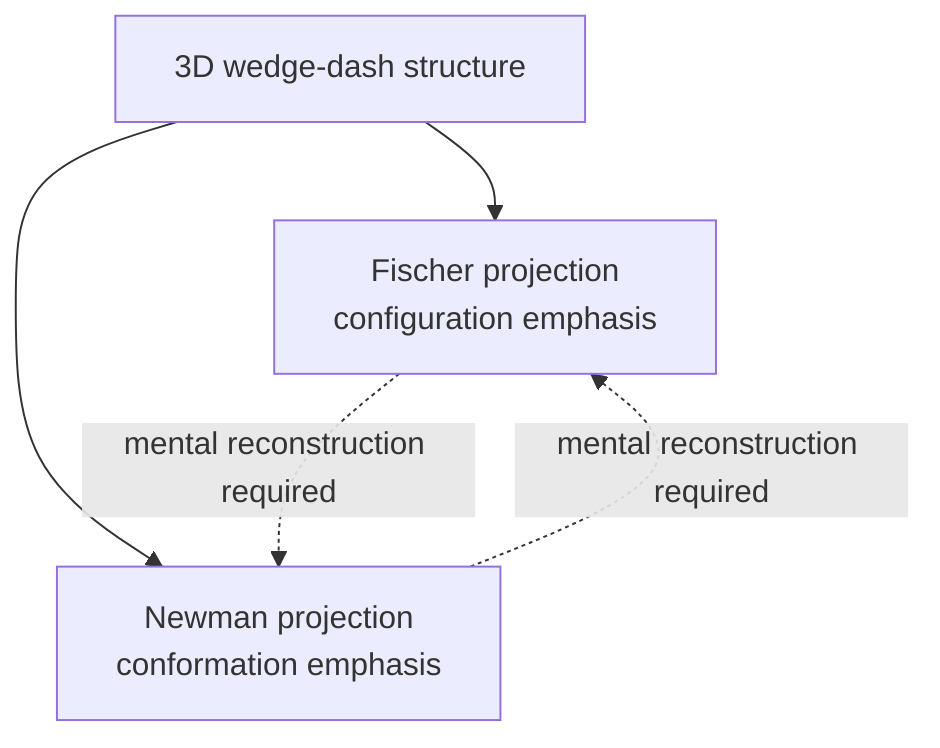

## Fischer and Newman Projections

### Overview

Fischer and Newman projections are two-dimensional drawing conventions used to represent the three-dimensional arrangement of atoms in a molecule. Each convention is optimized for a different purpose: Fischer projections excel at representing configuration at stereocenters (especially in chains with multiple stereocenters, such as sugars), while Newman projections excel at representing conformation around a specific single bond.

### Fischer Projections

**Construction convention:**

- A stereocenter is represented as the intersection of a vertical and a horizontal line (a cross).
- **Horizontal lines represent bonds coming toward the viewer** (out of the page, wedge-like).
- **Vertical lines represent bonds going away from the viewer** (into the page, dash-like).
- The main carbon chain is conventionally drawn vertically, with the highest-priority (often most oxidized) carbon at the top.

**Key Points**

- Fischer projections were developed by Emil Fischer originally to represent sugar stereochemistry and remain the standard convention in carbohydrate chemistry.
- A Fischer projection implicitly represents a specific eclipsed conformation of the molecule (the "all-eclipsed" backbone arrangement), even though the actual molecule in solution predominantly exists in staggered, lower-energy conformations. The projection is a *configurational* tool, not a literal conformational depiction.
- For molecules with multiple stereocenters, each stereocenter is represented by its own cross along the vertical chain.

### Diagram: Fischer Projection Construction (svg_diagram)

<svg xmlns="http://www.w3.org/2000/svg" viewBox="0 0 500 260">
<text x="250" y="24" text-anchor="middle" font-size="16" font-weight="bold">Fischer projection convention (svg_diagram)</text>
<line x1="250" y1="60" x2="250" y2="200" stroke="black" stroke-width="2" />
<line x1="170" y1="130" x2="330" y2="130" stroke="black" stroke-width="2" />

<text x="250" y="50" text-anchor="middle" font-size="13">CHO (top, toward viewer end)</text>

<text x="250" y="215" text-anchor="middle" font-size="13">CH2OH (bottom)</text>

<text x="150" y="125" text-anchor="end" font-size="13">OH</text>

<text x="350" y="125" text-anchor="start" font-size="13">H</text>

<text x="250" y="245" text-anchor="middle" font-size="11">Horizontal bonds = toward viewer | Vertical bonds = away from viewer</text>

</svg>

**Manipulating Fischer projections — permitted operations:**

1. **Rotation by 180° in the plane of the page** does not change the configuration represented (it is equivalent to viewing the same molecule from the opposite side while preserving all spatial relationships).
2. **Keeping one group fixed and rotating the other three groups by 120°** (a cyclic permutation of three substituents around the stereocenter) does not change the configuration.
3. **Swapping any two groups an even number of times** (0, 2, 4, ...) returns the same configuration; swapping an odd number of times (1, 3, ...) inverts the configuration and produces the enantiomer.

**Operations that are NOT permitted (each single instance inverts configuration):**

- Rotating the projection by 90° in the plane of the page.
- Lifting the projection out of the page and flipping it over (equivalent to a single swap).
- Swapping any two substituents a single time.

### Assigning R/S from a Fischer Projection

1. Assign CIP priorities to the four substituents (1 = highest, 4 = lowest).
2. If the lowest-priority group (4) is on a **horizontal** bond (pointing toward the viewer), trace 1→2→3 as drawn, then **reverse the apparent direction** (since the lowest priority group is toward, not away from, the viewer).
3. If the lowest-priority group (4) is on a **vertical** bond (pointing away from the viewer), trace 1→2→3 directly: clockwise = *R*, counterclockwise = *S*.

**Worked Example**: (*R*)-Glyceraldehyde in Fischer projection places CHO at top, CH₂OH at bottom, OH on the right (horizontal), H on the left (horizontal). Since the lowest-priority group (H) is on a horizontal bond, the apparent clockwise trace of OH(1) → CHO(2) → CH₂OH(3) must be reversed, but for D-glyceraldehyde the visual trace with OH on the right is clockwise, and after correctly accounting for the horizontal H position, this Fischer projection represents the (*R*) configuration — consistent with D-glyceraldehyde being (*R*)-glyceraldehyde.

### Fischer Projections in Carbohydrate Chemistry

**Key Points**

- The D/L configurational system for sugars is defined by the configuration at the stereocenter farthest from the carbonyl group (the "reference" stereocenter, historically compared to glyceraldehyde): if the OH group at that carbon points to the right in the standard Fischer projection (carbonyl at or near the top), the sugar is designated **D**; if to the left, **L**.
- D/L designation refers only to this reference-carbon configuration and does not by itself specify the configuration at other stereocenters in a polyhydroxy sugar chain — a full description requires either specifying the Fischer projection completely or providing R/S descriptors at every stereocenter.
- Diastereomeric sugars (e.g., glucose vs. galactose vs. mannose) are distinguished by the pattern of OH groups (left/right) at their respective Fischer-projection stereocenters, illustrating how Fischer projections make it visually straightforward to compare diastereomers differing at one or more centers.

### Newman Projections

**Construction convention:**

- The molecule is viewed along a chosen C–C (or other single) bond axis.
- The **front atom** is represented as a point at the center, with three bonds radiating outward at 120° intervals.
- The **back atom** is represented as a circle, with three bonds drawn from the circle's edge, also at 120° intervals, offset appropriately to represent the actual dihedral (torsional) angle between front and back substituents.

**Key Points**

- Newman projections are the standard tool for visualizing and comparing **staggered** and **eclipsed** conformations and for constructing potential-energy diagrams as a function of dihedral angle.
- The dihedral (torsion) angle between a front substituent and a back substituent is read directly off the projection as the angle between their respective lines.
- Unlike Fischer projections, Newman projections do not use a fixed convention linking wedge/dash to horizontal/vertical; instead, the visual geometry (point vs. circle, radiating lines) directly encodes the actual 3D relationship along the viewed bond.

### Comparison of Fischer and Newman Projections

| Feature | Fischer projection | Newman projection |
| --- | --- | --- |
| Primary purpose | Represent configuration (R/S) at stereocenters | Represent conformation (dihedral angle) about a bond |
| Convention | Horizontal = toward viewer, vertical = away | Front = point, back = circle, bonds at 120° |
| Implicit geometry shown | An eclipsed backbone arrangement (by convention) | Explicit staggered or eclipsed relationship, user-specified |
| Typical use case | Carbohydrates, amino acids, multi-stereocenter chains | Rotational barriers, gauche/anti/eclipsed analysis |
| Bond viewed | The full carbon backbone (multiple centers stacked vertically) | One specific σ-bond at a time |

### Interconverting Between Representations

Converting a Fischer projection to a Newman projection (or vice versa) for the same molecule requires:

1. Mentally reconstructing the 3D (wedge-dash or sawhorse) structure implied by the Fischer projection at the relevant stereocenter(s).
2. Choosing the bond axis of interest and reorienting the 3D structure to view along that axis.
3. Redrawing the front/back substituents according to Newman convention, being careful to preserve the actual spatial (not merely 2D-drawn) relationships established in step 1.

**Key Points**

- This conversion is a common source of error for students; the safest approach is to build a physical or mental 3D model (or use wedge-dash notation as an intermediate step) rather than attempting a direct visual transcription between the two 2D conventions.
- Since the Fischer projection's "eclipsed" backbone convention does not represent the molecule's actual lowest-energy conformation, a Newman projection derived faithfully from a Fischer projection (without additional rotation) will show an eclipsed arrangement along the chosen bond — the conformational information must be separately considered if the anti or gauche conformer is of interest.

### Diagram: Same Molecule, Two Projections

### Common Pitfalls

- **Rotating a Fischer projection by 90°**: This single operation inverts the apparent configuration and is a very common student error; only 180° in-plane rotations are configuration-preserving.
- **Treating a Fischer projection as a literal 3D conformation**: The implied eclipsed backbone is a drawing convention, not evidence that the molecule exists predominantly in that conformation.
- **Applying R/S priority tracing directly without checking the position of the lowest-priority group**: In a Fischer projection, the direction must be reversed if group 4 is on a horizontal (toward-viewer) bond.
- **Confusing D/L (Fischer-based, relative/historical) with R/S (CIP-based, absolute) or with d/l optical rotation direction**: These are three distinct labeling systems that happen to overlap in specific historical cases (e.g., D-glyceraldehyde being R) but are not interchangeable in general.

### Related Topics

- R/S (CIP) nomenclature and priority assignment
- Sawhorse projections as an alternative conformational drawing convention
- Carbohydrate stereochemistry: D/L system, aldoses and ketoses
- Conformational analysis (staggered/eclipsed/gauche/anti energetics)
- Wedge-dash notation and its relationship to Fischer projections
- Enantiomers and diastereomers in multi-stereocenter systems