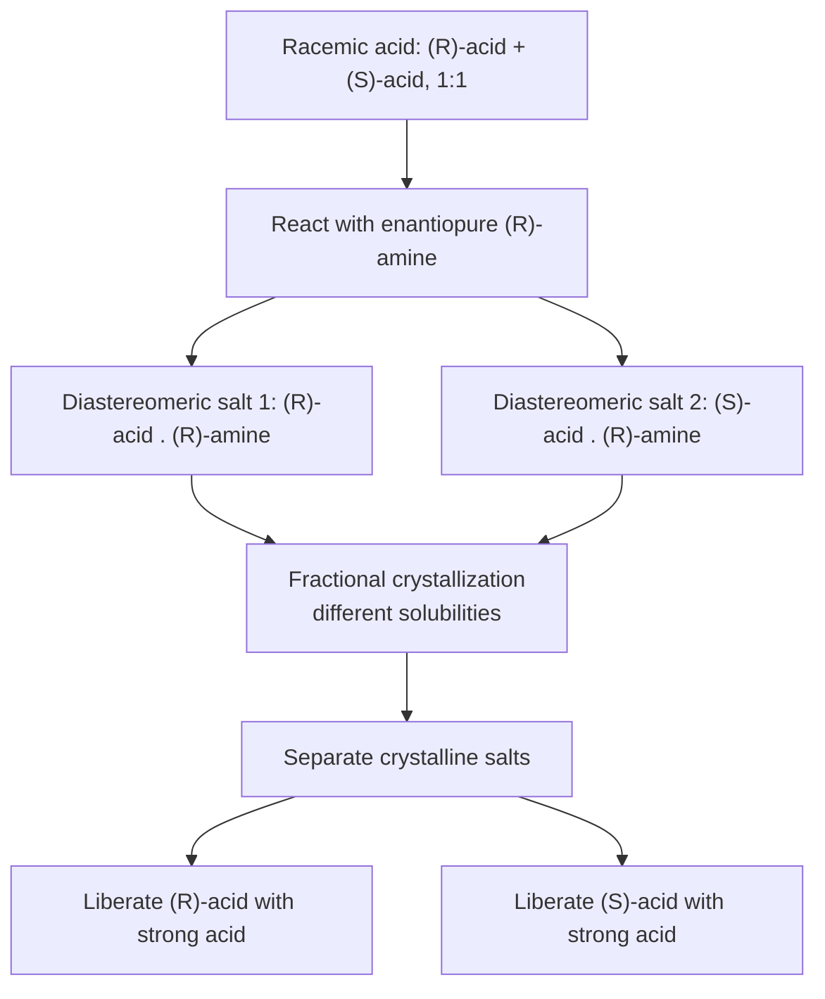
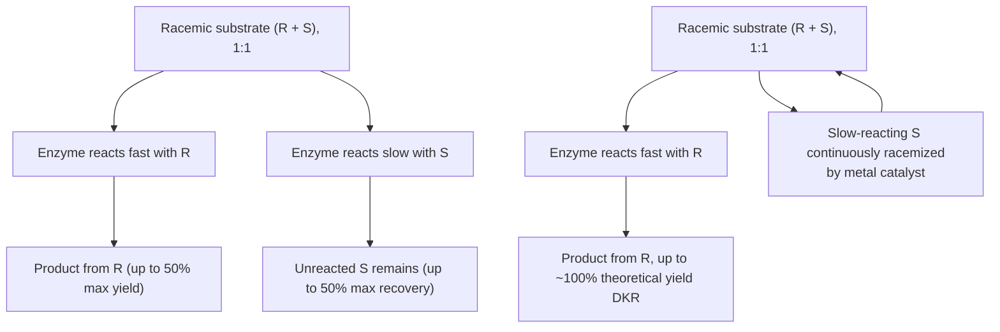

## Resolving Racemic Mixtures

### Overview

Resolution is the process of separating a racemic mixture (a 1:1 blend of two enantiomers) into its two individual enantiomerically pure (or enantiomerically enriched) components. Because enantiomers share identical physical properties in an achiral environment, resolution requires introducing chirality somewhere in the separation process — through a chiral resolving agent, a chiral stationary phase, an enzyme, or a chiral physical environment.

### Why Enantiomers Cannot Be Separated by Ordinary Methods

**Key Points**

- Enantiomers have identical melting points, boiling points, solubilities, and chromatographic behavior on achiral stationary phases, since these properties depend only on interactions in an achiral environment, where the two enantiomers behave identically.
- Any separation method must therefore introduce a chiral element that interacts differently with each enantiomer, converting the problem into one of separating diastereomers (which *do* have different physical properties) or exploiting chirality-dependent interaction energies directly.

### Method 1: Diastereomeric Salt Formation (Classical Resolution)

This is the oldest and most widely taught resolution technique, historically developed by Louis Pasteur and refined by others for acid/base pairs.

**Procedure:**

1. React the racemic mixture (containing, e.g., a racemic carboxylic acid) with a single enantiomer of a chiral resolving agent (e.g., an enantiopure amine base, such as brucine, quinine, or (*R*)-1-phenylethylamine).
2. The reaction produces two diastereomeric salts: (*R*-acid)·(*R*-amine) and (*S*-acid)·(*R*-amine). These are diastereomers of each other, not enantiomers, because the resolving agent's configuration is fixed while the acid's configuration differs between the two salts.
3. Because diastereomers have different physical properties (notably different solubilities), the two salts can be separated by fractional crystallization — typically one salt crystallizes preferentially from a chosen solvent while the other remains in solution.
4. Each separated diastereomeric salt is then treated with a strong acid or base to liberate the free (now enantiomerically enriched or pure) acid, and the chiral resolving agent is recovered and can, in principle, be reused.

### Diagram: Classical Resolution via Diastereomeric Salts

**Key Points**

- Common chiral resolving agents include naturally occurring chiral bases (brucine, quinine, cinchonidine) and acids (tartaric acid, camphorsulfonic acid), chosen historically for their availability in enantiopure form from natural sources.
- The efficiency of this method depends heavily on finding a resolving agent and solvent system that produces a large enough solubility difference between the two diastereomeric salts; this is often found empirically through screening.
- This method is applicable primarily to compounds bearing an acidic or basic functional group capable of salt formation (carboxylic acids, amines, sometimes alcohols via derivatization).

### Method 2: Chiral Chromatography

**Principle**: A chiral stationary phase (CSP) — a chromatographic medium coated or bonded with an enantiopure chiral selector — interacts differently (via differential binding, hydrogen bonding, π-stacking, or steric fit) with each enantiomer of the racemic analyte, causing them to have different retention times and elute separately.

**Common techniques:**

- **Chiral HPLC (High-Performance Liquid Chromatography)**: Uses chiral stationary phases such as derivatized cellulose or amylose polymers, cyclodextrin-based phases, or Pirkle-type phases (small chiral molecules bonded to silica).
- **Chiral GC (Gas Chromatography)**: Uses volatile chiral stationary phases, often based on cyclodextrin derivatives, suitable for volatile racemic analytes.
- **Simulated Moving Bed (SMB) chromatography**: A continuous, industrial-scale chromatographic technique that improves throughput and solvent efficiency for large-scale enantiomer separation.

**Key Points**

- Chiral chromatography is widely used both analytically (to determine enantiomeric excess, ee, of a sample) and preparatively (to isolate enantiopure material on gram-to-kilogram scales).
- Unlike diastereomeric salt formation, chiral chromatography does not require the analyte to have an acidic/basic functional group, making it more broadly applicable.
- Method development (selecting the appropriate CSP, mobile phase, and conditions) is often empirical and can require significant optimization for a given analyte.

### Method 3: Enzymatic (Kinetic) Resolution

**Principle**: Enzymes are inherently chiral catalysts (built from L-amino acids) and therefore react at different rates with the two enantiomers of a racemic substrate. In a kinetic resolution, the enzyme selectively converts one enantiomer to product much faster than the other, allowing separation of the unreacted enantiomer from the newly formed product.

**Common enzyme classes used:**

- **Lipases and esterases**: Commonly used to selectively hydrolyze one enantiomer of a racemic ester (or selectively esterify one enantiomer of a racemic alcohol), leaving the other enantiomer largely unreacted.
- **Proteases**: Used for selective hydrolysis of amino acid derivatives and related substrates.

**Key Points**

- A fundamental limitation of simple kinetic resolution is that the **maximum theoretical yield of each enantiomer is 50%**, since the racemic starting material is inherently a 1:1 mixture and the method separates rather than converts both enantiomers.
- The efficiency and selectivity of a kinetic resolution are quantified by the **enantiomeric ratio (E-value)**, which reflects the relative rate of enzymatic reaction between the two enantiomers; a high E-value indicates good selectivity.
- **Dynamic kinetic resolution (DKR)** overcomes the 50% yield ceiling by combining the enzymatic kinetic resolution with an in-situ racemization catalyst (often a transition-metal catalyst) that continuously interconverts the slow-reacting enantiomer back into a mixture, allowing, in principle, up to 100% conversion into a single enantiomer of product. [Inference — actual yields in DKR depend on the specific catalyst/enzyme pairing and reaction conditions.]

### Diagram: Kinetic Resolution vs. Dynamic Kinetic Resolution

### Method 4: Chiral Pool Synthesis (Related Strategy, Not True Resolution)

**Note**: This is technically a strategy for *obtaining* enantiopure material rather than resolving an existing racemate, but it is commonly discussed alongside resolution methods as an alternative approach.

- The "chiral pool" refers to the large collection of inexpensive, naturally occurring enantiopure compounds (amino acids, sugars, terpenes, tartaric acid) available from biological sources.
- A target enantiopure compound can sometimes be synthesized starting from a chiral pool material, using its existing stereocenter(s) to control the stereochemical outcome of the synthesis, avoiding the need for resolution altogether.

### Method 5: Preferential Crystallization (Direct Resolution)

**Principle**: Applicable to racemic mixtures that form a **conglomerate** (a physical mixture of separate crystals of each pure enantiomer, rather than a single crystal form containing both enantiomers in one lattice, called a racemic compound).

**Procedure**: A supersaturated solution of the racemate is seeded with a small crystal of one pure enantiomer, which preferentially induces crystallization of additional material of that same enantiomer, allowing physical separation of a crop of nearly enantiopure crystals.

**Key Points**

- This method requires that the racemate crystallizes as a conglomerate rather than a racemic compound or solid solution; only a minority of racemic solids (historically estimated around 5–10%) form conglomerates, limiting the general applicability of this method. [Inference — the exact proportion of conglomerate-forming racemates varies across literature surveys.]
- Historically significant as the method used by Louis Pasteur in 1848 to achieve the first resolution of a racemic compound (sodium ammonium tartrate), performed by manually sorting hemihedral crystals under a microscope.

### Comparison of Resolution Methods

| Method | Requires functional group? | Scale suitability | Max yield per enantiomer | Key limitation |
| --- | --- | --- | --- | --- |
| Diastereomeric salt formation | Yes (acid/base) | Lab to industrial | 50% (unless combined with racemization) | Empirical resolving-agent/solvent screening |
| Chiral chromatography | No | Analytical to preparative | Up to ~100% (both enantiomers recoverable) | Cost, throughput at large scale |
| Enzymatic kinetic resolution | Substrate-dependent | Lab to industrial | 50% (without DKR) | Enzyme specificity, 50% ceiling |
| Dynamic kinetic resolution | Substrate-dependent | Lab to industrial | Up to ~100% (theoretical) | Requires compatible racemization catalyst |
| Preferential crystallization | No | Industrial (when applicable) | Up to ~100% (both enantiomers recoverable) | Only works for conglomerates |

### Common Pitfalls

- **Assuming a racemic mixture can be separated by simple achiral chromatography or crystallization**: Without a chiral element introduced, enantiomers are physically indistinguishable by ordinary methods.
- **Confusing diastereomeric salt formation with converting the substrate's own configuration**: The resolving agent's chirality is what creates the separable diastereomers; the substrate's stereocenters are unchanged by the salt formation/liberation steps.
- **Overlooking the 50% yield ceiling in simple kinetic resolution**: Without a racemization step (DKR), the theoretical maximum yield of a single desired enantiomer from kinetic resolution of a racemate is 50%.
- **Assuming all racemic solids are conglomerates**: Preferential crystallization only works for the subset of racemates that crystallize as physically separate enantiopure crystals rather than as a racemic compound.

### Related Topics

- Enantiomers and diastereomers (conceptual foundation for resolution)
- Optical activity and enantiomeric excess (ee) measurement
- Asymmetric synthesis as an alternative to resolution (catalytic enantioselective methods)
- Chiral HPLC method development and chiral stationary phase chemistry
- Industrial-scale resolution processes (simulated moving bed chromatography)
- Pasteur's original resolution of tartaric acid — historical context