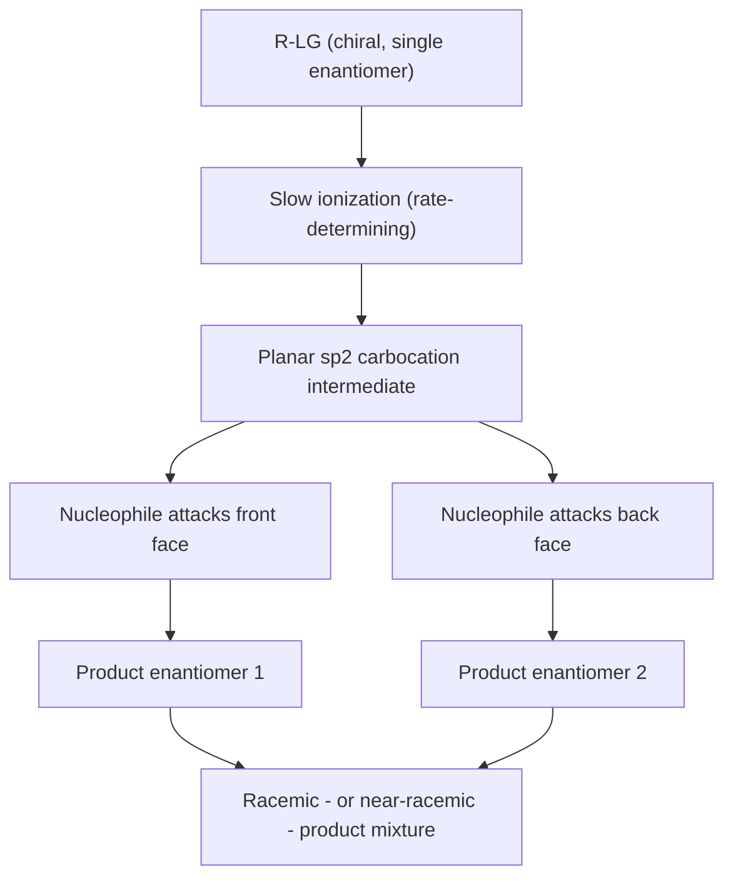

## Nucleophilic Substitution Reactions

### Overview

Nucleophilic substitution reactions involve the replacement of a leaving group on a substrate by an incoming nucleophile. These reactions proceed through two limiting mechanistic pathways — $S_N1$ (unimolecular) and $S_N2$ (bimolecular) — distinguished by their kinetics, stereochemistry, and sensitivity to substrate structure, nucleophile strength, leaving group ability, and solvent.

### General Reaction

$$\text{Nu:}^{-} + \text{R–LG} \rightarrow \text{R–Nu} + \text{LG}^{-}$$

where Nu is the nucleophile and LG is the leaving group.

### The SN2 Mechanism

**Key Points**

- $S_N2$ (Substitution, Nucleophilic, Bimolecular) proceeds in a single concerted step: the nucleophile attacks the electrophilic carbon from the side directly opposite the leaving group (backside attack) as the leaving group departs, with no discrete intermediate.
- The rate law is second order overall: $\text{rate} = k[\text{Nu}][\text{R–LG}]$, first order in both nucleophile and substrate, reflecting that both species are involved in the single rate-determining transition state.
- The transition state has a trigonal bipyramidal-like geometry at the reacting carbon, with partial bonds to both the incoming nucleophile and the departing leaving group.

**Stereochemical outcome**: Backside attack causes **inversion of configuration** at the reacting stereocenter (Walden inversion) — the spatial arrangement of the three non-reacting substituents flips, analogous to an umbrella turning inside out in the wind.

### Diagram: SN2 Transition State (svg_diagram)

<svg xmlns="http://www.w3.org/2000/svg" viewBox="0 0 640 240">
<text x="320" y="24" text-anchor="middle" font-size="16" font-weight="bold">SN2 backside attack and inversion (svg_diagram)</text>

<text x="100" y="140" text-anchor="middle" font-size="14">Nu⁻</text>

<line x1="120" y1="140" x2="180" y2="140" stroke="black" stroke-width="2" marker-end="url(#a1)" />

<circle cx="220" cy="140" r="4" fill="black" />
<line x1="220" y1="140" x2="200" y2="100" stroke="black" stroke-width="1.5" />
<line x1="220" y1="140" x2="200" y2="180" stroke="black" stroke-width="1.5" />
<line x1="220" y1="140" x2="180" y2="140" stroke="black" stroke-width="1.5" stroke-dasharray="3,3" />
<line x1="220" y1="140" x2="280" y2="140" stroke="black" stroke-width="1.5" stroke-dasharray="3,3" />
<text x="220" y="115" text-anchor="middle" font-size="10">‡ TS</text>

<text x="330" y="140" text-anchor="middle" font-size="14">LG⁻</text>

<line x1="240" y1="140" x2="300" y2="140" stroke="none" />

<text x="220" y="200" text-anchor="middle" font-size="11">partial bonds to both Nu and LG</text>

<text x="480" y="140" text-anchor="middle" font-size="13">Product: Nu–C, inverted geometry</text>

<line x1="380" y1="140" x2="420" y2="140" stroke="black" stroke-width="2" marker-end="url(#a1)" />

</svg>

**Substrate reactivity (steric effects dominate)**: Because the nucleophile must approach the backside of the carbon, steric hindrance around the reacting carbon strongly disfavors $S_N2$:

$$\text{methyl} > \text{primary} > \text{secondary} \gg \text{tertiary (essentially unreactive)}$$

**Key Points**

- Tertiary substrates are essentially unreactive toward $S_N2$ due to steric blocking of the backside approach by the three alkyl groups.
- Neopentyl-type substrates (primary carbon adjacent to a quaternary carbon) react very slowly in $S_N2$ despite being formally primary, because the bulky adjacent group sterically shields the backside approach.

### The SN1 Mechanism

**Key Points**

- $S_N1$ (Substitution, Nucleophilic, Unimolecular) proceeds through two discrete steps:
  1. **Rate-determining ionization**: The leaving group departs first, without assistance from the nucleophile, generating a planar carbocation intermediate.
  2. **Nucleophilic capture**: The nucleophile then attacks the carbocation in a fast, non-rate-determining step.
- The rate law depends only on substrate concentration: $\text{rate} = k[\text{R–LG}]$, first order overall, since the nucleophile is not involved in the rate-determining step.

**Stereochemical outcome**: Because the carbocation intermediate is planar ($sp^2$-hybridized) and achiral, the nucleophile can attack from either face with roughly equal probability, leading to **racemization** (formation of a racemic or near-racemic mixture) at the reacting stereocenter, though some degree of net inversion is commonly observed in practice due to incomplete separation of the leaving group (ion-pair effects), which can partially shield one face of the carbocation. [Inference — the exact degree of net inversion vs. full racemization is substrate- and solvent-dependent.]

### Diagram: SN1 Mechanism and Racemization

**Substrate reactivity (carbocation stability dominates)**: Since the rate-determining step generates a carbocation, substrate reactivity in $S_N1$ correlates with carbocation stability:

$$\text{tertiary} > \text{secondary} \gg \text{primary}, \text{methyl (essentially unreactive)}$$

**Key Points**

- Tertiary and resonance-stabilized (allylic, benzylic) carbocations are readily formed and favor $S_N1$; primary and methyl cations are so unstable that primary/methyl substrates essentially never react via $S_N1$.
- Carbocation intermediates are prone to **rearrangement** (1,2-hydride or 1,2-alkyl shifts) if a more stable carbocation can be reached, which can lead to substitution products with a rearranged carbon skeleton — a hallmark diagnostic of $S_N1$ mechanisms not seen in clean $S_N2$ reactions.

### Comparative Factors Governing SN1 vs. SN2

| Factor | Favors SN2 | Favors SN1 |
| --- | --- | --- |
| Substrate | Methyl, primary | Tertiary (secondary can go either way) |
| Nucleophile strength | Strong nucleophile | Weak nucleophile (often also the solvent) |
| Nucleophile concentration | High concentration matters (appears in rate law) | Concentration irrelevant to rate |
| Leaving group | Good leaving group required (both mechanisms) | Good leaving group required (both mechanisms) |
| Solvent | Polar aprotic (does not stabilize/hinder nucleophile) | Polar protic (stabilizes carbocation and leaving group via solvation) |
| Stereochemical outcome | Inversion | Racemization (with possible partial net inversion) |
| Rearrangements | Not observed | Commonly observed |

### Nucleophile Strength (Nucleophilicity)

**Key Points**

- Nucleophilicity generally correlates with, but is not identical to, basicity; the two properties diverge notably with steric bulk and with solvent effects.
- In **protic solvents**, nucleophilicity within a group of the periodic table increases down the group (e.g., $I^- > Br^- > Cl^- > F^-$) because smaller, more charge-dense anions are more strongly solvated by hydrogen bonding, which impedes their reactivity.
- In **polar aprotic solvents**, this order can reverse (e.g., $F^- > Cl^- > Br^- > I^-$ in some cases) since the anions are poorly solvated (no hydrogen bonding to the anion), allowing intrinsic basicity/charge density to dominate. [Inference — the precise ordering can vary with the specific aprotic solvent and counter-cation.]
- Steric bulk reduces nucleophilicity without necessarily reducing basicity: bulky bases such as *tert*-butoxide ($(CH_3)_3CO^-$) are strong bases but poor nucleophiles in $S_N2$ due to hindered approach to the electrophilic carbon.

### Leaving Group Ability

**Key Points**

- A good leaving group is one that stabilizes the negative charge (or, in the case of neutral leaving groups, is a good neutral molecule) after it departs — generally correlating with the leaving group being the conjugate base of a strong acid (weak, stable conjugate base).
- Common good leaving groups, in rough order of ability: $\text{I}^- > \text{Br}^- > \text{Cl}^- \gg \text{F}^-$; sulfonate esters (tosylate, mesylate, triflate) are also excellent leaving groups widely used synthetically.
- Poor leaving groups (hydroxide $OH^-$, alkoxide $OR^-$, amide $NH_2^-$) generally must be chemically activated before substitution can proceed — for example, by protonation (converting $OH$ to the better leaving group $H_2O$) or by conversion to a sulfonate ester.

### Solvent Effects

**Key Points**

- **Polar protic solvents** (water, alcohols) can hydrogen-bond to and stabilize both cations and anions; they favor $S_N1$ by stabilizing the developing carbocation and the departing anionic leaving group, and they favor a smaller effective nucleophile through solvation, which further disfavors $S_N2$.
- **Polar aprotic solvents** (acetone, DMSO, DMF, acetonitrile) solvate cations well (via dipole interactions) but poorly solvate anions (no hydrogen-bond donors), leaving nucleophilic anions relatively "naked" and highly reactive — favoring $S_N2$.
- Nonpolar solvents generally do not support ionization and are poor media for either mechanism unless the nucleophile/substrate combination allows a concerted, low-charge-buildup pathway.

### Worked Example: Predicting Mechanism

**Substrate**: (*R*)-2-bromobutane

**Nucleophile/Conditions A**: $NaI$ in acetone (strong nucleophile, polar aprotic solvent)

**Nucleophile/Conditions B**: $H_2O$, heat (weak nucleophile/solvent, polar protic)

- **Conditions A**: Secondary substrate + strong nucleophile + polar aprotic solvent → favors $S_N2$. Expected outcome: (*S*)-2-iodobutane, formed with inversion of configuration, via backside attack.
- **Conditions B**: Secondary substrate + weak nucleophile (water) + polar protic, ionizing solvent + heat → favors $S_N1$. Expected outcome: racemic (or near-racemic) 2-butanol, since the secondary carbocation intermediate can be attacked from either face.

### Competition with Elimination

**Key Points**

- Nucleophilic substitution reactions frequently compete with elimination reactions (E1, E2), since many nucleophiles are also capable of acting as bases, and many substrates capable of ionizing (or undergoing backside attack) can also undergo proton loss to form an alkene.
- Strong, bulky bases favor E2 elimination over $S_N2$ substitution even with primary/secondary substrates, since steric bulk impedes backside nucleophilic attack while proton abstraction (elimination) remains accessible.
- Tertiary substrates with heat and/or weak nucleophile/base conditions often give substantial E1 elimination competing with $S_N1$ substitution, since the same carbocation intermediate is common to both pathways.

### Common Pitfalls

- **Assuming all secondary substrates behave identically**: Secondary substrates are mechanistic "swing" cases whose actual pathway (SN1 vs SN2) depends sensitively on nucleophile strength, solvent, and temperature — these must be evaluated together, not assumed from substrate structure alone.
- **Forgetting that nucleophilicity and basicity are not interchangeable properties**: A species can be strongly basic but weakly nucleophilic (e.g., due to steric bulk) or vice versa, especially across changes in solvent.
- **Overlooking the possibility of carbocation rearrangement in $S_N1$ conditions**: Predicted "simple" substitution products may be incorrect if a more stable carbocation is accessible via hydride or alkyl shift.
- **Neglecting the competing elimination pathway**: Nucleophilic substitution conditions frequently also produce elimination products, especially with secondary/tertiary substrates, strong bases, or elevated temperature.

### Related Topics

- Elimination reactions (E1, E2) and their competition with substitution
- Carbocation stability and rearrangement mechanisms
- Leaving group activation strategies (tosylation, mesylation, protonation)
- Solvent polarity scales and their effect on reaction mechanism
- Stereochemistry of reaction mechanisms (inversion, retention, racemization)
- Kinetics and rate law determination for substitution reactions