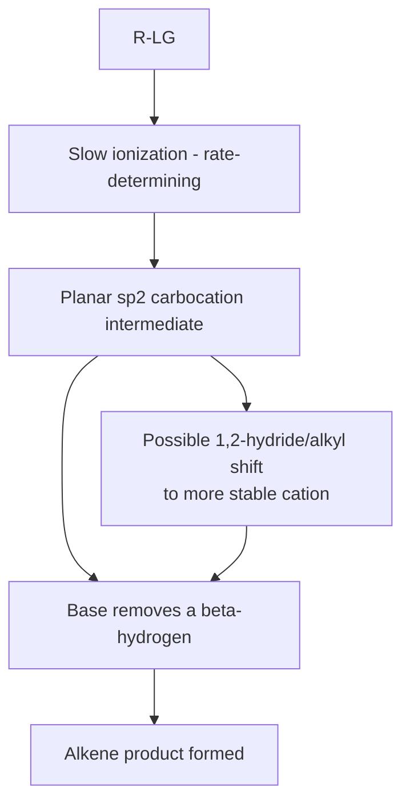
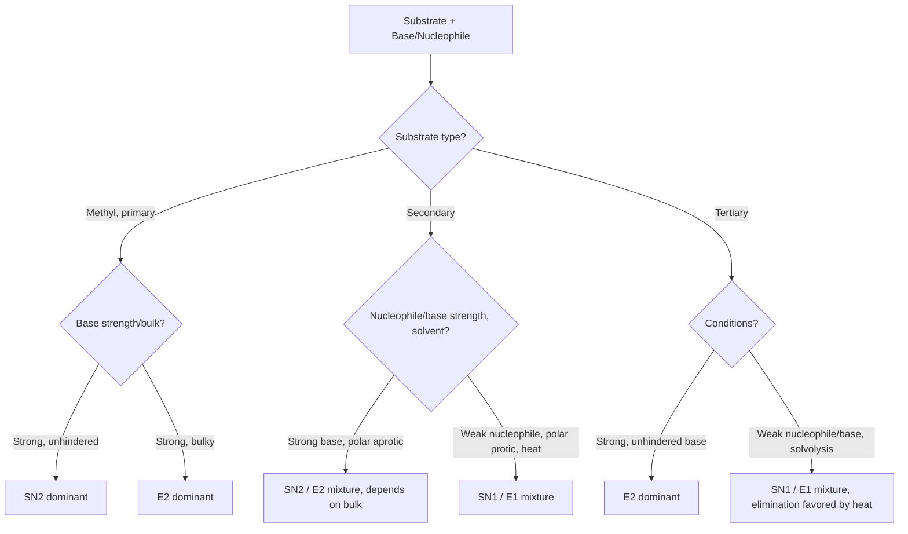

## Elimination Reactions

### Overview

Elimination reactions remove two substituents from adjacent (or, less commonly, the same) carbon atoms to form a new π bond, typically generating an alkene. The two limiting mechanistic pathways — **E1** (unimolecular) and **E2** (bimolecular) — parallel the $S_N1$/$S_N2$ substitution mechanisms and often compete directly with them for the same substrates.

### General Reaction

$$\text{R–CH}_2\text{–CHX–R}' + \text{Base} \rightarrow \text{R–CH=CH–R}' + \text{Base–H}^+ + \text{X}^-$$

A base removes a proton from a carbon adjacent (β) to the carbon bearing the leaving group (α), and the electrons from the C–H bond form the new π bond as the leaving group departs.

### The E2 Mechanism

**Key Points**

- E2 (Elimination, Bimolecular) proceeds in a single concerted step: a base removes a β-hydrogen at the same time that the leaving group departs from the α-carbon, with the C=C π bond forming simultaneously.
- The rate law is second order overall: $\text{rate} = k[\text{Base}][\text{R–LG}]$, first order in both base and substrate.
- No carbocation intermediate is formed, so E2 does not lead to skeletal rearrangement.

**Stereochemical requirement — anti-periplanar geometry**: For the concerted E2 mechanism, the C–H bond being broken and the C–LG bond being broken must be **anti-periplanar** (dihedral angle of 180°) in the reactive conformation, allowing optimal overlap between the developing p-orbitals as the π bond forms.

### Diagram: E2 Anti-Periplanar Transition State (svg_diagram)

<svg xmlns="http://www.w3.org/2000/svg" viewBox="0 0 600 260">
<text x="300" y="24" text-anchor="middle" font-size="16" font-weight="bold">E2 anti-periplanar transition state (svg_diagram)</text>
<circle cx="300" cy="140" r="55" fill="none" stroke="black" stroke-width="2" />
<circle cx="300" cy="140" r="3" fill="black" />
<line x1="300" y1="140" x2="300" y2="70" stroke="black" stroke-width="2" />
<text x="300" y="60" text-anchor="middle" font-size="12">LG (leaving group)</text>
<line x1="300" y1="140" x2="255" y2="175" stroke="black" stroke-width="2" />
<line x1="300" y1="140" x2="345" y2="175" stroke="black" stroke-width="2" />
<line x1="300" y1="195" x2="300" y2="225" stroke="black" stroke-width="2" />
<text x="300" y="245" text-anchor="middle" font-size="12">H (removed by base, anti to LG)</text>

<text x="150" y="140" text-anchor="middle" font-size="12">Base:⁻</text>

<line x1="180" y1="140" x2="230" y2="200" stroke="black" stroke-width="1.5" stroke-dasharray="3,3" />

<text x="450" y="120" text-anchor="middle" font-size="11">Dihedral H-C-C-LG = 180°</text>

</svg>

**Key Points**

- In **cyclohexane systems**, the anti-periplanar requirement translates to the geometric requirement that the leaving group and the β-hydrogen both be **axial** (diaxial), since only axial substituents on adjacent carbons are anti-periplanar to each other in the chair conformation. Equatorial-axial or diequatorial relationships cannot achieve the required geometry without a ring flip.
- For acyclic systems, anti-periplanar geometry is achieved by rotation about the C–C σ bond to reach the correct staggered conformation prior to the elimination step.
- Because a specific anti-periplanar conformation is required, E2 reactions on substrates with a fixed or strongly preferred conformation can show high stereospecificity, producing predominantly one alkene geometric isomer (E or Z) from a given diastereomeric starting material.

### The E1 Mechanism

**Key Points**

- E1 (Elimination, Unimolecular) proceeds through two discrete steps, sharing its first step with $S_N1$:
  1. **Rate-determining ionization**: The leaving group departs, generating a planar carbocation intermediate.
  2. **Deprotonation**: A base (often the solvent, since only a weak base is needed) removes a β-hydrogen from the carbocation in a fast step, forming the alkene.
- The rate law depends only on substrate concentration: $\text{rate} = k[\text{R–LG}]$, since the base is not involved in the rate-determining step.
- Because the carbocation intermediate can freely rotate about the remaining σ-bonds before deprotonation, there is **no anti-periplanar geometric requirement** in E1, unlike E2.

### Diagram: E1 Mechanism

**Key Points**

- Because E1 shares a carbocation intermediate with $S_N1$, the two pathways compete directly, and **carbocation rearrangements** (1,2-hydride or 1,2-alkyl shifts) can occur before deprotonation, potentially leading to an elimination product with a rearranged carbon skeleton.
- Substrate reactivity in E1 correlates with carbocation stability, following the same order as $S_N1$: tertiary > secondary ≫ primary (essentially unreactive via E1).

### Regiochemistry: Zaitsev vs. Hofmann Products

When more than one type of β-hydrogen is available, elimination can produce constitutionally isomeric alkenes differing in the position of the double bond.

**Zaitsev's rule (the more substituted alkene)**: In most E1 and E2 reactions using small, unhindered bases, the more highly substituted (and generally more thermodynamically stable) alkene predominates, since more highly substituted alkenes are stabilized by hyperconjugation and are typically favored at or near the transition state.

**Hofmann product (the less substituted alkene)**: Using a **bulky base** (e.g., *tert*-butoxide, $(CH_3)_3CO^-$, or bulky amine bases), the less hindered, less substituted alkene predominates, because the bulky base preferentially removes the more sterically accessible (typically less substituted, terminal) β-hydrogen.

| Condition | Product favored | Explanation |
| --- | --- | --- |
| Small base (e.g., $NaOH$, $NaOEt$), E1 or E2 | Zaitsev (more substituted) | More stable alkene / more stable developing transition state |
| Bulky base (e.g., $(CH_3)_3CO^-$), typically E2 | Hofmann (less substituted) | Steric access favors removing the less hindered proton |

**Worked Example**: 2-bromo-2-methylbutane treated with:

- $NaOEt$ (small base): predominantly gives 2-methyl-2-butene (Zaitsev, trisubstituted alkene).
- $(CH_3)_3COK$ (bulky base): predominantly gives 2-methyl-1-butene (Hofmann, disubstituted, less hindered alkene).

### Comparative Factors Governing E1 vs. E2

| Factor | Favors E2 | Favors E1 |
| --- | --- | --- |
| Substrate | Primary, secondary, tertiary (all can undergo E2 with a strong base) | Secondary, tertiary only (needs a stable carbocation) |
| Base | Strong base required | Weak base sufficient (often the solvent) |
| Base concentration | Matters (appears in rate law) | Irrelevant to rate |
| Mechanism | Concerted, single step | Stepwise via carbocation |
| Stereochemical requirement | Anti-periplanar geometry required | None (free rotation in carbocation) |
| Rearrangements | Not observed | Commonly observed |
| Typical regiochemistry | Zaitsev (small base) or Hofmann (bulky base) | Predominantly Zaitsev |

### Substitution vs. Elimination Competition

Because many nucleophiles are also bases, and many substrates capable of ionizing/undergoing backside attack can also lose a β-proton, substitution and elimination frequently compete for the same substrate/reagent combination.

**Key Points**

- **Strong, bulky bases/nucleophiles** (e.g., *tert*-butoxide) favor E2 over $S_N2$ even for primary and secondary substrates, since steric bulk impedes backside nucleophilic attack while β-hydrogen abstraction remains sterically accessible.
- **Tertiary substrates** essentially cannot undergo $S_N2$ or E2 productively without a specifically strong, unhindered base for E2; under solvolysis conditions (weak nucleophile/base, heat), tertiary substrates typically give a mixture of $S_N1$ and E1 products.
- **Heat generally favors elimination over substitution** in mixed E1/$S_N1$ or E2/$S_N2$ systems, since elimination pathways typically have a more favorable entropy of activation (releasing more independent product molecules/fragments) and elimination products are thermodynamically favored at higher temperature (consistent with $\Delta G = \Delta H - T\Delta S$ favoring the more entropically favorable elimination pathway as $T$ increases). [Inference — the precise magnitude of this temperature effect is substrate- and condition-specific.]
- **High concentration of a strong base/nucleophile favors the bimolecular pathways (E2 or $S_N2$)** over the unimolecular pathways (E1, $S_N1$), since the bimolecular rate laws depend on base/nucleophile concentration while the unimolecular ones do not.

### Diagram: Substitution/Elimination Decision Framework

### Common Pitfalls

- **Forgetting the anti-periplanar requirement for E2**: Predicting the wrong regiochemistry or stereochemistry by ignoring which β-hydrogens are actually accessible in the anti-periplanar (or diaxial, for rings) conformation.
- **Applying Zaitsev's rule universally**: Bulky bases reverse the typical regiochemical outcome, favoring the Hofmann (less substituted) product; the identity of the base must always be checked.
- **Assuming primary substrates cannot undergo elimination**: Primary substrates cannot undergo E1 (no stable primary carbocation) but readily undergo E2 with a sufficiently strong base.
- **Neglecting the possibility of carbocation rearrangement in E1**: As with $S_N1$, the alkene product distribution in E1 may reflect a rearranged carbon skeleton if a more stable cation is accessible.

### Related Topics

- Nucleophilic substitution reactions ($S_N1$/$S_N2$) and their competition with elimination
- Carbocation stability, formation, and rearrangement
- Alkene stability trends (degree of substitution, conjugation)
- Anti-periplanar and diaxial geometric requirements in cyclohexane systems
- Zaitsev's rule and Hofmann elimination in synthesis planning
- Kinetics and rate law determination for elimination reactions