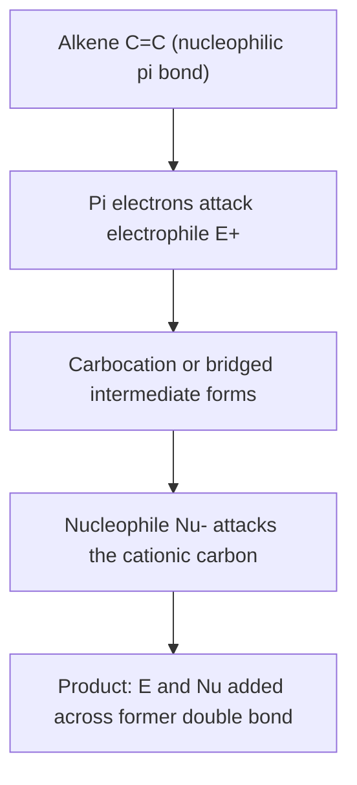
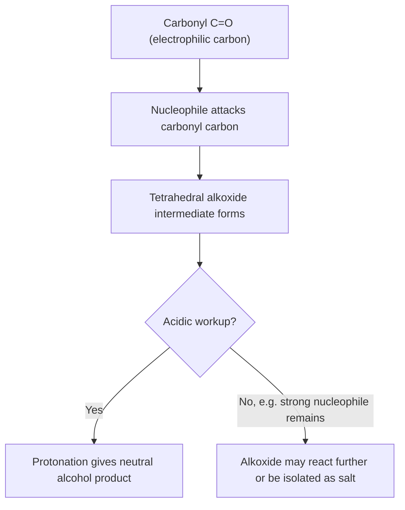

## Electrophilic and Nucleophilic Addition

### Overview

Addition reactions convert a π bond (typically C=C or C=O) into two new σ bonds by adding two groups across the multiple bond. The mechanism and regiochemical outcome differ fundamentally depending on whether the π-bond-containing substrate is electron-rich (undergoing **electrophilic addition**, characteristic of alkenes and alkynes) or electron-poor (undergoing **nucleophilic addition**, characteristic of carbonyl compounds).

### Electrophilic Addition to Alkenes

**General principle**: The electron-rich π bond of an alkene acts as a nucleophile, attacking an electrophile to generate a carbocation (or related electrophilic intermediate), which is then captured by a nucleophile.

**General two-step mechanism:**

1. The alkene π electrons attack an electrophile, forming a new C–electrophile σ bond and generating a carbocation (or a bridged intermediate, depending on the electrophile) at the other alkene carbon.
2. A nucleophile attacks the resulting cationic intermediate, forming the second new σ bond.

### Diagram: General Electrophilic Addition Mechanism

### Addition of Hydrogen Halides (HX)

**Mechanism**: Markovnikov addition via a carbocation intermediate.

1. Protonation of the alkene by $H^+$ (from HX) generates the more stable carbocation, following the alkene's inherent preference to place positive charge on the more substituted carbon.
2. The halide ion ($X^-$) then attacks the carbocation.

**Markovnikov's rule**: In the addition of HX to an unsymmetrical alkene, the hydrogen adds to the carbon that already bears more hydrogens, and consequently the halogen ends up on the more substituted carbon — because protonation occurs to generate the more stable (more substituted) carbocation intermediate.

**Key Points**

- Because a carbocation intermediate is involved, **rearrangement** (1,2-hydride or 1,2-alkyl shift) can occur if a more stable carbocation is accessible, leading to a rearranged product.
- Markovnikov addition is regioselective but not stereospecific in a simple sense for simple alkenes, since the carbocation is planar and can be attacked from either face; for cyclic alkenes this typically results in a mixture of relative stereochemical outcomes.

### Addition of Halogens (X₂): Anti Addition via Halonium Ion

**Mechanism**:

1. The alkene π bond attacks one atom of the halogen molecule ($X_2$), displacing the other halide and forming a cyclic three-membered **halonium ion** (bromonium or chloronium ion) that bridges both former alkene carbons, delocalizing the positive charge and preventing free rotation.
2. A halide nucleophile (often from solution) attacks one carbon of the halonium ion from the face **opposite** the bridging halogen (backside attack, analogous to $S_N2$), opening the ring.

**Stereochemical outcome**: Because the second halide must attack from the face opposite the bridging halonium ion, the net result is **anti addition** — the two halogen atoms end up on opposite faces of the former double bond, giving a specific relative (diastereomeric) configuration in cyclic substrates.

### Diagram: Halonium Ion Formation and Anti Addition (svg_diagram)

<svg xmlns="http://www.w3.org/2000/svg" viewBox="0 0 640 260">
<text x="320" y="24" text-anchor="middle" font-size="16" font-weight="bold">Bromonium ion intermediate — anti addition (svg_diagram)</text>
<line x1="150" y1="140" x2="230" y2="140" stroke="black" stroke-width="3" />
<text x="120" y="145" font-size="13">C</text>
<text x="240" y="145" font-size="13">C</text>
<path d="M 190 100 Q 190 80 190 100" stroke="none" />
<path d="M 165 115 A 40 40 0 0 1 215 115" fill="none" stroke="black" stroke-width="2" />
<text x="190" y="90" text-anchor="middle" font-size="13">Br⁺ (bridging)</text>
<line x1="270" y1="140" x2="330" y2="140" stroke="black" stroke-width="2" marker-end="url(#a3)" />
<text x="300" y="130" text-anchor="middle" font-size="10">Br⁻ backside attack</text>

<text x="450" y="145" font-size="13">Product: Br atoms anti (opposite faces)</text>

</svg>

**Key Points**

- Anti addition of $Br_2$ or $Cl_2$ to a cyclic alkene (e.g., cyclohexene) gives specifically the *trans*-dihalide diastereomer, not the *cis* — a classic experimental test for the halonium ion mechanism, since a simple carbocation intermediate would be expected to give a mixture of *cis* and *trans* products.
- In the presence of a second nucleophile (e.g., performing the halogenation in water or an alcohol solvent, "halohydrin formation"), that nucleophile competes with the halide for attack on the halonium ion, typically attacking the more substituted carbon (which bears more positive character in the unsymmetrical halonium ion) — giving a halohydrin with anti stereochemistry and Markovnikov-like regiochemistry.

### Oxymercuration–Demercuration

**Key Points**

- A synthetically useful alternative to acid-catalyzed hydration that avoids carbocation rearrangements: mercury(II) acetate forms a bridged mercurinium ion (analogous to the halonium ion) with the alkene, which is opened by water attacking the more substituted carbon (Markovnikov regiochemistry), followed by reduction (demercuration) with $NaBH_4$ to replace the mercury with hydrogen.
- Because the mechanism proceeds through a bridged ion rather than a free carbocation, oxymercuration–demercuration gives **Markovnikov addition of water without rearrangement**, making it a more reliable method than direct acid-catalyzed hydration for unrearranged Markovnikov alcohols.

### Hydroboration–Oxidation

**Key Points**

- Boron hydride ($BH_3$ or a substituted borane) adds to the alkene in a single concerted step (a four-centered transition state) with no carbocation intermediate, giving **syn addition** (both new bonds form on the same face) and **anti-Markovnikov regiochemistry** (boron adds to the less hindered, less substituted carbon, due to steric factors in the concerted transition state).
- Subsequent oxidation (with $H_2O_2/NaOH$) replaces boron with a hydroxyl group **with retention of configuration**, so the overall transformation delivers an anti-Markovnikov alcohol via syn addition — complementary to both acid-catalyzed hydration and oxymercuration in both regiochemistry and stereochemistry.

### Comparison of Alkene Addition Methods

| Method | Regiochemistry | Stereochemistry | Rearrangement risk |
| --- | --- | --- | --- |
| HX addition | Markovnikov | Not stereospecific (via carbocation) | Yes |
| $X_2$ addition | N/A (symmetric reagent) | Anti (via halonium ion) | No |
| Halohydrin formation | Markovnikov (Nu on more-substituted C) | Anti | No |
| Oxymercuration–demercuration | Markovnikov | Not strictly stereospecific | No |
| Hydroboration–oxidation | Anti-Markovnikov | Syn | No |

### Nucleophilic Addition to Carbonyl Compounds

**General principle**: The carbonyl carbon of an aldehyde or ketone is electrophilic (due to the polarized $C=O$ bond, with oxygen being more electronegative), so it is attacked by nucleophiles rather than electrophiles.

**General mechanism:**

1. A nucleophile attacks the electrophilic carbonyl carbon, and the C=O π electrons shift fully onto the oxygen, generating a tetrahedral alkoxide (or, under acidic conditions, a neutral alcohol after protonation) intermediate.
2. If the reaction is carried out under acidic or aqueous conditions, the alkoxide intermediate is protonated to give the neutral alcohol product.

### Diagram: General Nucleophilic Addition to a Carbonyl

**Key Points**

- Nucleophilic addition to carbonyls proceeds through a **tetrahedral intermediate**, in contrast to electrophilic addition to alkenes, which proceeds through a cationic (trigonal or bridged) intermediate.
- Reactivity toward nucleophilic addition generally follows: aldehydes > ketones, because aldehydes have less steric hindrance (only one alkyl/aryl substituent versus two for ketones) and a more electrophilic carbonyl carbon (less electron donation from only one alkyl group, compared to two for ketones).
- Electron-withdrawing groups near the carbonyl increase its electrophilicity and accelerate nucleophilic addition; electron-donating groups (and increased steric bulk) decrease reactivity.

### Common Nucleophilic Addition Reactions of Carbonyls

| Nucleophile | Product class | Notes |
| --- | --- | --- |
| $H^-$ (from $NaBH_4$, $LiAlH_4$) | Alcohol | Reduction of aldehyde/ketone |
| $R–MgX$ (Grignard), $R–Li$ | Alcohol (new C–C bond) | Carbanion-equivalent nucleophile |
| $CN^-$ | Cyanohydrin | Reversible; adds a new C–C bond and a nitrile group |
| $H_2O$ | Hydrate (gem-diol) | Equilibrium typically favors carbonyl unless strongly electrophilic (e.g., formaldehyde, chloral) |
| $ROH$ | Hemiacetal (then acetal with excess ROH, acid catalysis) | Equilibrium-driven; acetal formation requires acid catalyst and water removal |
| $RNH_2$ (1° amine) | Imine (after dehydration) | Proceeds through a hemiaminal intermediate |
| $R_2NH$ (2° amine) | Enamine (after dehydration) | No N–H remains to lose as water in the same way; forms enamine instead of imine |

### Contrasting the Two Addition Classes

| Feature | Electrophilic addition (alkenes) | Nucleophilic addition (carbonyls) |
| --- | --- | --- |
| π bond character | Electron-rich, acts as nucleophile | Electron-poor, acts as electrophile |
| First step | π bond attacks electrophile | Nucleophile attacks π-bond carbon |
| Intermediate | Carbocation or bridged cation | Tetrahedral alkoxide |
| Typical reagents | $HX$, $X_2$, $H_3O^+/H_2O$, $BH_3$ | $H^-$, $R–MgX$, $CN^-$, amines, alcohols |
| Common stereochemical outcomes | Markovnikov/anti-Markovnikov, syn/anti addition | Attack from either face of planar carbonyl (can be diastereoselective with adjacent stereocenters) |

### Common Pitfalls

- **Confusing which species is nucleophilic vs. electrophilic**: In alkene chemistry, the π bond itself is the nucleophile; in carbonyl chemistry, the π bond is part of an electrophilic center attacked by an external nucleophile. Reversing this distinction leads to mechanistic errors.
- **Assuming all alkene additions are Markovnikov**: Anti-Markovnikov regiochemistry occurs specifically in radical HBr addition (not covered here as it is a distinct radical mechanism) and in hydroboration–oxidation; the specific reagent and mechanism must be checked.
- **Forgetting the halonium ion intermediate for halogenation**: Predicting a simple carbocation intermediate (and thus a mixture of cis/trans products) rather than the bridged halonium ion (which enforces anti addition) is a common error.
- **Overlooking equilibrium considerations in carbonyl addition**: Many nucleophilic additions to carbonyls (hydration, hemiacetal formation) are reversible equilibria whose position depends on the specific carbonyl compound's electrophilicity and reaction conditions (e.g., water removal to drive acetal formation forward).

### Related Topics

- Carbocation stability, formation, and rearrangement in electrophilic addition
- Markovnikov's rule and regiochemistry of alkene reactions
- Grignard and organolithium reagents in carbon–carbon bond formation
- Acetal and imine/enamine formation mechanisms in carbonyl chemistry
- Stereochemistry of addition reactions (syn vs. anti addition)
- Reduction of carbonyl compounds (hydride reagents)