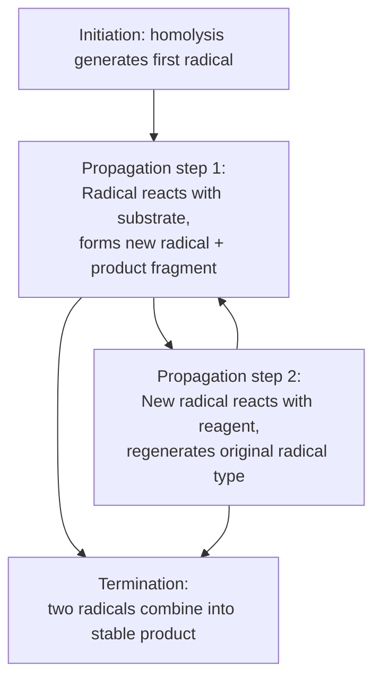
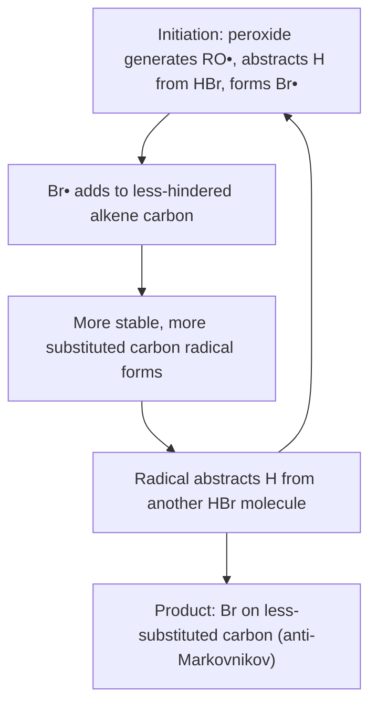

## Radical Reactions

### Overview

Radical reactions proceed through intermediates bearing an unpaired electron (free radicals), generated by homolytic bond cleavage rather than the heterolytic cleavage characteristic of ionic (nucleophilic/electrophilic) mechanisms. Radical reactions follow a distinctive chain mechanism pattern — initiation, propagation, and termination — and exhibit reactivity and selectivity trends governed by radical stability rather than by nucleophile/electrophile or acid/base considerations.

### Homolytic vs. Heterolytic Bond Cleavage

**Key Points**

- **Homolytic cleavage**: A bond breaks symmetrically, with one electron going to each fragment, generating two radicals. Represented with single-barbed ("fishhook") curved arrows, each showing the movement of one electron.
- **Heterolytic cleavage**: A bond breaks asymmetrically, with both electrons going to one fragment, generating a cation and an anion. Represented with standard double-barbed curved arrows.
- Homolytic cleavage is favored under conditions that supply energy without a polar/ionic driving force: heat (thermolysis), light (photolysis), or reaction with another radical, often assisted by weak bonds (e.g., O–O peroxide bonds, halogen–halogen bonds) or by radical-stabilizing initiators.

### The Radical Chain Mechanism

Radical reactions characteristically proceed through a three-phase chain mechanism:

**1. Initiation**: Homolytic cleavage generates the first radical(s), typically requiring an external energy input (heat, light) or an added initiator (e.g., peroxides, azo compounds such as AIBN).

**2. Propagation**: A radical reacts with a stable (non-radical) molecule to generate a new radical and a new stable molecule, regenerating a reactive radical that can continue the cycle. Propagation steps repeat many times, consuming starting material and forming product, without net change in total radical concentration.

**3. Termination**: Two radicals combine (or a radical undergoes disproportionation) to form a stable, non-radical product, removing reactive radicals from the system and ending that particular chain.

### Diagram: General Radical Chain Mechanism

### Radical Halogenation of Alkanes

**Example**: Chlorination of methane, $CH_4 + Cl_2 \xrightarrow{h\nu} CH_3Cl + HCl$

**Initiation**:

$$\text{Cl}_2 \xrightarrow{h\nu \text{ or } \Delta} 2\, \text{Cl}\cdot$$

**Propagation (two steps, repeating in a cycle)**:

$$\text{Cl}\cdot + \text{CH}_4 \rightarrow \text{HCl} + \cdot\text{CH}_3$$

$$\cdot\text{CH}_3 + \text{Cl}_2 \rightarrow \text{CH}_3\text{Cl} + \text{Cl}\cdot$$

**Termination (any radical–radical combination)**:

$$\text{Cl}\cdot + \cdot\text{CH}_3 \rightarrow \text{CH}_3\text{Cl}$$

$$2\, \text{Cl}\cdot \rightarrow \text{Cl}_2$$

$$2\, \cdot\text{CH}_3 \rightarrow \text{CH}_3\text{CH}_3$$

**Key Points**

- The two propagation steps sum to give the overall reaction; because each propagation step regenerates a reactive species that feeds into the next step, the cycle can repeat many times per initiation event (a high "chain length"), making initiator-catalyzed radical reactions efficient despite requiring only a small amount of initiation.
- Termination steps are comparatively rare (since they require two low-concentration radical species to meet) but are responsible for the small amounts of side products (e.g., ethane, $Cl_2$ reformation) observed in radical halogenations.

### Radical Stability and Selectivity

**Radical stability order**: Analogous to carbocation stability, radical stability increases with substitution due to hyperconjugation and, where applicable, resonance delocalization:

$$\text{tertiary} > \text{secondary} > \text{primary} > \text{methyl}$$

$$\text{benzylic}, \text{allylic (resonance-stabilized)} > \text{tertiary} > \text{secondary} > \text{primary}$$

**Key Points**

- Benzylic and allylic radicals are especially stabilized by resonance delocalization of the unpaired electron into the adjacent π system, making C–H bonds at benzylic/allylic positions especially susceptible to radical abstraction.
- Radical halogenation selectivity depends strongly on which halogen is used:
  - **Chlorination ($Cl_2$)** is relatively unselective (a reactive, "early" transition state radical abstraction step means bond-dissociation-energy differences translate into only modest selectivity differences), often giving mixtures of constitutional isomers when multiple types of C–H bonds are present.
  - **Bromination ($Br_2$)** is highly selective for the most substituted (most stable radical) C–H bond, because bromine radical abstraction has a later, more product-like transition state that more fully reflects the stability difference between the possible radical intermediates (consistent with the Hammond postulate).

### Diagram: Selectivity Comparison, Chlorination vs. Bromination (svg_diagram)

<svg xmlns="http://www.w3.org/2000/svg" viewBox="0 0 640 260">
<text x="320" y="24" text-anchor="middle" font-size="16" font-weight="bold">Reaction coordinate: Cl vs Br abstraction (svg_diagram)</text>
<line x1="60" y1="220" x2="600" y2="220" stroke="black" stroke-width="1" />
<text x="320" y="245" text-anchor="middle" font-size="12">Reaction coordinate</text>
<path d="M 80 200 Q 150 100 220 190" fill="none" stroke="black" stroke-width="2" />
<text x="150" y="90" text-anchor="middle" font-size="11">Cl• TS (early, reactant-like)</text>
<text x="80" y="215" text-anchor="middle" font-size="11">low selectivity</text>
<path d="M 380 200 Q 460 60 540 130" fill="none" stroke="black" stroke-width="2" />
<text x="460" y="50" text-anchor="middle" font-size="11">Br• TS (late, product-like)</text>
<text x="540" y="150" text-anchor="middle" font-size="11">high selectivity</text>
</svg>

**Worked Example**: Monochlorination of propane ($CH_3CH_2CH_3$) gives a mixture of 1-chloropropane and 2-chloropropane, with the ratio reflecting both the number of available hydrogens (6 primary vs. 2 secondary) and the relative reactivity per hydrogen (secondary C–H bonds react faster per hydrogen due to greater radical stability), but because chlorination is relatively unselective, a substantial amount of the primary product still forms despite the lower per-hydrogen reactivity.

### Anti-Markovnikov Addition of HBr (Radical Mechanism)

**Key Points**

- In the presence of peroxides (radical initiators), HBr adds to unsymmetrical alkenes with **anti-Markovnikov regiochemistry** — bromine ends up on the less substituted carbon — a result that contrasts with the Markovnikov regiochemistry of ionic HX addition (see Electrophilic and Nucleophilic Addition).
- This reversal arises because the mechanism is entirely different: initiation generates $Br\cdot$, which adds to the alkene at the less-hindered carbon to generate the more stable (more substituted) carbon radical, which then abstracts a hydrogen from another $HBr$ molecule to give the product and regenerate $Br\cdot$.
- This anti-Markovnikov behavior is specific to **HBr** with radical initiators (peroxides); HCl and HI do not undergo an analogous efficient radical chain addition under comparable conditions, for thermodynamic/kinetic reasons specific to the bond strengths and radical stabilities involved. [Inference — the precise thermodynamic reasoning (bond dissociation energies of the relevant propagation steps) is commonly cited to explain why only HBr shows this behavior efficiently.]

### Diagram: Radical Addition of HBr (Anti-Markovnikov)

### Allylic Bromination (NBS)

**Key Points**

- N-bromosuccinimide (NBS), typically used with light or a radical initiator and a non-polar solvent (e.g., $CCl_4$), provides a low, steady-state concentration of $Br_2$, which favors selective radical substitution at the allylic position over competing ionic addition across the double bond.
- The mechanism proceeds through a resonance-stabilized allylic radical intermediate, which can react with $Br_2$ at either end of the delocalized radical, potentially giving a mixture of constitutional isomers (allylic transposition/rearrangement products) if the allylic system is unsymmetrical.

### Radical Polymerization (Overview)

**Key Points**

- Radical chain-growth polymerization of alkenes (e.g., ethylene to polyethylene, styrene to polystyrene) follows the same initiation/propagation/termination framework: an initiator radical adds to a monomer, generating a new radical that adds to the next monomer, repeating many times to build a polymer chain, until termination by radical combination or disproportionation.
- Chain-transfer reactions (where a growing polymer radical abstracts an atom from another molecule, transferring the radical center and effectively ending that chain's growth while starting a new one) influence the molecular weight distribution of the resulting polymer. [Inference — detailed polymer molecular weight control involves additional kinetic considerations beyond the scope of a basic radical mechanism treatment.]

### Common Pitfalls

- **Using double-barbed (heterolytic) arrows for radical mechanisms**: Radical mechanisms require single-barbed ("fishhook") arrows, each representing the movement of a single electron; using standard curved arrows misrepresents the mechanism.
- **Assuming all HX addition to alkenes is Markovnikov**: The presence of peroxides specifically reverses the regiochemistry for HBr addition via a radical mechanism; this is a frequently tested exception.
- **Confusing chlorination and bromination selectivity**: Chlorination is relatively unselective (via an early, reactant-like transition state) while bromination is highly selective for the most stable radical (via a later, product-like transition state) — the two halogens are not interchangeable in predicting product distribution.
- **Forgetting termination steps when writing a full mechanism**: A complete radical chain mechanism must include initiation, propagation, and at least one representative termination step to be mechanistically complete.

### Related Topics

- Carbocation vs. radical stability trends and their common hyperconjugative basis
- Bond dissociation energies and their use in predicting radical reaction thermodynamics
- Electrophilic addition to alkenes (contrasting ionic vs. radical HX addition)
- NBS allylic/benzylic bromination in synthesis
- Radical polymerization mechanisms and chain-transfer processes
- Autoxidation and radical chain reactions in combustion and biological contexts