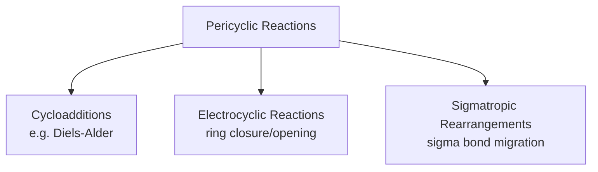
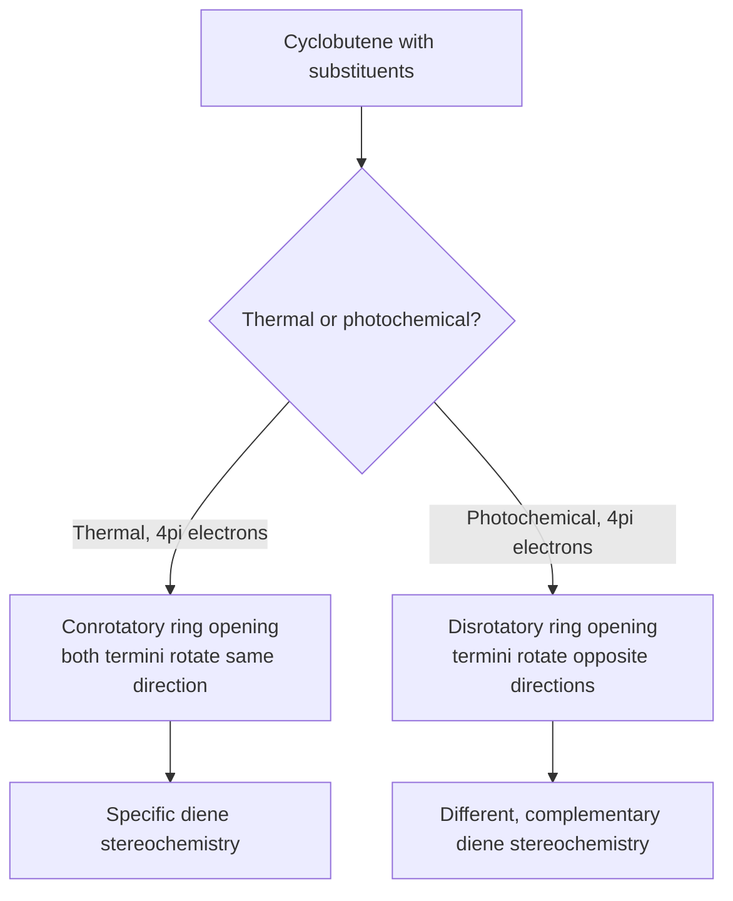

## Overview of Pericyclic Reactions

### Overview

Pericyclic reactions are a class of concerted transformations that proceed through a single cyclic transition state involving a continuous, closed loop of overlapping orbitals, with no discrete ionic or radical intermediates. Unlike substitution, addition, or elimination mechanisms (which involve stepwise bond-breaking/bond-forming events mediated by nucleophiles, electrophiles, or radicals), pericyclic reactions involve simultaneous, concerted reorganization of σ and π bonds, and their outcomes are governed by orbital symmetry rather than by classical polar or radical reactivity concepts.

### Defining Features of Pericyclic Reactions

**Key Points**

- **Concerted**: All bond-breaking and bond-forming events occur in a single step, through one transition state, with no intermediates.
- **Cyclic transition state**: The transition state involves a closed loop of continuously overlapping atomic or molecular orbitals.
- **Governed by orbital symmetry**: The feasibility, stereochemistry, and conditions (thermal vs. photochemical) under which a given pericyclic reaction proceeds are dictated by the symmetry properties of the molecular orbitals involved, formalized in the Woodward–Hoffmann rules.
- **Not accelerated by acids, bases, nucleophiles, or radicals** in their idealized (purely thermal or photochemical) form, distinguishing them mechanistically from the ionic and radical mechanisms covered elsewhere; reaction rate depends primarily on temperature (thermal reactions) or wavelength/light absorption (photochemical reactions).

### Three Major Classes of Pericyclic Reactions

### 1. Cycloadditions

**Definition**: Two π systems combine to form a new ring, with two new σ bonds forming simultaneously at the expense of two π bonds (net conversion of π bonds to σ bonds and ring formation).

**Nomenclature**: Cycloadditions are classified by the number of π electrons contributed by each component, written as $[m+n]$ (e.g., $[4+2]$ for a 4-π-electron component reacting with a 2-π-electron component).

**Representative example — the Diels–Alder reaction ($[4+2]$)**:

$$\text{diene (4}\pi\text{)} + \text{dienophile (2}\pi\text{)} \rightarrow \text{cyclohexene product}$$

**Key Points**

- The Diels–Alder reaction is **suprafacial-suprafacial** with respect to both components under thermal conditions, meaning both new σ bonds form on the same face of each π system — this is the thermally allowed pathway per the Woodward–Hoffmann rules for a $[4\text{s}+2\text{s}]$ process.
- The Diels–Alder reaction is highly **stereospecific**: the relative (cis/trans) configuration of substituents on the dienophile is retained in the product, and the diene must adopt (or be locked into) an *s-cis* conformation to react.
- Electron-withdrawing groups on the dienophile and electron-donating groups on the diene generally accelerate the "normal-electron-demand" Diels–Alder reaction, consistent with a frontier molecular orbital (FMO) picture in which the diene's HOMO interacts with the dienophile's LUMO.

### Diagram: Diels–Alder [4+2] Cycloaddition (svg_diagram)

<svg xmlns="http://www.w3.org/2000/svg" viewBox="0 0 640 240">
<text x="320" y="24" text-anchor="middle" font-size="16" font-weight="bold">Diels-Alder [4+2] cycloaddition (svg_diagram)</text>
<path d="M 80 150 L 130 110 L 180 150 L 230 110" fill="none" stroke="black" stroke-width="2" />
<text x="150" y="180" text-anchor="middle" font-size="12">Diene (4π)</text>
<line x1="330" y1="130" x2="390" y2="130" stroke="black" stroke-width="2" />
<text x="360" y="180" text-anchor="middle" font-size="12">Dienophile (2π)</text>
<line x1="250" y1="130" x2="300" y2="130" stroke="black" stroke-width="2" marker-end="url(#a4)" />
<polygon points="480,110 530,90 560,120 540,160 490,160" fill="none" stroke="black" stroke-width="2" />
<text x="520" y="200" text-anchor="middle" font-size="12">Cyclohexene product (new ring, 2 new σ bonds)</text>
</svg>

### 2. Electrocyclic Reactions

**Definition**: An intramolecular process in which a σ bond forms at the expense of the terminal π bonds of a conjugated polyene, closing a ring (ring closure), or the reverse, in which a σ bond in a ring breaks to generate a conjugated polyene (ring opening). Electrocyclic reactions are unimolecular and interconvert an open-chain conjugated polyene with a cyclic structure bearing one fewer π bond.

**Key Points**

- The stereochemical outcome (which substituents end up cis or trans on the newly formed σ bond) depends on whether ring closure/opening proceeds via a **conrotatory** (both termini rotate in the same direction) or **disrotatory** (termini rotate in opposite directions) pathway.
- Whether a given electrocyclic reaction is conrotatory or disrotatory depends on both the number of π electrons involved and whether the reaction is carried out thermally or photochemically, as summarized by the Woodward–Hoffmann selection rules.

**Example**: The thermal ring-opening of *cis*-3,4-dimethylcyclobutene proceeds conrotatory (a 4π-electron thermal electrocyclic process), while the photochemical version of the same ring-opening/closing proceeds disrotatory, giving different (and predictable) relative stereochemical outcomes for the resulting butadiene geometry.

### Diagram: Conrotatory vs. Disrotatory Ring Opening

### 3. Sigmatropic Rearrangements

**Definition**: A σ bond, flanked on one or both sides by one or more π systems, migrates to a new position within the molecule, with the π system(s) reorganizing accordingly. The overall transformation shifts a σ bond from one position in a conjugated system to another, without any atoms being gained or lost.

**Nomenclature**: Sigmatropic rearrangements are classified by an $[i,j]$ notation describing how many atoms (counted along each of the two fragments produced by breaking the original σ bond) the σ bond migrates across, counting from the original bond's atoms as position 1 on each fragment.

**Representative examples**:

- **Cope rearrangement ($[3,3]$)**: A 1,5-diene rearranges to a new 1,5-diene through a six-membered cyclic transition state, with the σ bond shifting from the original C3–C4 position to a new position, and the two π bonds shifting correspondingly.
- **Claisen rearrangement ($[3,3]$)**: An allyl vinyl ether rearranges to a γ,δ-unsaturated carbonyl compound, also through a six-membered cyclic transition state; this is the oxygen-containing analog of the Cope rearrangement and is widely used synthetically to form new C–C bonds with predictable stereochemical outcomes.

### Diagram: [3,3] Sigmatropic Rearrangement (svg_diagram)

<svg xmlns="http://www.w3.org/2000/svg" viewBox="0 0 640 220">
<text x="320" y="24" text-anchor="middle" font-size="16" font-weight="bold">[3,3]-sigmatropic rearrangement, six-membered TS (svg_diagram)</text>
<polygon points="320,60 380,90 380,140 320,170 260,140 260,90" fill="none" stroke="black" stroke-width="2" />
<text x="320" y="55" text-anchor="middle" font-size="12">1</text>
<text x="390" y="90" text-anchor="middle" font-size="12">2</text>
<text x="390" y="145" text-anchor="middle" font-size="12">3</text>
<text x="320" y="185" text-anchor="middle" font-size="12">1'</text>
<text x="250" y="145" text-anchor="middle" font-size="12">2'</text>
<text x="250" y="90" text-anchor="middle" font-size="12">3'</text>

<text x="320" y="205" text-anchor="middle" font-size="11">σ bond migrates 1→1' via cyclic six-membered TS</text>

</svg>

### The Woodward–Hoffmann Rules (Conceptual Summary)

**Key Points**

- The Woodward–Hoffmann rules formalize the requirement that, for a pericyclic reaction to be **thermally allowed**, the overlapping orbitals in the cyclic transition state must maintain constructive (bonding) overlap throughout — this is expressed through the total electron count and the suprafacial/antarafacial or conrotatory/disrotatory geometric mode of the process.
- **Thermal and photochemical conditions generally favor complementary stereochemical modes** for a given reaction type and electron count: a reaction that is suprafacial-suprafacial (or disrotatory) under thermal conditions is typically antarafacial (or conrotatory) under photochemical conditions for the same total electron count, and vice versa — this general pattern is sometimes summarized as the thermal/photochemical selection rules being complementary.
- The underlying theoretical justification can be approached through frontier molecular orbital (FMO) theory (examining the symmetry of the relevant HOMO/LUMO) or through the Möbius–Hückel aromatic transition state model (treating the cyclic transition state as either a Hückel-type or Möbius-type array of orbitals and applying aromaticity-like electron-counting rules, analogous to Hückel's 4n+2 rule).

### Comparison of the Three Pericyclic Classes

| Class | Bond change | Molecularity | Key stereochemical descriptor | Representative example |
| --- | --- | --- | --- | --- |
| Cycloaddition | 2 π bonds → 1 π bond + 2 σ bonds (ring formed) | Typically bimolecular | Suprafacial/antarafacial | Diels–Alder $[4+2]$ |
| Electrocyclic | 1 π bond ↔ 1 σ bond (ring opens/closes) | Unimolecular | Conrotatory/disrotatory | Cyclobutene/butadiene interconversion |
| Sigmatropic rearrangement | σ bond migrates; π bonds reorganize | Unimolecular | Suprafacial/antarafacial (on each fragment) | Cope, Claisen $[3,3]$ |

### Common Pitfalls

- **Attempting to draw a stepwise (ionic or radical) mechanism for a pericyclic reaction**: Pericyclic reactions are, by definition, concerted; drawing discrete intermediates misrepresents the mechanism and the electron-counting logic used to classify them.
- **Assuming thermal and photochemical conditions give the same stereochemical outcome**: For a given electron count and reaction type, thermal and photochemical pathways typically proceed through complementary (opposite) stereochemical modes (e.g., conrotatory vs. disrotatory).
- **Miscounting π electrons when classifying a cycloaddition or electrocyclic reaction**: The $[m+n]$ or electron-count classification is essential for correctly applying the Woodward–Hoffmann selection rules; errors here lead to incorrect predictions of allowed/forbidden pathways.
- **Forgetting the conformational requirement for the Diels–Alder reaction**: The diene must be able to achieve (or be locked into) the *s-cis* conformation for the $[4+2]$ cycloaddition to proceed; a diene rigidly held *s-trans* (e.g., certain cyclic dienes) cannot undergo the reaction.

### Related Topics

- Diels–Alder reaction: detailed regiochemistry (FMO coefficients) and stereospecificity
- Woodward–Hoffmann rules and frontier molecular orbital theory in depth
- Cope and Claisen rearrangements: synthetic applications and variants (e.g., Ireland–Claisen)
- Electrocyclic reactions in specific ring-size systems (cyclobutene/butadiene, hexatriene/cyclohexadiene)
- Conjugation and molecular orbital theory of polyenes
- Photochemistry of organic molecules (excited-state reactivity)