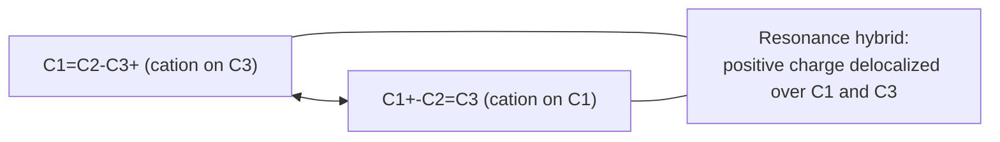
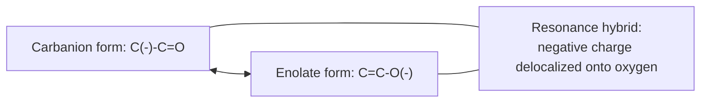

## Stability of Carbocations and Carbanions

### Overview

Carbocations and carbanions are the two classes of trivalent/reactive carbon-centered intermediates central to organic reaction mechanisms, bearing formal positive and negative charge respectively. Their relative stabilities — governed by hybridization, inductive effects, hyperconjugation, and resonance — determine which reaction pathways are accessible and predict regiochemical and mechanistic outcomes across substitution, elimination, addition, and rearrangement chemistry.

### Carbocations: Structure and Hybridization

**Key Points**

- A carbocation carbon is $sp^2$-hybridized, trigonal planar, with an empty, unhybridized $p$ orbital perpendicular to the plane of the three σ bonds.
- The empty $p$ orbital is what makes carbocations electron-deficient and highly electrophilic, making them susceptible to attack by any available nucleophile and prone to stabilization by any adjacent electron density source.
- Because the carbocation carbon is planar, any stereochemical information at that center is lost upon formation of a simple (non-bridged) carbocation, a key factor underlying the racemization observed in $S_N1$ reactions.

### Diagram: Carbocation Structure (svg_diagram)

<svg xmlns="http://www.w3.org/2000/svg" viewBox="0 0 400 240">
<text x="200" y="24" text-anchor="middle" font-size="16" font-weight="bold">Carbocation: sp2, empty p orbital (svg_diagram)</text>
<circle cx="200" cy="140" r="6" fill="black" />
<line x1="200" y1="140" x2="140" y2="180" stroke="black" stroke-width="2" />
<line x1="200" y1="140" x2="260" y2="180" stroke="black" stroke-width="2" />
<line x1="200" y1="140" x2="200" y2="190" stroke="black" stroke-width="2" />
<ellipse cx="200" cy="90" rx="14" ry="35" fill="none" stroke="black" stroke-width="1.5" stroke-dasharray="4,3" />
<ellipse cx="200" cy="190" rx="14" ry="35" fill="none" stroke="black" stroke-width="1.5" stroke-dasharray="4,3" />
<text x="200" y="55" text-anchor="middle" font-size="12">empty p orbital</text>
<text x="200" y="225" text-anchor="middle" font-size="11">C+ trigonal planar, sp2</text>
</svg>

### Carbocation Stability Order

**Alkyl substitution effect**: Increasing substitution stabilizes carbocations, primarily through **hyperconjugation** (donation of electron density from adjacent C–H or C–C σ bonds into the empty $p$ orbital) and, to a lesser extent, inductive electron donation from alkyl groups.

$$\text{tertiary} > \text{secondary} > \text{primary} > \text{methyl}$$

**Resonance stabilization (stronger than simple hyperconjugation)**:

$$\text{benzylic, allylic (resonance-delocalized)} \gtrsim \text{tertiary} > \text{secondary} > \text{primary} > \text{methyl}$$

**Key Points**

- **Hyperconjugation** involves overlap between a filled, adjacent $\sigma_{C-H}$ (or $\sigma_{C-C}$) bonding orbital and the empty $p$ orbital of the carbocation, delocalizing electron density into the cationic center; more adjacent C–H/C–C bonds (i.e., greater substitution) means more hyperconjugative stabilization is possible.
- **Allylic and benzylic carbocations** are stabilized by true resonance delocalization: the adjacent π system (alkene or aromatic ring) can donate electron density directly into the empty $p$ orbital through continuous $p$-orbital overlap, spreading the positive charge over multiple atoms — a stronger stabilizing effect than hyperconjugation alone.
- A **tertiary benzylic or tertiary allylic** carbocation (combining both substitution and resonance effects) is exceptionally stable, and such cations can sometimes be observed or even isolated as stable salts under special conditions (e.g., the triphenylmethyl cation, $Ph_3C^+$).

### Diagram: Allylic Cation Resonance Delocalization

**Heteroatom stabilization (α-alkoxy and α-amino cations)**:

**Key Points**

- A carbocation adjacent to an oxygen or nitrogen atom bearing a lone pair (e.g., an oxocarbenium ion, $R_2C=O^+R'$, or an iminium-type cation) is strongly stabilized by direct resonance donation of the heteroatom lone pair into the empty $p$ orbital, since oxygen and nitrogen lone pairs are excellent π donors.
- This stabilization underlies the high reactivity and stability of oxocarbenium ion intermediates in acetal hydrolysis and glycoside chemistry, and of iminium ion intermediates in enamine/imine chemistry.

**Destabilizing effects**:

**Key Points**

- Electron-withdrawing groups (e.g., $-NO_2$, $-CN$, $-C(=O)R$, halogens) adjacent to a potential carbocation center destabilize it through inductive electron withdrawal, since they pull electron density away from an already electron-deficient center, disfavoring carbocation formation at or near that position.
- Carbocations adjacent to a full positive charge (e.g., a 1,2-dicationic arrangement) or at a bridgehead position of certain rigid bicyclic systems (where the required planar geometry cannot be achieved, per Bredt's rule considerations) are strongly destabilized or effectively inaccessible.

### Nonclassical Carbocations (Bridged Cations)

**Key Points**

- Certain carbocations are stabilized by delocalization through a bridging σ bond (rather than a π system), forming a **nonclassical** (bridged) carbocation structure in which the positive charge is delocalized over more than one carbon through a three-center, two-electron bonding interaction.
- The classic example is the **norbornyl cation**, historically the subject of extensive debate regarding whether it exists as a rapidly equilibrating pair of classical cations or as a single symmetrically bridged nonclassical structure; substantial spectroscopic and computational evidence supports the nonclassical (bridged) description. [Inference — while broadly accepted today, some historical debate on this specific system persisted for decades and nuances of interpretation remain an active area of physical organic chemistry discussion.]

### Carbocation Rearrangements

**Key Points**

- A carbocation can undergo a **1,2-hydride shift** or **1,2-alkyl (methyl/alkyl) shift** if migration of a hydrogen or alkyl group from an adjacent carbon generates a more stable carbocation, since such rearrangements are typically fast relative to competing nucleophilic capture or elimination.
- Rearrangements are a diagnostic feature of mechanisms proceeding through free carbocation intermediates ($S_N1$, $E1$, and acid-catalyzed additions to alkenes), and their occurrence (evidenced by a rearranged carbon skeleton in the product) is strong mechanistic evidence against a concerted ($S_N2$/$E2$) pathway, which does not generate a free carbocation capable of rearranging.

### Carbanions: Structure and Hybridization

**Key Points**

- A simple carbanion carbon is generally considered to adopt a geometry closer to $sp^3$ (pyramidal, similar to ammonia) with the negative charge residing in a lone pair occupying one of the four $sp^3$-like orbitals, though the degree of pyramidalization and the rate of pyramidal inversion depend on the specific substituents. [Inference — the precise hybridization and inversion barrier vary with substitution and are sometimes described as intermediate between sp³ and sp² depending on stabilizing substituents.]
- Because the negative charge occupies a lone pair (analogous to an amine lone pair) rather than an empty orbital, carbanions are strongly basic and nucleophilic, in direct contrast to the electrophilic, electron-poor character of carbocations.

### Carbanion Stability Order

**Substitution effect (opposite trend to carbocations)**: Alkyl groups are weakly electron-donating (inductively and hyperconjugatively) relative to hydrogen, which is destabilizing for a carbanion (an already electron-rich center does not benefit from additional electron density); consequently, carbanion stability trends opposite to carbocation stability with respect to alkyl substitution:

$$\text{methyl} > \text{primary} > \text{secondary} > \text{tertiary}$$

**Key Points**

- This trend directly explains observed C–H acidity trends: for simple alkanes, the conjugate base (carbanion) is destabilized by increasing alkyl substitution, so bond dissociation/acidity trends for terminal vs. internal C–H bonds are consistent with less-substituted carbanions being relatively more stable/accessible than more highly substituted ones, all else being equal. [Inference — in practice, other stabilizing effects (resonance, hybridization, inductive substituents) typically dominate over this simple alkyl-substitution trend in determining actual measured C–H acidities of real compounds.]

**Hybridization effect**: Increased $s$-character in the orbital holding the carbanion lone pair stabilizes the carbanion, since an $s$ orbital holds electron density closer to (and more strongly attracted to) the positively charged nucleus than a $p$ orbital does.

$$sp \, (\approx 50\% \, s) > sp^2 \, (\approx 33\% \, s) > sp^3 \, (25\% \, s)$$

**Key Points**

- This hybridization effect explains why terminal alkyne C–H bonds (bonded to an $sp$ carbon) are considerably more acidic than vinyl ($sp^2$) or alkyl ($sp^3$) C–H bonds, and why acetylide ions ($R–C\equiv C^-$) are readily generated and are useful, reasonably stable nucleophiles/bases in synthesis.

**Resonance stabilization**:

**Key Points**

- A carbanion adjacent to a carbonyl group (an **enolate**, formed by deprotonation α to a carbonyl) is strongly resonance-stabilized, since the negative charge can delocalize onto the more electronegative oxygen atom, giving a resonance structure with the negative charge on oxygen rather than carbon — the basis for the significant acidity of α C–H bonds relative to ordinary alkane C–H bonds.
- Carbanions stabilized by adjacent aromatic rings (benzylic) or by adjacent alkenes (allylic) similarly benefit from resonance delocalization into the π system, analogous to (but with opposite charge polarity from) the stabilization seen in benzylic/allylic carbocations.
- Additional electron-withdrawing groups (nitro, cyano, additional carbonyls, sulfonyl) adjacent to a carbanion center further stabilize it by both resonance delocalization and inductive electron withdrawal, which is why compounds such as malonate esters and nitroalkanes have particularly acidic α-hydrogens.

### Diagram: Enolate Resonance Stabilization

### Side-by-Side Comparison: Carbocations vs. Carbanions

| Property | Carbocation | Carbanion |
| --- | --- | --- |
| Formal charge | Positive | Negative |
| Typical hybridization | $sp^2$, trigonal planar | Closer to $sp^3$, pyramidal (variable) |
| Key stabilizing orbital feature | Empty $p$ orbital (accepts electron density) | Filled lone-pair orbital (needs electron-density stabilization from elsewhere) |
| Effect of alkyl substitution | Stabilizing (hyperconjugation, induction) | Destabilizing (alkyl groups are weak electron donors) |
| Effect of adjacent EWG | Destabilizing (inductive withdrawal from cationic center) | Stabilizing (resonance/inductive withdrawal of negative charge) |
| Effect of adjacent π system (allylic/benzylic) | Strongly stabilizing (resonance) | Strongly stabilizing (resonance) |
| Effect of increased $s$-character | Not the dominant stabilizing factor typically discussed | Strongly stabilizing (sp > sp² > sp³) |
| Characteristic reactivity | Electrophilic; prone to nucleophilic attack and rearrangement | Nucleophilic and basic; reacts with electrophiles |
| Governs mechanisms | $S_N1$, $E1$, electrophilic addition | Enolate chemistry, organometallic reagents, elimination (E1cb) |

### Worked Comparative Example

**Question**: Rank the following in order of increasing stability as carbanions: (a) $CH_3^-$ (methyl anion), (b) the acetylide ion $HC\equiv C^-$, (c) the enolate of acetone, (d) the benzyl anion $PhCH_2^-$.

**Reasoning**:

- Methyl anion (a) has no stabilizing features beyond its inherent $sp^3$ hybridization — least stable of this set.
- The acetylide ion (b) benefits from the high $s$-character of the $sp$-hybridized carbon, a substantial stabilizing effect.
- The benzyl anion (d) benefits from resonance delocalization into the aromatic ring.
- The acetone enolate (c) benefits from resonance delocalization onto the highly electronegative oxygen atom, generally considered a stronger stabilizing interaction than delocalization into a carbocyclic aromatic ring, due to oxygen's higher electronegativity better accommodating the negative charge. [Inference — the precise relative ranking of resonance stabilization magnitudes (aromatic ring vs. carbonyl oxygen) can depend on the specific comparison and computational/experimental method used.]

**Approximate order (least to most stable)**: (a) < (b) < (d) < (c)

### Common Pitfalls

- **Applying carbocation stability trends directly to carbanions**: Alkyl substitution stabilizes carbocations but destabilizes carbanions — these trends are opposite, and confusing them is a frequent source of error.
- **Forgetting the hybridization effect on carbanion stability**: Students often focus only on resonance and inductive effects while overlooking that increased $s$-character (as in $sp$-hybridized acetylide anions) is itself a significant stabilizing factor.
- **Assuming all resonance-stabilized carbanions are equally stable**: The identity of the atom accepting delocalized negative charge (oxygen in enolates vs. an aromatic ring in benzylic anions) affects the degree of stabilization, since more electronegative atoms are generally better able to stabilize negative charge.
- **Neglecting to check for rearrangement possibilities when a carbocation intermediate is proposed**: Any mechanism invoking a free carbocation should be checked for the possibility of a more stable rearranged structure via hydride or alkyl shift.

### Related Topics

- Nucleophilic substitution reactions ($S_N1$/$S_N2$) and their dependence on carbocation stability
- Elimination reactions (E1, E1cb) and carbanion/carbocation intermediates
- Enolate chemistry and α,β-unsaturated carbonyl reactivity
- Aromaticity and resonance theory
- Acid–base chemistry: predicting relative acidity from conjugate-base stability
- Nonclassical carbocations and the norbornyl cation controversy