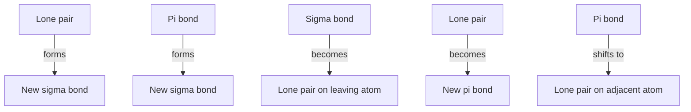

## Curved Arrow Notation

### Overview

Curved arrow notation is the standard formalism organic chemists use to depict the movement of electrons during a reaction mechanism. Each arrow represents the motion of a specific pair of electrons (or, for radical mechanisms, a single electron), tracking bond-breaking and bond-forming events from starting materials through intermediates to products. Mastery of this notation is foundational to representing, predicting, and communicating every mechanism class covered elsewhere in this chapter (substitution, elimination, addition, radical, and pericyclic reactions).

### The Two Types of Arrows

**Full-headed (double-barbed) arrow**: Represents the movement of a pair of electrons (two electrons). Used in essentially all ionic (heterolytic) mechanisms: nucleophilic/electrophilic substitution, addition, elimination, and acid–base reactions.

**Half-headed ("fishhook") arrow**: Represents the movement of a single electron. Used exclusively in radical (homolytic) mechanisms.

### Diagram: Arrow Types Compared (svg_diagram)

<svg xmlns="http://www.w3.org/2000/svg" viewBox="0 0 600 200">
<text x="300" y="24" text-anchor="middle" font-size="16" font-weight="bold">Full-headed vs. fishhook arrows (svg_diagram)</text>

<text x="150" y="70" text-anchor="middle" font-size="13">Full-headed (2 electrons)</text>

<path d="M 90 110 Q 150 80 210 110" fill="none" stroke="black" stroke-width="2" marker-end="url(#full)" />

<text x="150" y="140" text-anchor="middle" font-size="11">used in ionic mechanisms</text>

<text x="450" y="70" text-anchor="middle" font-size="13">Fishhook (1 electron)</text>

<path d="M 390 110 Q 450 80 510 110" fill="none" stroke="black" stroke-width="2" marker-end="url(#half)" />

<text x="450" y="140" text-anchor="middle" font-size="11">used in radical mechanisms</text>

</svg>

### Fundamental Rule: Arrows Show Electron Movement, Not Atom Movement

**Key Points**

- A curved arrow always originates from a source of electron density — a lone pair, a π bond, or a σ bond — and points toward the destination where those electrons end up — an atom (forming a new lone pair), a new bond (forming a new σ or π bond), or, in the case of a leaving group, an atom that will carry the electrons away as it departs.
- Arrows never originate from a positive charge or from an empty orbital, since there are no electrons there to move; a positive center can only ever be the **destination** of an arrow, or the site from which an adjacent bond's electrons shift toward it (as in hyperconjugation/resonance).
- Arrows never originate from an atom itself without reference to a specific pair (or single) of electrons — always draw the arrow tail from the specific bond or lone pair, not vaguely from "the atom" as a whole.

### Common Arrow-Pushing Patterns

**1. Lone pair to new bond (nucleophile attacking an electrophile)**

A lone pair on a nucleophilic atom moves to form a new σ bond to an electrophilic center.

**2. π bond to new bond (alkene acting as nucleophile, or carbonyl-type addition in reverse)**

The electrons of a π bond shift to form a new σ bond, as in electrophilic addition to an alkene.

**3. Bond to lone pair (leaving group departure)**

A σ bond's electrons move entirely onto the more electronegative/stabilized atom as it departs, becoming a lone pair on that now-anionic (or neutral, if applicable) species.

**4. Lone pair to π bond (resonance donation, e.g., amide resonance or enolate formation direction)**

A lone pair shifts to become part of a new π bond, as seen in resonance structures where a heteroatom lone pair delocalizes into an adjacent π system.

**5. π bond to lone pair (protonation of an alkene, or the reverse direction of pattern 4)**

The electrons of a π bond move to form a new bond to an incoming electrophile (often $H^+$), or, in resonance contexts, shift to reside as a lone pair on an adjacent atom.

### Diagram: The Five Core Patterns, Illustrated Schematically

### Worked Example 1: SN2 Mechanism Arrow-Pushing

For the reaction of hydroxide with bromomethane, $HO^- + CH_3Br \rightarrow CH_3OH + Br^-$:

1. **Arrow 1**: Tail on one of the lone pairs of the hydroxide oxygen; head pointing to the space between the oxygen and the electrophilic carbon (representing formation of the new O–C σ bond).
2. **Arrow 2**: Tail on the existing C–Br σ bond; head pointing directly onto the bromine atom (representing the C–Br bond's electrons becoming a lone pair on the departing bromide ion).

**Key Points**

- Both arrows are drawn simultaneously in a single concerted step, consistent with the $S_N2$ mechanism having no intermediate — the arrows collectively represent one continuous electron-flow event, not two sequential ones.
- The geometry of the arrows (nucleophile approaching from the side opposite the leaving group) should reflect the actual backside-attack geometry of $S_N2$, reinforcing the inversion of configuration at the reacting carbon.

### Worked Example 2: Acid-Catalyzed Carbonyl Addition (Multi-Step)

For acid-catalyzed hydration of a ketone:

**Step 1 (protonation of carbonyl oxygen)**: Arrow tail on a lone pair of the carbonyl oxygen; head pointing to the incoming proton. A second, simultaneous arrow has its tail on the $H$–(acid) σ bond and its head pointing onto the acid's conjugate base atom (showing that bond's electrons becoming a lone pair there).

**Step 2 (water attacks the now more electrophilic, protonated carbonyl carbon)**: Arrow tail on a lone pair of the water oxygen; head pointing to the carbonyl carbon. A second, simultaneous arrow has its tail on the C=O π bond; head pointing onto the (now singly-bonded, positively charged) oxygen, becoming a lone pair there.

**Step 3 (deprotonation to regenerate the catalyst)**: Arrow tail on a lone pair of a base (often another water molecule); head pointing to one of the protons on the newly formed, positively charged oxygen. A second, simultaneous arrow has its tail on the O–H σ bond being broken; head pointing onto the oxygen, becoming a lone pair (completing formation of the neutral diol/hydrate product).

**Key Points**

- Each individual mechanistic step, even within a multi-step overall transformation, must itself be balanced: the total charge shown by the arrows in that single step must be conserved between the step's starting structure and its resulting structure.
- Protonation and deprotonation steps are typically drawn with two simultaneous arrows each (one showing the lone pair attacking $H^+$, or the base's lone pair attacking a proton; another showing the departing bond's electrons moving onto the appropriate atom).

### Worked Example 3: Radical Chain Propagation (Fishhook Arrows)

For the propagation step $Cl\cdot + CH_4 \rightarrow HCl + \cdot CH_3$:

1. **Arrow 1 (fishhook)**: Tail on the unpaired electron of the chlorine radical; head pointing to the space between $Cl$ and the hydrogen being abstracted (forming the new H–Cl bond with one electron from each fragment).
2. **Arrow 2 (fishhook)**: Tail on one electron of the C–H σ bond being broken; head pointing onto the carbon atom, left behind as the new unpaired electron of the methyl radical.

**Key Points**

- Radical mechanisms always use two separate single-headed (fishhook) arrows to represent the two electrons of a bond being broken (one electron to each resulting fragment), never a single full-headed arrow, since a full-headed arrow would incorrectly imply both electrons moving together (a heterolytic, ionic process).

### Common Rules and Conventions Checklist

**Key Points**

- Arrow tails must start precisely on a lone pair, a σ bond, or a π bond — never on a charge symbol, an atom label with no explicit bond/lone pair shown, or an implicit/unstated electron source.
- Arrow heads must point precisely to the destination: the midpoint of a newly forming bond, or directly onto an atom that will bear a new lone pair.
- The total formal charge of the system must be conserved from before to after each individual arrow-pushing step (charges can move or redistribute, but the algebraic sum is unchanged in a step that involves no addition/removal of charged species from solution).
- The octet rule (for main-group elements, particularly carbon, nitrogen, oxygen) must not be violated at any intermediate stage; an arrow that would push a fifth bond onto a carbon already possessing four bonds represents an invalid step.
- Multi-step mechanisms should show each elementary step separately, with arrows redrawn fresh for each step on the structure resulting from the previous step — arrows are never carried over or implied across multiple structures.

### Common Pitfalls

- **Drawing an arrow from a positive charge or an atom with no lone pair/bond specified**: This is one of the most frequent student errors; always identify a specific electron source (lone pair, σ, or π bond) before drawing the tail.
- **Using a full-headed arrow in a radical mechanism (or vice versa)**: Full-headed arrows imply two-electron (ionic) movement; fishhook arrows imply one-electron (radical) movement — mixing these misrepresents the electron count and the mechanism class.
- **Failing to show the leaving-group arrow in a substitution or elimination mechanism**: Showing only the nucleophile/base's attacking arrow while forgetting to show where the displaced bond's electrons go is a common incomplete-mechanism error.
- **Violating the octet rule at an intermediate step**: Pushing arrows without checking that no atom (especially carbon) temporarily exceeds four bonds is a frequent source of chemically impossible "mechanisms."
- **Combining multiple bond-breaking/forming events into a single arrow inappropriately**: Each arrow represents exactly one pair (or one single, for fishhook) of electrons moving from one specific location to one specific destination; a single arrow cannot represent two unrelated electron-pair movements simultaneously.

### Related Topics

- Nucleophilic substitution and elimination reaction mechanisms (arrow-pushing applications)
- Resonance structures and formal charge assignment
- Acid–base mechanisms and proton-transfer arrow conventions
- Radical reaction mechanisms and fishhook arrow use
- Electrophilic and nucleophilic addition mechanisms
- Pericyclic reaction arrow notation (cyclic electron flow)