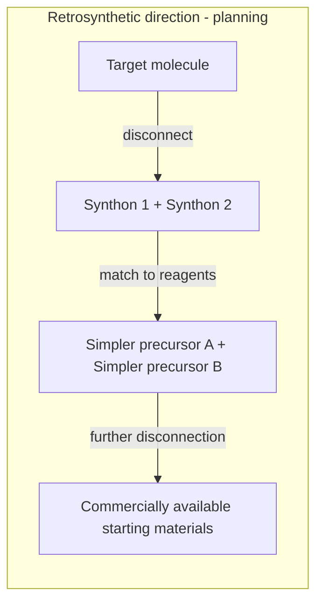
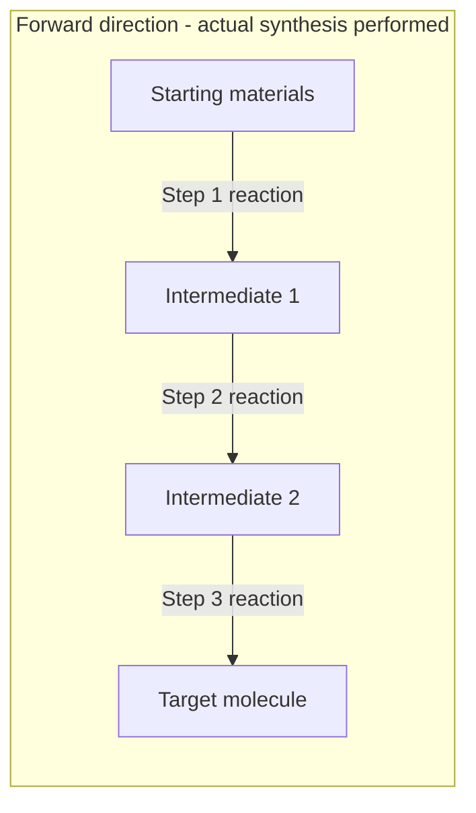
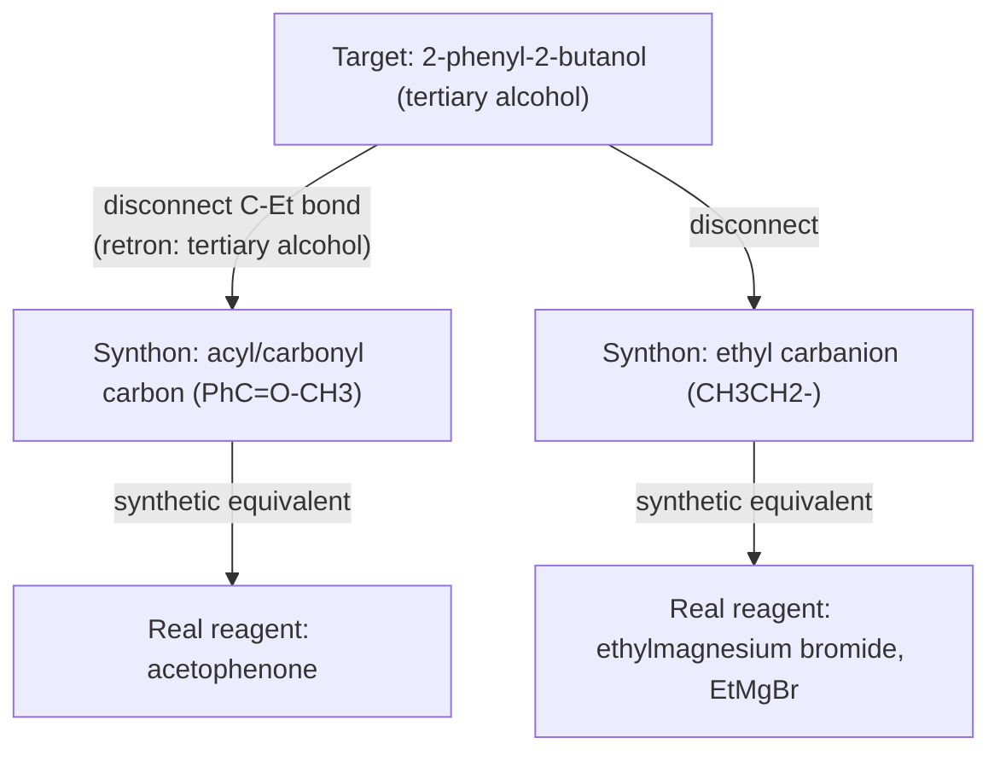
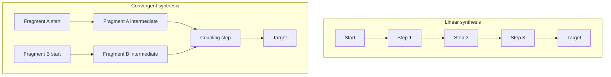

## Multistep Synthesis and Retrosynthetic Analysis

### Overview

Multistep synthesis is the construction of a target organic molecule through a planned sequence of individual reactions, each building on the product of the previous step. Retrosynthetic analysis is the systematic strategy for planning such a sequence by working backward from the target molecule, mentally disassembling it into progressively simpler precursors until commercially available or readily accessible starting materials are reached.

### The Retrosynthetic Approach

**Key Points**

- Retrosynthetic analysis proceeds in the opposite direction from the eventual forward synthesis: the chemist starts with the target molecule and identifies a **disconnection** — a bond that could plausibly be formed by a known reaction — mentally breaking that bond to generate one or more simpler **synthons** (idealized fragments, often carbocation- or carbanion-like, representing the reactive roles the real reagents will play).
- Each synthon is then matched to a real, available **synthetic equivalent** (an actual reagent or starting material capable of playing that synthon's role in a real reaction).
- This backward process is repeated on each resulting precursor until every fragment traces back to a simple, commercially available, or easily prepared starting material.
- The special retrosynthetic arrow, an open double-lined arrow ($\Rightarrow$), is used to indicate a retrosynthetic disconnection, distinguishing it from the standard forward reaction arrow ($\rightarrow$).

### Diagram: Forward Synthesis vs. Retrosynthetic Analysis

### Key Terminology

| Term | Definition |
| --- | --- |
| Target molecule | The final compound the synthesis is designed to produce |
| Disconnection | A bond in the target chosen to be "broken" mentally, corresponding to a bond that will be formed in the real forward synthesis |
| Synthon | An idealized (often charged) fragment representing the reactive role a piece of the molecule plays at a disconnection (e.g., an acyl cation synthon, an enolate anion synthon) |
| Synthetic equivalent | The real, actual reagent or compound used in the laboratory to fulfill the role of a given synthon (e.g., an acid chloride as the synthetic equivalent of an acylium synthon) |
| Functional group interconversion (FGI) | A retrosynthetic step that changes one functional group into another (without forming or breaking a C–C bond), often used to reveal a more strategically useful disconnection |
| Retron | The minimal structural pattern within the target that signals a specific disconnection strategy is applicable (e.g., a 1,5-relationship between a carbonyl and an alkene signaling a potential Diels–Alder retrosynthetic disconnection) |

### Worked Example: Retrosynthesis of a Tertiary Alcohol via Grignard Addition

**Target**: 2-phenyl-2-butanol, $Ph$–$C(CH_3)(OH)$–$CH_2CH_3$

**Step 1 — Identify the disconnection**: A tertiary alcohol bearing an aryl group is a classic retron for a Grignard (or organolithium) addition to a ketone. Disconnect one of the C–C bonds at the carbinol carbon, choosing the bond between the carbinol carbon and the ethyl group (or, alternatively, the phenyl group, or the methyl group — several disconnections are chemically valid).

**Step 2 — Generate synthons**: Disconnecting the ethyl–carbinol bond generates two synthons: an acyl-type synthon corresponding to the ketone carbon (the electrophilic carbonyl carbon of acetophenone, $PhC(=O)CH_3$) and a carbanion synthon, $CH_3CH_2^-$ (ethyl anion equivalent).

**Step 3 — Match synthons to synthetic equivalents**: The carbonyl synthon corresponds directly to the real ketone, acetophenone. The carbanion synthon corresponds to the real reagent ethylmagnesium bromide ($CH_3CH_2MgBr$), a Grignard reagent.

**Forward synthesis (the actual laboratory sequence)**:

$$PhC(=O)CH_3 + CH_3CH_2MgBr \xrightarrow{\text{Et}_2\text{O}} \text{intermediate alkoxide} \xrightarrow{H_3O^+} Ph\text{-}C(CH_3)(OH)\text{-}CH_2CH_3$$

### Diagram: Retrosynthesis of 2-Phenyl-2-butanol

### Strategic Principles in Retrosynthetic Planning

**1. Identify strategic bonds**: Disconnections at bonds adjacent to functional groups (especially C–C bonds near carbonyls, or bonds that would be formed by well-precedented named reactions) are generally more productive starting points than arbitrary disconnections.

**2. Work toward convergence over linearity where possible**: A **convergent synthesis** (in which two or more independently prepared fragments of comparable complexity are joined together, often near the end of the synthesis) is generally more efficient than a strictly **linear synthesis** (in which the target is built up one step at a time from a single starting material), because the overall yield of a convergent route is less severely eroded by the yield losses of any individual step compared to a linear route of the same overall length.

**3. Recognize common retrons**: Certain structural patterns reliably suggest a specific named reaction or disconnection strategy:

- A 1,3-relationship between two oxygen-containing functional groups often suggests an aldol-type disconnection.
- A six-membered ring containing a remnant alkene, viewed together with an appropriately positioned second alkene/carbonyl 1,5 to it, often suggests a Diels–Alder disconnection.
- A tertiary or secondary alcohol suggests a possible organometallic (Grignard/organolithium) addition to a carbonyl.
- An amide or ester suggests disconnection to a carboxylic acid derivative and an amine or alcohol.

**4. Consider protecting groups when necessary**: If a synthetic route requires a reagent (e.g., a strong nucleophile or reducing agent) that would also react with another sensitive functional group already present in an intermediate, a **protecting group** strategy is used: the sensitive group is temporarily converted to an unreactive form before the incompatible step, then deprotected (restored) afterward.

### Diagram: Linear vs. Convergent Synthesis Strategy

**Key Points**

- In a convergent synthesis, even if each individual step proceeds in a similar yield to the corresponding step in a linear route, the overall yield tends to be higher because the final coupling step combines two fragments that each required fewer sequential steps from their own respective starting points, reducing the cumulative multiplicative yield loss along the longest single path to the target.

### Forward Synthesis: Practical Considerations

**Key Points**

- Once a retrosynthetic route has been planned, the forward synthesis must be checked for **functional group compatibility** at every step: reagents used in a later step must not inadvertently react with functional groups introduced or retained from earlier steps, unless that reaction is the intended transformation.
- **Order of operations** matters: some functional groups must be installed before others, or a given transformation may need to precede a step that would otherwise destroy a sensitive group; retrosynthetic planning should explicitly consider whether the proposed order of disconnections translates into a viable, compatible forward sequence.
- **Stereochemical control** must be planned explicitly where the target has defined stereocenters or alkene geometry: the retrosynthetic plan should identify which step(s) will set each stereocenter or double-bond geometry, and whether that step's mechanism (e.g., $S_N2$ inversion, syn or anti addition, a stereospecific pericyclic process) is consistent with the stereochemical outcome required in the target.

### Worked Multistep Example: Combining Concepts

**Target**: *trans*-4-*tert*-butylcyclohexanol (a defined-stereochemistry secondary alcohol on a substituted cyclohexane ring)

**Retrosynthetic analysis**:

1. Disconnect the alcohol via a **functional group interconversion (FGI)**: a secondary alcohol can be traced back to the corresponding ketone (4-*tert*-butylcyclohexanone) via a reduction reaction, since this defers the stereochemical question to the reduction step rather than the ring-forming step.
2. 4-*tert*-butylcyclohexanone is itself a reasonably available starting material (or can be further disconnected, but for this example is treated as the point where retrosynthesis stops).

**Forward synthesis and stereochemical reasoning**:

- Reduction of 4-*tert*-butylcyclohexanone with a bulky hydride reagent (e.g., $L$-Selectride) delivers hydride preferentially from the less hindered equatorial trajectory, which — due to the way this docking direction relates to axial/equatorial product stereochemistry in this specific ring system — is used to access the desired *trans* relative stereochemistry between the resulting hydroxyl and the *tert*-butyl group; a small, unhindered hydride reagent (e.g., $NaBH_4$) would give a different (predominantly *cis*) stereochemical preference by attacking from the opposite face. [Inference — the specific axial/equatorial correlation with cis/trans product labeling depends on the ring system's exact substitution pattern and should be verified with a 3D model for any specific case; the general principle that bulky vs. small hydride reagents give differing facial selectivity is well established.]
- This example illustrates how retrosynthetic planning must explicitly select a reagent capable of delivering the correct stereochemical outcome, not merely the correct constitutional connectivity.

### Common Pitfalls

- **Confusing synthons with synthetic equivalents**: A synthon (e.g., an acyl cation, $R–C\equiv O^+$) is an idealized concept useful for identifying disconnections; the synthetic equivalent (e.g., the real acid chloride, $R–COCl$) is the actual reagent used in the laboratory. These should not be conflated when writing a retrosynthetic scheme.
- **Choosing a disconnection with no known corresponding forward reaction**: Every retrosynthetic disconnection must correspond to at least one well-precedented real reaction; a disconnection that looks structurally clean but has no viable forward reaction is not useful.
- **Ignoring functional group compatibility across steps**: A synthesis plan that looks correct step-by-step in isolation can fail if an early-installed functional group is incompatible with reagents required in a later step; protecting group strategies or reordering of steps may be required.
- **Overlooking stereochemical requirements until the end**: Stereocenters and alkene geometries in the target should be traced back through the retrosynthesis to identify exactly which step is responsible for setting each one, and whether the proposed reagent/mechanism for that step is actually capable of delivering the required stereochemical outcome.
- **Defaulting to a purely linear synthesis when a convergent route is available**: For more complex targets, failing to consider convergent disconnections can lead to unnecessarily long, lower-overall-yield synthetic routes.

### Related Topics

- Named reactions commonly used as forward-synthesis building blocks (Grignard addition, aldol reaction, Diels–Alder reaction, Wittig reaction)
- Protecting group strategies for alcohols, amines, and carbonyls
- Stereochemistry of reaction mechanisms (as applied to stereochemical planning in synthesis)
- Functional group interconversions and their role in retrosynthetic simplification
- Total synthesis case studies illustrating convergent vs. linear strategies
- Reaction yield, atom economy, and green chemistry considerations in route selection