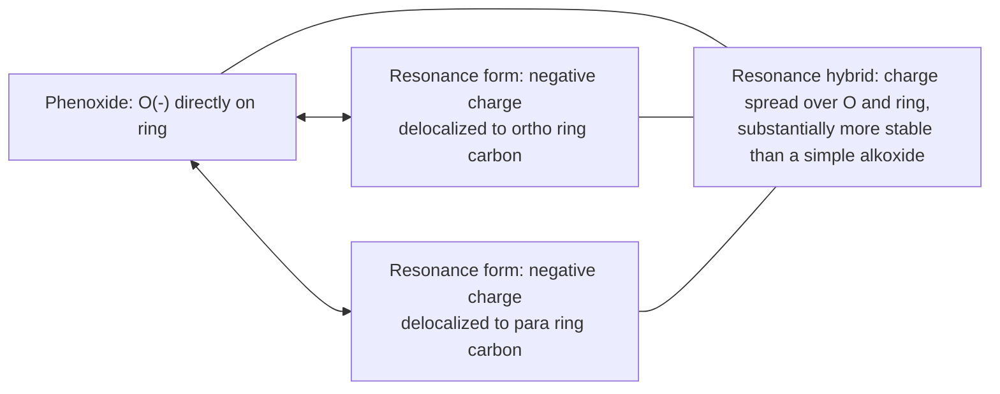

## Nomenclature and Physical Properties

### Overview

Alcohols, ethers, and phenols share the common structural feature of an oxygen atom bonded to carbon, but differ in their overall connectivity (hydroxyl on sp³ carbon vs. on aromatic ring vs. oxygen bridging two carbons), which in turn governs their nomenclature rules and produces distinct trends in physical properties such as boiling point, solubility, and acidity.

### Nomenclature of Alcohols

**IUPAC rules:**

1. Identify the longest continuous carbon chain that contains the carbon bearing the $-OH$ group.
2. Replace the $-e$ ending of the corresponding alkane with $-ol$ (e.g., ethane → ethanol).
3. Number the chain to give the $-OH$ group the lowest possible locant, and cite this locant immediately before the $-ol$ suffix (e.g., pentan-2-ol) or, in older style, before the parent name (2-pentanol).
4. Substituents are named and numbered as prefixes in the usual way, with the $-OH$ group taking priority over most other groups (alkyl, halo) for receiving the lowest locant, but ranking below carboxylic acids, esters, amides, nitriles, aldehydes, and ketones in the standard seniority order for choosing the principal characteristic group and parent chain.
5. For diols and polyols, the terminal $-e$ of the alkane name is retained before adding the multiplying suffix: e.g., ethane-1,2-diol (retaining the "e" because the suffix "-diol" begins with a consonant sound, per IUPAC convention).

**Common (trivial) nomenclature**: Alcohols are also frequently named as "[alkyl group] alcohol" (e.g., isopropyl alcohol for propan-2-ol, *tert*-butyl alcohol for 2-methylpropan-2-ol).

**Classification by substitution**: Alcohols are classified as **primary (1°)**, **secondary (2°)**, or **tertiary (3°)** based on the number of carbon substituents attached to the carbinol carbon (the carbon bearing the $-OH$ group): a primary alcohol's carbinol carbon is attached to one other carbon, secondary to two, and tertiary to three.

### Nomenclature of Ethers

**IUPAC substitutive nomenclature**: The ether is named by treating the smaller alkyl/aryl-oxy group as an "alkoxy" substituent prefix on the parent chain corresponding to the larger group. Example: $CH_3–O–CH_2CH_2CH_3$ is named 1-methoxypropane (methoxy substituent on a propane parent chain).

**Common nomenclature**: Ethers are very frequently named by citing both alkyl/aryl groups attached to the oxygen, in alphabetical order, followed by the word "ether" (e.g., diethyl ether for $CH_3CH_2–O–CH_2CH_3$; ethyl methyl ether for $CH_3CH_2–O–CH_3$).

**Cyclic ethers**: Common cyclic ethers have retained/common names widely used even in otherwise systematic contexts: oxirane (common name: ethylene oxide, a three-membered ring), oxetane (four-membered ring), tetrahydrofuran (THF, five-membered ring), and tetrahydropyran/dioxane (six-membered rings).

### Nomenclature of Phenols

**Key Points**

- "Phenol" itself is the retained IUPAC name for hydroxybenzene and also serves as the parent name for substituted derivatives, numbered with the $-OH$ carbon as C1.
- Common names are retained for several important substitution patterns and derivatives: *cresols* (methylphenols), *catechol* (benzene-1,2-diol), *resorcinol* (benzene-1,3-diol), *hydroquinone* (benzene-1,4-diol).
- When a phenolic $-OH$ is present alongside a higher-priority functional group elsewhere on the ring (e.g., a carboxylic acid), the phenolic $-OH$ is named as a "hydroxy" substituent prefix rather than as the principal suffix (e.g., 4-hydroxybenzoic acid).

### Diagram: Structural Distinctions (svg_diagram)

<svg xmlns="http://www.w3.org/2000/svg" viewBox="0 0 640 220">
<text x="320" y="24" text-anchor="middle" font-size="16" font-weight="bold">Alcohol, ether, and phenol connectivity (svg_diagram)</text>

<text x="100" y="70" text-anchor="middle" font-size="13" font-weight="bold">Alcohol</text>

<line x1="60" y1="120" x2="100" y2="90" stroke="black" stroke-width="2" />

<line x1="100" y1="90" x2="140" y2="120" stroke="black" stroke-width="2" />

<line x1="100" y1="90" x2="100" y2="50" stroke="black" stroke-width="2" />

<text x="100" y="40" text-anchor="middle" font-size="12">OH</text>

<text x="100" y="150" text-anchor="middle" font-size="11">R-OH, sp3 C-OH</text>

<text x="320" y="70" text-anchor="middle" font-size="13" font-weight="bold">Ether</text>

<line x1="270" y1="110" x2="310" y2="110" stroke="black" stroke-width="2" />

<line x1="330" y1="110" x2="370" y2="110" stroke="black" stroke-width="2" />

<text x="320" y="115" text-anchor="middle" font-size="12">O</text>

<text x="320" y="150" text-anchor="middle" font-size="11">R-O-R', oxygen bridges 2 carbons</text>

<text x="530" y="70" text-anchor="middle" font-size="13" font-weight="bold">Phenol</text>

<polygon points="530,90 560,105 560,135 530,150 500,135 500,105" fill="none" stroke="black" stroke-width="2" />

<line x1="530" y1="90" x2="530" y2="60" stroke="black" stroke-width="2" />

<text x="530" y="50" text-anchor="middle" font-size="12">OH</text>

<text x="530" y="180" text-anchor="middle" font-size="11">OH directly on aromatic ring</text>

</svg>

### Boiling Points

**Key Points**

- Alcohols and phenols have significantly higher boiling points than alkanes, ethers, or alkyl halides of comparable molecular weight, because the $-OH$ group can act as both a hydrogen-bond donor and acceptor, allowing extensive intermolecular hydrogen bonding between molecules in the liquid phase.
- Ethers, lacking an $-OH$ group (no hydrogen directly bonded to the electronegative oxygen), cannot hydrogen-bond to other ether molecules; their boiling points are much closer to those of alkanes of similar molecular weight, and substantially lower than isomeric alcohols.
- Within a series of alcohols, boiling point increases with increasing molecular weight (more surface area for van der Waals interactions) and decreases with increasing branching (reduced surface area for intermolecular contact, similar to the branching trend seen in alkanes).
- Phenols generally have higher boiling points than aliphatic alcohols of comparable molecular weight due to the added contribution of the polarizable aromatic ring to intermolecular (π-stacking and dipole) interactions, in addition to hydrogen bonding.

### Comparative Boiling Point Table (Illustrative Trend)

| Compound | Formula | Approx. MW (g/mol) | Approx. boiling point (°C) | Class |
| --- | --- | --- | --- | --- |
| Butane | $C_4H_{10}$ | 58 | −0.5 | Alkane (no H-bonding) |
| Diethyl ether | $C_4H_{10}O$ | 74 | 34.6 | Ether (dipole only, no H-bond donor) |
| 1-Butanol | $C_4H_{10}O$ | 74 | 117.7 | Alcohol (H-bond donor + acceptor) |

**Key Points**

- Diethyl ether and 1-butanol are constitutional isomers with identical molecular formula and molecular weight, yet 1-butanol boils roughly 80 °C higher, illustrating the dominant effect of hydrogen-bonding capability (present in the alcohol, absent in the ether) on boiling point.

### Diagram: Hydrogen Bonding in Alcohols (svg_diagram)

<svg xmlns="http://www.w3.org/2000/svg" viewBox="0 0 500 200">
<text x="250" y="24" text-anchor="middle" font-size="16" font-weight="bold">Intermolecular hydrogen bonding, alcohols (svg_diagram)</text>

<text x="120" y="110" font-size="14">R-O-H</text>

<line x1="185" y1="105" x2="235" y2="105" stroke="black" stroke-width="1.5" stroke-dasharray="3,3" />

<text x="250" y="110" font-size="14">O-R'</text>

<text x="200" y="90" text-anchor="middle" font-size="10">H-bond</text>

<text x="345" y="110" font-size="12">|</text>

<text x="335" y="140" font-size="12">H</text>

<text x="250" y="180" text-anchor="middle" font-size="11">Each O-H can donate and accept H-bonds, extending into a network</text>

</svg>

### Water Solubility

**Key Points**

- Small alcohols (methanol through roughly butanol/pentanol) are miscible with or highly soluble in water because the polar $-OH$ group can hydrogen-bond effectively with water molecules, and the small hydrocarbon portion does not overwhelm this favorable interaction.
- As the alkyl chain length increases beyond about four to five carbons, water solubility decreases substantially, since the increasingly large nonpolar hydrocarbon portion of the molecule dominates the solubility behavior, making longer-chain alcohols behave more like alkanes with respect to water miscibility.
- Ethers have water solubility roughly comparable to alcohols of similar molecular weight for the smaller members of the series, because although ethers cannot donate a hydrogen bond, the ether oxygen can still accept a hydrogen bond from a water molecule.
- Phenol itself has appreciable (though not complete) water solubility due to hydrogen bonding through the $-OH$ group and the added polarity/polarizability of the OH-substituted aromatic ring, though solubility decreases with alkyl substitution on the ring, following the same "nonpolar portion dominates at larger size" pattern seen in aliphatic alcohols. [Inference — exact solubility figures for phenol and its derivatives are compound-specific and are usually reported from experimental solubility tables.]

### Acidity Trends

**Key Points**

- Alcohols have $pK_a$ values typically in the range of approximately 16–18, comparable to or slightly less acidic than water ($pK_a \approx 15.7$), reflecting only modest stabilization of the resulting alkoxide by the alkyl group (alkyl groups are weakly electron-donating, which is slightly destabilizing for the anion, though steric and solvation effects also contribute to the exact ordering across different alcohol classes).
- Phenols are dramatically more acidic than aliphatic alcohols, with $pK_a$ typically around 10, because the resulting phenoxide ion is resonance-stabilized: the negative charge on oxygen can delocalize into the aromatic ring through resonance, spreading the charge and lowering the anion's energy relative to a simple, non-delocalized alkoxide.
- Electron-withdrawing substituents on the phenol ring (e.g., nitro, halogen, carbonyl-containing groups), particularly at the ortho and para positions (where resonance delocalization of the phenoxide charge can reach the substituent), further increase phenol acidity by additional resonance and inductive stabilization of the phenoxide anion; electron-donating substituents (alkyl, amino, alkoxy) decrease phenol acidity by destabilizing the phenoxide.
- Ethers have no acidic O–H proton at all (the oxygen bears two carbon substituents rather than a hydrogen) and are not acidic in the sense discussed for alcohols and phenols; ethers are, however, weakly basic due to the oxygen lone pairs, allowing them to be protonated by strong acids.

### Diagram: Phenoxide Resonance Stabilization

### Comparative Summary Table

| Property | Alcohols | Ethers | Phenols |
| --- | --- | --- | --- |
| H-bond donor? | Yes (O–H) | No | Yes (O–H) |
| H-bond acceptor? | Yes | Yes | Yes |
| Relative boiling point (vs. similar MW alkane) | Much higher | Slightly higher (dipole only) | Much higher |
| Typical $pK_a$ | ~16–18 | Not acidic (no O–H) | ~10 |
| Basis of acidity, if applicable | Weak; simple alkoxide, minimal stabilization | N/A | Strong; resonance-stabilized phenoxide |
| Effect of chain length on water solubility | Decreases with increasing chain length | Decreases with increasing chain length | Decreases with increasing ring substitution |

### Worked Example: Ranking Acidity

**Question**: Rank in order of increasing acidity: (a) cyclohexanol, (b) phenol, (c) 4-nitrophenol, (d) 4-methoxyphenol.

**Reasoning**:

- Cyclohexanol (a), a simple aliphatic alcohol, is the least acidic — its alkoxide conjugate base has no resonance stabilization.
- Phenol (b) is substantially more acidic than cyclohexanol due to phenoxide resonance stabilization.
- 4-Methoxyphenol (d) is less acidic than plain phenol, because the methoxy group is electron-donating (net effect, despite oxygen's inductive withdrawal, its resonance donation into the ring dominates at the para position), destabilizing the phenoxide relative to unsubstituted phenoxide.
- 4-Nitrophenol (c) is the most acidic, because the nitro group is strongly electron-withdrawing by both resonance and induction, and at the para position it can directly stabilize the delocalized negative charge of the phenoxide through extended conjugation.

**Order (least to most acidic)**: (a) < (d) < (b) < (c)

### Common Pitfalls

- **Assuming all C–O-containing compounds have similar physical properties**: The presence or absence of an O–H bond (alcohols/phenols vs. ethers) is the dominant factor controlling hydrogen-bonding capability and therefore boiling point and, where applicable, acidity.
- **Forgetting that alkyl substitution destabilizes rather than stabilizes an alkoxide**: Unlike carbocation stability trends, alkyl groups do not meaningfully acidify simple alcohols; the modest acidity differences among primary/secondary/tertiary alcohols arise mostly from steric and solvation effects rather than electronic stabilization of the anion.
- **Overlooking substituent position when predicting phenol acidity**: Electron-withdrawing/donating effects on phenol acidity are strongly position-dependent; a substituent's influence via resonance is most pronounced at the ortho and para positions (where it can directly interact with the delocalized phenoxide charge) and much weaker at the meta position.
- **Confusing common and IUPAC names for ethers, leading to structural misassignment**: Since common ether names simply list both attached groups, care must be taken to correctly identify both alkyl/aryl fragments rather than assuming a substitutive naming pattern.

### Related Topics

- Preparation of alcohols (reduction of carbonyls, Grignard addition, hydration of alkenes)
- Reactions of alcohols (oxidation, dehydration, tosylation)
- Williamson ether synthesis and ether cleavage reactions
- Acid–base chemistry and $pK_a$ prediction from resonance/inductive effects
- Electrophilic aromatic substitution on phenols (activating effect of the hydroxyl group)
- Hydrogen bonding and intermolecular forces in organic molecules generally