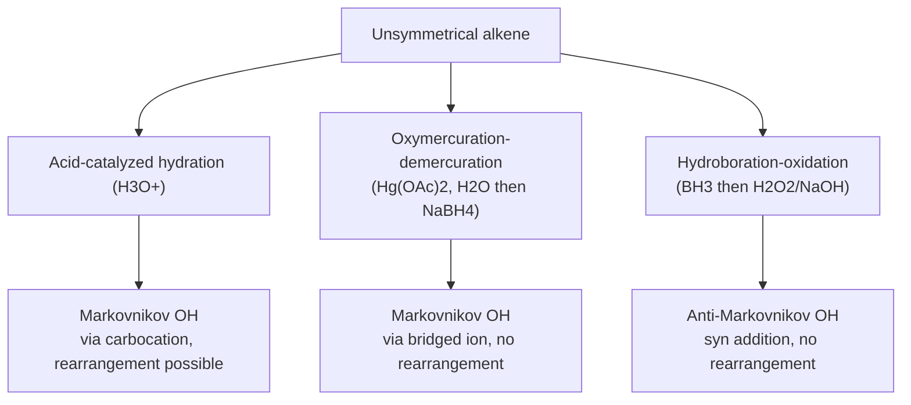
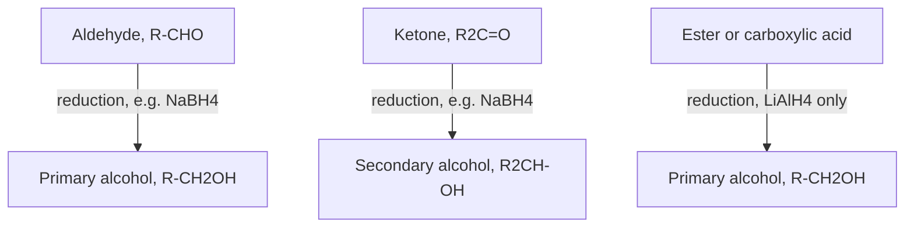

## Synthesis of Alcohols

### Overview

Alcohols can be prepared through a wide variety of reactions spanning nearly every major reaction class in organic chemistry: hydration and hydroboration of alkenes, nucleophilic substitution, reduction of carbonyl compounds, and nucleophilic addition of organometallic reagents to carbonyls. Selecting the appropriate method requires considering the required regiochemistry, stereochemistry, and functional group compatibility with the rest of the target molecule.

### Method 1: Acid-Catalyzed Hydration of Alkenes

**Mechanism**: Proceeds through a carbocation intermediate (Markovnikov addition), as detailed in electrophilic addition to alkenes.

1. Protonation of the alkene by $H_3O^+$ generates the more stable (more substituted) carbocation.
2. Water attacks the carbocation.
3. Deprotonation of the resulting oxonium ion gives the neutral alcohol.

**Key Points**

- Gives **Markovnikov regiochemistry**: the $-OH$ group ends up on the more substituted carbon.
- Proceeds through a free carbocation, so **rearrangement** (1,2-hydride or 1,2-alkyl shift) is possible if a more stable cation is accessible, which can lead to an unrearranged product prediction being incorrect.
- The reaction is reversible (acid-catalyzed dehydration is the reverse reaction), so reaction conditions (excess water favors hydration; removal of water favors dehydration) determine the direction of the equilibrium.

### Method 2: Oxymercuration–Demercuration

**Mechanism**: Proceeds through a bridged mercurinium ion rather than a free carbocation (see Electrophilic and Nucleophilic Addition for full mechanistic detail).

1. $Hg(OAc)_2$ adds to the alkene, forming a bridged mercurinium ion.
2. Water attacks the more substituted carbon of the bridged ion (Markovnikov regiochemistry) from the face opposite the mercury.
3. Reduction with $NaBH_4$ replaces the $-HgOAc$ group with $-H$ (demercuration).

**Key Points**

- Gives **Markovnikov regiochemistry**, identical to acid-catalyzed hydration, but **without rearrangement**, since no free carbocation is ever formed — a significant practical advantage over direct acid-catalyzed hydration for substrates prone to rearrangement.
- The overall stereochemical outcome at the new C–OH bond is generally not strictly defined as a single stereospecific mode in typical descriptions, since the demercuration step (radical-type reduction) can proceed with loss of stereochemical information at the carbon bearing mercury. [Inference — the exact degree of stereochemical scrambling in the demercuration step depends on the substrate and has been a subject of detailed mechanistic study.]

### Method 3: Hydroboration–Oxidation

**Mechanism**: A single concerted step (four-centered transition state) adds boron and hydrogen across the double bond with no carbocation intermediate, followed by oxidative workup.

1. $BH_3$ (or a substituted borane, e.g., 9-BBN) adds to the alkene: boron bonds to the less hindered, less substituted carbon (steric control in the concerted transition state), and hydrogen adds to the more substituted carbon, with both new bonds forming on the same face (**syn addition**).
2. Oxidation with $H_2O_2/NaOH$ replaces the C–B bond with a C–OH bond **with retention of configuration** at that carbon.

**Key Points**

- Gives **anti-Markovnikov regiochemistry**: the $-OH$ group ends up on the less substituted carbon, the opposite regiochemical outcome from acid-catalyzed hydration and oxymercuration.
- Gives **syn stereochemistry**: both new bonds (eventually $H$ and $OH$) are delivered to the same face of the original alkene, a stereospecific outcome useful for controlling relative configuration in cyclic and acyclic substrates alike.
- No carbocation intermediate means **no rearrangement risk**, making this method reliable for substrates where a free carbocation would rearrange.

### Diagram: Comparing the Three Alkene Hydration Methods

### Method 4: Reduction of Carbonyl Compounds

**Reagents and selectivity:**

| Reducing agent | Reduces aldehydes/ketones? | Reduces esters/carboxylic acids? | Notes |
| --- | --- | --- | --- |
| $NaBH_4$ | Yes | Generally no (or very slowly) | Mild, selective; safe to use in protic solvents (e.g., methanol) |
| $LiAlH_4$ | Yes | Yes | Strong, reduces virtually all carbonyl-containing groups; must be used under anhydrous conditions |
| $H_2/Pd$ (catalytic hydrogenation) | Generally not for simple aldehydes/ketones under standard conditions | No (not typically effective for esters/acids) | Primarily used for alkene/alkyne reduction; not the standard method for carbonyl-to-alcohol reduction |
| $DIBAL-H$ (at low temperature, controlled stoichiometry) | Yes | Partial reduction of esters/nitriles to aldehydes possible | Useful for stopping ester reduction at the aldehyde stage under carefully controlled conditions |

**Key Points**

- Reduction of an **aldehyde** gives a **primary alcohol**; reduction of a **ketone** gives a **secondary alcohol**; reduction of an **ester or carboxylic acid** (with a sufficiently strong reagent, e.g., $LiAlH_4$) gives a **primary alcohol** (with loss of the alkoxy or hydroxyl leaving group from the original acyl compound).
- $NaBH_4$'s comparatively mild reactivity (unreactive toward esters, carboxylic acids, and most other functional groups under standard conditions) makes it useful for **chemoselective reduction** of an aldehyde or ketone in the presence of an ester elsewhere in the same molecule.
- $LiAlH_4$ is a strong, relatively unselective hydride source capable of reducing esters, carboxylic acids, amides, and nitriles in addition to aldehydes and ketones, and must be handled under strictly anhydrous conditions due to its vigorous, exothermic reaction with water and protic solvents.

### Diagram: Carbonyl Reduction Product Classes

### Method 5: Grignard and Organolithium Addition to Carbonyls

**Mechanism**: A carbanion-equivalent organometallic reagent (Grignard, $R–MgX$, or organolithium, $R–Li$) performs nucleophilic addition to the electrophilic carbonyl carbon, forming a new C–C bond and, after aqueous acidic workup, delivering an alcohol.

**Reaction outcomes by carbonyl class:**

| Starting carbonyl compound | Product alcohol class |
| --- | --- |
| Formaldehyde, $CH_2O$ | Primary alcohol |
| Aldehyde, $RCHO$ | Secondary alcohol |
| Ketone, $R_2C=O$ | Tertiary alcohol |
| Ester, $RCO_2R'$ (2 equivalents of $R''MgX$ typically add) | Tertiary alcohol (both R'' groups incorporated) |

**Key Points**

- This method is one of the most versatile for constructing new **C–C bonds** while simultaneously installing an alcohol functional group, and is central to retrosynthetic planning for tertiary and secondary alcohols (see Multistep Synthesis and Retrosynthetic Analysis).
- Grignard and organolithium reagents are strong bases and strong nucleophiles; they are **incompatible** with substrates bearing acidic protons (alcohols, carboxylic acids, terminal alkynes, amines with N–H) or other electrophilic functional groups (additional unprotected carbonyls) elsewhere in the same molecule, since the organometallic reagent will react preferentially (often simply as a base, quenching itself) with those groups instead of performing the desired addition.
- With an ester, the initially formed ketone intermediate is generally more electrophilic than the starting ester and reacts further with a second equivalent of the organometallic reagent under standard conditions, so esters typically give tertiary alcohols with **two equivalents of the same R group** incorporated (both new C–C bonds from the same organometallic reagent), rather than stopping cleanly at the ketone stage.

### Worked Example: Choosing the Right Method

**Target**: Synthesize 3-methyl-2-butanol from an appropriate alkene without rearrangement.

**Analysis**: 3-Methyl-2-butanol, $(CH_3)_2CH$–$CH(OH)$–$CH_3$, corresponds to Markovnikov addition of water to 3-methyl-1-butene (or, alternatively, to 2-methyl-2-butene, but the regiochemical outcome must be checked). Direct acid-catalyzed hydration of 3-methyl-1-butene would proceed through a secondary carbocation that is adjacent to a tertiary center, making a 1,2-hydride shift to the more stable tertiary carbocation highly likely, leading to the wrong (rearranged) product.

**Solution**: Use **oxymercuration–demercuration** instead of direct acid-catalyzed hydration; because no free carbocation forms, the Markovnikov product is obtained cleanly without rearrangement.

### Worked Example: Grignard Retrosynthetic Choice

**Target**: 2-methyl-2-hexanol, a tertiary alcohol, $(CH_3)_2C(OH)$–$CH_2CH_2CH_2CH_3$

**Analysis**: This tertiary alcohol can be disconnected at any of three C–C bonds at the carbinol carbon, corresponding to three different (but all valid) combinations of ketone + Grignard reagent:

- 2-hexanone + methylmagnesium bromide
- 2-methyl-2-hexanone is not applicable here (would require pre-existing quaternary carbon); instead, consider: 5-methyl-2-hexanone is also not directly relevant — the viable disconnections are those that generate a ketone plus a Grignard reagent whose combination reconstructs the target.
- A practical choice: methyl ethyl ketone-type disconnection is not applicable directly; the most direct choice is 2-hexanone ($CH_3COCH_2CH_2CH_2CH_3$) + $CH_3MgBr$ (adding a methyl group to the ketone carbon to generate the two methyl groups and the existing chain simultaneously is not correct as stated — the correct disconnection is 2-hexanone plus methylmagnesium bromide, which installs the second methyl group at the carbinol carbon to generate the required gem-dimethyl tertiary alcohol center).

**Key Points**

- When multiple disconnections are chemically valid for a target tertiary alcohol, practical considerations (commercial availability and cost of the required ketone and organometallic reagent, avoidance of protecting groups) typically guide the final choice.

### Common Pitfalls

- **Using acid-catalyzed hydration when rearrangement is a concern**: If the resulting carbocation is adjacent to a carbon capable of hydride/alkyl shift to a more stable cation, oxymercuration–demercuration or hydroboration–oxidation should be used instead to avoid rearranged products.
- **Confusing the regiochemical outcomes of oxymercuration and hydroboration**: Oxymercuration gives Markovnikov addition; hydroboration gives anti-Markovnikov addition — these are frequently confused since both avoid carbocation rearrangement.
- **Using $NaBH_4$ to reduce an ester or carboxylic acid**: $NaBH_4$ is generally unreactive toward these more resistant carbonyl types under standard conditions; $LiAlH_4$ (or another strong hydride source) is required.
- **Attempting a Grignard addition on a substrate with an unprotected acidic or electrophilic group**: The organometallic reagent will be consumed by (or react preferentially with) any acidic O–H/N–H proton or additional unprotected carbonyl present, often before the intended reaction can occur; protecting groups or careful substrate selection are required.
- **Forgetting that ester + Grignard typically gives a tertiary alcohol with two identical new groups**: Students sometimes incorrectly predict that the reaction stops at the ketone stage; under standard excess-Grignard conditions, the more electrophilic intermediate ketone reacts further to give the tertiary alcohol.

### Related Topics

- Electrophilic and nucleophilic addition mechanisms (detailed mechanisms underlying hydration methods)
- Carbocation stability and rearrangement (relevant to predicting hydration outcomes)
- Multistep synthesis and retrosynthetic analysis (using alcohol-forming reactions in synthetic planning)
- Reactions of alcohols (oxidation back to carbonyls, dehydration, substitution)
- Protecting group strategies for use with strong organometallic reagents
- Reduction reagent selectivity (NaBH4 vs. LiAlH4 vs. DIBAL-H) in synthesis planning