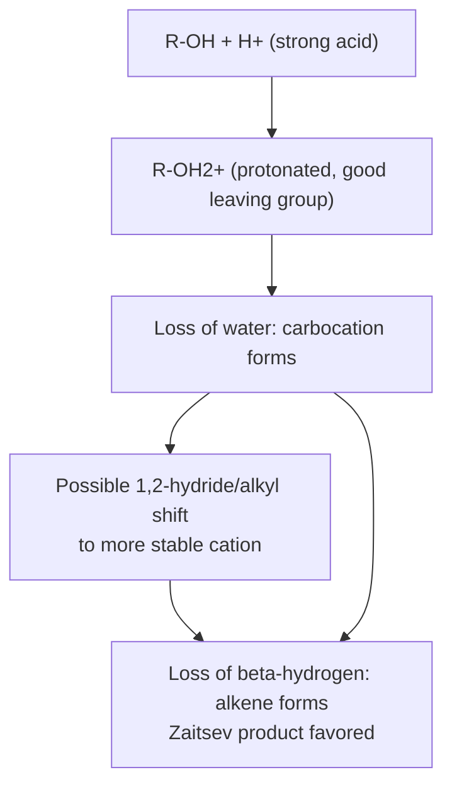
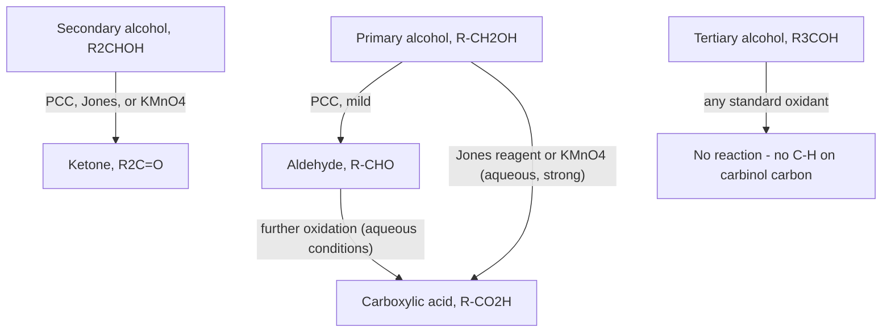

## Reactions of Alcohols


### Overview

Alcohols participate in a broad range of transformations centered on the hydroxyl group: it can act as a weak acid or weak base, be converted into a superior leaving group for substitution and elimination chemistry, or be oxidized to carbonyl compounds. The specific outcome of a given reaction depends heavily on whether the alcohol is primary, secondary, or tertiary, and on the reagents and conditions employed.

### Acid–Base Behavior of Alcohols

**Key Points**

- Alcohols are weakly acidic ($pK_a \approx 16$–$18$) and can be deprotonated by strong bases (e.g., sodium hydride, $NaH$, or sodium/potassium metal) to form an **alkoxide** ion, a strong base and good nucleophile widely used in subsequent reactions (Williamson ether synthesis, elimination reactions).
- Alcohols are also weakly basic at oxygen (the lone pairs can accept a proton), and protonation of the hydroxyl oxygen by a strong acid converts $-OH$ (a poor leaving group) into $-OH_2^+$ (water, an excellent leaving group) — the essential first step of most acid-catalyzed substitution, elimination, and dehydration reactions of alcohols.

### Conversion of Alcohols to Alkyl Halides

**Using hydrogen halides ($HX$)**:

**Key Points**

- Tertiary alcohols react readily with $HX$ (especially $HCl$, $HBr$, $HI$) via an $S_N1$-type mechanism: protonation of the $-OH$ generates a good leaving group ($H_2O$), ionization gives a relatively stable tertiary carbocation, and halide attacks the cation.
- Primary and secondary alcohols react more slowly and are prone to $S_N2$-type pathways under forcing conditions, though primary substrates in particular can require more vigorous conditions (heat, concentrated acid) since a primary carbocation is not accessible; secondary alcohols can proceed through either mechanism depending on conditions.
- Because a carbocation intermediate can be involved (especially for secondary and tertiary substrates), **rearrangement** is a possible complication with this method, mirroring the general risk seen in other carbocation-mediated reactions.

**Using thionyl chloride ($SOCl_2$) or phosphorus tribromide ($PBr_3$)**:

**Key Points**

- These reagents avoid the free-carbocation rearrangement problem: they convert the hydroxyl into a good leaving group in situ (a chlorosulfite intermediate for $SOCl_2$, or a related phosphorus-containing intermediate for $PBr_3$) that is then displaced by halide in a subsequent, often stereospecific, substitution step.
- $SOCl_2$ (typically with pyridine present) commonly proceeds with **inversion of configuration** at the reacting carbon via a backside $S_N2$-type displacement, making it a preferred method when a defined stereochemical outcome (inversion) is required and rearrangement must be avoided.
- $PBr_3$ operates by a broadly analogous strategy (in situ formation of a good leaving group followed by nucleophilic displacement by bromide) and is the standard mild, non-rearranging method for converting primary and secondary alcohols to the corresponding alkyl bromides.

### Diagram: SOCl2 Mechanism Overview

```mermaid
flowchart TD
    A[R-OH + SOCl2] --> B[Chlorosulfite intermediate<br/>R-O-S(=O)-Cl forms, HCl released]
    B --> C[Chloride ion attacks carbon<br/>backside, SN2-like, with pyridine present]
    C --> D[R-Cl product with inversion<br/>SO2 and Cl- byproducts released]
```

### Tosylation: Converting -OH into a Superior Leaving Group

**Key Points**

- Treatment of an alcohol with *p*-toluenesulfonyl chloride (tosyl chloride, $TsCl$), typically in the presence of a mild base (pyridine), converts the hydroxyl into a **tosylate ester** ($R–OTs$), without affecting the stereochemistry or connectivity at the carbinol carbon itself (the C–O bond to the original oxygen is never broken in this step).
- The tosylate group is an excellent leaving group (comparable to or better than a halide), because the resulting tosylate anion is highly resonance- and inductively stabilized (a sulfonate, the conjugate base of a strong sulfonic acid).
- Tosylation is widely used as a strategic tool to convert an otherwise poor leaving group ($-OH$) into an excellent one, enabling subsequent clean $S_N2$ or $E2$ reactions with a defined stereochemical outcome (since the configuration at the carbinol carbon is untouched during tosylation itself, and only inverted in the subsequent substitution step).

### Dehydration of Alcohols (Acid-Catalyzed Elimination)

**Mechanism (E1, typical for secondary/tertiary alcohols)**:

1. Protonation of the hydroxyl by a strong acid (commonly $H_2SO_4$ or $H_3PO_4$) converts $-OH$ into the good leaving group $-OH_2^+$.
2. Ionization (loss of water) generates a carbocation.
3. Loss of a β-hydrogen (deprotonation) forms the alkene.

**Key Points**

- Because dehydration proceeds through a carbocation intermediate for secondary and tertiary alcohols, **rearrangement** is possible, and the reaction typically follows **Zaitsev's rule**, favoring the more substituted (more stable) alkene as the major product when multiple β-hydrogens are available.
- Relative reactivity toward acid-catalyzed dehydration follows carbocation stability: tertiary > secondary ≫ primary; primary alcohols generally require more forcing conditions and are more prone to proceeding through a concerted, E2-like pathway (or via rearrangement to a more stable carbocation) rather than a discrete primary carbocation, since free primary carbocations are highly unstable.
- Because acid-catalyzed hydration of alkenes is the reverse of this reaction, dehydration conditions typically favor alkene formation by removing water from the equilibrium (e.g., through distillation of a lower-boiling alkene product or use of concentrated acid with minimal water present), driving the equilibrium toward the elimination product.

### Diagram: Alcohol Dehydration (E1) Overview



### Oxidation of Alcohols

**Key Points by alcohol class:**

| Alcohol class | Typical oxidation product | Common reagents |
| --- | --- | --- |
| Primary alcohol | Aldehyde (mild/controlled oxidant) or carboxylic acid (strong/excess oxidant) | PCC (stops at aldehyde); $CrO_3$/$H_2SO_4$ (Jones reagent), $KMnO_4$ (goes to carboxylic acid) |
| Secondary alcohol | Ketone | PCC, Jones reagent, $KMnO_4$ (all effective; ketones are not oxidized further under these conditions) |
| Tertiary alcohol | No reaction (no oxidizable C–H bond on the carbinol carbon) | N/A |

**Key Points**

- **Pyridinium chlorochromate (PCC)**, a mild, anhydrous chromium(VI)-based oxidant, selectively oxidizes primary alcohols to **aldehydes** and stops there (does not over-oxidize to the carboxylic acid), because the mechanism avoids the aqueous hydrate intermediate required for further oxidation to the acid.
- **Jones reagent** ($CrO_3$/$H_2SO_4$/$H_2O$, an aqueous, strongly acidic chromium(VI) oxidant) and other strong aqueous oxidants (e.g., $KMnO_4$) oxidize primary alcohols all the way to **carboxylic acids**, because the aqueous conditions allow the intermediate aldehyde to form a hydrate, which is then further oxidized.
- **Secondary alcohols** are oxidized cleanly to **ketones** by essentially any of these reagents (PCC, Jones, $KMnO_4$), and ketones are not oxidized further under these conditions since there is no additional C–H bond on the carbonyl carbon available for further oxidation to a carboxylic acid.
- **Tertiary alcohols cannot be oxidized** by these standard reagents under normal conditions, because oxidation requires removal of a hydrogen directly from the carbinol carbon, and a tertiary carbinol carbon bears no such hydrogen.

### Diagram: Alcohol Oxidation Product Classes



### Esterification (Fischer Esterification)

**Key Points**

- Alcohols react with carboxylic acids under acid catalysis (typically with a strong acid catalyst and often with removal of water to drive the equilibrium) to form an **ester**, via nucleophilic acyl substitution at the carbonyl carbon of the protonated carboxylic acid.
- This reaction is an equilibrium process; excess alcohol or removal of water (e.g., via a Dean–Stark trap) is typically used to drive the equilibrium toward ester formation.

### Formation of Ethers from Alcohols

**Key Points**

- Alkoxide ions (generated by deprotonating an alcohol with a strong base) can act as nucleophiles in the **Williamson ether synthesis**, reacting with a primary alkyl halide or tosylate via $S_N2$ to form an ether — this reaction connects the chemistry of alcohols directly to ether synthesis.
- Two molecules of a secondary or tertiary alcohol can also be dehydrated intermolecularly under acidic conditions to form a symmetrical ether, though this method competes with intramolecular elimination (alkene formation) and is generally less controllable/selective than the Williamson approach.

### Comparative Summary of Alcohol Reactions

| Reaction | Reagents | Product | Key mechanistic note |
| --- | --- | --- | --- |
| Conversion to alkyl halide (via carbocation) | $HX$ | Alkyl halide | Possible rearrangement; best for tertiary substrates |
| Conversion to alkyl halide (no rearrangement) | $SOCl_2$ or $PBr_3$ | Alkyl halide | Often stereospecific (inversion, esp. $SOCl_2$/pyridine) |
| Tosylation | $TsCl$, pyridine | Tosylate ester | Stereochemistry at carbinol carbon retained |
| Dehydration | $H_2SO_4$ or $H_3PO_4$, heat | Alkene | E1-type, Zaitsev product, possible rearrangement |
| Oxidation (1° alcohol, mild) | PCC | Aldehyde | Stops at aldehyde, anhydrous conditions |
| Oxidation (1° alcohol, strong) | Jones reagent, $KMnO_4$ | Carboxylic acid | Proceeds via aldehyde hydrate |
| Oxidation (2° alcohol) | PCC, Jones, $KMnO_4$ | Ketone | No further oxidation possible |
| Esterification | Carboxylic acid, acid catalyst | Ester | Equilibrium; Fischer esterification |
| Ether formation | Alkoxide + R–X (Williamson) | Ether | $S_N2$; best with primary R–X |

### Common Pitfalls

- **Using $HX$ when rearrangement must be avoided**: For substrates prone to carbocation rearrangement, $SOCl_2$ or $PBr_3$ should be used instead to avoid a free carbocation intermediate.
- **Using PCC when a carboxylic acid is the desired product**: PCC is specifically chosen to stop oxidation at the aldehyde stage; a stronger aqueous oxidant (Jones reagent, $KMnO_4$) is required to reach the carboxylic acid.
- **Assuming a tertiary alcohol can be oxidized under standard conditions**: Without a C–H bond on the carbinol carbon, tertiary alcohols are inert to these oxidants; forcing conditions would instead risk unwanted side reactions (e.g., dehydration) rather than oxidation at that carbon.
- **Forgetting the possibility of rearrangement during acid-catalyzed dehydration**: As with $HX$-mediated substitution, the carbocation intermediate in E1 dehydration can rearrange to a more stable structure before elimination occurs, potentially giving an unexpected alkene skeleton.
- **Confusing tosylation with a substitution reaction**: Tosylation only converts $-OH$ into $-OTs$; it does not itself replace the oxygen or invert configuration — the actual substitution (and any stereochemical inversion) occurs in a subsequent, separate step when a nucleophile displaces the tosylate.

### Related Topics

- Nucleophilic substitution and elimination reactions ($S_N1$/$S_N2$/E1/E2 mechanistic detail)
- Carbocation stability and rearrangement
- Synthesis of alcohols (the reverse-direction reactions and their complementary regiochemistry)
- Williamson ether synthesis in detail
- Oxidation states and functional group interconversions in synthesis planning
- Fischer esterification equilibrium and Le Chatelier considerations